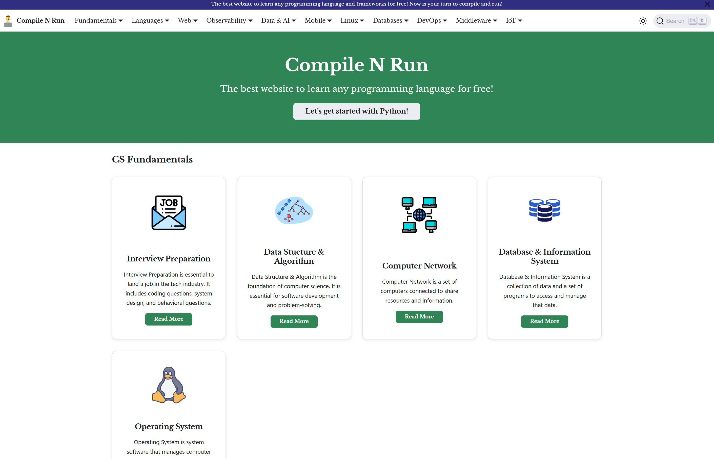

# Compile N Run




- https://www.compilenrun.com/

**Compile N Run** is a comprehensive learning platform designed for developers and computer science enthusiasts. Whether you're preparing for technical interviews, strengthening your programming fundamentals, or exploring new technologies, our platform provides curated resources across the entire software development stack.


## What You'll Find Here

Our content spans essential areas of software development:

**📚 CS Fundamentals**
- Data Structures & Algorithms
- Computer Networks
- Database & Information Systems
- Interview preparation materials

**💻 Programming Languages**
- JavaScript, C, C++, Kotlin
- Language-specific tutorials and best practices

**🚀 Modern Frameworks**
- Web frameworks: Django, FastAPI, Next.js, Angular
- Enterprise platforms: .NET
- Complete development guides and examples

**📊 Observability & Monitoring**
- Grafana for visualization
- Prometheus for monitoring and alerting

**🔧 Developer Tools & Libraries**
- Data analysis with Pandas
- Middleware solutions: Nginx, Kong, Redis

**🛠️ DevOps & Infrastructure**
- CI/CD best practices
- Containerization with Docker
- Orchestration with Kubernetes
- Version control with Git
- Automation with Ansible
- Linux/Ubuntu system administration

## Perfect For

- **Job seekers** preparing for technical interviews
- **Students** learning computer science fundamentals
- **Developers** exploring new technologies and frameworks
- **DevOps engineers** implementing modern infrastructure practices

---

*Start your journey in software development with practical, hands-on learning materials designed for real-world applications.*

### Installation

```
$ yarn
```

### Local Development

```
$ yarn start
```

This command starts a local development server and opens up a browser window. Most changes are reflected live without having to restart the server.

### Build

```
$ yarn build
```

This command generates static content into the `build` directory and can be served using any static contents hosting service.

### Deployment

Using SSH:

```
$ USE_SSH=true yarn deploy
```

Not using SSH:

```
$ GIT_USER=<Your GitHub username> yarn deploy
```

If you are using GitHub pages for hosting, this command is a convenient way to build the website and push to the `gh-pages` branch.

