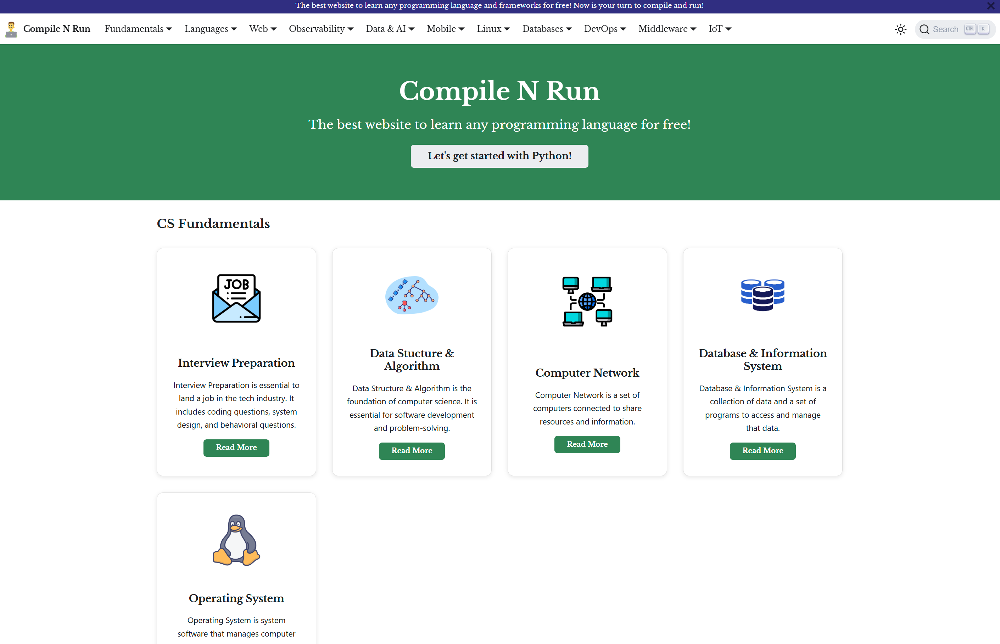

# omniscanner




- https://www.compilenrun.com/

**omniscanner** is a comprehensive learning platform designed for developers and computer science enthusiasts. Whether you're preparing for technical interviews, strengthening your programming fundamentals, or exploring new technologies, our platform provides curated resources across the entire software development stack.


## What You'll Find Here

Our content spans essential areas of software development:

**📚 CS Fundamentals**
- Data Structures & Algorithms
- Computer Networks
- Database & Information Systems
- Interview preparation materials

**💻 Programming Languages**
- JavaScript, C, C++, Kotlin
- Language-specific tutorials and best practices

**🚀 Modern Frameworks**
- Web frameworks: Django, FastAPI, Next.js, Angular
- Enterprise platforms: .NET
- Complete development guides and examples

**📊 Observability & Monitoring**
- Grafana for visualization
- Prometheus for monitoring and alerting

**🔧 Developer Tools & Libraries**
- Data analysis with Pandas
- Middleware solutions: Nginx, Kong, Redis

**🛠️ DevOps & Infrastructure**
- CI/CD best practices
- Containerization with Docker
- Orchestration with Kubernetes
- Version control with Git
- Automation with Ansible
- Linux/Ubuntu system administration

## Perfect For

- **Job seekers** preparing for technical interviews
- **Students** learning computer science fundamentals
- **Developers** exploring new technologies and frameworks
- **DevOps engineers** implementing modern infrastructure practices

---

*Start your journey in software development with practical, hands-on learning materials designed for real-world applications.*

### Installation

```bash
npm install
```

### Local Development

```bash
npm run dev
```

The site runs on `http://localhost:3002`. Fumadocs watches the Markdown/MDX files in `docs/` and refreshes changed pages during development.

### Content migration

```bash
npm run migrate:content
```

This repeatable migration generates Fumadocs `meta.json` navigation files, fills legacy titles that Docusaurus inferred from headings, and copies document assets into `public/docs-assets/`. Run it after changing the Docusaurus sidebar or category metadata.

Validate the migrated URL and navigation inventory with:

```bash
npm run validate:routes
npm run validate:routes -- --production
```

The production check compares every local document and generated category URL with the live sitemap.

### Build

```bash
npm run build
npm start
```

Document pages intentionally do not use `generateStaticParams`. Next.js resolves and caches each page on its first request instead of compiling all 10,000+ documents during the build.

### Deployment

Deploy this project to a Node.js-compatible Next.js host. The on-demand document loader reads the `docs/` directory at runtime, so the deployment artifact must include that directory; a static-only GitHub Pages deployment is not sufficient.
