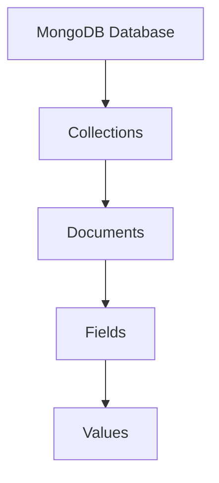

# MongoDB Introduction

<div style={{
    "width": "20%",
    "margin": "0 auto",
    "text-align": "center"
}}>
    
</div>

MongoDB is a popular NoSQL database that stores data in flexible, JSON-like documents. Unlike traditional relational databases that use tables and rows, MongoDB uses collections and documents, making it well-suited for modern application development. In this introduction, we'll explore what MongoDB is, why it's useful, and how to get started with it.

## What is MongoDB?

MongoDB is a document database designed for ease of development and scaling. It's classified as a NoSQL database because it doesn't rely on the traditional table-based relational database structure.

### Key Concepts:



- **Document**: A record in MongoDB, similar to a row in relational databases but more flexible. Documents are stored in BSON (Binary JSON) format.
- **Collection**: A group of documents, similar to a table in relational databases.
- **Database**: A container for collections.

## Why Use MongoDB?

### Advantages of MongoDB:

1. **Flexible Schema**: Unlike SQL databases, MongoDB doesn't require a predefined schema. Each document can have different fields.
2. **Scalability**: MongoDB is designed to scale horizontally using sharding.
3. **Performance**: Fast for many use cases, especially read-heavy workloads.
4. **JSON-like Documents**: Natural for developers working with JavaScript and modern web applications.
5. **Rich Query Language**: Supports a wide range of queries, indexing, and aggregations.

## Getting Started with MongoDB

### 1. Installation

Let's start by installing MongoDB. The exact steps depend on your operating system.

For macOS using Homebrew:

```bash
brew tap mongodb/brew
brew install mongodb-community
```

For Ubuntu:

```bash
sudo apt-get update
sudo apt-get install -y mongodb
```

For Windows, download the installer from the [MongoDB website](https://www.mongodb.com/try/download/community) and follow the installation wizard.

### 2. Starting MongoDB

After installation, start the MongoDB service:

```bash
# On macOS
brew services start mongodb-community

# On Ubuntu
sudo systemctl start mongodb

# On Windows
# The MongoDB service should start automatically after installation
```

### 3. Accessing MongoDB

You can access MongoDB through the mongo shell, a command-line interface:

```bash
mongo
```

You should see output like this:

```
MongoDB shell version v5.0.6
connecting to: mongodb://127.0.0.1:27017
MongoDB server version: 5.0.6
```

## Basic MongoDB Operations

Let's explore some basic operations in MongoDB.

### Creating a Database

```javascript
use myFirstDatabase
```

This command creates a new database if it doesn't exist or switches to it if it does.

### Creating a Collection and Inserting Documents

Let's create a collection called `users` and insert a document:

```javascript
db.users.insertOne({
  name: "John Doe",
  email: "john@example.com",
  age: 30,
  address: {
    city: "New York",
    state: "NY",
    country: "USA"
  },
  interests: ["programming", "reading", "hiking"]
})
```

Output:

```
{
  "acknowledged": true,
  "insertedId": ObjectId("60d5ec9af682fbd12a694123")
}
```

Notice how we can store nested objects (`address`) and arrays (`interests`) directly in a document.

### Querying Documents

To find all documents in a collection:

```javascript
db.users.find()
```

To find documents matching specific criteria:

```javascript
db.users.find({ name: "John Doe" })
```

To find documents with more complex queries:

```javascript
db.users.find({ age: { $gt: 25 }, "address.city": "New York" })
```

This query finds users older than 25 who live in New York.

### Updating Documents

To update a document:

```javascript
db.users.updateOne(
  { name: "John Doe" },
  { $set: { age: 31, "address.city": "Boston" } }
)
```

Output:

```
{
  "acknowledged": true,
  "matchedCount": 1,
  "modifiedCount": 1
}
```

### Deleting Documents

To delete a document:

```javascript
db.users.deleteOne({ name: "John Doe" })
```

Output:

```
{ "acknowledged": true, "deletedCount": 1 }
```

## Real-World Example: Building a Blog Application

Let's see how MongoDB might be used for a simple blog application.

### Step 1: Define the Collections

For a blog, we might have collections for `posts`, `users`, and `comments`.

### Step 2: Create a Post

```javascript
db.posts.insertOne({
  title: "Getting Started with MongoDB",
  content: "MongoDB is a document database that...",
  author: ObjectId("60d5ec9af682fbd12a694123"), // Reference to a user
  tags: ["mongodb", "database", "nosql"],
  comments: [],
  createdAt: new Date(),
  likes: 0
})
```

### Step 3: Add Comments to a Post

```javascript
db.posts.updateOne(
  { title: "Getting Started with MongoDB" },
  { $push: { comments: {
    user: ObjectId("60d5ec9af682fbd12a694124"),
    text: "Great post! Very informative.",
    createdAt: new Date()
  }}}
)
```

### Step 4: Query Posts with Filters

Find all MongoDB-related posts:

```javascript
db.posts.find({ tags: "mongodb" })
```

Find recent posts with comments:

```javascript
db.posts.find({
  createdAt: { $gt: new Date(Date.now() - 7 * 24 * 60 * 60 * 1000) },
  "comments.0": { $exists: true }
})
```

This query finds posts from the last 7 days that have at least one comment.

### Step 5: Use Aggregation for Advanced Queries

Count posts by tag:

```javascript
db.posts.aggregate([
  { $unwind: "$tags" },
  { $group: { _id: "$tags", count: { $sum: 1 } } },
  { $sort: { count: -1 } }
])
```

Output:

```
{ "_id": "mongodb", "count": 5 }
{ "_id": "nosql", "count": 3 }
{ "_id": "database", "count": 2 }
```

## Connecting to MongoDB from Applications

Here's how to connect to MongoDB from different programming languages:

### Node.js (using Mongoose)

First, install Mongoose:

```bash
npm install mongoose
```

Then connect and define a schema:

```javascript
const mongoose = require('mongoose');
mongoose.connect('mongodb://localhost/myFirstDatabase');

// Define a schema
const userSchema = new mongoose.Schema({
  name: String,
  email: { type: String, required: true, unique: true },
  age: Number,
  address: {
    city: String,
    state: String,
    country: String
  },
  interests: [String]
});

// Create a model
const User = mongoose.model('User', userSchema);

// Create a new user
async function createUser() {
  const user = new User({
    name: 'Jane Smith',
    email: 'jane@example.com',
    age: 28,
    address: {
      city: 'San Francisco',
      state: 'CA',
      country: 'USA'
    },
    interests: ['design', 'photography']
  });
  
  await user.save();
  console.log('User saved successfully!');
}

createUser();
```

### Python (using PyMongo)

First, install PyMongo:

```bash
pip install pymongo
```

Then connect and perform operations:

```python
from pymongo import MongoClient

# Connect to MongoDB
client = MongoClient('mongodb://localhost:27017/')
db = client['myFirstDatabase']
users = db['users']

# Insert a document
new_user = {
    "name": "Alex Johnson",
    "email": "alex@example.com",
    "age": 35,
    "address": {
        "city": "Chicago",
        "state": "IL",
        "country": "USA"
    },
    "interests": ["music", "cooking", "travel"]
}
result = users.insert_one(new_user)
print(f"User inserted with ID: {result.inserted_id}")

# Find documents
for user in users.find({"age": {"$gt": 30}}):
    print(f"{user['name']} is {user['age']} years old")
```

## MongoDB Atlas: Cloud Database Service

MongoDB Atlas is MongoDB's cloud database service. It allows you to deploy fully managed MongoDB databases in the cloud.

Key benefits:

- **Global Deployment**: Deploy databases across AWS, Google Cloud, or Azure in 80+ regions.
- **Security**: Built-in security features like encryption at rest and in transit.
- **Scalability**: Scale up or down with a few clicks.
- **Monitoring**: Real-time performance metrics and alerts.

## Summary

In this introduction to MongoDB, we've covered:

- What MongoDB is and its key concepts
- The advantages of using MongoDB
- How to install and start MongoDB
- Basic MongoDB operations: creating databases and collections, inserting, querying, updating, and deleting documents
- A real-world example of using MongoDB for a blog application
- How to connect to MongoDB from Node.js and Python
- An overview of MongoDB Atlas

MongoDB's flexible schema design makes it ideal for applications where data structures might evolve over time. Its JSON-like document model aligns well with modern programming paradigms, making it a popular choice for web and mobile applications.

## Additional Resources

To continue learning MongoDB:

1. [MongoDB Official Documentation](https://docs.mongodb.com/)
2. [MongoDB University](https://university.mongodb.com/) - Free online courses
3. [MongoDB Compass](https://www.mongodb.com/products/compass) - A GUI for MongoDB

## Exercises

1. Install MongoDB on your computer and access it through the mongo shell.
2. Create a database for a music collection with albums and artists.
3. Write queries to find:
   - All albums by a specific artist
   - Albums released in a specific year
   - Artists who have released more than 5 albums
4. Connect to your MongoDB database using a programming language of your choice.
5. Create a simple CRUD (Create, Read, Update, Delete) application using MongoDB and a web framework.

Happy coding with MongoDB!