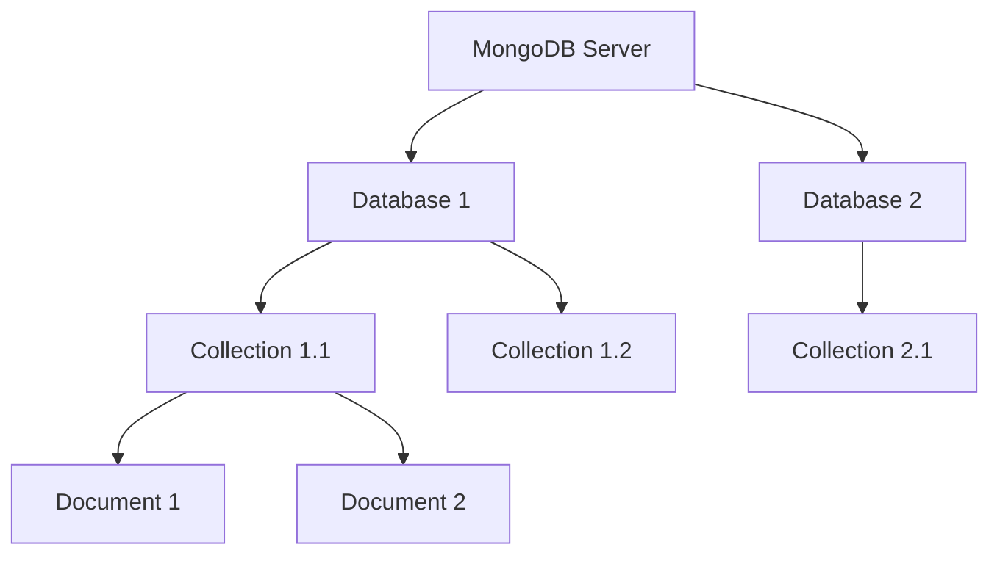

# MongoDB Installation

## Introduction

MongoDB is a popular NoSQL database that stores data in flexible, JSON-like documents. Before you can start working with MongoDB, you need to install it on your system. This guide will walk you through the installation process on different operating systems and help you set up your development environment for working with MongoDB databases.

Installing MongoDB correctly is the first crucial step to becoming proficient with this powerful database technology. By the end of this guide, you'll have a functioning MongoDB server running on your machine and be ready to start creating and managing databases.

## Prerequisites

Before installing MongoDB, ensure that your system meets the following requirements:

- 64-bit processor
- At least 4 GB of RAM
- Sufficient disk space (MongoDB recommends at least 10 GB)
- Operating System: Windows 10/11, macOS 10.14 or later, or a supported Linux distribution

## Installation Process by Operating System

Let's walk through the installation process for different operating systems.

### Installing MongoDB on Windows

Follow these steps to install MongoDB on Windows:

1. **Download the MongoDB Installer**
   - Visit the [MongoDB Download Center](https://www.mongodb.com/try/download/community)
   - Select the "Community Server" edition
   - Choose "Windows" as your operating system
   - Select "MSI" as the package type
   - Click Download

2. **Run the Installer**
   - Double-click the downloaded MSI file
   - Follow the installation wizard
   - Choose "Complete" installation type

3. **Install MongoDB as a Service**
   - During installation, check "Install MongoDB as a Service"
   - You can choose to run the service using the default "Network Service" account or a specific user account

4. **Configure Data Directory**
   - By default, MongoDB stores data in `C:\Program Files\MongoDB\Server\[version]\data`
   - You can change this path during installation if needed

5. **Verify Installation**
   - Open Command Prompt and type:

```cmd
"C:\Program Files\MongoDB\Server\6.0\bin\mongo.exe"
```

If MongoDB is installed correctly, you should see the MongoDB shell prompt.

### Installing MongoDB on macOS

The recommended way to install MongoDB on macOS is using Homebrew:

1. **Install Homebrew** (if not already installed)

```bash
/bin/bash -c "$(curl -fsSL https://raw.githubusercontent.com/Homebrew/install/HEAD/install.sh)"
```

2. **Install MongoDB Community Edition**

```bash
brew tap mongodb/brew
brew install mongodb-community
```

3. **Start MongoDB Service**

```bash
brew services start mongodb-community
```

4. **Verify Installation**

```bash
mongo
```

You should see the MongoDB shell prompt.

### Installing MongoDB on Linux (Ubuntu)

Follow these steps to install MongoDB on Ubuntu:

1. **Import the MongoDB public GPG key**

```bash
wget -qO - https://www.mongodb.org/static/pgp/server-6.0.asc | sudo apt-key add -
```

2. **Create a list file for MongoDB**

```bash
echo "deb [ arch=amd64,arm64 ] https://repo.mongodb.org/apt/ubuntu focal/mongodb-org/6.0 multiverse" | sudo tee /etc/apt/sources.list.d/mongodb-org-6.0.list
```

Note: Replace "focal" with your Ubuntu version codename if different.

3. **Update the package database**

```bash
sudo apt-get update
```

4. **Install MongoDB packages**

```bash
sudo apt-get install -y mongodb-org
```

5. **Start MongoDB service**

```bash
sudo systemctl start mongod
```

6. **Enable MongoDB to start on boot**

```bash
sudo systemctl enable mongod
```

7. **Verify installation**

```bash
mongo
```

## Post-Installation Setup

After installing MongoDB, there are a few important steps to secure your installation and set it up for development use.

### Securing MongoDB

By default, MongoDB may be accessible without authentication. For production systems, it's important to set up authentication:

1. **Create an admin user**

```javascript
use admin
db.createUser({
  user: "adminUser",
  pwd: "securePassword",
  roles: [{ role: "userAdminAnyDatabase", db: "admin" }]
})
```

2. **Enable authentication** in the MongoDB configuration file:

For Windows, edit the `mongod.cfg` file (typically located at `C:\Program Files\MongoDB\Server\6.0\bin\mongod.cfg`) and add:

```yaml
security:
  authorization: enabled
```

For Linux/macOS, edit `/etc/mongod.conf` and add:

```yaml
security:
  authorization: enabled
```

3. **Restart MongoDB service** after making these changes

### Setting Up MongoDB Compass (GUI Tool)

MongoDB Compass is a graphical user interface for MongoDB that makes it easy to explore and manipulate your data:

1. Download MongoDB Compass from the [MongoDB Download Center](https://www.mongodb.com/try/download/compass)
2. Install and launch MongoDB Compass
3. Connect to your MongoDB instance using the connection string: `mongodb://localhost:27017`

## Testing Your Installation

Let's verify that MongoDB is working correctly by performing some basic operations:

1. **Connect to MongoDB** using the MongoDB shell:

```bash
mongo
```

2. **Create a test database**:

```javascript
use testdb
```

3. **Insert a document**:

```javascript
db.users.insertOne({
  name: "John Doe",
  email: "john@example.com",
  age: 30
})
```

Expected output:
```
{
  "acknowledged" : true,
  "insertedId" : ObjectId("...")
}
```

4. **Query the database**:

```javascript
db.users.find()
```

Expected output:
```
{ "_id" : ObjectId("..."), "name" : "John Doe", "email" : "john@example.com", "age" : 30 }
```

If you can perform these operations, your MongoDB installation is working correctly!

## Troubleshooting Common Installation Issues

### MongoDB Service Won't Start

If the MongoDB service fails to start:

1. Check the MongoDB log file:
   - Windows: `C:\Program Files\MongoDB\Server\6.0\log\mongod.log`
   - Linux/macOS: `/var/log/mongodb/mongod.log`

2. Ensure the data directory exists and has proper permissions:
   - Windows: Ensure the user running MongoDB has write access to the data directory
   - Linux/macOS: Run `sudo chown -R mongodb:mongodb /var/lib/mongodb`

### Connection Refused

If you get a "connection refused" error:

1. Check if MongoDB is running:
   - Windows: Open Services.msc and check if MongoDB service is running
   - Linux/macOS: Run `sudo systemctl status mongod`

2. Ensure MongoDB is listening on the expected port (default 27017):
   - Run `netstat -an | grep 27017` (Linux/macOS)
   - Run `netstat -an | findstr 27017` (Windows)

## MongoDB Architecture Overview

Understanding MongoDB's basic architecture will help you better manage your installation:



- **MongoDB Server**: The main service that runs and manages your databases
- **Databases**: Logical containers for collections
- **Collections**: Groups of related documents (similar to tables in relational databases)
- **Documents**: Individual records stored in BSON format (binary JSON)

## Real-World Applications

### Application 1: E-commerce Product Catalog

An e-commerce application might use MongoDB to store product information:

```javascript
// Connect to the ecommerce database
use ecommerce

// Insert a product document
db.products.insertOne({
  name: "Wireless Headphones",
  brand: "AudioTech",
  price: 89.99,
  category: "Electronics",
  features: ["Bluetooth 5.0", "Noise Cancellation", "20-hour Battery"],
  inStock: true,
  reviews: [
    {
      user: "customer123",
      rating: 4,
      comment: "Great sound quality!"
    }
  ]
})

// Query products by category
db.products.find({ category: "Electronics", price: { $lt: 100 } })
```

This example shows how MongoDB's flexible document structure makes it easy to store complex product information that would require multiple tables in a relational database.

### Application 2: User Authentication System

A user authentication system might use MongoDB to store user credentials and profile information:

```javascript
// Connect to the auth database
use auth

// Create a users collection
db.users.insertOne({
  username: "sarah_dev",
  email: "sarah@example.com",
  passwordHash: "5f4dcc3b5aa765d61d8327deb882cf99", // never store plain passwords!
  profile: {
    firstName: "Sarah",
    lastName: "Johnson",
    location: "New York",
    joinDate: new Date()
  },
  roles: ["user", "editor"],
  lastLogin: new Date()
})

// Create an index on email field for faster lookups
db.users.createIndex({ email: 1 }, { unique: true })

// Query to find a user by email
db.users.findOne({ email: "sarah@example.com" })
```

## Summary

In this guide, you learned how to:

1. Install MongoDB on Windows, macOS, and Linux
2. Secure your MongoDB installation with authentication
3. Set up MongoDB Compass for visual database management
4. Test your installation with basic CRUD operations
5. Troubleshoot common installation issues
6. Understand MongoDB's basic architecture
7. See real-world examples of MongoDB applications

With MongoDB now properly installed on your system, you're ready to start building applications that leverage the power and flexibility of this NoSQL database. The document-oriented structure of MongoDB makes it ideal for scenarios where your data schema may evolve over time or where you need to store complex, nested data structures.

## Additional Resources and Exercises

### Resources for Further Learning

- [Official MongoDB Documentation](https://docs.mongodb.com/)
- [MongoDB University](https://university.mongodb.com/) - Free online courses
- [MongoDB Developer Hub](https://www.mongodb.com/developer/)

### Practice Exercises

1. **Basic Database Operations**:
   - Create a database named "library"
   - Add a collection called "books"
   - Insert 5 book documents with fields: title, author, year, genres (array), and available (boolean)
   - Write a query to find all books published after 2010
   - Update a book to mark it as unavailable

2. **Data Modeling Exercise**:
   - Design a MongoDB schema for a blog platform with users, posts, and comments
   - Implement your schema by creating the necessary collections
   - Write queries to:
     - Find all posts by a specific user
     - Find all comments on a specific post
     - Count the number of comments per post

3. **Performance Optimization**:
   - Create a collection with at least 1000 documents
   - Add appropriate indexes based on your common query patterns
   - Compare query performance before and after adding indexes

By completing these exercises, you'll gain hands-on experience with MongoDB and be well on your way to mastering this powerful NoSQL database system.