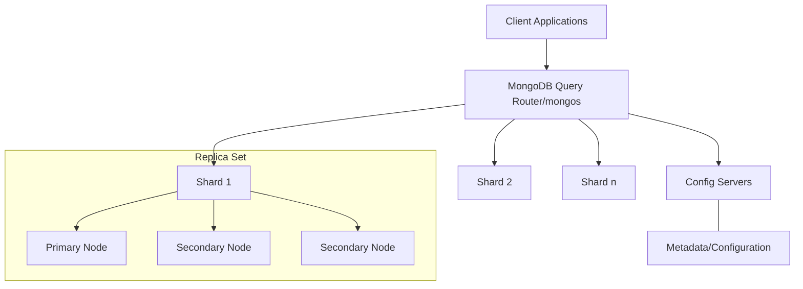
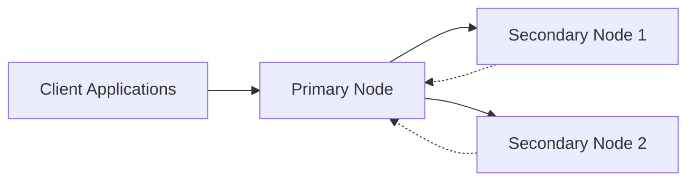
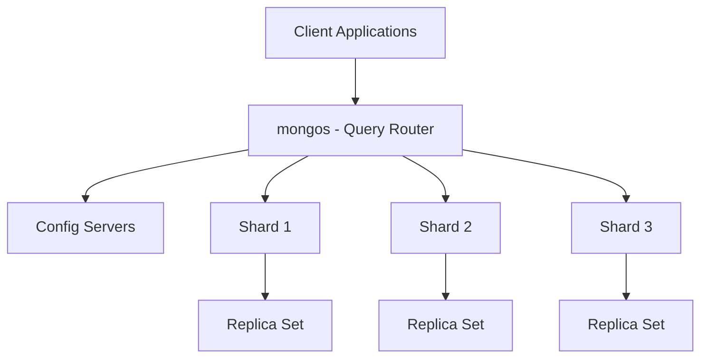

# MongoDB Architecture

## Introduction

MongoDB's architecture is designed to support scalable, high-performance document-oriented databases. Understanding MongoDB architecture is essential for effectively designing, deploying, and maintaining MongoDB-based applications. In this article, we'll explore the fundamental components of MongoDB's architecture and how they work together to provide a flexible and powerful database system.

## Core Architectural Components

MongoDB's architecture consists of several key components that work together to provide its functionality:



### Document Model

At the core of MongoDB's architecture is the document model, which stores data in JSON-like BSON (Binary JSON) documents.

```javascript
// Example MongoDB document
{
   "_id": ObjectId("5f8d0c2b9d3b2e1234567890"),
   "name": "John Doe",
   "age": 30,
   "email": "john.doe@example.com",
   "address": {
      "street": "123 Main St",
      "city": "New York",
      "state": "NY",
      "zip": "10001"
   },
   "interests": ["programming", "hiking", "reading"]
}
```

The document model provides several advantages:
- Schema flexibility
- Native support for arrays and nested objects
- No complex joins
- Intuitive data representation

### Storage Engine

MongoDB's storage engine is responsible for managing how data is stored both in memory and on disk.

#### WiredTiger Storage Engine

Since MongoDB 3.2, WiredTiger has been the default storage engine. It provides:

1. **Document-Level Concurrency Control**: Multiple clients can modify different documents of a collection at the same time.

2. **Compression**: Both data and indexes are compressed by default.

3. **Journaling**: For durability in case of crashes.

Let's look at how we might configure WiredTiger options when starting MongoDB:

```javascript
// MongoDB configuration for WiredTiger
mongod --storageEngine wiredTiger --wiredTigerCacheSizeGB 2
```

The configuration above starts a MongoDB instance with the WiredTiger storage engine and allocates 2GB of RAM for its cache.

## Distributed System Architecture

MongoDB's distributed architecture consists of several components that work together to provide scalability and high availability.

### Replica Sets

A replica set is a group of MongoDB servers that maintain the same data set, providing redundancy and increasing data availability.



#### How to Create a Replica Set

```javascript
// Initialize a replica set
rs.initiate({
  _id: "myReplicaSet",
  members: [
    { _id: 0, host: "mongodb0.example.net:27017" },
    { _id: 1, host: "mongodb1.example.net:27017" },
    { _id: 2, host: "mongodb2.example.net:27017" }
  ]
})

// Check replica set status
rs.status()
```

#### Key Replica Set Features:

1. **Automatic Failover**: If the primary node becomes unavailable, the replica set automatically elects a new primary.

2. **Data Redundancy**: Multiple copies of data provide protection against data loss.

3. **Read Scaling**: By configuring read preferences, applications can direct read operations to secondary nodes.

### Sharding

Sharding is MongoDB's approach to scaling horizontally by distributing data across multiple machines.



#### How Sharding Works:

1. **Shard Key**: Data is distributed based on the shard key.
2. **Chunks**: Data is divided into chunks based on shard key ranges.
3. **Balancer**: MongoDB automatically balances chunks across shards.

#### Setting Up a Sharded Cluster

```javascript
// Enable sharding for a database
sh.enableSharding("myDatabase")

// Create a sharded collection
sh.shardCollection("myDatabase.users", { "userId": 1 })

// Check sharding status
sh.status()
```

## Data Flow in MongoDB

Understanding how data flows through a MongoDB system helps in optimizing performance and troubleshooting issues.

### Write Operations Flow

1. Client sends write request
2. MongoDB server receives the request
3. Document is written to the in-memory representation
4. Write is recorded in the journal (for durability)
5. Eventually, data is flushed to disk

### Read Operations Flow

1. Client sends read request
2. MongoDB checks if the data is in memory (WiredTiger cache)
3. If not in memory, data is read from disk into memory
4. Result is returned to the client

## MongoDB Components in a Deployment

### mongod

The primary daemon process for the MongoDB server.

```bash
# Start a MongoDB server
mongod --dbpath /data/db --port 27017
```

### mongos

The query router that interfaces between client applications and the sharded cluster.

```bash
# Start a mongos router
mongos --configdb config/cfg1:27019,cfg2:27019,cfg3:27019 --port 27017
```

### Config Servers

Store metadata and configuration settings for sharded clusters.

## Practical Example: Setting Up a Small MongoDB Deployment

Let's walk through a practical example of setting up a small MongoDB deployment for a web application.

### Step 1: Set up a simple MongoDB server

```bash
# Create data directory
mkdir -p /data/db

# Start MongoDB server
mongod --dbpath /data/db --port 27017
```

### Step 2: Connect to MongoDB and create a database for a blog application

```javascript
// Connect to MongoDB
mongo --host localhost --port 27017

// Create and use a database
use blogDB

// Create a collection and insert a document
db.posts.insertOne({
  title: "Understanding MongoDB Architecture",
  content: "MongoDB has a flexible document model...",
  author: "Jane Smith",
  date: new Date(),
  tags: ["mongodb", "database", "nosql"]
})

// Query the document
db.posts.find({ author: "Jane Smith" })

// Output:
// {
//   "_id": ObjectId("..."),
//   "title": "Understanding MongoDB Architecture",
//   "content": "MongoDB has a flexible document model...",
//   "author": "Jane Smith",
//   "date": ISODate("2023-..."),
//   "tags": ["mongodb", "database", "nosql"]
// }
```

### Step 3: Add indexes for performance

```javascript
// Create an index on frequently queried fields
db.posts.createIndex({ author: 1 })
db.posts.createIndex({ tags: 1 })

// Show existing indexes
db.posts.getIndexes()

// Output:
// [
//   { "v": 2, "key": { "_id": 1 }, "name": "_id_" },
//   { "v": 2, "key": { "author": 1 }, "name": "author_1" },
//   { "v": 2, "key": { "tags": 1 }, "name": "tags_1" }
// ]
```

### Step 4: Set up basic monitoring

```javascript
// Check server status
db.serverStatus()

// Check database statistics
db.stats()

// Check collection statistics
db.posts.stats()
```

## Performance Considerations

When working with MongoDB architecture, keep these performance tips in mind:

1. **Choose appropriate shard keys** that distribute data evenly and support your common query patterns.

2. **Properly size your WiredTiger cache** - ideally 50% of available RAM for dedicated MongoDB servers.

3. **Use indexes wisely** - they speed up queries but slow down writes and consume memory.

4. **Consider read preferences** in replica sets to distribute read loads.

5. **Monitor and adjust write concern settings** based on your durability and performance requirements.

```javascript
// Example of write concern configuration
db.collection.insertOne(
  { item: "example" },
  { writeConcern: { w: "majority", wtimeout: 5000 } }
)
```

## Summary

MongoDB's architecture is designed to be flexible, scalable, and highly available. Key architectural components include:

- Document-oriented storage model
- WiredTiger storage engine
- Replica sets for redundancy and high availability
- Sharding for horizontal scalability
- Distributed systems components like mongos router and config servers

Understanding these components and how they interact helps in designing efficient MongoDB deployments that meet your application's requirements for performance, availability, and scalability.

## Additional Resources

To deepen your understanding of MongoDB architecture:

1. Experiment with creating your own replica set on a local development environment
2. Try to set up a small sharded cluster with multiple shards
3. Use MongoDB Compass to visually explore your database architecture
4. Use the MongoDB Performance Advisor to optimize your database operations

## Practice Exercises

1. Set up a three-node replica set and practice failover scenarios
2. Create a sample collection and experiment with different indexing strategies
3. Benchmark read performance with and without appropriate indexes
4. Design a shard key for a hypothetical e-commerce product catalog and analyze its distribution properties

By mastering MongoDB's architecture, you'll be well-equipped to design, deploy, and maintain efficient database systems for your applications.