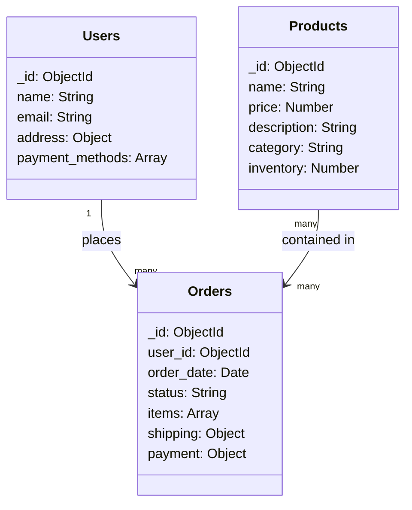

# MongoDB Collections

## Introduction

In MongoDB, a collection is a grouping of MongoDB documents. It's analogous to a table in relational databases, but unlike a table, a collection doesn't enforce a specific schema. Collections are where your data lives within MongoDB databases, giving you the flexibility to store different types of documents in the same collection.

This flexibility is one of MongoDB's key strengths as a NoSQL database. While relational databases require you to define your table structure before inserting data, MongoDB collections allow you to insert documents with varying fields, making them ideal for scenarios where data structure might evolve over time.

## Collections Fundamentals

### What is a Collection?

A collection is a container for MongoDB documents. Here are the key characteristics:

- **Schema-less**: Documents in a collection can have different fields
- **Document Storage**: Each item in a collection is a BSON document
- **Unique Identifier**: Every document requires a unique `_id` field
- **Organization**: Collections help organize related documents together

### Collection Naming Rules

When naming your collections, keep these rules in mind:

- Cannot be an empty string (`""`)
- Cannot contain the null character (`\0`)
- Cannot begin with the `system.` prefix (reserved for internal collections)
- Cannot contain the `$` character
- Should be less than 64 characters in length

## Creating Collections

There are two ways to create collections in MongoDB:

### 1. Explicit Creation

You can explicitly create a collection using the `createCollection()` method:

```javascript
db.createCollection("customers")
```

Output:
```
{ "ok" : 1 }
```

### 2. Implicit Creation

MongoDB will automatically create a collection when you first insert a document:

```javascript
db.products.insertOne({ name: "Laptop", price: 999, category: "Electronics" })
```

Output:
```
{
  "acknowledged": true,
  "insertedId": ObjectId("60a2f738d58b952e1cf0f7a9")
}
```

In this example, if the `products` collection doesn't exist, MongoDB creates it automatically.

## Working with Collections

### Basic Collection Operations

#### Listing Collections

To see all collections in the current database:

```javascript
db.getCollectionNames()
```

Output:
```
[ "customers", "products", "orders" ]
```

#### Dropping a Collection

To remove a collection and all its documents:

```javascript
db.products.drop()
```

Output:
```
true
```

### Collection Statistics

To get detailed information about a collection:

```javascript
db.orders.stats()
```

Output:
```
{
  "ns": "myStore.orders",
  "count": 1423,
  "size": 425690,
  "avgObjSize": 299,
  "storageSize": 557056,
  "capped": false,
  "wiredTiger": { ... },
  "nindexes": 2,
  "totalIndexSize": 131072,
  "indexSizes": {
    "_id_": 65536,
    "order_date_1": 65536
  },
  "scaleFactor": 1,
  "ok": 1
}
```

## Collection Options and Configuration

When creating collections explicitly, you can specify various configuration options.

### Capped Collections

Capped collections are fixed-size collections that maintain insertion order and automatically remove the oldest documents when the size limit is reached:

```javascript
db.createCollection("logs", {
  capped: true, 
  size: 10000000, // 10 MB
  max: 10000 // maximum 10,000 documents
})
```

Capped collections are useful for:
- Logging applications
- Storing recent data like cache information
- Any scenario where you only care about the most recent entries

### Validation Rules

You can enforce document validation rules on a collection:

```javascript
db.createCollection("users", {
  validator: {
    $jsonSchema: {
      bsonType: "object",
      required: ["name", "email", "status"],
      properties: {
        name: {
          bsonType: "string",
          description: "must be a string and is required"
        },
        email: {
          bsonType: "string",
          pattern: "^.+@.+$",
          description: "must be a valid email address"
        },
        status: {
          enum: ["Active", "Inactive", "Pending"],
          description: "can only be one of the enum values"
        }
      }
    }
  },
  validationLevel: "moderate",
  validationAction: "warn"
})
```

This example creates a collection with validation rules that:
- Requires `name`, `email`, and `status` fields
- Validates that `email` contains an @ character
- Ensures `status` is one of three allowed values

## Collection Relationships and Design

In MongoDB, you need to carefully consider how to structure your collections based on your data relationships and access patterns.

### Embedding vs. Referencing

MongoDB gives you two main options for modeling relationships:

1. **Embedded Documents**: Store related data in a single document
2. **References**: Store references between documents in different collections

#### Example of Embedding (One-to-Few)

When a user has a small number of addresses, embedding might be appropriate:

```javascript
db.users.insertOne({
  name: "John Smith",
  email: "john@example.com",
  addresses: [
    { 
      type: "home",
      street: "123 Main St",
      city: "Boston",
      state: "MA",
      zip: "02101"
    },
    { 
      type: "work",
      street: "456 Corporate Ave",
      city: "Boston", 
      state: "MA",
      zip: "02110"
    }
  ]
})
```

#### Example of Referencing (One-to-Many)

For a blog with many posts per author, references might work better:

```javascript
// Authors collection
db.authors.insertOne({
  _id: ObjectId("60a2f738d58b952e1cf0f7b1"),
  name: "Jane Doe",
  bio: "Technology writer and researcher"
})

// Posts collection with reference to author
db.posts.insertOne({
  title: "Introduction to MongoDB Collections",
  content: "MongoDB collections are...",
  author_id: ObjectId("60a2f738d58b952e1cf0f7b1"),
  created_at: new Date()
})
```

## Real-World Collection Design Examples

### E-commerce Application

For an e-commerce site, you might have the following collections:



Sample product document:

```javascript
{
  _id: ObjectId("60a2f738d58b952e1cf0f7c1"),
  name: "Wireless Headphones",
  price: 79.99,
  description: "Noise-cancelling wireless headphones with 20hr battery life",
  category: "Electronics",
  tags: ["audio", "wireless", "headphones"],
  inventory: 45,
  specifications: {
    weight: "250g",
    bluetooth: "5.0",
    color: "Black"
  },
  reviews: [
    { user_id: ObjectId("60a2f738d58b952e1cf0f8a1"), rating: 5, comment: "Great sound quality!" },
    { user_id: ObjectId("60a2f738d58b952e1cf0f8a2"), rating: 4, comment: "Good battery life but a bit heavy." }
  ]
}
```

### Content Management System

For a CMS, you might structure collections like this:

```javascript
// Articles collection
db.articles.insertOne({
  _id: ObjectId(),
  title: "MongoDB Collection Best Practices",
  slug: "mongodb-collection-best-practices",
  content: "When designing MongoDB collections...",
  author_id: ObjectId("60a2f738d58b952e1cf0f7d1"),
  status: "published",
  tags: ["mongodb", "database", "nosql"],
  published_date: new Date(),
  category_id: ObjectId("60a2f738d58b952e1cf0f7e1"),
  comments_count: 5
})

// Comments stored in a separate collection
db.comments.insertOne({
  _id: ObjectId(),
  article_id: ObjectId("60a2f738d58b952e1cf0f7f1"),
  user_id: ObjectId("60a2f738d58b952e1cf0f7d2"),
  content: "Great article! Very helpful explanation of collection design.",
  created_at: new Date(),
  likes: 3
})
```

## Best Practices for Collections

1. **Design for your access patterns**: Structure collections based on how you'll query and update data
   
2. **Use descriptive collection names**: Make collection names plural and descriptive (e.g., `users`, `products`)
   
3. **Limit embedded document size**: Keep in mind the 16MB document size limit
   
4. **Consider document growth**: Allow for fields being added to documents over time
   
5. **Create indexes**: Add appropriate indexes to collections for better query performance
   
6. **Use capped collections** for logs and temporary data

7. **Apply data validation**: Use schema validation for critical collections

8. **Balance embedding vs. referencing**: Don't over-embed; use references when appropriate

## Performance Considerations

### Indexing

Indexes are essential for collection performance:

```javascript
// Create an index on the email field for quick user lookups
db.users.createIndex({ email: 1 }, { unique: true })

// Create a compound index for order queries
db.orders.createIndex({ user_id: 1, order_date: -1 })
```

### Collection Sharding

For large datasets, consider sharding your collections across multiple servers:

```javascript
sh.enableSharding("ecommerce")
sh.shardCollection("ecommerce.orders", { order_date: 1 })
```

## Summary

MongoDB collections are flexible containers for storing documents. Unlike tables in relational databases, collections don't enforce a strict schema, allowing for more versatile data modeling. Key points to remember:

- Collections store documents of varying structures
- You can create collections explicitly or implicitly
- Design collections based on your application's query patterns
- Choose between embedding related data or referencing across collections
- Apply validation rules when data consistency is important
- Use indexing for performance optimization

Collections are the foundation of MongoDB's document model, providing the perfect balance between structure and flexibility for modern application development.

## Exercises

1. Create a collection called `inventory` with validation rules that require `item_name`, `quantity`, and `category` fields.

2. Insert five different products into the `inventory` collection with varying fields.

3. Create an index on the `category` field of the `inventory` collection.

4. Design a collection structure for a social media application with users, posts, and comments.

5. Create a capped collection for storing system logs with a maximum size of 5MB.

## Additional Resources

- [MongoDB Official Documentation on Collections](https://docs.mongodb.com/manual/core/databases-and-collections/)
- [MongoDB Schema Design Best Practices](https://www.mongodb.com/blog/post/building-with-patterns-the-schema-design-process)
- [MongoDB University - Free Online Courses](https://university.mongodb.com/)