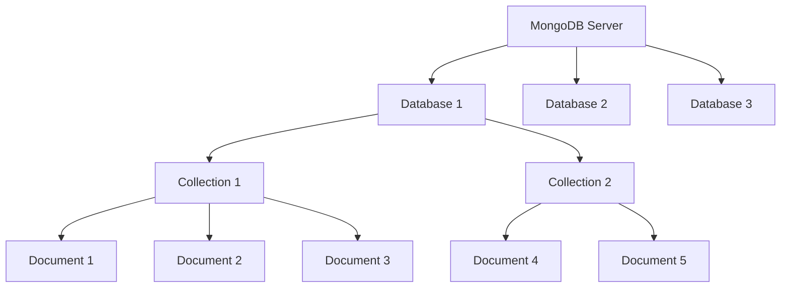

# MongoDB Databases

## Introduction

In the MongoDB ecosystem, a database serves as a container for collections, similar to how a traditional SQL database contains tables. As part of MongoDB's document-oriented model, databases provide a logical namespace for organizing your data.

Understanding how MongoDB databases work is fundamental to effectively using MongoDB in your applications. This guide will walk you through the key concepts, operations, and best practices for working with MongoDB databases.

## What is a MongoDB Database?

A MongoDB database is a physical container for collections. Each database gets its own set of files on the file system and can contain multiple collections of documents.

Some key characteristics of MongoDB databases include:

- They provide a namespace for your data
- They are isolated from each other
- Each database has its own permissions
- Database names are case-sensitive
- Database names have restrictions (can't contain spaces, special characters, etc.)

## Database Structure in MongoDB

MongoDB follows a hierarchical structure:



In this structure:
- A MongoDB server can host multiple databases
- Each database contains multiple collections
- Each collection contains multiple documents
- Documents contain fields and values

## Default Databases in MongoDB

When you install MongoDB, it comes with several default databases:

1. **admin**: Used for administrative operations
2. **local**: Stores data specific to a single server
3. **config**: Used for sharded cluster configuration
4. **test**: Default database for practicing MongoDB operations

## Creating and Managing Databases

### Connecting to MongoDB

Before working with databases, you need to connect to your MongoDB server:

```javascript
// Using the MongoDB shell (mongosh)
mongosh "mongodb://localhost:27017"

// Using Node.js with the MongoDB driver
const { MongoClient } = require('mongodb');
const uri = "mongodb://localhost:27017";
const client = new MongoClient(uri);

async function connect() {
  try {
    await client.connect();
    console.log("Connected to MongoDB");
  } catch (e) {
    console.error(e);
  }
}

connect();
```

### Creating a Database

In MongoDB, you don't explicitly create a database. Instead, it's created when you first store data in it:

```javascript
// Using mongosh
use myNewDatabase

// The database isn't actually created until you add data
db.users.insertOne({ name: "John", age: 30 })

// Output:
// {
//   acknowledged: true,
//   insertedId: ObjectId("...")
// }
```

Using Node.js:

```javascript
async function createDatabase() {
  try {
    await client.connect();
    const database = client.db("myNewDatabase");
    const collection = database.collection("users");
    
    const result = await collection.insertOne({ name: "John", age: 30 });
    console.log(`Created database with document ID: ${result.insertedId}`);
  } finally {
    await client.close();
  }
}

createDatabase();
```

### Listing All Databases

To see all available databases:

```javascript
// In mongosh
show dbs

// Output:
// admin        0.000GB
// config       0.000GB
// local        0.000GB
// myNewDatabase 0.000GB
```

Using Node.js:

```javascript
async function listDatabases() {
  try {
    await client.connect();
    const databasesList = await client.db().admin().listDatabases();
    
    console.log("Databases:");
    databasesList.databases.forEach(db => console.log(` - ${db.name}`));
  } finally {
    await client.close();
  }
}

listDatabases();
```

### Switching Between Databases

To switch to a different database in the MongoDB shell:

```javascript
// Switch to the "users" database
use users

// Check current database
db.getName()
// Output: users
```

### Dropping (Deleting) a Database

To delete a database:

```javascript
// In mongosh - first switch to the database you want to drop
use myNewDatabase
db.dropDatabase()

// Output:
// { ok: 1, dropped: 'myNewDatabase' }
```

Using Node.js:

```javascript
async function dropDatabase() {
  try {
    await client.connect();
    const result = await client.db("myNewDatabase").dropDatabase();
    console.log(`Database dropped: ${result}`);
  } finally {
    await client.close();
  }
}

dropDatabase();
```

## Database Statistics

MongoDB provides commands to view statistics about your databases:

```javascript
// In mongosh
db.stats()

// Output:
// {
//   db: 'myNewDatabase',
//   collections: 1,
//   views: 0,
//   objects: 1,
//   avgObjSize: 34,
//   dataSize: 34,
//   storageSize: 20480,
//   numExtents: 0,
//   indexes: 1,
//   indexSize: 20480,
//   fsUsedSize: 256060219392,
//   fsTotalSize: 499963174912,
//   ok: 1
// }
```

## Database Operations in Real-World Applications

Let's look at some practical examples of how databases are used in real-world MongoDB applications.

### Example 1: Multi-tenant Application

In a multi-tenant SaaS application, you might create a separate database for each customer:

```javascript
async function createTenantDatabase(tenantId, tenantName) {
  try {
    await client.connect();
    
    // Create a new database for the tenant
    const tenantDb = client.db(`tenant_${tenantId}`);
    
    // Set up basic collections for the tenant
    await tenantDb.collection('users').insertOne({ 
      admin: true, 
      name: 'Admin User', 
      email: `admin@${tenantName}.com` 
    });
    
    // Set up configuration collection
    await tenantDb.collection('config').insertOne({
      tenantName: tenantName,
      createdAt: new Date(),
      plan: 'basic',
      active: true
    });
    
    console.log(`Created database for tenant: ${tenantName}`);
  } finally {
    await client.close();
  }
}

// Usage
createTenantDatabase('acme123', 'acme');
```

### Example 2: Database for an E-commerce Application

Setting up a database structure for an e-commerce application:

```javascript
async function setupEcommerceDatabase() {
  try {
    await client.connect();
    const db = client.db("ecommerce");
    
    // Create product collection with a schema validation
    await db.createCollection("products", {
      validator: {
        $jsonSchema: {
          bsonType: "object",
          required: ["name", "price", "category"],
          properties: {
            name: {
              bsonType: "string",
              description: "must be a string and is required"
            },
            price: {
              bsonType: "number",
              minimum: 0,
              description: "must be a positive number and is required"
            },
            category: {
              bsonType: "string",
              description: "must be a string and is required"
            }
          }
        }
      }
    });
    
    // Create indexes for better performance
    await db.collection("products").createIndex({ name: 1 });
    await db.collection("products").createIndex({ category: 1 });
    
    // Create other necessary collections
    await db.createCollection("customers");
    await db.createCollection("orders");
    await db.createCollection("inventory");
    
    console.log("E-commerce database setup completed");
  } finally {
    await client.close();
  }
}

setupEcommerceDatabase();
```

## Best Practices for MongoDB Databases

Here are some best practices to consider when working with MongoDB databases:

1. **Use descriptive database names** that reflect their purpose
2. **Follow a consistent naming convention** (e.g., lowercase names with underscores)
3. **Implement appropriate access controls** using MongoDB's role-based access control
4. **Keep database sizes manageable** for efficient backups and restores
5. **Plan for scalability** - consider how your database structure will accommodate growth
6. **Monitor database performance** using MongoDB's built-in tools
7. **Create regular backups** of your databases

## Common Issues and Troubleshooting

### Database Creation Failed

If you're unable to create a database, check:
- Your MongoDB server is running
- You have sufficient permissions
- The database name is valid (no spaces, special characters)
- You have enough disk space

### Database Not Visible in `show dbs`

If your newly created database doesn't appear when running `show dbs`, it might be because:
- The database is empty (no collections or documents)
- You need to insert at least one document for the database to be created physically

```javascript
// Solution
use myNewDatabase
db.temp.insertOne({ temp: true })

// Now the database should appear
show dbs
```

### Connection Issues

If you can't connect to your database:

```javascript
// Check if MongoDB is running
// On Linux/macOS
ps -ef | grep mongod

// On Windows (PowerShell)
Get-Process mongod

// Verify connection string format
// Should be in format:
// mongodb://[username:password@]host[:port][/database]
```

## Summary

MongoDB databases are flexible containers for collections that provide a logical separation of data. In this guide, we covered:

- What MongoDB databases are and their role in the MongoDB architecture
- How to create, list, and manage databases
- How to perform common database operations
- Real-world examples of database usage in applications
- Best practices for MongoDB database management

Understanding how to properly work with MongoDB databases forms the foundation for effectively using MongoDB in your applications. As you progress, you'll learn how to design efficient database schemas and optimize your database operations for performance.

## Additional Resources and Exercises

### Exercises

1. Create a new database called "blog" and add collections for "posts", "authors", and "comments"
2. Write a script to check if a database exists, and if not, create it with some initial data
3. Create a database for a simple social media application with appropriate collections

### Additional Resources

- [MongoDB Database Documentation](https://www.mongodb.com/docs/manual/core/databases-and-collections/)
- [MongoDB University - Free Online Courses](https://university.mongodb.com/)
- [MongoDB Node.js Driver Documentation](https://mongodb.github.io/node-mongodb-native/)

Happy coding with MongoDB databases!