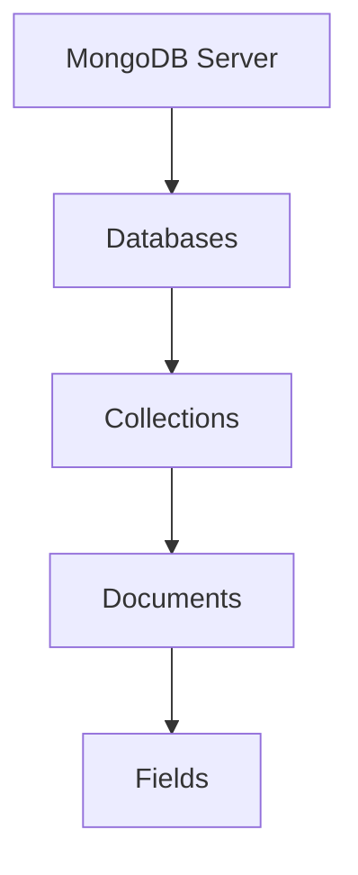

# MongoDB Structure

## Introduction

MongoDB is a popular NoSQL database that stores data in a flexible, JSON-like format called BSON (Binary JSON). Understanding MongoDB's structure is crucial for effectively designing and interacting with MongoDB databases.

Unlike traditional relational databases with tables, rows, and columns, MongoDB uses a different organizational structure. This article explores the hierarchical structure of MongoDB, from databases at the top level down to individual fields within documents.

## MongoDB Hierarchical Structure

MongoDB organizes data in a hierarchical structure consisting of four main levels:



Let's explore each level in detail:

### 1. Databases

At the top level, MongoDB organizes data into databases. A single MongoDB server typically hosts multiple databases, each functioning as a high-level container for collections.

```javascript
// List all databases
show dbs

// Output:
// admin      0.000GB
// config     0.000GB
// local      0.000GB
// myproject  0.000GB
```

To create and switch to a database:

```javascript
// Create or switch to a database named "ecommerce"
use ecommerce

// Output:
// switched to db ecommerce
```

The database won't actually be created until you add data to it.

### 2. Collections

Within databases, MongoDB stores related data in collections. Collections are analogous to tables in relational databases but without enforced schemas. This allows for more flexibility in the types of data you can store.

```javascript
// Create a collection
db.createCollection("products")

// Output:
// { "ok" : 1 }

// List all collections in the current database
show collections

// Output:
// products
```

### 3. Documents

Collections contain documents, which are the basic unit of data in MongoDB. Documents are stored in BSON format and are similar to JSON objects. Each document is composed of field-value pairs.

```javascript
// Insert a document into the products collection
db.products.insertOne({
  name: "Wireless Headphones",
  price: 129.99,
  category: "Electronics",
  inStock: true,
  specifications: {
    color: "black",
    connectivity: "Bluetooth 5.0",
    batteryLife: "30 hours"
  }
})

// Output:
// {
//   "acknowledged": true,
//   "insertedId": ObjectId("5f8d0e2a9d3b2e1c2a9d3b2e")
// }
```

### 4. Fields

Fields are key-value pairs within documents. Fields can be simple data types like strings, numbers, and booleans, or complex types like arrays and embedded documents.

```javascript
// Query to see the fields in our document
db.products.findOne()

// Output:
// {
//   "_id": ObjectId("5f8d0e2a9d3b2e1c2a9d3b2e"),
//   "name": "Wireless Headphones",
//   "price": 129.99,
//   "category": "Electronics",
//   "inStock": true,
//   "specifications": {
//     "color": "black",
//     "connectivity": "Bluetooth 5.0",
//     "batteryLife": "30 hours"
//   }
// }
```

In this document, fields include `_id`, `name`, `price`, `category`, `inStock`, and `specifications`. The `specifications` field contains an embedded document with its own fields.

## Key Characteristics of MongoDB Structure

### Dynamic Schema

Unlike relational databases, MongoDB collections don't enforce a schema, which means:

1. Documents in the same collection can have different sets of fields
2. The data type for a field can differ across documents

This flexibility is particularly useful for evolving data models.

```javascript
// Adding a document with different fields to the same collection
db.products.insertOne({
  name: "Programming Book",
  price: 49.99,
  category: "Books",
  author: "Jane Doe",
  pages: 450,
  topics: ["JavaScript", "MongoDB", "Node.js"]
})

// Output:
// {
//   "acknowledged": true,
//   "insertedId": ObjectId("5f8d0e2b9d3b2e1c2a9d3b2f")
// }
```

### _id Field

Every document in MongoDB must have an `_id` field that serves as a primary key. If you don't provide one, MongoDB automatically generates an ObjectId for this field.

```javascript
// The _id field is automatically created
db.products.insertOne({ name: "Mouse Pad" })

// Output:
// {
//   "acknowledged": true,
//   "insertedId": ObjectId("5f8d0e2c9d3b2e1c2a9d3b30")
// }
```

### Document Size Limit

MongoDB documents have a maximum size of 16MB, which helps ensure good performance. For larger data, you can use GridFS, MongoDB's specification for storing and retrieving large files.

## Real-World Example: E-commerce Application

Let's design a simple MongoDB structure for an e-commerce application to demonstrate how these concepts work together:

```javascript
// Create and switch to our database
use ecommerce_store

// Create collections
db.createCollection("customers")
db.createCollection("products")
db.createCollection("orders")

// Add a customer document
db.customers.insertOne({
  firstName: "John",
  lastName: "Smith",
  email: "john.smith@example.com",
  address: {
    street: "123 Main St",
    city: "New York",
    state: "NY",
    zipCode: "10001"
  },
  phoneNumber: "212-555-1234",
  registeredDate: new Date("2022-01-15")
})

// Add a product document
db.products.insertOne({
  name: "Ultra HD Monitor",
  sku: "MONITOR-4K-27",
  price: 349.99,
  category: "Electronics",
  subcategory: "Monitors",
  manufacturer: "TechScreen",
  description: "27-inch 4K Ultra HD Monitor with HDR support",
  specifications: {
    resolution: "3840x2160",
    refreshRate: "60Hz",
    panelType: "IPS",
    ports: ["HDMI", "DisplayPort", "USB-C"]
  },
  inStock: 45,
  tags: ["monitor", "4k", "ultra hd", "computer accessories"]
})

// Add an order document with references
db.orders.insertOne({
  customerId: ObjectId("customer_id_here"), // Replace with actual ObjectId
  orderDate: new Date(),
  status: "Processing",
  items: [
    {
      productId: ObjectId("product_id_here"), // Replace with actual ObjectId
      name: "Ultra HD Monitor",
      quantity: 1,
      priceAtPurchase: 349.99
    }
  ],
  shippingAddress: {
    street: "123 Main St",
    city: "New York",
    state: "NY",
    zipCode: "10001"
  },
  paymentDetails: {
    method: "Credit Card",
    transactionId: "txn_123456789",
    amount: 349.99,
    tax: 28.00,
    shipping: 15.00,
    total: 392.99
  }
})
```

This example demonstrates:

1. **Database**: `ecommerce_store` containing all e-commerce data
2. **Collections**: `customers`, `products`, and `orders` for organizing related data
3. **Documents**: Individual entries for each customer, product, and order
4. **Fields**: Simple (like `name`, `price`) and complex (like `address` and `specifications` objects)
5. **Document References**: The order document references customer and product documents using their ObjectIds

## Schema Design Considerations

When designing your MongoDB structure, consider these best practices:

### 1. Embedding vs. Referencing

MongoDB gives you two options for relating data:

- **Embedding**: Nesting related data within a single document
- **Referencing**: Storing a reference (usually an ObjectId) to documents in other collections

```javascript
// Embedding example - Customer with embedded addresses
db.customers.insertOne({
  name: "Sarah Johnson",
  addresses: [
    { type: "home", street: "456 Oak Ave", city: "Chicago", state: "IL" },
    { type: "work", street: "789 Corporate Blvd", city: "Chicago", state: "IL" }
  ]
})

// Referencing example - Order referencing customer and products
db.orders.insertOne({
  orderId: "ORD-12345",
  customerId: ObjectId("customer_id_here"),
  products: [
    { productId: ObjectId("product_id_1"), quantity: 2 },
    { productId: ObjectId("product_id_2"), quantity: 1 }
  ]
})
```

General guideline:
- Embed when data is always accessed together and doesn't change frequently
- Reference when data is large, accessed separately, or updated frequently

### 2. Denormalization for Performance

In MongoDB, it's common to duplicate some data (denormalize) across documents to improve read performance, even if this means occasional updates to multiple places.

```javascript
// Example of denormalization - storing product name in order
db.orders.insertOne({
  orderId: "ORD-12345",
  productId: ObjectId("product_id_here"),
  productName: "Ultra HD Monitor", // Duplicated for quick access
  quantity: 1,
  price: 349.99
})
```

## Summary

MongoDB's structure consists of databases, collections, documents, and fields, providing a flexible and scalable approach to data storage. Unlike relational databases, MongoDB offers a dynamic schema that adapts to changing data requirements.

Key points to remember:

1. Databases contain collections, which contain documents, which contain fields
2. Documents are stored as BSON (Binary JSON) and have a 16MB size limit
3. Each document has a unique `_id` field that serves as its primary key
4. Collections don't enforce schemas, allowing documents with different structures
5. You can design relationships using embedding or referencing strategies

Understanding MongoDB's structure is fundamental to designing efficient and effective database solutions for your applications.

## Additional Resources and Exercises

### Resources for Further Learning
- [MongoDB Official Documentation](https://docs.mongodb.com/)
- [MongoDB University](https://university.mongodb.com/) (free online courses)

### Practice Exercises

1. **Basic Structure Creation**: Create a database for a blog with collections for posts, authors, and comments.
   
2. **Data Modeling Challenge**: Design a MongoDB structure for a social media application that includes:
   - User profiles
   - Posts with comments
   - User connections (friends/followers)
   
3. **Embedding vs. Referencing**: For a movie database, decide which data to embed and which to reference among:
   - Movies
   - Actors
   - Directors
   - Reviews

4. **Query Practice**: Using the e-commerce example above, write queries to:
   - Find all products with stock less than 10
   - Find orders for a specific customer
   - Calculate the total value of all orders

By practicing these exercises, you'll gain practical experience with MongoDB's structure and develop skills in designing effective MongoDB databases for your applications.