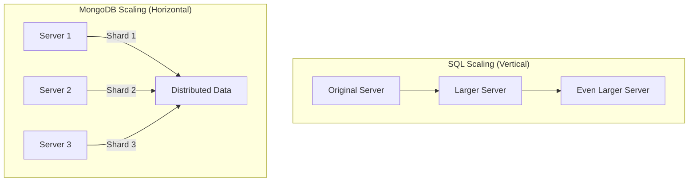

# MongoDB vs SQL

## Introduction

When starting your journey in database management, you'll quickly encounter two major approaches: **SQL** (Structured Query Language) databases like MySQL, PostgreSQL, and SQLite, and **NoSQL** databases like MongoDB. Understanding the fundamental differences between these two database systems is crucial for making informed decisions about which one to use for your projects.

In this tutorial, we'll explore how MongoDB (a popular NoSQL database) differs from traditional SQL databases, and help you understand when to choose one over the other.

## What is SQL?

SQL databases have been the standard for data storage for decades. They are relational database management systems (RDBMS) that store data in tables with rows and columns, establishing relationships between these tables.

### Key Characteristics of SQL Databases

- **Structured Data**: Data is stored in tables with predefined schemas
- **Relationships**: Uses foreign keys to create relationships between tables
- **ACID Compliance**: Ensures reliable transaction processing (Atomicity, Consistency, Isolation, Durability)
- **Vertical Scaling**: Typically scales by increasing the server's power
- **Standardized Language**: Uses SQL as a standard query language

## What is MongoDB?

MongoDB is a document-oriented NoSQL database that stores data in flexible, JSON-like documents. Instead of tables, MongoDB uses collections of documents.

### Key Characteristics of MongoDB

- **Flexible Schema**: Documents in a collection can have different fields
- **Document-Based**: Data stored in BSON (Binary JSON) documents
- **No Complex Joins**: Typically embeds related data in a single document
- **Horizontal Scaling**: Built to scale out across multiple servers
- **Query Language**: Uses a document-based query language

## Core Differences: A Side-by-Side Comparison

### Data Structure

**SQL**:
- Data is stored in tables with rows and columns
- Requires a predefined schema
- Relations between tables are established through foreign keys

**MongoDB**:
- Data is stored in collections containing JSON-like documents
- Flexible, dynamic schema
- Can embed related data within a document

### Schema

Let's see how the same data would be structured in both systems:

**SQL Schema Example**:

```sql
CREATE TABLE customers (
    id INT PRIMARY KEY,
    name VARCHAR(100),
    email VARCHAR(100),
    phone VARCHAR(15)
);

CREATE TABLE orders (
    id INT PRIMARY KEY,
    customer_id INT,
    order_date DATE,
    total DECIMAL(10,2),
    FOREIGN KEY (customer_id) REFERENCES customers(id)
);
```

**MongoDB Schema Example**:

```javascript
// No explicit schema definition needed, but could use a model like:
const customerSchema = {
  name: String,
  email: String,
  phone: String,
  orders: [
    {
      order_date: Date,
      total: Number,
      items: Array
    }
  ]
}
```

### Query Language

**SQL Query Example**:

```sql
-- Find all orders for a specific customer
SELECT o.id, o.order_date, o.total
FROM orders o
JOIN customers c ON o.customer_id = c.id
WHERE c.name = 'John Doe';
```

**MongoDB Query Example**:

```javascript
// Find all orders for a specific customer
db.customers.find(
  { "name": "John Doe" },
  { "orders": 1, "_id": 0 }
)
```

### Relationships

**SQL** handles relationships through foreign keys and joins:

```sql
-- Fetch customers and their orders
SELECT c.name, o.id as order_id, o.total
FROM customers c
LEFT JOIN orders o ON c.id = o.customer_id;
```

**MongoDB** typically embeds related data or uses references:

```javascript
// Embedded approach
db.customers.find(
  { "name": "John Doe" },
  { "name": 1, "orders": 1 }
)

// Reference approach (using an application-level join)
const customer = db.customers.findOne({ "name": "John Doe" });
const customerOrders = db.orders.find({ "customer_id": customer._id });
```

## Performance Considerations

### When SQL Shines

- **Complex Queries**: SQL excels when you need to execute complex joins across multiple tables
- **Transaction Requirements**: When ACID compliance is critical (e.g., financial applications)
- **Established Data Structure**: When data structure is well-defined and unlikely to change

### When MongoDB Shines

- **Large Data Volume**: MongoDB can handle very large amounts of data with horizontal scaling
- **Evolving Schema**: When your data structure may change over time
- **High Write Load**: MongoDB's architecture can handle high write loads efficiently
- **Hierarchical Data**: When dealing with nested or hierarchical data structures

## Real-World Examples

### E-commerce Application

Let's compare how an e-commerce product catalog might be implemented in both systems:

**SQL Approach**:

```sql
-- SQL schema for a product catalog
CREATE TABLE categories (
    id INT PRIMARY KEY,
    name VARCHAR(100)
);

CREATE TABLE products (
    id INT PRIMARY KEY,
    name VARCHAR(200),
    price DECIMAL(10,2),
    description TEXT,
    category_id INT,
    FOREIGN KEY (category_id) REFERENCES categories(id)
);

CREATE TABLE product_attributes (
    id INT PRIMARY KEY,
    product_id INT,
    attribute_name VARCHAR(100),
    attribute_value VARCHAR(200),
    FOREIGN KEY (product_id) REFERENCES products(id)
);

-- Query to get product with its attributes
SELECT p.name, p.price, c.name as category, pa.attribute_name, pa.attribute_value
FROM products p
JOIN categories c ON p.category_id = c.id
JOIN product_attributes pa ON p.id = pa.product_id
WHERE p.id = 123;
```

**MongoDB Approach**:

```javascript
// MongoDB document for a product
{
  "_id": ObjectId("123abc"),
  "name": "Wireless Headphones",
  "price": 89.99,
  "description": "High-quality wireless headphones with noise cancellation",
  "category": {
    "name": "Electronics",
    "id": 456
  },
  "attributes": [
    { "name": "Color", "value": "Black" },
    { "name": "Battery Life", "value": "20 hours" },
    { "name": "Connectivity", "value": "Bluetooth 5.0" }
  ]
}

// MongoDB query to get the product
db.products.findOne({ "_id": ObjectId("123abc") })
```

### User Authentication System

Let's see how a user authentication system might differ:

**SQL Approach**:

```sql
-- SQL tables for users, roles, and permissions
CREATE TABLE users (
    id INT PRIMARY KEY,
    username VARCHAR(50) UNIQUE,
    password_hash VARCHAR(255),
    email VARCHAR(100) UNIQUE,
    created_at TIMESTAMP DEFAULT CURRENT_TIMESTAMP
);

CREATE TABLE roles (
    id INT PRIMARY KEY,
    name VARCHAR(50) UNIQUE
);

CREATE TABLE user_roles (
    user_id INT,
    role_id INT,
    PRIMARY KEY (user_id, role_id),
    FOREIGN KEY (user_id) REFERENCES users(id),
    FOREIGN KEY (role_id) REFERENCES roles(id)
);

-- Query to get a user with roles
SELECT u.username, u.email, r.name as role
FROM users u
JOIN user_roles ur ON u.id = ur.user_id
JOIN roles r ON ur.role_id = r.id
WHERE u.username = 'johndoe';
```

**MongoDB Approach**:

```javascript
// MongoDB document for a user with roles
{
  "_id": ObjectId("456def"),
  "username": "johndoe",
  "password_hash": "$2a$10$XOPbrlUPQdwdJUpSrIF6X.LbE14qsMmKGq4V8tfX",
  "email": "john@example.com",
  "created_at": ISODate("2023-05-15T09:24:17Z"),
  "roles": ["admin", "editor"]
}

// MongoDB query to find the user with specific roles
db.users.findOne({ "username": "johndoe", "roles": "admin" })
```

## When to Choose Which?

### Choose SQL When:

1. Your data is structured and unlikely to change
2. You need to perform complex queries with multiple joins
3. ACID compliance is critical for your application
4. You have complex transactions that need to maintain integrity
5. You're building an application with clearly defined relationships

### Choose MongoDB When:

1. Your data structure may evolve over time
2. You need horizontal scalability for large volumes of data
3. You're building applications that require high write throughput
4. Your data is hierarchical or document-oriented
5. You need rapid development with flexible schemas

## Scaling Differences

SQL and MongoDB handle scaling differently, which can significantly impact your application as it grows:



## Common Misconceptions

1. **"NoSQL is always faster than SQL"** - Not true. Performance depends on your specific use case, data model, and query patterns.

2. **"MongoDB doesn't support transactions"** - While early versions had limited transaction support, MongoDB now supports multi-document ACID transactions.

3. **"SQL can't scale as well as MongoDB"** - SQL databases can scale well through techniques like replication and sharding, though the approach differs from MongoDB.

4. **"MongoDB has no schema"** - MongoDB has a flexible schema, not no schema. Well-designed MongoDB applications still need thoughtful data modeling.

## Summary

In this tutorial, we explored the key differences between MongoDB and SQL databases:

- **SQL** uses tables with predefined schemas and relationships between tables
- **MongoDB** uses collections of JSON-like documents with flexible schemas
- SQL excels at complex queries and transactions
- MongoDB provides flexibility, scalability, and is well-suited for document-oriented data

The choice between MongoDB and SQL isn't about which is better overall, but rather which is better suited for your specific project requirements. Many modern applications even use both types of databases for different components of their system, known as a polyglot persistence approach.

## Additional Resources

- Try practicing by designing a blogging platform database in both SQL and MongoDB
- Experiment with creating a simple application that uses both database types
- Explore MongoDB's aggregation framework and compare it to SQL's GROUP BY operations
- Implement a simple CRUD application using both database systems and compare the implementation complexity

## Exercises

1. Design a database schema for a simple social media platform in both SQL and MongoDB.
2. Write queries to find all posts by a specific user in both SQL and MongoDB.
3. Implement a data migration script that would move data from a SQL database to MongoDB.
4. Compare the performance of a complex query in both database systems.
5. Design a database model for a library management system in both SQL and MongoDB, and evaluate which would be more appropriate.

By understanding the strengths and weaknesses of both SQL and MongoDB, you'll be better equipped to choose the right database system for your future projects.