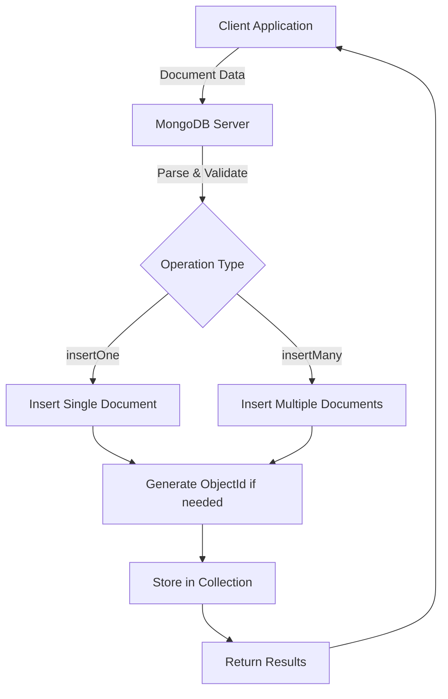

# MongoDB Create Operations

## Introduction

Create operations in MongoDB are foundational to working with the database. These operations allow you to add new documents to collections, which is the first step in storing data in MongoDB. Whether you're building a simple application or a complex data platform, understanding how to properly insert data is essential.

In this guide, we'll explore the various ways to create documents in MongoDB, covering single and multiple document insertions, along with options and best practices to make your database operations efficient and reliable.

## Understanding MongoDB Documents

Before diving into create operations, let's briefly review what a MongoDB document is:

- A MongoDB document is a JSON-like data structure with key-value pairs
- Documents are stored in collections (similar to tables in relational databases)
- Each document typically has a unique `_id` field that serves as a primary key
- Documents can have different structures within the same collection (schema flexibility)

## Basic Document Creation

### The `insertOne()` Method

The simplest way to add a document to a MongoDB collection is using the `insertOne()` method.

```javascript
// Syntax
db.collection.insertOne(
   <document>,
   {
      writeConcern: <document>
   }
)
```

Let's look at a practical example:

```javascript
// Insert a single document into a collection named "users"
db.users.insertOne({
    name: "John Doe",
    email: "john.doe@example.com",
    age: 30,
    address: {
        street: "123 Main St",
        city: "Anytown",
        zipCode: "12345"
    },
    interests: ["reading", "hiking", "coding"]
})

// Output
{
  "acknowledged": true,
  "insertedId": ObjectId("60a2b8e13f3d7a58f0b8b4d1")
}
```

In this example:
- We created a document with various data types (strings, numbers, objects, and arrays)
- MongoDB automatically generated an `_id` field with a unique ObjectId
- The operation returned acknowledgment and the ID of the inserted document

### Specifying Your Own Document ID

If you prefer to use your own identifier instead of letting MongoDB generate one, you can include an `_id` field in your document:

```javascript
// Insert a document with a custom _id
db.products.insertOne({
    _id: "PROD-001",
    name: "Smartphone X",
    price: 799.99,
    category: "Electronics",
    inStock: true
})

// Output
{
  "acknowledged": true,
  "insertedId": "PROD-001"
}
```

:::caution
When specifying your own `_id`, ensure it's unique across the collection. Attempting to insert a document with a duplicate `_id` will result in an error.
:::

## Inserting Multiple Documents

### The `insertMany()` Method

To create multiple documents in a single operation, use the `insertMany()` method.

```javascript
// Syntax
db.collection.insertMany(
   [ <document 1>, <document 2>, ... ],
   {
      writeConcern: <document>,
      ordered: <boolean>
   }
)
```

Here's an example inserting multiple documents:

```javascript
// Insert multiple documents into the "inventory" collection
db.inventory.insertMany([
    {
        item: "notebook",
        qty: 50,
        price: 10.99,
        tags: ["office", "stationary"]
    },
    {
        item: "pencil",
        qty: 100,
        price: 1.99,
        tags: ["school", "office"]
    },
    {
        item: "eraser",
        qty: 25,
        price: 0.99,
        tags: ["school"]
    }
])

// Output
{
  "acknowledged": true,
  "insertedIds": {
    "0": ObjectId("60a2b9e13f3d7a58f0b8b4d2"),
    "1": ObjectId("60a2b9e13f3d7a58f0b8b4d3"),
    "2": ObjectId("60a2b9e13f3d7a58f0b8b4d4")
  }
}
```

### Ordered vs. Unordered Inserts

By default, `insertMany()` performs an ordered insert, which means MongoDB will stop processing upon encountering an error. You can change this behavior with the `ordered` option:

```javascript
// Unordered insert - continues processing even if some documents fail
db.products.insertMany([
    { _id: 1, name: "Tablet", price: 299.99 },
    { _id: 2, name: "Laptop", price: 1299.99 },
    { _id: 2, name: "Duplicate ID", price: 599.99 }, // This will fail
    { _id: 3, name: "Monitor", price: 199.99 }
], { ordered: false })

// Output in case of error with ordered: false
{
  "acknowledged": true,
  "insertedIds": {
    "0": 1,
    "1": 2,
    "3": 3
  },
  "writeErrors": [
    {
      "index": 2,
      "code": 11000,
      "errmsg": "E11000 duplicate key error collection: test.products index: _id_ dup key: { _id: 2 }"
    }
  ]
}
```

In this example:
- The document with the duplicate `_id: 2` fails
- Since we specified `ordered: false`, MongoDB continues processing the remaining documents
- The result shows which documents were inserted and which errors occurred

## Advanced Create Operations

### Write Concern

Write concern determines the level of acknowledgment requested from MongoDB for write operations.

```javascript
// Insert with a specific write concern
db.orders.insertOne(
    { 
        customerId: "CUST-1234", 
        items: ["widget-A", "widget-B"],
        total: 57.98 
    },
    { writeConcern: { w: "majority", wtimeout: 5000 } }
)
```

In this example, the operation will ensure the write is acknowledged by a majority of the replica set members, with a 5-second timeout.

### Bulk Write Operations

For more control over different types of write operations, you can use the `bulkWrite()` method:

```javascript
// Perform multiple operations in bulk
db.customers.bulkWrite([
    { 
        insertOne: { 
            document: { name: "Alice", email: "alice@example.com" } 
        }
    },
    { 
        insertOne: { 
            document: { name: "Bob", email: "bob@example.com" } 
        }
    },
    // Other operations like updateOne, deleteOne can also be included
])
```

## Real-World Application Example

Let's look at a more comprehensive example of creating documents for a simple blog application:

```javascript
// Create a new blog post
db.blogPosts.insertOne({
    title: "Getting Started with MongoDB",
    slug: "getting-started-with-mongodb",
    author: {
        name: "Jane Smith",
        email: "jane.smith@example.com",
        userId: ObjectId("60a2b8e13f3d7a58f0b8b4d5")
    },
    content: "MongoDB is a popular NoSQL database that offers flexibility and scalability...",
    tags: ["mongodb", "database", "nosql", "tutorial"],
    createdAt: new Date(),
    status: "published",
    comments: [],
    metadata: {
        wordCount: 1250,
        readTimeMinutes: 5,
        featured: true
    }
})

// Insert multiple comments for a blog post
const postId = ObjectId("60a2b8e13f3d7a58f0b8b4e1");

db.comments.insertMany([
    {
        postId: postId,
        user: "Alex Johnson",
        content: "Great tutorial! Very helpful for beginners.",
        createdAt: new Date(),
        likes: 5
    },
    {
        postId: postId,
        user: "Maria Garcia",
        content: "I would like to see more examples of complex queries.",
        createdAt: new Date(),
        likes: 2
    },
    {
        postId: postId,
        user: "Tom Wilson",
        content: "This helped me solve my database issues.",
        createdAt: new Date(),
        likes: 3
    }
])
```

This example shows how to:
1. Create a detailed blog post document with nested objects, arrays, and different data types
2. Insert multiple related comments with references to the original post
3. Use appropriate data types for each field (strings, dates, numbers, ObjectIds)

## Best Practices for Create Operations

### 1. Document Validation

Consider adding validation rules to prevent invalid data from being inserted:

```javascript
db.createCollection("products", {
    validator: {
        $jsonSchema: {
            bsonType: "object",
            required: ["name", "price", "category"],
            properties: {
                name: {
                    bsonType: "string",
                    description: "must be a string and is required"
                },
                price: {
                    bsonType: "number",
                    minimum: 0,
                    description: "must be a positive number and is required"
                },
                category: {
                    bsonType: "string",
                    description: "must be a string and is required"
                }
            }
        }
    }
})
```

### 2. Handling Errors

Always implement error handling in your application code:

```javascript
try {
    db.users.insertOne({
        username: "newuser",
        email: "newuser@example.com"
    });
    console.log("Document inserted successfully");
} catch (error) {
    console.error("Error inserting document:", error.message);
}
```

### 3. Use Batch Operations for Better Performance

When adding multiple documents, use `insertMany()` instead of multiple `insertOne()` operations to reduce network overhead.

### 4. Be Cautious with Large Documents

MongoDB has a 16MB document size limit. For larger data, consider references or GridFS.

## MongoDB Create Operations Visualization

Here's a diagram showing the document creation flow in MongoDB:



## Summary

In this guide, we've covered MongoDB's create operations in depth:

- Using `insertOne()` to add a single document to a collection
- Using `insertMany()` for batch insertions
- Working with custom document IDs
- Configuring options like ordered inserts and write concerns
- Implementing document validation and error handling
- Best practices for efficient document creation

Create operations form the foundation of working with MongoDB, and mastering them will help you build robust and efficient database interactions in your applications.

## Exercises

To practice what you've learned, try these exercises:

1. Create a collection named "students" and insert a document with fields for name, age, grade, and a nested object for contact information.
2. Insert multiple documents representing different products with varying attributes into an "inventory" collection.
3. Create a collection with validation rules and attempt to insert valid and invalid documents.
4. Use bulkWrite to perform a mix of insert operations.
5. Create a document with your own custom _id and then try to create another document with the same _id. Handle the error appropriately.

## Additional Resources

- [MongoDB Documentation on Insert Operations](https://docs.mongodb.com/manual/tutorial/insert-documents/)
- [MongoDB Data Validation](https://docs.mongodb.com/manual/core/schema-validation/)
- [Bulk Write Operations in MongoDB](https://docs.mongodb.com/manual/core/bulk-write-operations/)