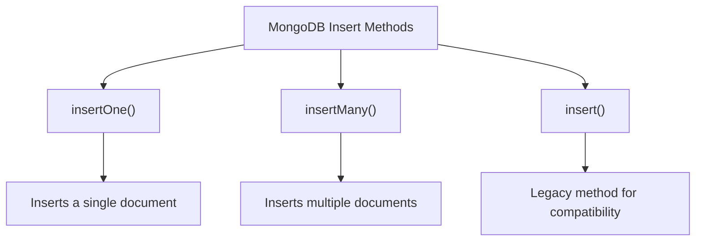

# MongoDB insertOne

## Introduction

In MongoDB, adding data to a collection is one of the most fundamental operations you'll perform. The `insertOne()` method is the primary way to add a single document to a MongoDB collection. Whether you're building a user registration system, a product catalog, or a blog platform, understanding how to properly insert documents is essential.

In this guide, we'll explore how to use the `insertOne()` method, its options, handling potential errors, and see practical examples that demonstrate how to implement it in real applications.

## What is insertOne()?

The `insertOne()` method is used to add a new document to a MongoDB collection. It takes a JSON-like document as an argument and inserts it into the specified collection.

### Basic Syntax

```javascript
db.collection.insertOne(
   <document>,
   {
      writeConcern: <document>,
      ordered: <boolean>
   }
)
```

Where:
- `<document>` is the document you want to insert
- `writeConcern` (optional) defines the level of acknowledgment requested from MongoDB for the write operation
- `ordered` (optional) specifies whether to perform an ordered or unordered insert operation

## Using insertOne() - Basic Example

Let's start with a simple example of adding a user to a `users` collection:

```javascript
db.users.insertOne({
  name: "John Doe",
  email: "john.doe@example.com",
  age: 30,
  active: true,
  created: new Date()
});
```

### Output:

```javascript
{
  "acknowledged": true,
  "insertedId": ObjectId("60a2e2c67c865a5a8511fb82")
}
```

This output tells us:
- The operation was acknowledged by the MongoDB server
- MongoDB generated a unique `_id` field (an ObjectId) for the document

## Understanding the Result

When you execute an `insertOne()` operation, MongoDB returns a document containing:

1. `acknowledged`: A boolean indicating if the operation was acknowledged by the server
2. `insertedId`: The `_id` value of the inserted document

If you don't specify an `_id` field in your document, MongoDB will automatically generate a unique ObjectId for you.

## Document Structure and Data Types

MongoDB documents are essentially JSON-like objects. You can insert different data types, including:

```javascript
db.product.insertOne({
  name: "Laptop",
  price: 999.99,                // Number (floating point)
  quantity: 50,                 // Number (integer)
  available: true,              // Boolean
  categories: ["electronics", "computers"], // Array
  specs: {                      // Nested document
    cpu: "Intel i7",
    ram: "16GB",
    storage: "512GB SSD"
  },
  lastUpdated: new Date(),      // Date object
  manufacturer_id: ObjectId("60a2e2c67c865a5a8511fb83") // ObjectId reference
});
```

## Handling Errors and Validation

When inserting documents, you may encounter errors. Common issues include:

1. **Duplicate Key Error**: When trying to insert a document with an `_id` that already exists

```javascript
// This will succeed
db.inventory.insertOne({ _id: 123, item: "Pencil", qty: 500 });

// This will fail with a duplicate key error
db.inventory.insertOne({ _id: 123, item: "Pen", qty: 300 });
```

2. **Schema Validation Errors**: If your collection has validation rules

To handle potential errors, you can use try-catch blocks in your application code:

```javascript
try {
  db.inventory.insertOne({ _id: 123, item: "Pencil", qty: 500 });
  console.log("Document inserted successfully");
} catch (e) {
  console.error("Error during insertion:", e.message);
}
```

## InsertOne() Options

### Write Concern

Write concern determines the level of acknowledgment requested from MongoDB for write operations:

```javascript
db.users.insertOne(
  { name: "Jane Smith", email: "jane@example.com" },
  { writeConcern: { w: "majority", wtimeout: 5000 } }
);
```

This ensures that the write operation has been applied to a majority of the replica set members within 5 seconds.

### Bypassing Document Validation

If you have document validation rules but need to insert a document that doesn't meet those rules:

```javascript
db.validated_collection.insertOne(
  { value: "invalid_value" },
  { bypassDocumentValidation: true }
);
```

## Practical Examples

### Example 1: User Registration System

```javascript
function registerUser(userData) {
  // Add default values and process data
  const user = {
    ...userData,
    verified: false,
    createdAt: new Date(),
    lastLogin: new Date(),
    roles: ["user"]
  };
  
  try {
    const result = db.users.insertOne(user);
    return {
      success: true,
      userId: result.insertedId,
      message: "User registered successfully"
    };
  } catch (error) {
    if (error.code === 11000) { // Duplicate key error
      return {
        success: false,
        message: "Email address already in use"
      };
    }
    return {
      success: false,
      message: "Error during registration"
    };
  }
}
```

### Example 2: E-commerce Product Addition

```javascript
function addProduct(productData) {
  // Generate SKU and add metadata
  const product = {
    ...productData,
    sku: generateSKU(productData.category, productData.name),
    addedOn: new Date(),
    lastModified: new Date(),
    views: 0,
    sales: 0
  };
  
  const result = db.products.insertOne(product);
  
  // If insertion successful, update inventory
  if (result.acknowledged) {
    db.inventory.insertOne({
      product_id: result.insertedId,
      warehouse: "MAIN",
      quantity: productData.initialStock,
      lowStockAlert: productData.initialStock < 10
    });
    
    return {
      success: true,
      productId: result.insertedId
    };
  }
  
  return { success: false };
}
```

### Example 3: Logging System

```javascript
function logSystemEvent(eventType, details) {
  const event = {
    type: eventType,
    details: details,
    timestamp: new Date(),
    severity: getSeverityLevel(eventType)
  };
  
  try {
    db.system_logs.insertOne(event);
    
    // If it's a critical event, also store in separate collection
    if (event.severity === "CRITICAL") {
      db.critical_events.insertOne({
        ...event,
        acknowledged: false,
        notificationSent: false
      });
    }
    
    return true;
  } catch (error) {
    // Fallback logging if database insert fails
    console.error("Failed to log event to database:", eventType, details);
    return false;
  }
}
```

## MongoDB insertOne() vs Other Insert Methods

MongoDB provides several methods for inserting documents:



- **insertOne()**: Inserts a single document
- **insertMany()**: Inserts multiple documents in one operation
- **insert()**: Legacy method that can insert either one document or an array of documents

## Performance Considerations

When using `insertOne()`, keep these performance tips in mind:

1. **Batching**: If you need to insert multiple documents, use `insertMany()` instead of multiple `insertOne()` calls
2. **Indexes**: Be aware that inserting into collections with many indexes will be slower
3. **Write Concern**: Higher write concern levels (like `{w: "majority"}`) provide more durability but may impact performance
4. **Document Size**: MongoDB has a 16MB document size limit

## Summary

The `insertOne()` method is a fundamental MongoDB operation for adding new documents to collections. In this guide, we've covered:

- Basic syntax and usage of `insertOne()`
- Understanding the result object
- Handling different data types in documents
- Error handling strategies
- Configuration options like write concerns
- Practical examples in real-world applications

By mastering `insertOne()`, you've taken an important step in your MongoDB journey. This operation forms the foundation for creating data in your MongoDB collections.

## Exercises

1. Create a collection named `books` and insert a document representing your favorite book with fields for title, author, publication year, and genre.
2. Write a function that takes user input (like name, email, age) and inserts it into a `contacts` collection with error handling for duplicate emails.
3. Insert a document with a custom `_id` field rather than letting MongoDB generate one automatically.
4. Create a blog post document with nested arrays of comments, each containing the commenter's name and the comment text.
5. Try inserting a document with the `insertOne()` method and a write concern that ensures the write is acknowledged by a majority of replica set members.

## Additional Resources

- [MongoDB Official Documentation on insertOne()](https://www.mongodb.com/docs/manual/reference/method/db.collection.insertOne/)
- [MongoDB Data Types](https://www.mongodb.com/docs/manual/reference/bson-types/)
- [Write Concern Documentation](https://www.mongodb.com/docs/manual/reference/write-concern/)

Happy coding with MongoDB!