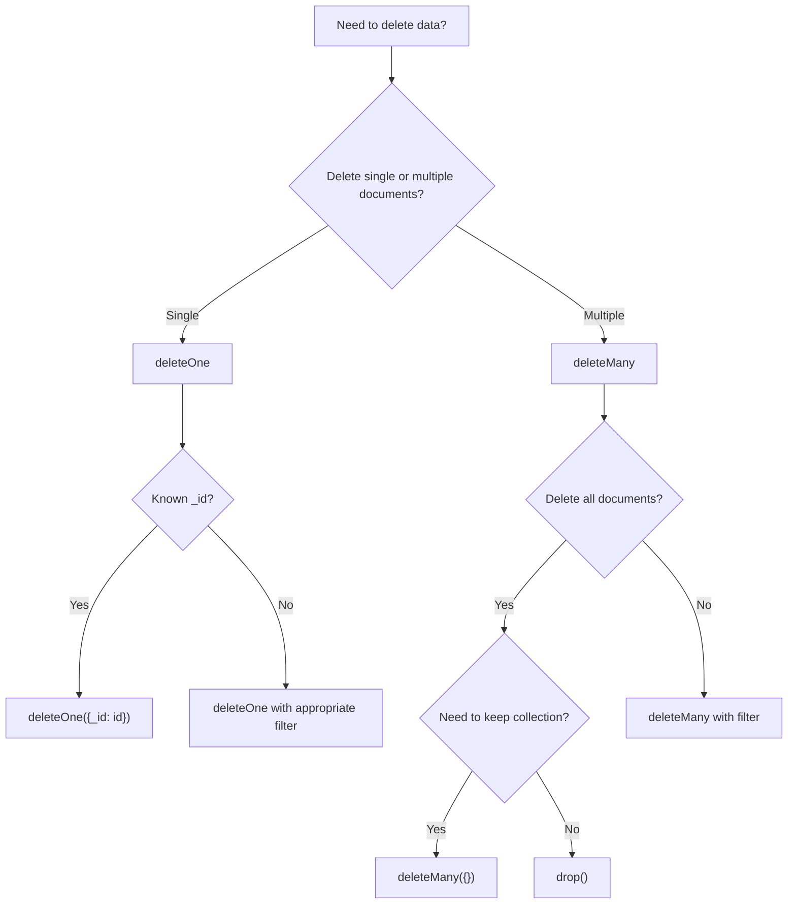

# MongoDB Delete Operations

## Introduction

Delete operations in MongoDB allow you to remove documents from collections when they're no longer needed. These operations are fundamental to database management, helping you maintain clean, relevant data and optimize storage space. Whether you need to remove a single document, multiple documents matching specific criteria, or clear an entire collection, MongoDB provides efficient methods to handle these tasks.

In this tutorial, we'll explore the various delete operations in MongoDB, when to use each one, and best practices to follow when removing data from your database.

## Understanding Delete Operations

MongoDB provides two primary methods for removing documents:

1. `deleteOne()` - Removes a single document that matches the specified criteria
2. `deleteMany()` - Removes all documents that match the specified criteria

Let's dive into each method with examples.

## The deleteOne() Method

The `deleteOne()` method removes the first document that matches the specified filter criteria. If multiple documents match the filter, only the first document found will be deleted.

### Syntax

```javascript
db.collection.deleteOne(<filter>, <options>)
```

Where:
- `filter`: Specifies the selection criteria for deletion
- `options`: Optional parameters for the delete operation

### Example: Delete a Single Document

Let's say we have a `users` collection with the following documents:

```javascript
[
  { "_id": 1, "name": "John", "age": 25, "city": "New York" },
  { "_id": 2, "name": "Jane", "age": 30, "city": "Boston" },
  { "_id": 3, "name": "Bob", "age": 35, "city": "Chicago" },
  { "_id": 4, "name": "Alice", "age": 28, "city": "New York" }
]
```

To delete the user named "Bob":

```javascript
db.users.deleteOne({ name: "Bob" })
```

Output:
```javascript
{ "acknowledged": true, "deletedCount": 1 }
```

After this operation, our collection would look like:

```javascript
[
  { "_id": 1, "name": "John", "age": 25, "city": "New York" },
  { "_id": 2, "name": "Jane", "age": 30, "city": "Boston" },
  { "_id": 4, "name": "Alice", "age": 28, "city": "New York" }
]
```

### Deleting by ObjectId

When deleting documents by their `_id` field, remember that MongoDB automatically generates ObjectId values for this field. To delete a document by its ObjectId:

```javascript
db.users.deleteOne({ _id: ObjectId("60a2e8eaf09c2d1e9c9e8f4a") })
```

## The deleteMany() Method

The `deleteMany()` method removes all documents that match the specified filter criteria. This is useful for batch deletions.

### Syntax

```javascript
db.collection.deleteMany(<filter>, <options>)
```

### Example: Delete Multiple Documents

Let's delete all users who live in "New York":

```javascript
db.users.deleteMany({ city: "New York" })
```

Output:
```javascript
{ "acknowledged": true, "deletedCount": 2 }
```

After this operation, our collection would look like:

```javascript
[
  { "_id": 2, "name": "Jane", "age": 30, "city": "Boston" }
]
```

### Delete All Documents in a Collection

To remove all documents from a collection, pass an empty document `{}` as the filter:

```javascript
db.users.deleteMany({})
```

Output:
```javascript
{ "acknowledged": true, "deletedCount": 3 }
```

This will remove all documents but keep the collection and its indexes intact.

## Compound Conditions for Deletion

You can use complex query operators to define more specific conditions for document deletion.

### Example: Delete with Multiple Conditions

Delete users who are over 30 years old and live in Boston:

```javascript
db.users.deleteMany({
  age: { $gt: 30 },
  city: "Boston"
})
```

## Comparing delete() vs. remove() Methods

MongoDB also has a `remove()` method for deleting documents. However, this method is now deprecated in favor of `deleteOne()` and `deleteMany()`.

Old approach (deprecated):
```javascript
db.users.remove({ name: "John" })  // Removes all documents matching the criteria
db.users.remove({ name: "John" }, true)  // Removes only the first matching document
```

New approach (recommended):
```javascript
db.users.deleteMany({ name: "John" })  // Removes all matching documents
db.users.deleteOne({ name: "John" })   // Removes only the first matching document
```

The newer methods provide clearer intent and better consistency with other CRUD operations.

## drop() Method: Removing Collections

If you want to remove an entire collection including its indexes, use the `drop()` method:

```javascript
db.users.drop()
```

Output:
```javascript
true
```

This operation is much faster than deleting all documents with `deleteMany({})` if you plan to remove everything, as it doesn't need to iterate through each document.

## Real-world Applications

Let's explore some common scenarios where delete operations are essential:

### 1. Cleaning Up Temporary Data

In a web application that stores temporary session data:

```javascript
// Delete expired sessions (older than 24 hours)
const twentyFourHoursAgo = new Date(Date.now() - 24 * 60 * 60 * 1000);

db.sessions.deleteMany({
  lastActive: { $lt: twentyFourHoursAgo }
});
```

### 2. User Account Deletion

When a user requests account deletion, you might need to remove their data from multiple collections:

```javascript
// Start a session for transaction
const session = db.getMongo().startSession();
session.startTransaction();

try {
  // Delete user document
  db.users.deleteOne({ _id: userId }, { session });
  
  // Delete all user's posts
  db.posts.deleteMany({ authorId: userId }, { session });
  
  // Delete user's comments
  db.comments.deleteMany({ userId: userId }, { session });
  
  // Commit the transaction
  session.commitTransaction();
} catch (error) {
  // Abort transaction on error
  session.abortTransaction();
  throw error;
} finally {
  session.endSession();
}
```

### 3. Data Migration and Cleanup

When migrating to a new data structure, you might want to remove the old format:

```javascript
// Remove documents with the old schema version
db.products.deleteMany({ schemaVersion: { $lt: 3 } });
```

## Best Practices for Delete Operations

1. **Always Use Specific Filters**: Avoid broad delete operations. Be as specific as possible with your query filters.

2. **Consider Using Soft Deletes**: Instead of physically removing documents, consider adding a `deleted` flag:

   ```javascript
   // Soft delete approach
   db.users.updateMany(
     { city: "Boston" },
     { $set: { isDeleted: true, deletedAt: new Date() } }
   )
   ```

3. **Use Transactions for Complex Operations**: When deleting related data across multiple collections, use transactions to maintain data integrity.

4. **Create Backups Before Large Deletions**: Always backup your data before performing large-scale deletion operations.

5. **Index Fields Used in Delete Queries**: Ensure that fields commonly used in delete operation filters are indexed for better performance.

6. **Perform Deletes in Batches**: For very large delete operations, consider breaking them into smaller batches to avoid locking issues:

   ```javascript
   // Delete in batches of 1000
   let cursor = db.largeCollection.find({ outdated: true }).limit(1000);
   while (cursor.hasNext()) {
     let ids = cursor.map(doc => doc._id);
     db.largeCollection.deleteMany({ _id: { $in: ids } });
     cursor = db.largeCollection.find({ outdated: true }).limit(1000);
   }
   ```

## Common Delete Operation Patterns

Here's a flowchart showing common decision patterns for delete operations:



## Summary

MongoDB provides powerful and flexible delete operations through the `deleteOne()` and `deleteMany()` methods. These operations allow you to remove documents based on specific criteria, helping you maintain your database by eliminating outdated or unnecessary data.

Key points to remember:
- Use `deleteOne()` to remove a single document (the first matching one)
- Use `deleteMany()` to remove all documents matching your criteria
- Use `drop()` to remove an entire collection including its indexes
- Always be specific with your filter criteria to avoid accidental data loss
- Consider soft deletes for data that might need to be recovered
- Use transactions for deletes that affect multiple collections

## Practice Exercises

1. Create a `products` collection and insert several documents. Then write a query to delete all products that are out of stock.

2. Create a collection of `logs` with timestamps and delete all logs older than 30 days.

3. Implement a soft delete system for a `customers` collection, and write queries to:
   - Mark a customer as deleted
   - Retrieve only non-deleted customers
   - Permanently remove customers that were "soft deleted" more than 1 year ago

4. Create a script that removes duplicate documents from a collection, keeping only the newest version of each document.

## Further Resources

- [MongoDB Documentation: Delete Operations](https://docs.mongodb.com/manual/tutorial/remove-documents/)
- [MongoDB Data Modeling Best Practices](https://www.mongodb.com/blog/post/building-with-patterns-the-extended-reference-pattern)
- [Working with MongoDB Transactions](https://docs.mongodb.com/manual/core/transactions/)
- [MongoDB Write Concerns and Data Durability](https://docs.mongodb.com/manual/reference/write-concern/)

By mastering MongoDB's delete operations, you'll be able to maintain clean, efficient databases and implement proper data lifecycle management in your applications.