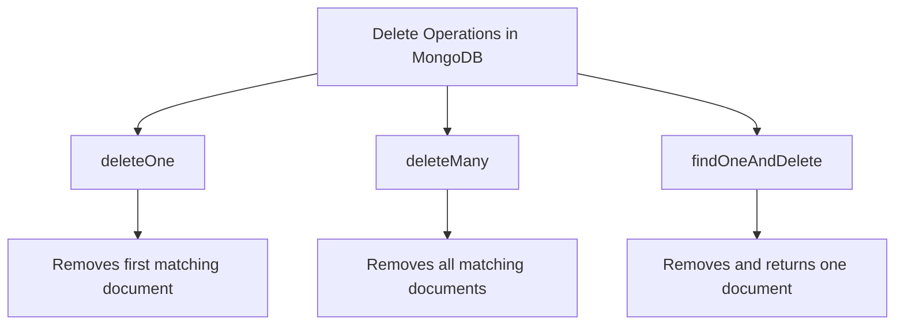

# MongoDB deleteMany

MongoDB's `deleteMany()` method is a powerful operation that allows you to remove multiple documents from a collection that match specific filter criteria. This is particularly useful when you need to clean up or update your database by removing sets of related documents at once.

## Introduction

In any database system, deleting data is as important as creating or updating it. Whether you're cleaning up outdated records, removing test data, or implementing a data retention policy, MongoDB's `deleteMany()` operation provides an efficient way to remove multiple documents simultaneously.

Unlike the `deleteOne()` method which removes only the first matching document, `deleteMany()` removes all documents that match the specified filter. This makes it both powerful and potentially dangerous if used without proper filtering conditions.

## Basic Syntax

The basic syntax for the `deleteMany()` operation is:

```javascript
db.collection.deleteMany(filter, options)
```

### Parameters

- `filter`: A document that specifies the selection criteria for the documents to delete.
- `options`: Optional. Additional options for the delete operation.

### Return Value

The `deleteMany()` method returns a document containing:
- `acknowledged`: boolean indicating if the operation was acknowledged by the server
- `deletedCount`: the number of documents that were deleted

## Basic Usage

Let's see how to use the `deleteMany()` method with some simple examples.

### Example 1: Delete All Documents in a Collection

To remove all documents from a collection:

```javascript
db.products.deleteMany({})
```

**Output:**
```javascript
{ "acknowledged" : true, "deletedCount" : 35 }
```

This command is very powerful (and potentially dangerous) as it deletes all documents in the collection. It's equivalent to truncating a table in SQL databases but preserves the collection structure and indexes.

### Example 2: Delete Documents with Specific Criteria

Let's delete all products that are out of stock:

```javascript
db.products.deleteMany({ stock: 0 })
```

**Output:**
```javascript
{ "acknowledged" : true, "deletedCount" : 7 }
```

This removes all products where the `stock` field equals 0.

## Advanced Filtering

One of MongoDB's strengths is its expressive query language. The `deleteMany()` method supports the same query operators that you use with `find()` and other query methods.

### Example 3: Delete with Comparison Operators

Delete all products with a price less than $10:

```javascript
db.products.deleteMany({ price: { $lt: 10 } })
```

**Output:**
```javascript
{ "acknowledged" : true, "deletedCount" : 15 }
```

### Example 4: Delete with Logical Operators

Delete products that are either discontinued OR have a price above $100:

```javascript
db.products.deleteMany({
  $or: [
    { discontinued: true },
    { price: { $gt: 100 } }
  ]
})
```

**Output:**
```javascript
{ "acknowledged" : true, "deletedCount" : 8 }
```

### Example 5: Delete with Multiple Conditions

Delete products in the "Electronics" category with less than 5 items in stock:

```javascript
db.products.deleteMany({
  category: "Electronics",
  stock: { $lt: 5 }
})
```

**Output:**
```javascript
{ "acknowledged" : true, "deletedCount" : 3 }
```

## Working with Options

The `deleteMany()` method also accepts an optional `options` parameter to modify the behavior of the deletion operation.

### Example 6: Using Write Concern

When working in production environments, you might want to ensure the delete operation propagates to a certain number of replica set members:

```javascript
db.products.deleteMany(
  { discontinued: true },
  { writeConcern: { w: "majority", wtimeout: 5000 } }
)
```

This ensures the delete operation is acknowledged by a majority of replica set members within 5 seconds.

## Real-World Applications

Let's explore some practical scenarios where `deleteMany()` is particularly useful:

### Data Cleanup Jobs

In a log management system, you might want to delete logs older than a certain date:

```javascript
const thirtyDaysAgo = new Date(new Date().setDate(new Date().getDate() - 30));

db.logs.deleteMany({
  timestamp: { $lt: thirtyDaysAgo }
})
```

**Output:**
```javascript
{ "acknowledged" : true, "deletedCount" : 13542 }
```

### User Data Management

In a user management system, when handling GDPR "right to be forgotten" requests:

```javascript
db.users.deleteMany({ accountStatus: "deleted_requested" })

// Then also clean up related data
db.userPreferences.deleteMany({ userId: { $in: deletedUserIds } })
db.userPosts.deleteMany({ authorId: { $in: deletedUserIds } })
```

### Batch Processing

When processing batches of e-commerce orders, you might want to remove all canceled orders:

```javascript
db.orders.deleteMany({
  status: "canceled",
  orderDate: { $lt: new Date("2023-01-01") }
})
```

## Best Practices and Considerations

When using `deleteMany()`, keep these important considerations in mind:

1. **Always include a filter**: Unless you truly want to delete all documents, never use an empty filter object `{}`.

2. **Test your filter first**: Run a `find()` query with the same filter to preview which documents will be deleted.

   ```javascript
   // First check what would be deleted
   db.products.find({ category: "Obsolete" }).toArray()
   
   // Then perform the deletion if the results match expectations
   db.products.deleteMany({ category: "Obsolete" })
   ```

3. **Consider performance impact**: Deleting a large number of documents can cause performance issues. For very large deletions, consider batching:

   ```javascript
   // Find IDs to delete
   const idsToDelete = db.largeCollection.find(
     { needsRemoval: true },
     { _id: 1 }
   ).limit(1000).map(doc => doc._id);
   
   // Delete in batches
   db.largeCollection.deleteMany({ _id: { $in: idsToDelete } })
   ```

4. **Use indexes**: Ensure your filter criteria uses indexed fields for better performance.

5. **Consider soft deletes**: In some cases, adding a "deleted" flag to documents might be preferable to actually removing them.

## Error Handling

When using `deleteMany()` in application code, it's important to handle potential errors:

```javascript
try {
  const result = await db.collection('products').deleteMany({ 
    category: "Discontinued" 
  });
  console.log(`${result.deletedCount} documents were deleted`);
} catch (err) {
  console.error(`Error occurred during deletion: ${err.message}`);
  // Handle the error appropriately
}
```

## MongoDB deleteMany vs Other Delete Operations

Let's compare MongoDB's different delete methods:



| Method | Purpose | Return Value | Use When |
|--------|---------|--------------|----------|
| `deleteOne()` | Delete a single document | Deletion confirmation | You need to delete just one specific document |
| `deleteMany()` | Delete multiple documents | Deletion confirmation with count | You need to remove multiple documents at once |
| `findOneAndDelete()` | Delete and return a document | The deleted document | You need the document content before it's deleted |

## Summary

MongoDB's `deleteMany()` method is a powerful tool for removing multiple documents from a collection based on specified criteria. Here's what we've covered:

- Basic syntax and parameters of `deleteMany()`
- How to delete all documents or filter by specific criteria
- Using comparison and logical operators for complex filtering
- Real-world applications like data cleanup and user management
- Best practices for safe and efficient deletions
- Error handling considerations

The `deleteMany()` operation is particularly useful for batch processing, data cleanup jobs, and implementing data retention policies. Always remember to test your filter criteria before executing a deletion to avoid unintended data loss.

## Exercises

To practice your new knowledge of `deleteMany()`, try these exercises:

1. Create a collection called `practice` and insert 10 documents with varying `category` and `value` fields.
2. Delete all documents with `value` greater than 50.
3. Delete documents that belong to either "category1" or "category3".
4. Delete documents where `active` is false AND `lastUpdated` is more than 30 days ago.
5. Add error handling to your delete operations.

## Additional Resources

- [MongoDB Official Documentation on deleteMany()](https://www.mongodb.com/docs/manual/reference/method/db.collection.deleteMany/)
- [MongoDB Query Operators](https://www.mongodb.com/docs/manual/reference/operator/query/)
- [MongoDB Write Concerns](https://www.mongodb.com/docs/manual/reference/write-concern/)