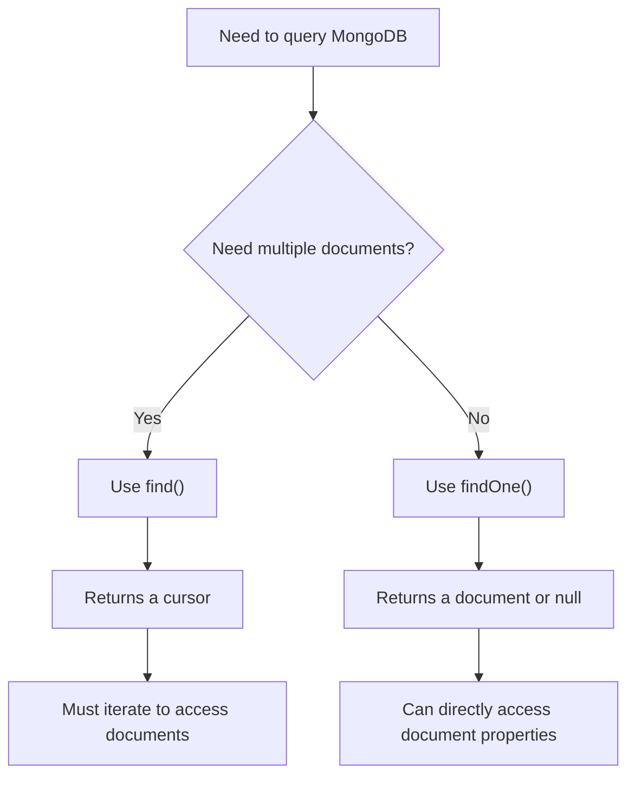

# MongoDB findOne

## Introduction

When working with MongoDB, retrieving data is one of the most common operations you'll perform. While the `find()` method returns multiple documents, there are many situations where you only need to retrieve a single document. This is where the `findOne()` method comes in handy.

The `findOne()` method is designed to retrieve only the first document that matches your query criteria. This makes it both efficient and practical when you know you need just one document, such as when looking up a user by their unique username or retrieving a specific product by its ID.

In this tutorial, we'll explore how to use the `findOne()` method effectively in MongoDB.

## Basic Syntax

The basic syntax of the `findOne()` method is:

```javascript
db.collection.findOne(query, projection)
```

Where:
- `query` (optional): A document that specifies the selection criteria. If omitted, returns the first document in the collection.
- `projection` (optional): A document that specifies which fields to include or exclude from the result.

## Using findOne to Retrieve Documents

### Example 1: Retrieving the First Document

Let's start with the simplest use case. Suppose we have a collection called `products`:

```javascript
db.products.findOne()
```

**Output:**
```json
{
  "_id": ObjectId("5f8a72f22c3f7f2a1c123456"),
  "name": "Laptop",
  "price": 999.99,
  "category": "Electronics",
  "inStock": true,
  "specs": {
    "processor": "Intel i7",
    "memory": "16GB",
    "storage": "512GB SSD"
  }
}
```

This returns the first document in the `products` collection according to the natural order in the database.

### Example 2: Finding a Document by a Specific Field

To find a document with a specific value, we provide a query document:

```javascript
db.products.findOne({ "name": "Smartphone" })
```

**Output:**
```json
{
  "_id": ObjectId("5f8a73122c3f7f2a1c123457"),
  "name": "Smartphone",
  "price": 699.99,
  "category": "Electronics",
  "inStock": true,
  "specs": {
    "screen": "6.5 inch",
    "camera": "48MP",
    "battery": "4500mAh"
  }
}
```

### Example 3: Using Query Operators

We can use query operators to create more complex conditions:

```javascript
db.products.findOne({ "price": { $lt: 500 } })
```

**Output:**
```json
{
  "_id": ObjectId("5f8a73522c3f7f2a1c123458"),
  "name": "Headphones",
  "price": 149.99,
  "category": "Electronics",
  "inStock": true,
  "specs": {
    "type": "Over-ear",
    "wireless": true,
    "noiseCancelling": true
  }
}
```

This query returns the first product with a price less than $500.

## Projections with findOne

Projections allow you to specify which fields to include or exclude from the result document.

### Including Specific Fields

```javascript
db.products.findOne(
  { "name": "Laptop" },
  { "name": 1, "price": 1, "category": 1 }
)
```

**Output:**
```json
{
  "_id": ObjectId("5f8a72f22c3f7f2a1c123456"),
  "name": "Laptop",
  "price": 999.99,
  "category": "Electronics"
}
```

In this example, we've included only the `name`, `price`, and `category` fields (plus the `_id` field, which is included by default).

### Excluding Fields

```javascript
db.products.findOne(
  { "name": "Laptop" },
  { "specs": 0, "inStock": 0 }
)
```

**Output:**
```json
{
  "_id": ObjectId("5f8a72f22c3f7f2a1c123456"),
  "name": "Laptop",
  "price": 999.99,
  "category": "Electronics"
}
```

This query excludes the `specs` and `inStock` fields from the result.

### Excluding the _id Field

If you don't want to include the `_id` field in the result, you can explicitly exclude it:

```javascript
db.products.findOne(
  { "name": "Laptop" },
  { "_id": 0, "name": 1, "price": 1 }
)
```

**Output:**
```json
{
  "name": "Laptop",
  "price": 999.99
}
```

## Practical Use Cases

### User Authentication

When implementing a login system, you might need to retrieve a user by their username:

```javascript
function authenticateUser(username, password) {
  const user = db.users.findOne({ "username": username });
  
  if (!user) {
    return { success: false, message: "User not found" };
  }
  
  // In a real application, you would compare hashed passwords
  if (user.password === password) {
    return { success: true, user: user };
  } else {
    return { success: false, message: "Invalid password" };
  }
}
```

### Finding a Document by ID

MongoDB's `ObjectId` is commonly used as a unique identifier. Here's how to find a document by its ID:

```javascript
// Assuming we have the ID as a string
const productId = "5f8a72f22c3f7f2a1c123456";
const product = db.products.findOne({ "_id": ObjectId(productId) });

if (product) {
  console.log(`Found product: ${product.name}`);
} else {
  console.log("Product not found");
}
```

### E-commerce: Getting Product Details

When a user views a product page, you need to fetch all the details for a specific product:

```javascript
function getProductDetails(productSlug) {
  return db.products.findOne(
    { "slug": productSlug },
    { "reviews": 0 }  // Exclude reviews as they might be fetched separately
  );
}

const productDetails = getProductDetails("premium-laptop-2023");
if (productDetails) {
  // Render product page with details
} else {
  // Display 404 page
}
```

## Error Handling with findOne

Unlike some database systems, MongoDB's `findOne()` doesn't throw an error if no document matches your query. Instead, it returns `null`. You should always check for this:

```javascript
const result = db.products.findOne({ "name": "NonExistentProduct" });

if (result === null) {
  console.log("No product found with that name");
} else {
  console.log(`Found product: ${result.name}`);
}
```

## Performance Considerations

`findOne()` is optimized to return as soon as it finds a matching document, making it more efficient than using `find().limit(1)` when you only need one result. However, there are some performance considerations:

1. **Use indexes** for fields you frequently query with `findOne()`. This dramatically improves performance.
   
   ```javascript
   // Create an index on the "username" field
   db.users.createIndex({ "username": 1 });
   
   // Now queries on username will be faster
   db.users.findOne({ "username": "john_doe" });
   ```

2. **Limit the fields** you retrieve when you only need specific information.

3. **Avoid** using `findOne()` in loops when you could use `find()` once instead.

## Comparing find() and findOne()

Let's compare `find()` and `findOne()` to understand when to use each:



## Summary

The `findOne()` method in MongoDB is an essential tool for retrieving single documents from a collection. It's particularly useful when:

- You need just one document that matches specific criteria
- You're looking up records by unique identifiers
- You want to check if a document with certain characteristics exists

Remember these key points about `findOne()`:

- It returns only one document (the first match) or `null` if no matches exist
- You can use query operators to create complex conditions
- Projections allow you to include or exclude specific fields
- It's more efficient than `find().limit(1)` for single-document retrieval

By mastering `findOne()`, you've added a crucial tool to your MongoDB toolkit that will help you write more efficient and cleaner code.

## Practice Exercises

1. Create a collection called `students` and insert several documents with fields for `name`, `age`, `major`, and `gpa`. Then write a `findOne()` query to find:
   - The first student majoring in "Computer Science"
   - A student with a GPA greater than 3.5
   - The youngest student in the collection

2. Modify your queries to use projections that:
   - Include only the name and GPA
   - Exclude the _id field
   - Return only the major field

## Additional Resources

- [MongoDB Documentation on findOne()](https://www.mongodb.com/docs/manual/reference/method/db.collection.findOne/)
- [MongoDB Query Operators](https://www.mongodb.com/docs/manual/reference/operator/query/)
- [Working with MongoDB Projections](https://www.mongodb.com/docs/manual/tutorial/project-fields-from-query-results/)

Now that you understand how to use `findOne()`, you can start building more efficient queries in your MongoDB applications!