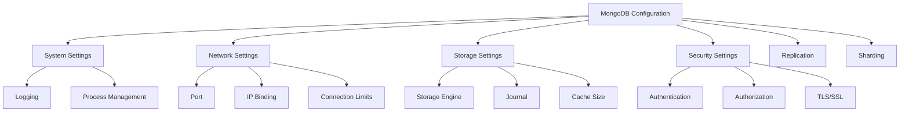

# MongoDB Server Configuration

## Introduction

MongoDB server configuration is a critical aspect of database administration that impacts performance, security, and reliability. Properly configuring your MongoDB server ensures that it runs efficiently and securely in various environments, from development machines to production systems.

In this guide, we'll explore the essential MongoDB configuration options, how to modify them, and best practices for different deployment scenarios. By the end, you'll have a solid understanding of how to configure MongoDB to meet your specific requirements.

## Configuration File Basics

MongoDB primarily uses a configuration file (`mongod.conf`) to manage server settings. This file uses the YAML format, which is human-readable and easy to maintain.

### Default Configuration File Locations

Depending on your operating system, the default configuration file location varies:

- **Linux**: `/etc/mongod.conf`
- **macOS**: `/usr/local/etc/mongod.conf`
- **Windows**: `<install directory>\bin\mongod.cfg`

### Starting MongoDB with a Configuration File

You can start MongoDB with a specific configuration file using:

```bash
mongod --config /path/to/mongod.conf
```

## Essential Configuration Sections

Let's explore the main sections of a MongoDB configuration file:

### 1. System Settings

```yaml
systemLog:
  destination: file
  path: "/var/log/mongodb/mongod.log"
  logAppend: true
processManagement:
  fork: true
  pidFilePath: "/var/run/mongodb/mongod.pid"
```

These settings control:
- Where logs are stored
- Whether MongoDB runs in the background (fork)
- Where the process ID file is stored

### 2. Network Settings

```yaml
net:
  port: 27017
  bindIp: 127.0.0.1
  maxIncomingConnections: 65536
  wireObjectCheck: true
  ipv6: false
```

This section configures:
- The port MongoDB listens on (default: 27017)
- IP addresses to which MongoDB binds (limit this to specific IPs for security)
- Maximum number of simultaneous connections
- IPv6 support

### 3. Storage Settings

```yaml
storage:
  dbPath: "/var/lib/mongodb"
  journal:
    enabled: true
  directoryPerDB: true
  engine: "wiredTiger"
  wiredTiger:
    engineConfig:
      cacheSizeGB: 2
      journalCompressor: snappy
    collectionConfig:
      blockCompressor: snappy
```

These options control:
- Where MongoDB stores data files
- Journaling for crash recovery
- Storage engine selection and configuration
- Cache size allocation

### 4. Security Settings

```yaml
security:
  authorization: enabled
  javascriptEnabled: false
  keyFile: "/etc/mongodb/keyfile"
```

This section configures:
- Role-based access control
- Whether JavaScript execution is allowed
- Keyfile for replica set authentication

## Creating a Basic Configuration File

Let's create a simple configuration file for a development environment:

```yaml
# Basic MongoDB configuration file for development

systemLog:
  destination: file
  path: "/var/log/mongodb/mongod.log"
  logAppend: true

storage:
  dbPath: "/var/lib/mongodb"
  journal:
    enabled: true

net:
  port: 27017
  bindIp: 127.0.0.1

security:
  authorization: enabled
```

## Practical Examples

### Example 1: Production Server Configuration

Here's a more complete example suitable for a production environment:

```yaml
# Production MongoDB configuration

systemLog:
  destination: file
  path: "/var/log/mongodb/mongod.log"
  logAppend: true
  logRotate: reopen

processManagement:
  fork: true
  pidFilePath: "/var/run/mongodb/mongod.pid"

net:
  port: 27017
  bindIp: 127.0.0.1,192.168.1.100  # Localhost and internal network IP
  maxIncomingConnections: 20000
  
storage:
  dbPath: "/var/lib/mongodb"
  journal:
    enabled: true
  directoryPerDB: true
  wiredTiger:
    engineConfig:
      cacheSizeGB: 8  # Adjust based on available RAM
      
security:
  authorization: enabled
  javascriptEnabled: false
  
operationProfiling:
  mode: slowOp
  slowOpThresholdMs: 100

replication:
  replSetName: "rs0"
```

### Example 2: Memory-Optimized Configuration

For servers with plenty of RAM:

```yaml
# Memory-optimized configuration

storage:
  dbPath: "/var/lib/mongodb"
  journal:
    enabled: true
  wiredTiger:
    engineConfig:
      cacheSizeGB: 16  # Increased cache size
      
net:
  port: 27017
  bindIp: 127.0.0.1
  
setParameter:
  internalQueryExecMaxBlockingSortBytes: 335544320  # 320MB

operationProfiling:
  mode: slowOp
  slowOpThresholdMs: 50
```

## How to Apply Configuration Changes

After modifying your configuration file, you need to restart MongoDB for changes to take effect:

```bash
# For systems using systemd
sudo systemctl restart mongod

# For macOS
brew services restart mongodb-community

# For Windows (Command Prompt as Administrator)
net stop MongoDB
net start MongoDB
```

## Verifying Configuration

You can verify the current server configuration by connecting to MongoDB and running:

```javascript
db.adminCommand( { getParameter: "*" } )
```

For a specific parameter:

```javascript
db.adminCommand( { getParameter: 1, "internalQueryExecMaxBlockingSortBytes": 1 } )
```

## Dynamic Configuration Parameters

Some parameters can be modified without restarting MongoDB using the `setParameter` command:

```javascript
db.adminCommand( { setParameter: 1, internalQueryExecMaxBlockingSortBytes: 335544320 } )
```

## Configuration Best Practices

1. **Security First**: Always enable authorization and bind MongoDB to specific IPs, not 0.0.0.0
2. **Right-size Cache**: Set WiredTiger cache to 60% of available RAM for dedicated servers
3. **Log Rotation**: Configure log rotation to prevent disk space issues
4. **Monitoring**: Set appropriate profiling levels to catch slow queries
5. **Backup Configuration**: Store your configuration files in version control
6. **Comments**: Add comments to your configuration file to document non-obvious settings

## Troubleshooting Configuration Issues

### Common Issues and Solutions

1. **MongoDB won't start**
   - Check logs at the configured log path
   - Verify file permissions on data directory and log file
   - Ensure IP binding is correct

2. **Authentication failures**
   - Verify `security.authorization` is enabled
   - Check user credentials and roles

3. **Performance issues**
   - Review cache size configuration
   - Check for proper indexing
   - Review profiling data for slow operations

## Advanced Configuration Diagram

Here's a visual representation of MongoDB's configuration components:



## Summary

Configuring MongoDB correctly is essential for ensuring performance, security, and reliability. In this guide, we've covered:

- Basic configuration file structure and location
- Essential configuration sections (system, network, storage, security)
- Practical examples for different environments
- How to apply and verify configuration changes
- Best practices and troubleshooting tips

By understanding these configuration options, you'll be able to optimize MongoDB for your specific use case, whether it's a development environment or a production system.

## Additional Resources

- [MongoDB Official Documentation on Configuration Options](https://docs.mongodb.com/manual/reference/configuration-options/)
- [MongoDB University Courses](https://university.mongodb.com/)

## Practice Exercises

1. Create a configuration file for a development MongoDB server with authorization enabled.
2. Modify an existing configuration file to optimize it for a server with 16GB of RAM.
3. Configure a MongoDB replica set using configuration files.
4. Set up proper logging with log rotation in your MongoDB configuration.
5. Create a minimal configuration file that focuses on security best practices.

Remember that proper MongoDB configuration is an ongoing process that should be reviewed and updated as your application needs evolve and grow.