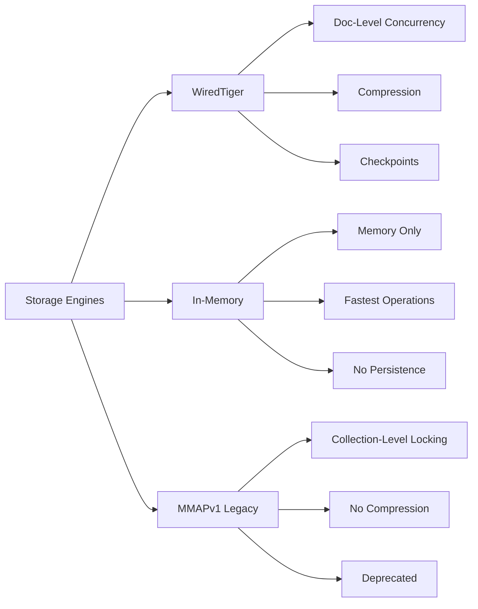

# MongoDB Storage Engines

## Introduction

A storage engine is the component of a database that is responsible for managing how data is stored both in memory and on disk. Think of it as the engine under the hood of your database that determines how your data is read from and written to disk.

In MongoDB, the storage engine doesn't affect the communication between applications and the database - all MongoDB drivers work with any supported storage engine. However, different storage engines perform better for specific workloads, so understanding their characteristics is vital for optimizing your MongoDB deployment.

## What Are Storage Engines?

Storage engines are responsible for:

1. **Data Storage**: How data is physically stored on disk
2. **Read/Write Operations**: How data is read from or written to disk
3. **Index Management**: How indexes are utilized
4. **Concurrency Control**: How concurrent operations are handled
5. **Transaction Management**: How transactions are processed
6. **Memory Usage**: How memory is utilized for caching and operations

Let's explore the primary storage engines available in MongoDB.

## WiredTiger Storage Engine

WiredTiger is the default storage engine for MongoDB since version 3.2. It offers superior performance and efficiency for most workloads.

### Key Features of WiredTiger

- **Document-Level Concurrency**: Multiple clients can modify different documents in a collection simultaneously
- **Compression**: Both data and indexes can be compressed, reducing storage requirements
- **No In-Place Updates**: Uses a MultiVersion Concurrency Control (MVCC) approach

### Compression Options

WiredTiger provides different compression algorithms:

```javascript
db.createCollection("orders", {
   storageEngine: {
      wiredTiger: {
         configString: "block_compressor=zlib"
      }
   }
})
```

Available compressors include:
- `zlib`: Higher compression ratio but more CPU intensive
- `snappy`: Default, offers good balance of compression and performance
- `none`: No compression

### Cache Configuration

WiredTiger uses an internal cache to hold recently accessed data:

```javascript
// mongod.conf excerpt
storage:
  wiredTiger:
    engineConfig:
      cacheSizeGB: 4  # Allocate 4GB for WiredTiger cache
```

### When to Use WiredTiger

WiredTiger is suitable for most use cases, especially:
- Applications requiring high write throughput
- Systems with limited disk space (due to compression)
- Workloads with many concurrent operations

## In-Memory Storage Engine

The In-Memory storage engine stores all data in memory, providing extremely fast operations but without persistence across restarts.

### Key Features of In-Memory

- **No Disk I/O for Data**: All data operations happen in memory
- **Superior Performance**: Eliminates disk access latency
- **Durability Trade-off**: Data is lost when the server shuts down
- **Journaling**: Optionally supports journaling for operations

### Configuration Example

```javascript
// mongod.conf excerpt
storage:
  engine: inMemory
  inMemory:
    engineConfig:
      inMemorySizeGB: 2  # Limit memory usage to 2GB
```

### Creating a Collection with In-Memory Engine

```javascript
db.createCollection("cachingData", {
   storageEngine: {
      inMemory: {
         engineConfig: {
            inMemorySizeGB: 0.5  // 500MB for this collection
         }
      }
   }
})
```

### When to Use In-Memory Engine

The In-Memory engine is ideal for:
- Caching scenarios
- Real-time analytics
- Testing environments
- Applications where data loss on restart is acceptable
- Situations requiring extremely low latency

## The Legacy MMAPv1 Engine

MMAPv1 was MongoDB's original storage engine, which was deprecated in MongoDB 4.0 and removed in MongoDB 4.2. It's included here for historical context.

### Key Features of MMAPv1

- **Collection-Level Locking**: In early versions (pre-3.0)
- **Document-Level Locking**: In later implementations
- **Memory Mapping**: Relied on OS memory mapping facilities
- **In-Place Updates**: Modified documents directly in their storage location

### When MMAPv1 Was Used

- Applications with high read-to-write ratios
- Workflows with simple, small updates
- Systems where compatibility with older MongoDB versions was essential

## Comparing Storage Engines

Let's compare the key characteristics of MongoDB storage engines:



## Practical Examples

### Example 1: Checking Current Storage Engine

```javascript
// Connect to MongoDB shell
mongo

// Check current storage engine
db.serverStatus().storageEngine
```

Output:
```json
{
   "name" : "wiredTiger",
   "supportsCommittedReads" : true,
   "readOnly" : false,
   "persistent" : true
}
```

### Example 2: Creating a Collection with Specific Storage Engine Options

```javascript
// Create a collection with custom WiredTiger options
db.createCollection("highCompressionCollection", {
   storageEngine: {
      wiredTiger: {
         configString: "block_compressor=zlib,prefix_compression=true"
      }
   }
})
```

### Example 3: Changing Storage Engines

To change storage engines, you must:

1. Create a backup of your data
2. Shut down MongoDB
3. Start MongoDB with new storage engine configuration
4. Import your data

```bash
# Export data
mongodump --out=/data/backup

# Stop MongoDB
sudo systemctl stop mongod

# Update mongod.conf
# storage:
#   engine: wiredTiger
# ...

# Start MongoDB with new configuration
sudo systemctl start mongod

# Import data back
mongorestore /data/backup
```

## Real-world Use Cases

### E-Commerce Platform

An e-commerce platform might benefit from WiredTiger due to:

- High write throughput (order processing)
- Document-level concurrency (multiple users shopping simultaneously)
- Data compression (for large product catalogs)

```javascript
// Create an orders collection optimized for write-heavy operations
db.createCollection("orders", {
   storageEngine: {
      wiredTiger: {
         configString: "block_compressor=snappy"
      }
   }
})

// Create product catalog with high compression
db.createCollection("products", {
   storageEngine: {
      wiredTiger: {
         configString: "block_compressor=zlib,prefix_compression=true"
      }
   }
})
```

### Real-time Analytics Application

A real-time analytics dashboard might use the In-Memory engine for:

- Extremely fast query responses
- Temporary aggregated data storage
- Data that can be regenerated if lost

```javascript
// Create a collection for real-time metrics
db.createCollection("activeUserMetrics", {
   storageEngine: {
      inMemory: { }
   }
})

// Store and retrieve analytics data
db.activeUserMetrics.insertOne({
   timestamp: new Date(),
   activeUsers: 15782,
   avgSessionTime: 340,
   topFeatures: ["search", "checkout", "recommendations"]
})

// Fast querying for dashboard
db.activeUserMetrics.find({
   timestamp: { $gt: new Date(Date.now() - 3600000) }
}).sort({ timestamp: -1 })
```

## Performance Considerations

### Write Concern Impact

Different storage engines handle write concerns differently:

```javascript
// Safe write with acknowledgment
db.orders.insertOne(
   { item: "laptop", price: 799.99 },
   { writeConcern: { w: "majority", j: true } }
)
```

With WiredTiger, journaling (`j: true`) ensures durability, while the In-Memory engine might support journaling but not actual data persistence.

### Index Usage

All storage engines benefit from proper indexing:

```javascript
// Create an index for frequent queries
db.customers.createIndex({ email: 1 }, { unique: true })

// Query using the index
db.customers.find({ email: "customer@example.com" })
```

### Monitoring Storage Engine Performance

```javascript
// Get WiredTiger statistics
db.serverStatus().wiredTiger

// Check cache usage
db.serverStatus().wiredTiger.cache
```

## How to Choose the Right Storage Engine

Consider the following factors when selecting a storage engine:

1. **Data Persistence Requirements**: Need data to survive restarts? WiredTiger is best.
2. **Performance Needs**: Need absolute fastest performance? Consider In-Memory.
3. **Workload Characteristics**: Read-heavy vs write-heavy operations.
4. **Concurrency Requirements**: Multiple applications accessing the same data.
5. **Hardware Resources**: Available RAM, CPU, and disk space.

## Summary

MongoDB's storage engines provide flexibility to optimize your database for specific workloads:

- **WiredTiger** (default): Best all-around option with document-level concurrency, compression, and good performance for mixed workloads.
- **In-Memory**: Highest performance but sacrifices durability; ideal for caching and real-time analytics.
- **MMAPv1** (legacy): Original MongoDB storage engine, now deprecated and removed.

Understanding storage engines allows you to make informed decisions about your MongoDB deployment architecture and optimize for your specific use cases.

## Additional Resources

- MongoDB Official Documentation on Storage Engines
- MongoDB University courses on Database Administration
- MongoDB Performance Best Practices

## Practice Exercises

1. Set up a MongoDB instance with the WiredTiger storage engine and experiment with different compression settings.
2. Create a small application that uses the In-Memory storage engine for caching frequently accessed data.
3. Benchmark the performance difference between WiredTiger and In-Memory engines for a read-heavy workload.
4. Design a database schema that takes advantage of document-level concurrency in WiredTiger.

By understanding MongoDB storage engines, you're better equipped to make architectural decisions that will ensure your applications perform optimally.