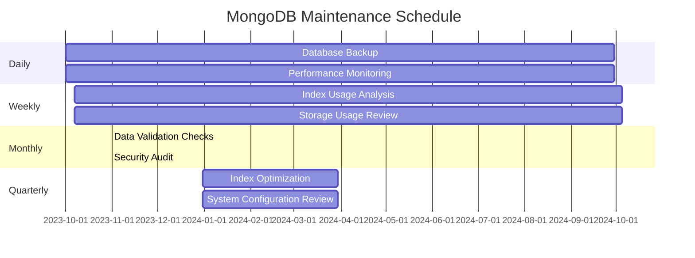

# MongoDB Maintenance Operations

Database maintenance is a crucial aspect of MongoDB administration that ensures your databases remain performant, reliable, and secure. Regular maintenance helps prevent data loss, improves query efficiency, and extends the lifespan of your MongoDB deployment.

## Introduction to MongoDB Maintenance

MongoDB, like any database system, requires regular maintenance to operate optimally. These maintenance activities range from creating backups and managing disk space to optimizing indexes and monitoring performance. As your MongoDB deployment grows in size and complexity, having a structured maintenance strategy becomes increasingly important.

In this guide, we'll explore essential maintenance operations that every MongoDB administrator should know, with practical examples to help you implement these practices in your own deployments.

## Backup and Recovery

### Creating MongoDB Backups

Backups are your primary defense against data loss. MongoDB offers several methods for creating backups:

#### 1. mongodump

`mongodump` is a utility that creates a binary export of the contents of a database.

```bash
# Basic mongodump command
mongodump --db myDatabase --out /backup/mongodb/$(date +"%Y-%m-%d")

# Output:
# 2023-10-15T14:30:12.123+0000    writing myDatabase.users to /backup/mongodb/2023-10-15/myDatabase/users.bson
# 2023-10-15T14:30:12.456+0000    writing myDatabase.products to /backup/mongodb/2023-10-15/myDatabase/products.bson
# 2023-10-15T14:30:12.789+0000    done dumping myDatabase.users (1234 documents)
# 2023-10-15T14:30:13.012+0000    done dumping myDatabase.products (567 documents)
```

#### 2. Filesystem Snapshots

For storage systems that support snapshots (like LVM or cloud providers):

```bash
# Example of creating an LVM snapshot
lvcreate --size 1G --snapshot --name mongodb_snapshot /dev/vg0/mongodb_volume
```

#### 3. MongoDB Atlas Backups

If you're using MongoDB Atlas, you can configure automated backups through the UI:

```javascript
// Atlas automated backups configuration (shown as equivalent settings)
{
  "backupEnabled": true,
  "backupSchedule": {
    "frequency": "daily",
    "retentionDays": 7
  }
}
```

### Restoring from Backups

#### Using mongorestore

```bash
# Restore an entire database
mongorestore --db myDatabase /backup/mongodb/2023-10-15/myDatabase/

# Output:
# 2023-10-15T15:45:10.123+0000    preparing collections to restore from
# 2023-10-15T15:45:10.456+0000    restoring myDatabase.users from /backup/mongodb/2023-10-15/myDatabase/users.bson
# 2023-10-15T15:45:11.789+0000    restoring myDatabase.products from /backup/mongodb/2023-10-15/myDatabase/products.bson
# 2023-10-15T15:45:12.012+0000    finished restoring myDatabase.users (1234 documents, 0 failures)
# 2023-10-15T15:45:12.234+0000    finished restoring myDatabase.products (567 documents, 0 failures)
```

## Database Compaction and Repair

MongoDB's storage engine (WiredTiger) handles most compaction automatically, but there are still some operations you might need to perform:

### Compact Collections

```javascript
// Compact a specific collection
db.runCommand({ compact: "users" })

// Output:
// { "ok" : 1 }
```

### Repair a Database

For MMAPv1 (legacy storage engine) or in cases of corruption:

```bash
# Repair database
mongod --repair --dbpath /var/lib/mongodb
```

## Index Management

Proper index management is crucial for MongoDB performance.

### Listing Indexes

```javascript
// List all indexes in a collection
db.users.getIndexes()

// Output:
// [
//   {
//     "v": 2,
//     "key": { "_id": 1 },
//     "name": "_id_"
//   },
//   {
//     "v": 2,
//     "key": { "email": 1 },
//     "name": "email_1",
//     "unique": true
//   }
// ]
```

### Creating Indexes

```javascript
// Create a simple index
db.users.createIndex({ "lastName": 1 })

// Output:
// {
//   "createdCollectionAutomatically" : false,
//   "numIndexesBefore" : 2,
//   "numIndexesAfter" : 3,
//   "ok" : 1
// }

// Create a compound index
db.products.createIndex({ "category": 1, "price": -1 })
```

### Index Maintenance

#### Rebuild Indexes

```javascript
// Rebuild all indexes on a collection
db.runCommand({ reIndex: "users" })

// Output:
// { "ok" : 1 }
```

#### Remove Unused Indexes

First, identify unused indexes using the `$indexStats` aggregation stage:

```javascript
// Check index usage
db.users.aggregate([
  { $indexStats: {} },
  { $project: { name: 1, accesses: 1 } }
])

// Output:
// { "name" : "_id_", "accesses" : { "ops" : 10250, "since" : ISODate("2023-10-01T00:00:00Z") } }
// { "name" : "email_1", "accesses" : { "ops" : 4520, "since" : ISODate("2023-10-01T00:00:00Z") } }
// { "name" : "lastName_1", "accesses" : { "ops" : 0, "since" : ISODate("2023-10-01T00:00:00Z") } }
```

Then remove unused indexes:

```javascript
// Remove an unused index
db.users.dropIndex("lastName_1")

// Output:
// { "nIndexesWas" : 3, "ok" : 1 }
```

## Data Validation and Consistency Checks

### Using Validators

MongoDB allows you to define validation rules for your collections:

```javascript
db.createCollection("products", {
  validator: {
    $jsonSchema: {
      bsonType: "object",
      required: ["name", "price", "category"],
      properties: {
        name: {
          bsonType: "string",
          description: "must be a string and is required"
        },
        price: {
          bsonType: "number",
          minimum: 0,
          description: "must be a non-negative number and is required"
        },
        category: {
          bsonType: "string",
          description: "must be a string and is required"
        }
      }
    }
  },
  validationLevel: "moderate",
  validationAction: "warn"
})

// Output:
// { "ok" : 1 }
```

### Consistency Checks

```javascript
// Find documents that don't match a validation pattern
db.products.find({
  $or: [
    { price: { $exists: false } },
    { price: { $lt: 0 } },
    { price: { $type: "string" } }
  ]
})
```

## Performance Optimization

### Analyze Query Performance

```javascript
// Analyze query execution with explain()
db.users.find({ age: { $gt: 30 } }).explain("executionStats")

// Output:
// {
//   "queryPlanner" : {
//     "plannerVersion" : 1,
//     "namespace" : "myDatabase.users",
//     ...
//   },
//   "executionStats" : {
//     "executionSuccess" : true,
//     "nReturned" : 1500,
//     "executionTimeMillis" : 5,
//     ...
//   },
//   ...
// }
```

### Monitor Database Performance

Using MongoDB's built-in monitoring tools:

```javascript
// Check server status
db.serverStatus()

// Get current operations
db.currentOp()

// Check collection stats
db.users.stats()

// Output:
// {
//   "ns" : "myDatabase.users",
//   "count" : 10000,
//   "size" : 2345678,
//   "avgObjSize" : 234,
//   ...
// }
```

## Scheduled Maintenance Tasks

Creating a maintenance schedule is key to a healthy MongoDB deployment. Here's a sample maintenance plan:



Here's a simple bash script for automating daily backups:

```bash
#!/bin/bash
# MongoDB daily backup script

BACKUP_DIR="/backup/mongodb/$(date +\%Y-\%m-\%d)"
LOG_FILE="/var/log/mongodb/backup_$(date +\%Y\%m\%d).log"

mkdir -p $BACKUP_DIR

echo "Starting MongoDB backup at $(date)" >> $LOG_FILE

mongodump --db myDatabase --out $BACKUP_DIR >> $LOG_FILE 2>&1

echo "Backup completed at $(date)" >> $LOG_FILE

# Clean backups older than 14 days
find /backup/mongodb -type d -mtime +14 -exec rm -rf {} \; 2>/dev/null
```

## Real-World Maintenance Scenarios

### Scenario 1: Handling Storage Growth

As your database grows, you might encounter storage issues. Here's how to address them:

```javascript
// Check database sizes
db.adminCommand({ listDatabases: 1, filter: { 'sizeOnDisk': { $gt: 1000000 } } })

// Identify large collections
db.getCollectionNames().forEach(function(collection) {
   print(collection + ": " + db[collection].stats().size);
})

// Output:
// users: 2345678
// products: 5678912
// orders: 98765432
```

Actions to take:
1. Archive old data to reduce collection sizes
2. Implement time-based partitioning for large collections
3. Increase storage capacity if needed

### Scenario 2: Recovering from Index Build Failures

If an index build fails during creation:

```javascript
// Check for in-progress index builds
db.currentOp({"$or": [{"op": "command", "command.createIndexes": {"$exists": true}}, {"op": "insert", "ns": /\.system\.indexes\b/}]})

// Resume index build with background option
db.users.createIndex({ "email": 1 }, { background: true, unique: true })
```

### Scenario 3: Handling Replication Lag

In a replica set, if secondary nodes fall behind:

```javascript
// Check replication status
rs.status()

// Output showing lag:
// {
//   "set" : "myReplicaSet",
//   "members" : [
//     {
//       "_id" : 0,
//       "name" : "mongodb-primary:27017",
//       "stateStr" : "PRIMARY",
//       ...
//     },
//     {
//       "_id" : 1,
//       "name" : "mongodb-secondary1:27017",
//       "stateStr" : "SECONDARY",
//       "lastHeartbeat" : ISODate("2023-10-15T16:40:10Z"),
//       "lastHeartbeatRecv" : ISODate("2023-10-15T16:40:09Z"),
//       "pingMs" : 15,
//       "optimeDate" : ISODate("2023-10-15T16:35:00Z"), // 5 minutes behind
//       ...
//     }
//   ]
// }
```

Actions to resolve replication lag:
1. Check network connectivity between nodes
2. Ensure secondary has adequate resources (CPU, memory, disk)
3. Reduce write load on the primary temporarily
4. Consider resynchronizing the secondary if lag persists

## Summary

Effective MongoDB maintenance involves a combination of regular backups, performance monitoring, index management, and data validation. By implementing the practices discussed in this guide, you can ensure your MongoDB deployments remain healthy, performant, and reliable.

Remember these key points:
- Back up your data regularly
- Monitor and optimize your indexes
- Validate data consistency
- Schedule regular maintenance operations
- Address storage and performance issues proactively

## Additional Resources and Exercises

### Resources

- [MongoDB Documentation on Database Profiler](https://www.mongodb.com/docs/manual/tutorial/manage-the-database-profiler/)
- [MongoDB Backup Methods](https://www.mongodb.com/docs/manual/core/backups/)
- [Storage Engine Documentation](https://www.mongodb.com/docs/manual/core/storage-engines/)

### Exercises

1. **Backup Exercise**: Create a daily backup script for your MongoDB database and test the restore process.

2. **Index Analysis**: Use `$indexStats` to identify unused indexes in your database and create a report.

3. **Maintenance Plan**: Design a comprehensive maintenance plan for a MongoDB deployment with 5 databases and 50GB of data.

4. **Performance Challenge**: Identify the top 3 slowest queries in your MongoDB deployment and optimize them using appropriate indexes.

5. **Automation Exercise**: Create a monitoring script that sends alerts when database size, connection count, or other metrics exceed predefined thresholds.

Remember that regular maintenance is the key to a healthy MongoDB deployment. Start small with basic maintenance tasks and gradually implement more advanced practices as you become comfortable with MongoDB administration.