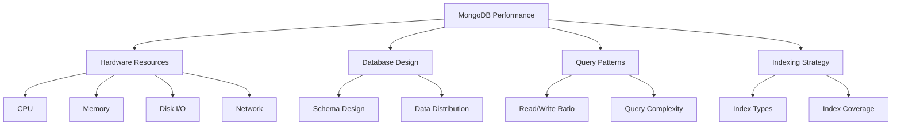

# MongoDB Performance Tuning

## Introduction

Performance tuning is a critical aspect of MongoDB database administration. As your applications grow and data volumes increase, optimizing your MongoDB deployment becomes essential to maintain responsiveness, reduce latency, and ensure a smooth user experience.

In this guide, we'll explore various strategies and best practices for tuning MongoDB performance. Whether you're experiencing slow queries, high CPU usage, or memory constraints, these techniques will help you identify bottlenecks and implement effective solutions.

## Why Performance Tuning Matters

Even a well-designed MongoDB deployment can face performance challenges as your application scales. Performance tuning offers several benefits:

- Faster query response times
- Reduced resource utilization
- Improved application user experience
- Lower operational costs
- Better scalability

## Understanding MongoDB Performance Factors

Before diving into specific optimization techniques, let's understand the key factors that affect MongoDB performance:



## Monitoring and Analysis Tools

### MongoDB Database Profiler

The database profiler collects detailed information about operations performed on your MongoDB instance.

```javascript
// Enable profiling for all operations that take more than 100 milliseconds
db.setProfilingLevel(1, { slowms: 100 })

// Check profiler status
db.getProfilingStatus()
// Output: { "was": 1, "slowms": 100, "sampleRate": 1 }

// Query the system.profile collection to view slow operations
db.system.profile.find().sort({ ts: -1 }).limit(5)
```

### MongoDB Compass

MongoDB Compass is the official GUI for MongoDB, providing visual tools for performance analysis, including:

- Real-time server stats
- Query optimizer
- Index suggestion tools
- Collection-level metrics

### mongostat and mongotop

These command-line utilities help monitor database performance:

```bash
# Monitor MongoDB server operations per second
mongostat --host mongodb://localhost:27017

# Check which collections are receiving the most read/write activity
mongotop --host mongodb://localhost:27017
```

## Indexing Strategies

Proper indexing is the cornerstone of MongoDB performance optimization.

### Creating Effective Indexes

```javascript
// Create a simple index on a single field
db.users.createIndex({ email: 1 })
// Output: { "createdCollectionAutomatically": false, "numIndexesBefore": 1, "numIndexesAfter": 2, "ok": 1 }

// Create a compound index for queries that filter on multiple fields
db.orders.createIndex({ customer_id: 1, order_date: -1 })

// Create a text index for full-text search
db.articles.createIndex({ content: "text", title: "text" })

// Create a geospatial index for location-based queries
db.locations.createIndex({ position: "2dsphere" })
```

### Index Intersection

MongoDB can use more than one index to fulfill a query:

```javascript
// Create separate indexes that might be used together via index intersection
db.products.createIndex({ category: 1 })
db.products.createIndex({ price: 1 })

// This query can use both indexes
db.products.find({ category: "electronics", price: { $gt: 100 } })
```

### Covered Queries

A covered query is one where all fields in the query are part of an index, so MongoDB doesn't need to examine any documents:

```javascript
// Create an index that includes all fields needed for the query
db.customers.createIndex({ name: 1, email: 1, phone: 1 })

// This query will be covered by the index (notice projection includes only indexed fields)
db.customers.find({ name: "John Smith" }, { _id: 0, email: 1, phone: 1 })
```

### Analyzing Index Usage

```javascript
// Check if your query is using an index
db.users.find({ username: "mongodb_user" }).explain("executionStats")

// Find unused indexes
db.collection.aggregate([
  { $indexStats: {} },
  { $project: { name: 1, accesses: 1 } }
])
```

## Query Optimization

### Use Projection to Return Only Necessary Fields

```javascript
// Bad practice: retrieving entire documents
db.products.find({ category: "electronics" })

// Good practice: retrieve only needed fields
db.products.find(
  { category: "electronics" },
  { name: 1, price: 1, _id: 0 }
)
```

### Limit Results

```javascript
// Use limit() and skip() for pagination
db.products.find().skip(20).limit(10)

// But be careful with large skip values - consider using range queries instead
db.products.find({ _id: { $gt: lastId } }).limit(10)
```

### Use Aggregation Pipeline Effectively

```javascript
// Inefficient approach - filtering after fetching all data
db.orders.find().forEach(function(order) {
  // Process only those with total > 100
  if (order.total > 100) {
    // process order
  }
})

// Efficient approach - filter at the database level
db.orders.aggregate([
  { $match: { total: { $gt: 100 } } },
  { $project: { customer: 1, items: 1, total: 1 } }
])
```

### Avoid Regular Expressions with Leading Wildcards

```javascript
// Inefficient - can't use indexes effectively
db.products.find({ name: /.*phone/ })

// More efficient - can use index prefix
db.products.find({ name: /^iphone/ })
```

## Schema Design Optimization

### Embedding vs. Referencing

Choose the right data model based on access patterns:

```javascript
// Embedding example (good for 1:1 or 1:few relationships)
db.users.insertOne({
  name: "John",
  email: "john@example.com",
  addresses: [
    { street: "123 Main St", city: "New York", type: "home" },
    { street: "456 Market St", city: "San Francisco", type: "work" }
  ]
})

// Referencing example (good for 1:many or many:many relationships)
db.orders.insertOne({
  customer_id: ObjectId("507f1f77bcf86cd799439011"),
  items: [
    { product_id: ObjectId("507f191e810c19729de860ea"), quantity: 1 },
    { product_id: ObjectId("507f191e810c19729de860eb"), quantity: 2 }
  ]
})
```

### Avoiding Large Documents

MongoDB documents have a 16MB size limit. For larger data:

```javascript
// Instead of storing large binary data in a document
db.products.insertOne({
  name: "User Manual",
  // Don't do this with large files
  pdfContent: BinData(0, "...very large binary data...") 
})

// Use GridFS for large files
// First, get a GridFS bucket
const bucket = new mongodb.GridFSBucket(db)

// Then stream a file to GridFS
const readStream = fs.createReadStream('/path/to/file.pdf')
const uploadStream = bucket.openUploadStream('user-manual.pdf')
readStream.pipe(uploadStream)
```

## Server Configuration and Hardware Optimization

### Configuring WiredTiger Cache

In your MongoDB configuration file:

```yaml
storage:
  wiredTiger:
    engineConfig:
      cacheSizeGB: 4  # Set to ~60% of RAM for dedicated servers
```

### Choosing the Right Hardware

- **CPU**: Multi-core processors for concurrent operations
- **Memory**: Sufficient RAM to hold your working set (frequently accessed data)
- **Storage**: SSDs provide significantly better performance than HDDs
- **Network**: High bandwidth, low latency connections between application servers and database servers

## Sharding Considerations

When your data grows beyond what a single server can handle, consider sharding:

```javascript
// Enable sharding for a database
sh.enableSharding("my_database")

// Choose a shard key - critical for performance
sh.shardCollection("my_database.customers", { region: 1, _id: 1 })
```

### Shard Key Selection Criteria

A good shard key should have:
- High cardinality (many possible values)
- Even data distribution
- Targeted query support

## Real-World Optimization Example

Let's walk through a practical example of optimizing a slow e-commerce product search:

### Initial Situation:

```javascript
// Slow query for product search
db.products.find({
  category: "electronics",
  price: { $gte: 100, $lte: 500 },
  inStock: true,
  name: /laptop/
}).sort({ rating: -1 })
```

### Performance Analysis:

```javascript
// Check query performance
db.products.find({
  category: "electronics",
  price: { $gte: 100, $lte: 500 },
  inStock: true,
  name: /laptop/
}).sort({ rating: -1 }).explain("executionStats")
```

Output shows:
- No useful index being used
- Full collection scan
- High execution time

### Optimization Steps:

1. Create a compound index to support the query:

```javascript
db.products.createIndex({
  category: 1,
  inStock: 1,
  price: 1,
  rating: -1
})
```

2. Add text index for better text searching:

```javascript
db.products.createIndex({ name: "text", description: "text" })
```

3. Rewrite the query to use text search instead of regex:

```javascript
db.products.find({
  category: "electronics",
  price: { $gte: 100, $lte: 500 },
  inStock: true,
  $text: { $search: "laptop" }
}).sort({ rating: -1 })
```

4. Verify improved performance:

```javascript
db.products.find({
  category: "electronics",
  price: { $gte: 100, $lte: 500 },
  inStock: true,
  $text: { $search: "laptop" }
}).sort({ rating: -1 }).explain("executionStats")
```

Result: Significant reduction in execution time, using indexes efficiently.

## Document Write and Update Optimization

### Bulk Operations

Use bulk operations instead of individual operations for better performance:

```javascript
// Inefficient - individual inserts
for (let i = 0; i < 1000; i++) {
  db.test.insertOne({ x: i })
}

// Efficient - bulk insert
const bulk = db.test.initializeUnorderedBulkOp()
for (let i = 0; i < 1000; i++) {
  bulk.insert({ x: i })
}
bulk.execute()
```

### Update Specific Fields

```javascript
// Inefficient - replaces entire document
db.users.updateOne(
  { _id: userId },
  { name: "New Name", age: 30, address: "123 Main St", /* and all other fields */ }
)

// Efficient - updates only necessary fields
db.users.updateOne(
  { _id: userId },
  { $set: { name: "New Name" } }
)
```

## Summary

MongoDB performance tuning is a multi-faceted process that requires ongoing attention as your application evolves. Key areas to focus on include:

1. **Proper indexing** - Create the right indexes to support your query patterns
2. **Query optimization** - Structure queries to take advantage of indexes
3. **Schema design** - Choose appropriate data models based on access patterns
4. **Hardware allocation** - Ensure sufficient resources for your workload
5. **Monitoring and analysis** - Use tools to identify and address bottlenecks

Remember that performance tuning is not a one-time task but an iterative process. Regularly review your database performance as data volumes and access patterns change over time.

## Additional Resources

- MongoDB's official documentation on [Performance](https://docs.mongodb.com/manual/administration/analyzing-mongodb-performance/)
- MongoDB University courses on database administration
- MongoDB Compass for visual performance analysis

## Exercises

1. Create an index for a collection with 1 million documents and measure query performance before and after indexing.

2. Use the MongoDB profiler to identify the slowest queries in your application and optimize them.

3. Compare the performance of embedded vs. referenced documents for a one-to-many relationship with different data volumes.

4. Analyze the impact of various shard key choices on a sharded collection's performance.

5. Implement a caching strategy for frequently accessed, rarely changed data and measure the performance improvement.