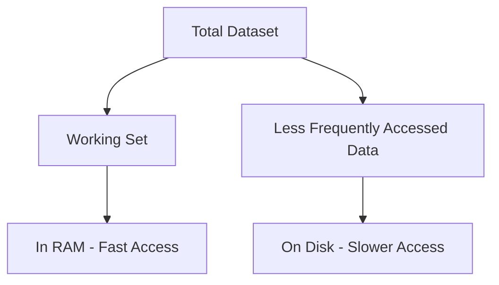

# MongoDB Hardware Considerations

When deploying MongoDB in production, choosing the right hardware can be the difference between a smooth-running database and one that consistently underperforms. This guide will walk you through the key hardware considerations that will help ensure your MongoDB deployments are performant, reliable, and cost-effective.

## Introduction

MongoDB's performance and reliability depend significantly on the hardware it runs on. As a document-oriented database that emphasizes flexibility and scalability, MongoDB has specific hardware requirements that may differ from traditional relational databases.

Whether you're planning a small single-node deployment or a large distributed cluster, understanding how MongoDB interacts with underlying hardware will help you make informed decisions and avoid common pitfalls.

## Memory (RAM) Considerations

### Working Set

One of the most crucial concepts in MongoDB's performance model is the **working set** - the portion of your data that clients access most frequently.



#### Why RAM Matters

MongoDB uses a memory-mapped storage engine by default (WiredTiger), which relies heavily on the operating system's ability to cache data in memory.

- **Ideal scenario**: Your entire working set fits in RAM
- **Reality**: You need to carefully size your RAM based on your working set

### RAM Sizing Guidelines

Here's a practical approach to determining how much RAM you need:

1. **Calculate working set size**: Estimate the portion of your data that is regularly accessed
2. **Add overhead**: Add approximately 20% for MongoDB's internal operations
3. **Account for operating system**: Reserve 1-2GB for the OS

#### Example Calculation

```
Database size: 100GB
Working set: ~40% of data = 40GB
MongoDB overhead: 20% of working set = 8GB
OS requirements: 2GB

Total RAM required: 40GB + 8GB + 2GB = 50GB
```

### Monitoring Memory Usage

To verify if your memory sizing is appropriate, use MongoDB's built-in tools:

```javascript
// Check the cache statistics
db.serverStatus().wiredTiger.cache
```

Example output:
```
{
  "maximum bytes configured": 8589934592,
  "bytes currently in the cache": 6342540288,
  "pages evicted by application threads": 0,
  "pages read into cache": 12589,
  "pages written from cache": 5621
}
```

If you see high values for "pages evicted by application threads" and frequent disk I/O, your working set likely exceeds available RAM.

## CPU Considerations

### CPU Characteristics

MongoDB benefits from:

1. **CPU clock speed**: Higher frequencies generally improve performance
2. **Multiple cores**: For concurrent operations
3. **Instruction set**: Modern processors with advanced instruction sets

### CPU Sizing Based on Workload Type

Different MongoDB workloads have different CPU requirements:

| Workload Type | CPU Characteristics | Example Use Case |
|---------------|---------------------|------------------|
| Read-heavy | Moderate CPU needs | Content management systems |
| Write-heavy | Higher CPU demands | IoT data collection |
| Aggregation pipeline | Very CPU intensive | Analytics applications |
| Index builds | Extremely CPU intensive | Initial data loading |

### Practical Example: Measuring CPU Usage

To determine if your CPU is adequately sized:

```javascript
// Monitor real-time server status including CPU metrics
db.serverStatus().metrics.commands
```

Look for signs of CPU saturation in your server metrics, such as consistently high CPU utilization (over 70% sustained usage).

## Storage Considerations

### Storage Engines

MongoDB supports two primary storage engines, each with different hardware implications:

1. **WiredTiger** (default since MongoDB 3.2)
2. **In-Memory** (Enterprise Edition only)

WiredTiger is the focus of our storage considerations, as it's used in most deployments.

### Storage Type Comparison

| Storage Type | Pros | Cons | Best For |
|--------------|------|------|----------|
| SSD | Very fast IOPS, Low latency | Higher cost | Production environments |
| NVMe | Extremely fast, Lower latency than SSD | Highest cost | High-performance needs |
| HDD | Lower cost, Higher capacity | Slow random I/O | Archived data, backups |
| SAN | Centralized management | Network overhead | Enterprise environments |

### RAID Configurations

MongoDB has specific recommendations for RAID:

- **RAID-10**: Recommended for performance and redundancy
- **RAID-0**: High performance but no redundancy (not for production)
- **RAID-5/6**: Not recommended due to write performance penalties

### Storage Capacity Planning

To estimate storage needs:

1. **Base data size**: Your raw data size
2. **Indexes**: Add 10-25% for indexes (depending on number and type)
3. **Oplog**: For replica sets (typically 5% of data)
4. **Growth**: Plan for future data growth
5. **Filesystem overhead**: Add 3-5%

#### Example Storage Calculation

```
Current data size: 500GB
Indexes: 20% = 100GB
Oplog: 5% = 25GB
Annual growth: 50% = 250GB
Filesystem overhead: 5% = 43.75GB

Total storage needed: 918.75GB (recommend 1TB)
```

### Filesystem Considerations

MongoDB performs best with specific filesystem configurations:

- **XFS**: Recommended for Linux (better performance than ext4)
- **Non-journaling filesystems**: Not recommended (risk of data corruption)
- **NFS**: Not supported for data files

## Network Considerations

### Network Bandwidth

Network bandwidth becomes increasingly important in distributed MongoDB deployments:

- **Replica Sets**: Need sufficient bandwidth for replication
- **Sharded Clusters**: Require bandwidth for chunk migrations and config server communication
- **Client Connections**: Consider cumulative bandwidth needs of all clients

### Network Latency

Low latency is crucial, especially for:

- Communication between replica set members
- Sharded cluster operations
- Client-to-server interactions in write operations

### Network Configuration Best Practices

1. **Dedicated Network**: Consider a separate network for database traffic
2. **Jumbo Frames**: Enable if your network supports them (improves throughput)
3. **TCP Settings**: Optimize TCP settings for database workloads

```bash
# Example: Increasing TCP buffer sizes on Linux
sudo sysctl -w net.ipv4.tcp_wmem="4096 65536 16777216"
sudo sysctl -w net.ipv4.tcp_rmem="4096 87380 16777216"
```

## Hardware Sizing for Common MongoDB Deployments

### Small Application (Development/Testing)

A basic setup suitable for development or small applications:

- **RAM**: 8GB
- **CPU**: 4 cores
- **Storage**: 100GB SSD
- **Network**: 1 Gbps

### Medium Production Deployment

For production applications with moderate load:

- **RAM**: 32GB
- **CPU**: 8-16 cores
- **Storage**: 500GB-1TB SSD/NVMe
- **Network**: 10 Gbps

### Large Scale Deployment

For high-traffic applications:

- **RAM**: 64GB+ (possibly multiple servers with sharding)
- **CPU**: 16+ cores (multiple servers)
- **Storage**: 2TB+ NVMe with RAID
- **Network**: 10+ Gbps with dedicated network

## Monitoring Hardware Performance

Effective monitoring is essential for validating your hardware choices. Set up monitoring for:

1. **Memory usage**: Track resident memory and page faults
2. **CPU utilization**: Watch for consistent high usage
3. **Disk I/O**: Monitor IOPS, latency, and queue depth
4. **Network metrics**: Measure throughput and latency

```javascript
// Example: Checking current MongoDB operation statistics
db.currentOp({"active": true})

// Example: Getting server status including hardware utilization metrics
db.serverStatus()
```

## Virtualization Considerations

When running MongoDB on virtualized infrastructure:

### Best Practices for Virtual Environments

1. **Dedicated resources**: Use dedicated CPU cores and RAM allocation
2. **Storage configuration**: 
   - Avoid thin provisioning
   - Use dedicated volumes for MongoDB
   - Consider pass-through devices for maximum performance

3. **Hypervisor settings**:
   - Disable memory ballooning
   - Avoid memory overcommitment
   - Use NUMA affinity if available

### Cloud-Specific Considerations

If deploying in cloud environments:

- **Instance types**: Choose memory-optimized instances for most MongoDB workloads
- **Storage options**: Use provisioned IOPS storage services
- **Network**: Be aware of potential "noisy neighbor" issues

## Practical Example: Sizing for an E-commerce Application

Let's work through a complete example for a medium-sized e-commerce site:

### Scenario
- 5 million products
- Average document size: 2KB
- 100,000 daily active users
- 10,000 orders per day

### Sizing Calculation

```
Data size: 5,000,000 × 2KB = ~10GB
Working set: ~40% (product catalog, active orders) = 4GB
Indexing: ~20% = 2GB
Growth over 1 year: 50% = 5GB
System overhead: 4GB

RAM requirement: 4GB (working set) + 4GB (overhead) = 8GB minimum, 16GB recommended
Storage: 10GB (data) + 2GB (indexes) + 5GB (growth) + 5GB (oplog) = 22GB, rounded to 50GB for safe measure
CPU: 8 cores (to handle peak shopping events)
Network: 1 Gbps minimum
```

## Summary

Choosing the right hardware for MongoDB involves careful consideration of several factors:

1. **Memory**: Size based on your working set, with additional overhead
2. **CPU**: Select based on workload characteristics, with emphasis on higher clock speeds
3. **Storage**: Use SSDs or NVMe drives whenever possible, with appropriate RAID configurations
4. **Network**: Ensure sufficient bandwidth and low latency, especially for distributed deployments

Remember that hardware requirements will evolve as your application grows, so regular monitoring and periodic hardware reviews are essential parts of MongoDB administration.

## Additional Resources

- [MongoDB Production Notes](https://docs.mongodb.com/manual/administration/production-notes/)
- [WiredTiger Storage Engine Configuration](https://docs.mongodb.com/manual/reference/configuration-options/#storage-options)
- [MongoDB Hardware Sizing Calculator](https://docs.mongodb.com/operations-manager/current/tutorial/provisioning-sizing/)
- [MongoDB Cloud Provider Considerations](https://docs.mongodb.com/manual/administration/production-notes/#cloud-provider-considerations)

## Exercises

1. Calculate the RAM requirements for a MongoDB deployment with a 50GB database where approximately 30% of the data is regularly accessed.

2. Design a hardware configuration for a MongoDB replica set that will store user session data for a web application with 500,000 daily active users.

3. Create a monitoring plan that tracks key hardware metrics for a production MongoDB deployment, including which thresholds should trigger alerts.

4. Compare the cost-benefit analysis of using high-end NVMe storage versus standard SSDs for a write-intensive MongoDB workload.