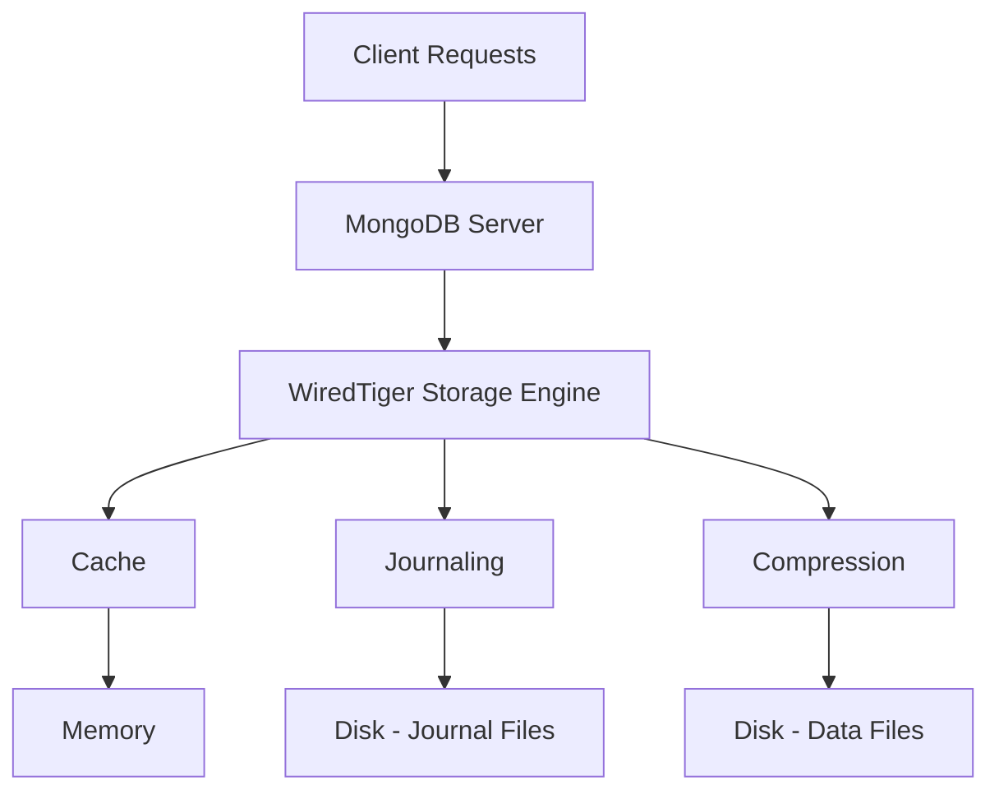

# MongoDB WiredTiger Storage Engine

## Introduction

WiredTiger is the default storage engine for MongoDB since version 3.2, replacing the previous MMAPv1 engine. A storage engine is the component of a database that is responsible for managing how data is stored on disk and in memory. Think of it as the filing system of your database that determines how data is written to disk, read from disk, and cached in memory.

In this guide, we'll explore WiredTiger's architecture, its key features, how to configure it optimally, and common administration tasks that MongoDB administrators should be familiar with.

## WiredTiger Architecture Overview

WiredTiger was designed from the ground up to take advantage of modern hardware architectures and to provide higher performance, better concurrency, and more efficient storage utilization than previous storage engines.



### Key Components

- **Document-level Concurrency**: WiredTiger uses document-level locking for most operations
- **Checkpoints**: Consistent on-disk snapshots of data written at intervals
- **Journal**: Write-ahead log for durability between checkpoints
- **Block Compression**: Data compression to reduce storage footprint
- **Cache**: In-memory cache for frequently accessed data

## Key Features of WiredTiger

### Document-Level Concurrency Control

Unlike MMAPv1's collection-level locking, WiredTiger implements document-level concurrency control:

```javascript
// With document-level concurrency, these operations can happen simultaneously
// even if they're updating documents in the same collection
db.users.updateOne({ _id: "user1" }, { $set: { status: "active" } }); // Session A
db.users.updateOne({ _id: "user2" }, { $set: { status: "inactive" } }); // Session B
```

This approach dramatically improves write scalability in high-concurrency workloads.

### Compression

WiredTiger provides both data and index compression options:

- **Snappy** (default for data): Offers good compression with minimal CPU overhead
- **Zlib**: Higher compression ratio but more CPU-intensive
- **Zstd**: Available in newer versions, with better compression than Snappy
- **Prefix compression** for indexes: Stores common prefixes only once

Let's see how to check the current compression settings:

```javascript
db.serverStatus().wiredTiger.cache["bytes currently in the cache"]
db.serverStatus().wiredTiger.cache["bytes read into cache"]
db.serverStatus().wiredTiger.cache["bytes written from cache"]
```

### Checkpoints and Journaling

WiredTiger maintains data durability through:

- **Checkpoints**: Default every 60 seconds or 2GB of journal data
- **Journal**: For operations between checkpoints (default: enabled)

This dual approach ensures data integrity even in case of unexpected shutdowns.

## Configuring WiredTiger

### Cache Configuration

The WiredTiger cache is one of the most critical components to configure properly:

```javascript
// MongoDB configuration file (mongod.conf)
storage:
  wiredTiger:
    engineConfig:
      cacheSizeGB: 4  // Specify cache size in GB
```

By default, WiredTiger will use:
- 50% of (RAM - 1GB) on systems with more than 1GB RAM
- 256MB on systems with less than 1GB RAM

### Compression Settings

You can configure compression at the collection level or globally:

```javascript
// Global configuration in mongod.conf
storage:
  wiredTiger:
    collectionConfig:
      blockCompressor: zlib
    indexConfig:
      prefixCompression: true
```

Or for a specific collection:

```javascript
db.createCollection(
   "users",
   { storageEngine: { wiredTiger: { configString: "block_compressor=zlib" } } }
)
```

## Monitoring WiredTiger Performance

### Cache Utilization

Monitor the WiredTiger cache to ensure optimal performance:

```javascript
// Check cache statistics
db.serverStatus().wiredTiger.cache

// Example output
{
  "bytes currently in the cache": 1252997752,
  "bytes read into cache": NumberLong("10987283429"),
  "bytes written from cache": NumberLong("7883932192"),
  "maximum bytes configured": 5368709120,
  "tracked dirty bytes in the cache": 148378,
  "eviction server running": 1,
  // ...additional statistics
}
```

A high cache eviction rate may indicate that increasing your cache size would improve performance.

### Checkpoint Operations

Monitoring checkpoint frequency and duration:

```javascript
db.serverStatus().wiredTiger["transaction checkpoint"]

// Example output
{
  "transaction checkpoint currently running": 0,
  "transaction checkpoint generation": 175,
  "transaction checkpoint max time (msecs)": 9647,
  "transaction checkpoint min time (msecs)": 4,
  "transaction checkpoint most recent time (msecs)": 26,
  "transaction checkpoint total time (msecs)": 94180
}
```

## Real-World WiredTiger Tuning Examples

### Scenario 1: High-Write Application

For applications with many write operations:

```javascript
// mongod.conf for write-heavy workload
storage:
  wiredTiger:
    engineConfig:
      cacheSizeGB: 8  # Larger cache to handle writes
      journalCompressor: snappy  # Lower CPU overhead
    collectionConfig:
      blockCompressor: snappy  # Prioritize write performance over storage
```

### Scenario 2: Analytics Workload

For applications that perform complex aggregations on large datasets:

```javascript
// mongod.conf for analytical workload
storage:
  wiredTiger:
    engineConfig:
      cacheSizeGB: 16  # Large cache for complex queries
    collectionConfig:
      blockCompressor: zlib  # Better compression for large datasets
```

### Scenario 3: Mixed Workload with Limited Memory

```javascript
// mongod.conf for balanced workload on constrained system
storage:
  wiredTiger:
    engineConfig:
      cacheSizeGB: 2  # Carefully sized for system
      checkpointSizeMB: 1024  # Smaller, more frequent checkpoints
```

## Common Administration Tasks

### Compacting Collections

Over time, collections can develop fragmentation. You can compact collections to reclaim space:

```javascript
// Compact a collection with default options
db.runCommand({ compact: "users" })

// Compact with specific options
db.runCommand({
  compact: "orders",
  force: true,  // Run even if MongoDB thinks it's unnecessary
  paddingFactor: 1.0,  // No padding for new documents (default is 1.0)
  paddingBytes: 0  // No additional padding bytes
})
```

### Checking Storage Size and Usage

```javascript
// Check collection storage stats
db.users.stats()

// Example output (partial)
{
  "ns": "mydb.users",
  "count": 10000,
  "size": 2300000,  // Data size in bytes
  "avgObjSize": 230,
  "storageSize": 1200000,  // Actual storage size (with compression)
  "freeStorageSize": 20480,  // Free space within allocation
  // ...other statistics
}
```

### Understanding Journal Files

Journal files are critical for data integrity between checkpoints:

```bash
# Journal files location (typical)
/var/lib/mongodb/journal/
```

The journal is organized as a set of files that maintain a record of all write operations that haven't yet been written to the data files during a checkpoint.

## Best Practices

1. **Right-size your cache**: The WiredTiger cache should be large enough to hold your working set

2. **Use appropriate compression**: Match your compression settings to your workload and hardware capabilities

3. **Monitor cache pressure**: Watch eviction rates and adjust cache size accordingly

4. **Understand checkpoint behavior**: Configure checkpoints based on your durability requirements and workload patterns

5. **Use appropriate read and write concerns**: WiredTiger's document-level concurrency works best when applications use appropriate read and write concerns

6. **Regular maintenance**: Schedule periodic compaction for heavily updated collections

## Summary

WiredTiger is a powerful storage engine that provides significant benefits for MongoDB deployments:

- Document-level concurrency for better write scalability
- Efficient compression options to reduce storage requirements
- Checkpoint and journal mechanisms for data durability
- Highly configurable cache for performance optimization

Understanding how to configure, monitor, and maintain WiredTiger is essential for effective MongoDB administration. By following the best practices outlined in this guide, you can ensure optimal database performance and reliability.

## Additional Resources

- [MongoDB WiredTiger Official Documentation](https://www.mongodb.com/docs/manual/core/wiredtiger/)
- [WiredTiger Storage Engine Configuration Options](https://www.mongodb.com/docs/manual/reference/configuration-options/#storage-options)
- [Storage Engine Blog Series from MongoDB](https://www.mongodb.com/blog/post/mongodb-wiredtiger-storage-engine-part-1)

## Practice Exercises

1. Configure a MongoDB instance with WiredTiger using different cache sizes and benchmark the performance differences
2. Experiment with different compression options on a sample dataset and compare storage efficiency
3. Use MongoDB's diagnostic commands to analyze WiredTiger cache utilization under different workloads
4. Create a monitoring dashboard for key WiredTiger metrics using MongoDB's serverStatus output