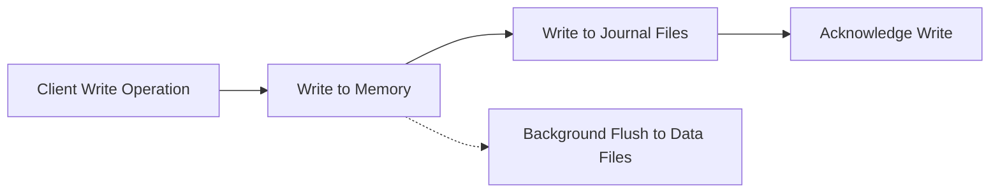

# MongoDB Journaling

## Introduction

MongoDB journaling is a critical component of the database's durability model, designed to ensure data persistence even in the event of unexpected failures. Think of journaling as MongoDB's safety net—it records operations that modify your data before those changes are permanently applied to the database files.

In this guide, we'll explore how journaling works in MongoDB, why it's important for your database's health, and how you can configure it to suit your application needs.

## What is Journaling?

Journaling is MongoDB's implementation of write-ahead logging (WAL), a technique used in database systems to provide atomicity and durability. Before MongoDB makes changes to the actual data files on disk, it first records the operations in journal files.

### Why Journaling Matters

Imagine your MongoDB server unexpectedly shuts down due to a power failure or system crash. Without journaling:

- In-memory changes not yet written to disk would be lost
- Database files could be left in an inconsistent state
- Recovery would be time-consuming and potentially incomplete

With journaling enabled (the default in MongoDB), the system can recover by replaying the journal files, applying all committed operations since the last checkpoint.

## How Journaling Works in MongoDB

The journaling process in MongoDB follows these general steps:



1. When you insert, update, or delete data, MongoDB first makes the changes in memory (in the WiredTiger cache).
2. The changes are simultaneously recorded in the journal files.
3. Once the journal write is complete, MongoDB acknowledges the write operation to the client.
4. Periodically, in the background, MongoDB writes the changes from memory to the actual data files.

### Journal Files Location

By default, MongoDB stores journal files in a subdirectory named `journal` within the `dbPath` directory:

```
<dbPath>/journal/
```

You can examine these files, though interpreting them requires understanding MongoDB's internal format.

## Configuring Journaling

### Checking if Journaling is Enabled

You can verify if journaling is enabled by running:

```javascript
db.adminCommand({ getCmdLineOpts: 1 })
```

In the output, look for `storage.journal.enabled`. If not explicitly set, the default is `true` for WiredTiger storage engine.

### Enabling or Disabling Journaling

While not recommended for production environments, you can disable journaling when starting MongoDB:

```bash
mongod --dbpath /data/db --nojournal
```

Or in the configuration file:

```yaml
storage:
  journal:
    enabled: false
```

### Journaling Commit Interval

The journal commit interval determines how frequently MongoDB commits the journal data to disk. The default is 100ms, but you can adjust this:

```yaml
storage:
  journal:
    commitIntervalMs: 200
```

**Note:** Increasing this value can improve performance but increases the risk of data loss in case of failure.

## Practical Applications and Examples

### Example 1: Monitoring Journal Space Usage

You can check the journal statistics using the `db.serverStatus()` command:

```javascript
db.serverStatus().wiredTiger.log
```

Example output:

```json
{
  "total log buffer size": 33554432,
  "log bytes written": 4718592,
  "log bytes written compression savings": 0,
  "log records compressed": 0,
  "log records not compressed": 0,
  "log records too small to compress": 0,
  "log sync operations": 5,
  "log sync time duration (usecs)": 8390,
  "log sync_dir operations": 5,
  "log sync_dir time duration (usecs)": 10565,
  "log flush operations": 0,
  "log flush time duration (usecs)": 0,
  "log prealloc files": 3,
  "log bytes of payload data": 4681472
}
```

### Example 2: Recovery from an Unexpected Shutdown

Let's simulate a scenario where MongoDB crashes during write operations:

1. Start by inserting some data:

```javascript
use sample_db
for(let i=0; i<1000; i++) {
  db.test_collection.insertOne({value: i, data: "This is some test data for journaling example"})
}
```

2. Simulate a crash (do NOT do this in production):

```bash
# In Linux/macOS (forcefully kill the mongod process)
pkill -9 mongod
```

3. When you restart MongoDB, observe the logs:

```
2023-10-15T14:22:31.123+0000 I STORAGE  [initandlisten] WiredTiger recoveryTimestamp. Ts: Timestamp(1634321550, 1)
2023-10-15T14:22:31.245+0000 I STORAGE  [initandlisten] WiredTiger recovery done.
2023-10-15T14:22:31.246+0000 I STORAGE  [initandlisten] Recovery complete. Duration: 123ms
```

4. Verify your data integrity:

```javascript
db.test_collection.count()
// Should return 1000 if recovery was successful
```

### Example 3: Tuning Journaling for Write-Heavy Workloads

If your application performs many write operations, you might want to optimize journaling:

1. Increase journal commit interval (trading some durability for performance):

```yaml
storage:
  journal:
    commitIntervalMs: 200
```

2. Place journal on a separate disk (ideally SSD) for better I/O:

```yaml
storage:
  dbPath: "/data/db"
  journal:
    enabled: true
    path: "/fastdisk/journal"
```

## Best Practices for Journaling

1. **Keep journaling enabled in production environments**: The durability guarantees far outweigh the minor performance impact.

2. **Use appropriate storage for journal files**: SSDs are recommended for journal files due to their performance with sequential writes.

3. **Monitor journal disk space**: Ensure adequate space for journal files, especially during bulk operations.

4. **Understand write concern levels**: Use appropriate write concerns based on your durability requirements:
   
```javascript
// Maximum durability, waits for journal commit
db.collection.insertOne({ item: "journal-example" }, { writeConcern: { w: 1, j: true }})
```

5. **Adjust journal commit interval based on your needs**: Default (100ms) works for most use cases, but can be tuned for specific requirements.

6. **Regular backups**: Remember that journaling is not a backup solution—it only helps recover from unexpected shutdowns.

## Journaling Limitations

1. **Performance impact**: Journaling adds some overhead to write operations due to the additional I/O.

2. **Disk space requirements**: Journal files consume additional disk space (typically a few GB).

3. **Not a replacement for replication**: While journaling protects against crashes, it doesn't protect against disk failures—use replication for that.

## Summary

MongoDB's journaling system is a fundamental feature that ensures data durability by recording operations before they're applied to data files. This write-ahead logging approach allows MongoDB to recover from unexpected shutdowns without data loss or corruption.

Key takeaways:
- Journaling is enabled by default and should remain enabled in production
- Journal files are stored in the `<dbPath>/journal/` directory
- Journaling adds some performance overhead but provides crucial durability guarantees
- You can tune journaling parameters to balance performance and durability needs
- Even with journaling, proper backup strategies are essential

## Additional Resources

- [MongoDB Official Documentation on Journaling](https://www.mongodb.com/docs/manual/core/journaling/)
- [Write Concern in MongoDB](https://www.mongodb.com/docs/manual/reference/write-concern/)
- [MongoDB Storage Engine Fundamentals](https://www.mongodb.com/docs/manual/core/storage-engines/)

## Exercises

1. Set up a MongoDB instance with a custom journal path and verify it's being used correctly.
2. Write a script to monitor journal space usage and alert when it exceeds a threshold.
3. Benchmark the performance difference with different journal commit intervals.
4. Simulate a crash recovery scenario and document the recovery process and time.
5. Analyze how different write concern levels affect write performance when journaling is enabled.