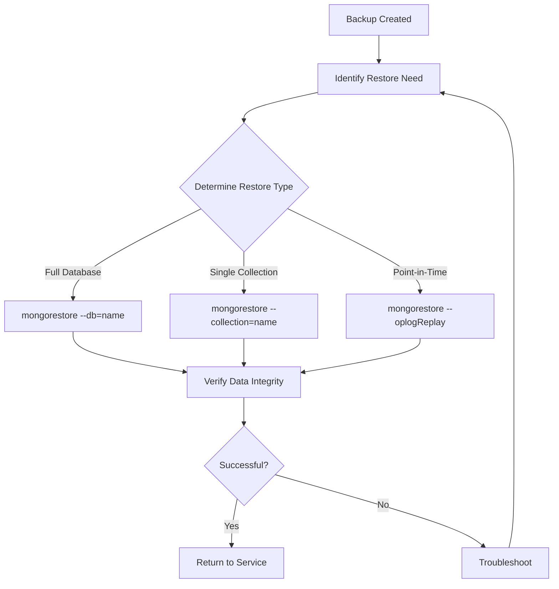

# MongoDB Restore Operations

When managing MongoDB databases, knowing how to properly restore data is just as important as creating backups. In this guide, we'll explore MongoDB restore operations, covering fundamental concepts, tools, and practical examples to help you safeguard your data.

## Introduction to MongoDB Restore

Restore operations in MongoDB allow you to recover databases, collections, or documents from previously created backups. These operations are crucial for data recovery after accidental deletions, corruptions, or when migrating data between environments.

The main tools for MongoDB restore operations are:

1. `mongorestore` - Command-line tool for restoring data from BSON dumps
2. MongoDB Atlas backup features - For cloud-managed MongoDB instances
3. MongoDB Ops Manager - Enterprise solution for managed MongoDB deployments

In this guide, we'll primarily focus on `mongorestore` as it's the most commonly used tool for self-managed MongoDB instances.

## Prerequisites

Before performing restore operations, ensure you have:

- MongoDB installed and running
- Appropriate permissions for the target database
- Backup files ready for restoration (usually BSON files)
- Basic understanding of MongoDB architecture

## Basic Restore Operations Using mongorestore

The `mongorestore` utility is MongoDB's built-in tool for restoring data from BSON dump files created by the `mongodump` command.

### Basic Syntax

```bash
mongorestore [options] [directory or file to restore]
```

### Simple Database Restore

To restore an entire database:

```bash
mongorestore --db=myDatabase dump/myDatabase
```

This command will restore all collections from the `dump/myDatabase` directory into the database named `myDatabase`.

### Restoring a Specific Collection

To restore a single collection:

```bash
mongorestore --db=myDatabase --collection=users dump/myDatabase/users.bson
```

This restores only the `users` collection to the `myDatabase` database.

### Example: Restoring a Sample Database

Let's say you have a sample e-commerce database backup and want to restore it:

```bash
# First, ensure MongoDB server is running
mongod --dbpath /data/db

# In a new terminal, restore the database
mongorestore --db=ecommerce dump/ecommerce

# Example output:
# 2023-10-28T13:45:22.123+0000    preparing collections to restore from
# 2023-10-28T13:45:22.145+0000    restoring ecommerce.products from dump/ecommerce/products.bson
# 2023-10-28T13:45:22.301+0000    restoring indexes for collection ecommerce.products from metadata
# 2023-10-28T13:45:22.423+0000    finished restoring ecommerce.products (1250 documents, 0 failures)
# 2023-10-28T13:45:22.489+0000    restoring ecommerce.users from dump/ecommerce/users.bson
# 2023-10-28T13:45:22.678+0000    restoring indexes for collection ecommerce.users from metadata
# 2023-10-28T13:45:22.801+0000    finished restoring ecommerce.users (870 documents, 0 failures)
# 2023-10-28T13:45:22.801+0000    2120 document(s) restored successfully. 0 document(s) failed to restore.
```

## Advanced Restore Options

### Restoring to a Different Database

You can restore data to a different database than the original:

```bash
mongorestore --db=newDatabaseName dump/originalDatabaseName
```

### Dropping Existing Collections Before Restore

To ensure clean data, you might want to drop existing collections before restoring:

```bash
mongorestore --drop --db=myDatabase dump/myDatabase
```

The `--drop` option will remove existing collections before restoring them, preventing duplicate data issues.

### Restoring with Authentication

If your MongoDB instance requires authentication:

```bash
mongorestore --username=admin --password=secret --authenticationDatabase=admin --db=myDatabase dump/myDatabase
```

### Restoring to a Specific MongoDB Instance

To restore to a MongoDB instance running on a different host or port:

```bash
mongorestore --host=mongodb.example.com --port=27018 --db=myDatabase dump/myDatabase
```

## Point-in-Time Recovery

One of the most powerful features of MongoDB's restore capabilities is point-in-time recovery, which allows you to restore your database to a specific moment in time.

### Using the oplog for Point-in-Time Recovery

To perform point-in-time recovery with `mongorestore`, you need:
1. A base backup (full dump)
2. The oplog records since that backup

```bash
mongorestore --oplogReplay --oplogLimit="1634830000:1" dump/
```

This command will:
1. Restore the database from the dump folder
2. Replay operations from the oplog up to the unix timestamp 1634830000:1

### Example: Recovering to a Specific Point in Time

Imagine your application experienced data corruption at 2:30 PM, but you have a backup from 1:00 PM and oplog records:

```bash
# Convert 2:30 PM to a Unix timestamp (e.g., 1634825400)
mongorestore --oplogReplay --oplogLimit="1634825400:0" --dir=dump/
```

This restores your database to the exact state it was in at 2:30 PM.

## Real-World Scenarios and Solutions

### Scenario 1: Database Disaster Recovery

After a server crash that corrupts your production database:

```bash
# Step 1: Stop the MongoDB service
sudo systemctl stop mongod

# Step 2: Move or rename the corrupted data files
sudo mv /var/lib/mongodb /var/lib/mongodb_corrupted

# Step 3: Create a new data directory
sudo mkdir /var/lib/mongodb
sudo chown mongodb:mongodb /var/lib/mongodb

# Step 4: Start MongoDB service
sudo systemctl start mongod

# Step 5: Restore from the latest backup
mongorestore --drop /backup/mongodb/latest/
```

### Scenario 2: Migrating Between Environments

When moving data from development to staging:

```bash
# Step 1: Create a dump of the development database
mongodump --db=devApp --out=/tmp/migration

# Step 2: Restore to the staging environment with data transformation
mongorestore --nsFrom="devApp.*" --nsTo="stagingApp.*" --drop /tmp/migration
```

This command uses namespace transformation (`--nsFrom` and `--nsTo`) to change the database name during restoration.

### Scenario 3: Selective Collection Restore

Sometimes, you only need to restore specific collections that were accidentally deleted:

```bash
# Restore only the users and products collections
mongorestore --db=ecommerce --collection=users dump/ecommerce/users.bson
mongorestore --db=ecommerce --collection=products dump/ecommerce/products.bson
```

## Handling Large-Scale Restores

For very large databases, consider these optimization techniques:

### Parallel Collection Restore

Use the `--numParallelCollections` option to speed up restoration:

```bash
mongorestore --numParallelCollections=4 --db=bigDatabase dump/bigDatabase
```

This will restore up to 4 collections in parallel, significantly reducing restore time.

### Restore Without Indexes, Then Add Them Later

For extremely large collections, you might want to restore data first and rebuild indexes afterward:

```bash
# Restore without indexes
mongorestore --db=bigDatabase --noIndexRestore dump/bigDatabase

# Connect to MongoDB and rebuild indexes after restoration
mongo
> use bigDatabase
> db.users.createIndex({email: 1}, {unique: true})
> db.products.createIndex({category: 1, name: 1})
```

## MongoDB Atlas Restore Operations

If you're using MongoDB Atlas (cloud-hosted MongoDB), you can perform restores through the web interface:

1. Navigate to the Clusters page in Atlas
2. Select the "..." menu for your cluster
3. Choose "Restore"
4. Select the backup snapshot and restoration options
5. Confirm the restore operation

Atlas also provides an API for programmatic restore operations:

```bash
curl -u "username:apiKey" --digest \
     -X POST \
     -H "Content-Type: application/json" \
     --data '{"targetClusterName":"MyCluster","pointInTimeWindowStart": {"date": "2023-10-15T00:00:00Z"}}' \
     "https://cloud.mongodb.com/api/atlas/v1.0/groups/{GROUP-ID}/clusters/{CLUSTER-NAME}/restoreJobs"
```

## Troubleshooting Common Restore Issues

### Issue: Insufficient Disk Space

```
Failed: error writing data for collection: no space left on device
```

**Solution**: Free up disk space or restore to a volume with adequate space.

### Issue: Duplicate Key Errors

```
Failed: error restoring users: E11000 duplicate key error collection: myDB.users
```

**Solution**: Use the `--drop` option to clear existing collections, or consider using `--stopOnError=false` to continue despite errors.

### Issue: Permissions Problems

```
Failed: not authorized on myDB to execute command
```

**Solution**: Ensure the user performing the restore has appropriate permissions. Use `--authenticationDatabase` with proper credentials.

```bash
mongorestore --username=admin --password=secret --authenticationDatabase=admin --db=myDB dump/myDB
```

## Best Practices for MongoDB Restore Operations

1. **Test Your Restore Process Regularly**: Don't wait for a disaster to find out if your backups can be restored successfully.

2. **Document Your Restore Procedures**: Keep clear documentation of restore processes for different scenarios.

3. **Verify Restored Data**: After restoration, validate that data integrity is maintained:

   ```javascript
   // Connect to MongoDB shell
   use restoredDatabase
   
   // Count documents
   db.users.countDocuments()
   
   // Check indexes
   db.users.getIndexes()
   
   // Sample a few documents to verify content
   db.users.find().limit(5)
   ```

4. **Monitor Resource Usage**: Large restores can impact system performance. Monitor CPU, memory, and disk I/O.

5. **Implement Staging Restores**: For critical systems, restore to a staging environment first to verify before applying to production.



## Summary

MongoDB restore operations are essential skills for database administrators and developers who work with MongoDB. In this guide, we've covered:

- Basic restore operations using `mongorestore`
- Advanced restore options like point-in-time recovery
- Real-world scenarios and solutions
- Handling large-scale restores
- MongoDB Atlas restore operations
- Troubleshooting common restore issues
- Best practices for successful restores

By mastering these concepts and techniques, you'll be well-prepared to handle data recovery scenarios and ensure the reliability of your MongoDB databases.

## Additional Resources and Practice Exercises

### Further Learning

- [Official MongoDB Documentation on mongorestore](https://www.mongodb.com/docs/database-tools/mongorestore/)
- [MongoDB University: MongoDB Backup and Recovery](https://university.mongodb.com/)
- [MongoDB Blog: Backup and Restore Best Practices](https://www.mongodb.com/blog)

### Practice Exercises

1. **Basic Restore Exercise**: Create a sample database, perform a backup using `mongodump`, delete the database, and practice restoring it.

2. **Collection-Level Restore**: Create multiple collections, back them up, then practice restoring specific collections.

3. **Point-in-Time Recovery Simulation**: Set up a replica set, create a backup, make some changes, then practice restoring to different points in time.

4. **Disaster Recovery Drill**: Simulate a database failure and perform a complete recovery following the steps outlined in this guide.

By practicing these scenarios in a safe environment, you'll build confidence in your ability to handle real restoration needs when they arise.