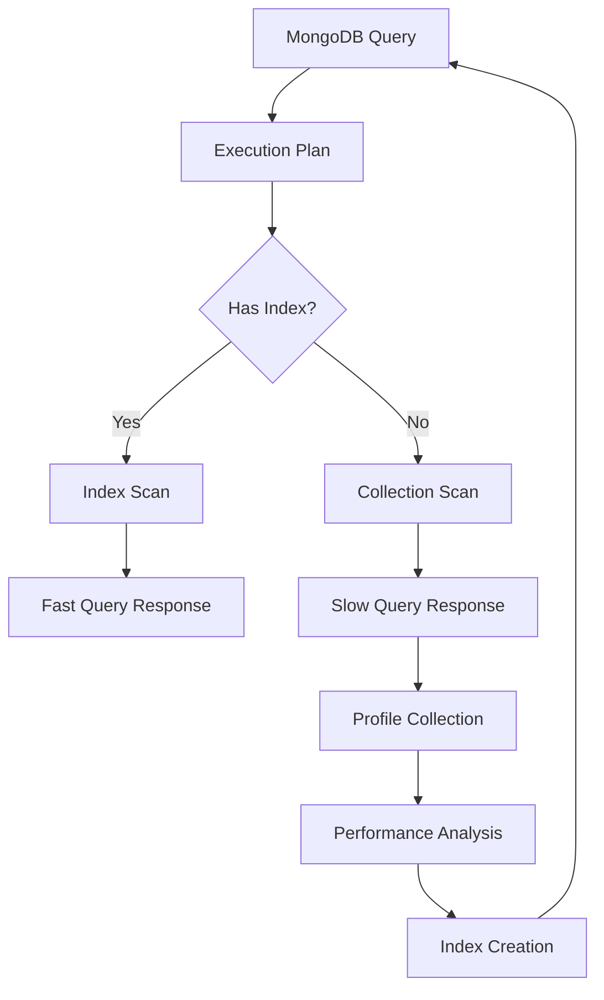

# MongoDB Database Profiler

## Introduction

Database performance is critical for application responsiveness and user experience. MongoDB provides a powerful built-in tool called the Database Profiler that helps administrators identify slow queries, analyze performance bottlenecks, and optimize database operations. This tool is essential for maintaining a healthy MongoDB deployment and ensuring optimal performance as your application scales.

The MongoDB Database Profiler records detailed information about operations performed against your database, including queries, updates, inserts, and other commands. By analyzing this information, you can detect inefficient queries, missing indexes, and other performance issues.

In this guide, we'll learn how to:
- Configure and enable the MongoDB Database Profiler
- Interpret profiler output
- Use profiling data to optimize database performance
- Implement best practices for production environments

## Understanding Profiling Levels

MongoDB's profiler operates at three different levels:

| Level | Description |
|-------|-------------|
| 0 | The profiler is off and does not collect any data (default) |
| 1 | The profiler collects data for operations that take longer than the `slowOpThresholdMs` value |
| 2 | The profiler collects data for all operations |

Level 1 is typically recommended for production environments as it helps identify problematic queries without significant overhead. Level 2 is useful during development or debugging specific issues but can impact performance due to the volume of data collected.

## Enabling the Database Profiler

You can enable profiling for a specific database using the `db.setProfilingLevel()` method in the MongoDB shell.

```javascript
// Enable profiling at level 1 (log slow queries) with a threshold of 100ms
db.setProfilingLevel(1, { slowms: 100 })

// Enable profiling for all operations
db.setProfilingLevel(2)

// Disable profiling
db.setProfilingLevel(0)
```

You can also check the current profiling status:

```javascript
// Check profiling status
db.getProfilingStatus()
```

Output:
```javascript
{
  "was": 1,
  "slowms": 100,
  "sampleRate": 1,
  "filterConnectionIds": []
}
```

## The system.profile Collection

When profiling is enabled, MongoDB stores profiling data in a capped collection called `system.profile`. This collection is automatically created when you enable profiling.

To query the profiling data:

```javascript
// View the most recent profile entries
db.system.profile.find().sort({ ts: -1 }).limit(5).pretty()
```

Sample output:
```javascript
{
  "op": "query",
  "ns": "mydb.users",
  "command": {
    "find": "users",
    "filter": { "age": { "$gt": 30 } },
    "limit": 20,
    "$db": "mydb"
  },
  "keysExamined": 0,
  "docsExamined": 10000,
  "cursorExhausted": true,
  "numYield": 78,
  "nreturned": 20,
  "responseLength": 2345,
  "millis": 120,
  "planSummary": "COLLSCAN",
  "execStats": {
    // Detailed execution statistics
  },
  "ts": ISODate("2023-11-01T10:15:30.123Z"),
  "client": "127.0.0.1",
  "appName": "MongoDB Shell",
  "user": "admin"
}
```

## Understanding Profiler Output

Let's break down the key fields in the profiler output:

- `op`: The type of operation (query, insert, update, remove, etc.)
- `ns`: The namespace (database and collection) the operation was performed on
- `command`: The actual command executed
- `keysExamined`: Number of index keys examined
- `docsExamined`: Number of documents scanned
- `millis`: Execution time in milliseconds
- `planSummary`: Query execution plan summary (COLLSCAN, IXSCAN, etc.)
- `ts`: Timestamp when the operation occurred

### Key Indicators of Performance Issues

When analyzing profiler data, pay attention to these warning signs:

1. **COLLSCAN in planSummary**: Indicates a collection scan rather than using an index
2. **High docsExamined count**: Examining many more documents than returned
3. **Large gap between keysExamined and nreturned**: Examining many index keys for few results
4. **High numYield value**: Query had to yield many times, possibly due to long execution
5. **High millis value**: Operation took a long time to complete

## Practical Examples

### Example 1: Identifying Slow Queries

Let's identify queries taking more than 100ms:

```javascript
// Enable profiling for slow queries
db.setProfilingLevel(1, { slowms: 100 })

// Run some operations...

// Find slow queries
db.system.profile.find({ millis: { $gt: 100 } }).sort({ millis: -1 }).pretty()
```

### Example 2: Finding Operations Without Index Usage

Queries performing collection scans are strong candidates for optimization:

```javascript
// Find operations using collection scans
db.system.profile.find({ 
  planSummary: "COLLSCAN",
  millis: { $gt: 10 } // Only interested in slow collection scans
}).pretty()
```

### Example 3: Optimizing a Slow Query

Let's say we discovered this slow query in the profiler:

```javascript
{
  "op": "query",
  "ns": "ecommerce.products",
  "command": {
    "find": "products",
    "filter": { "category": "electronics", "price": { "$lt": 500 } },
    "$db": "ecommerce"
  },
  "docsExamined": 50000,
  "nreturned": 120,
  "millis": 250,
  "planSummary": "COLLSCAN"
}
```

We can create an index to optimize this query:

```javascript
// Create a compound index for category and price
db.products.createIndex({ category: 1, price: 1 })

// Run the query again and check the profiler
db.products.find({ category: "electronics", price: { $lt: 500 } }).limit(10)
```

After creating the index, the same query in the profiler should show:
- Lower `millis` value
- `planSummary` showing `IXSCAN` instead of `COLLSCAN`
- Lower `docsExamined` count

## Profiling in Production Environments

For production environments, consider these best practices:

1. **Use Level 1 profiling with an appropriate threshold**:
   ```javascript
   db.setProfilingLevel(1, { slowms: 100 })
   ```

2. **Use sampling to reduce overhead** (MongoDB 4.0+):
   ```javascript
   db.setProfilingLevel(1, { slowms: 100, sampleRate: 0.2 }) // Sample 20% of slow operations
   ```

3. **Set up a routine to periodically analyze the profiler data**:
   ```javascript
   // Group by operation types to find the most problematic areas
   db.system.profile.aggregate([
     { $match: { millis: { $gt: 100 } } },
     { $group: { _id: "$op", count: { $sum: 1 }, avgTimeMS: { $avg: "$millis" } } },
     { $sort: { avgTimeMS: -1 } }
   ])
   ```

4. **Create a database monitoring dashboard** using tools like MongoDB Compass or MongoDB Atlas

5. **Rotate profiler data** by periodically dropping and recreating the profiler collection:
   ```javascript
   // To reset the profile collection (do this during low-traffic periods)
   db.setProfilingLevel(0)
   db.system.profile.drop()
   db.setProfilingLevel(1, { slowms: 100 })
   ```

## Profiling via MongoDB Configuration File

You can also configure profiling in the MongoDB configuration file (`mongod.conf`):

```yaml
operationProfiling:
  mode: slowOp
  slowOpThresholdMs: 100
  slowOpSampleRate: 1.0
```

After updating the configuration file, restart the MongoDB server to apply changes.

## Database Profiling with MongoDB Compass

MongoDB Compass, the official GUI for MongoDB, provides a user-friendly way to view and analyze performance data:

1. Connect to your database using MongoDB Compass
2. Navigate to the "Performance" tab
3. Click on "Explain Plan" to analyze specific queries
4. Use the "Real-Time Performance" panel to monitor current database activity

This visual interface makes it easier to spot performance issues without having to manually parse through the profiler data.

## Visualizing Profiler Data

Understanding the relationships between operations and their performance characteristics can be helpful. Here's a simple diagram showing how different factors affect query performance:



## Summary

The MongoDB Database Profiler is an essential tool for database administrators and developers looking to optimize query performance. By following these steps:

1. Enable profiling at an appropriate level (typically level 1 in production)
2. Analyze the `system.profile` collection to identify slow or inefficient operations
3. Look for telltale signs of performance issues like collection scans and high document examination counts
4. Create indexes to optimize problematic queries
5. Continue monitoring to ensure sustained performance

You can significantly improve the performance of your MongoDB databases and provide a better experience for your application users.

## Additional Resources

- [MongoDB Official Documentation on Database Profiling](https://www.mongodb.com/docs/manual/tutorial/manage-the-database-profiler/)
- [MongoDB Query Performance Optimization](https://www.mongodb.com/docs/manual/core/query-optimization/)
- [MongoDB Index Strategies](https://www.mongodb.com/docs/manual/applications/indexes/)

## Exercises

1. Enable level 1 profiling on a test database with a threshold of 50ms. Run various queries and analyze which ones appear in the profiler.

2. Create a collection with at least 10,000 documents and run queries both with and without proper indexes. Compare the profiler output for both scenarios.

3. Write a script that extracts the top 10 slowest operations from the `system.profile` collection and displays them in a readable format.

4. Use MongoDB Compass to connect to your database and explore the performance visualizations. Compare the insights gained from the UI versus the raw profiler data.

5. Implement a monitoring solution that alerts you when queries exceed a certain execution time threshold.