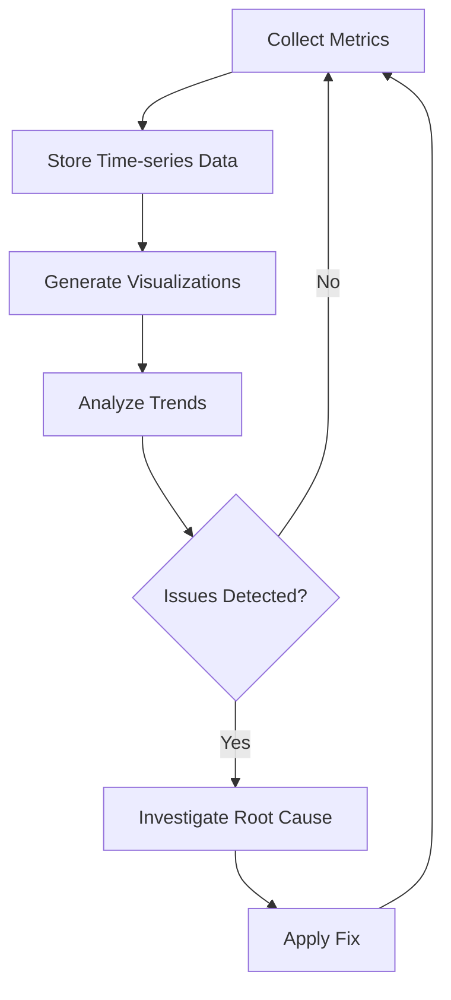
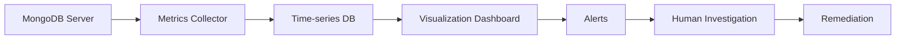

# MongoDB Diagnostics

MongoDB is a powerful NoSQL database, but like any database system, it requires proper monitoring, diagnostics, and troubleshooting to ensure optimal performance. In this guide, we'll explore various diagnostic techniques and tools to help you identify and resolve issues in your MongoDB deployments.

## Introduction to MongoDB Diagnostics

Database diagnostics is the process of analyzing, monitoring, and troubleshooting database performance and operational issues. For MongoDB administrators, having strong diagnostic skills is essential for:

- Identifying performance bottlenecks
- Troubleshooting connection issues
- Analyzing query performance
- Managing resource utilization
- Ensuring data consistency and integrity
- Planning for scaling and growth

## Essential MongoDB Diagnostic Commands

### 1. Server Status

The `serverStatus` command provides a comprehensive overview of the database instance's current state.

```javascript
// Get server status
db.adminCommand({ serverStatus: 1 })
```

Output (partial):

```json
{
  "host": "mongodb-server",
  "version": "5.0.14",
  "process": "mongod",
  "pid": 12345,
  "uptime": 86400,
  "uptimeMillis": 86400000,
  "uptimeEstimate": 86400,
  "localTime": ISODate("2023-09-15T10:00:00Z"),
  "connections": {
    "current": 25,
    "available": 975,
    "totalCreated": 1050
  },
  "globalLock": { /* lock data */ },
  "mem": { 
    "bits": 64,
    "resident": 1024,
    "virtual": 4096,
    "supported": true
  },
  "network": { /* network stats */ },
  // Other sections...
}
```

### 2. Database Stats

Get statistics about a specific database:

```javascript
// Get database statistics
db.stats()
```

Output:

```json
{
  "db": "myDatabase",
  "collections": 12,
  "views": 0,
  "objects": 10000,
  "avgObjSize": 256,
  "dataSize": 2560000,
  "storageSize": 3000000,
  "indexes": 24,
  "indexSize": 500000,
  "totalSize": 3500000,
  "scaleFactor": 1,
  "fsUsedSize": 50000000000,
  "fsTotalSize": 100000000000,
  "ok": 1
}
```

### 3. Collection Stats

Examine statistics for a specific collection:

```javascript
// Get collection statistics
db.users.stats()
```

Output:

```json
{
  "ns": "myDatabase.users",
  "count": 5000,
  "size": 1250000,
  "avgObjSize": 250,
  "storageSize": 1500000,
  "capped": false,
  "nindexes": 3,
  "indexBuilds": [],
  "totalIndexSize": 300000,
  "indexSizes": {
    "_id_": 100000,
    "username_1": 100000,
    "email_1": 100000
  },
  "scaleFactor": 1,
  "ok": 1
}
```

## Monitoring MongoDB Performance

### Current Operations

The `currentOp` command shows operations currently in progress on the MongoDB server:

```javascript
// View all current operations
db.adminCommand({ currentOp: 1 })

// View only long-running operations (>5 seconds)
db.adminCommand({ currentOp: 1, "secs_running": { "$gt": 5 } })
```

Output (partial):

```json
{
  "inprog": [
    {
      "opid": 123456,
      "active": true,
      "secs_running": 10,
      "op": "query",
      "ns": "myDatabase.users",
      "command": {
        "find": "users",
        "filter": { "status": "active" }
      },
      "client": "192.168.1.100:40123",
      "desc": "conn32"
    },
    // More operations...
  ]
}
```

### Killing Operations

If you identify a problematic or long-running operation, you can terminate it:

```javascript
// Kill an operation by its opid
db.adminCommand({ killOp: 1, op: 123456 })
```

Output:

```json
{ "info": "attempting to kill op", "ok": 1 }
```

## Query Profiling

MongoDB's profiler is a powerful tool for identifying slow queries and performance bottlenecks.

### Profiling Levels

```javascript
// Check current profiler level
db.getProfilingStatus()

// Set profiling level
// 0: Off, 1: Collect slow queries, 2: Collect all queries
db.setProfilingLevel(1, { slowms: 100 })
```

Output:

```json
// getProfilingStatus output
{ "was": 0, "slowms": 100, "sampleRate": 1 }

// setProfilingLevel output
{ "was": 0, "slowms": 100, "sampleRate": 1, "ok": 1 }
```

### Accessing Profiling Data

```javascript
// Query the system profiler
db.system.profile.find().sort({ ts: -1 }).limit(5)

// Find slow queries (execution time > 500ms)
db.system.profile.find({ millis: { $gt: 500 } }).sort({ ts: -1 })
```

Output:

```json
[
  {
    "op": "query",
    "ns": "myDatabase.users",
    "command": {
      "find": "users",
      "filter": { "lastLogin": { "$gt": ISODate("2023-01-01") } }
    },
    "keysExamined": 0,
    "docsExamined": 10000,
    "cursorExhausted": true,
    "numYield": 5,
    "nreturned": 1200,
    "responseLength": 123456,
    "millis": 650,
    "ts": ISODate("2023-09-15T10:15:30Z"),
    "client": "192.168.1.100:45678",
    "appName": "MongoDB Compass"
  },
  // More profile records...
]
```

## Analyzing Query Performance using `explain()`

The `explain()` method provides insights into how MongoDB executes queries and helps identify performance issues.

```javascript
// Basic explain
db.users.find({ age: { $gt: 30 } }).explain()

// Execute with "executionStats" for detailed performance data
db.users.find({ age: { $gt: 30 } }).explain("executionStats")

// "allPlansExecution" shows all considered plans
db.users.find({ age: { $gt: 30 } }).explain("allPlansExecution")
```

Output (using executionStats):

```json
{
  "explainVersion": "1",
  "queryPlanner": {
    "plannerVersion": 1,
    "namespace": "myDatabase.users",
    "indexFilterSet": false,
    "parsedQuery": {
      "age": { "$gt": 30 }
    },
    "winningPlan": {
      "stage": "COLLSCAN",
      "filter": {
        "age": { "$gt": 30 }
      },
      "direction": "forward"
    },
    "rejectedPlans": []
  },
  "executionStats": {
    "executionSuccess": true,
    "nReturned": 2500,
    "executionTimeMillis": 45,
    "totalKeysExamined": 0,
    "totalDocsExamined": 5000,
    "executionStages": {
      "stage": "COLLSCAN",
      "filter": {
        "age": { "$gt": 30 }
      },
      "nReturned": 2500,
      "executionTimeMillisEstimate": 10,
      "works": 5002,
      "advanced": 2500,
      "needTime": 2501,
      "needYield": 0,
      "saveState": 39,
      "restoreState": 39,
      "isEOF": 1,
      "direction": "forward",
      "docsExamined": 5000
    }
  }
}
```

### Key Performance Indicators in Explain Output

- `COLLSCAN` vs. `IXSCAN`: Collection scans (COLLSCAN) are generally slower than index scans (IXSCAN)
- `totalDocsExamined`: Number of documents scanned (lower is better)
- `totalKeysExamined`: Number of index keys scanned
- `nReturned`: Number of documents returned
- `executionTimeMillis`: Total execution time in milliseconds

## Diagnosing Memory Issues

### Working Set Assessment

The working set is the portion of data and indexes that MongoDB keeps in RAM:

```javascript
// Get WiredTiger cache statistics
db.serverStatus().wiredTiger.cache
```

Output:

```json
{
  "bytes currently in the cache": 1073741824,
  "bytes read into cache": 10737418240,
  "bytes written from cache": 5368709120,
  "maximum bytes configured": 4294967296,
  "tracked dirty bytes in the cache": 268435456,
  "pages evicted by application threads": 0,
  "pages queued for eviction": 0,
  "pages read into cache": 50000,
  "pages written from cache": 25000
}
```

High eviction rates and cache misses indicate memory pressure. When this happens:

1. Consider increasing your WiredTiger cache size
2. Analyze your access patterns
3. Consider adding more RAM to your server
4. Review your indexing strategy

## Monitoring I/O Performance

```javascript
// Get storage engine stats
db.serverStatus().wiredTiger
```

Look for signs of I/O bottlenecks:

- High read/write latencies
- Queue buildup
- Slow checkpoint times

## Network and Connection Analysis

```javascript
// Check connection status
db.serverStatus().connections

// Check network statistics
db.serverStatus().network
```

Output:

```json
// Connections
{
  "current": 125,
  "available": 875,
  "totalCreated": 9876,
  "active": 115
}

// Network
{
  "bytesIn": 10485760,
  "bytesOut": 20971520,
  "numRequests": 50000
}
```

## Implementing MongoDB Monitoring

For comprehensive MongoDB monitoring, consider:

1. **Built-in MongoDB tools:**
   - MongoDB Compass
   - MongoDB Cloud Manager
   - MongoDB Ops Manager

2. **Third-party monitoring tools:**
   - Prometheus with MongoDB exporter
   - Grafana dashboards
   - Datadog
   - New Relic

3. **Custom monitoring scripts:**

```javascript
// Simple monitoring script for connection count
const connectionStats = () => {
  const status = db.serverStatus();
  const conn = status.connections;
  const currentTime = new Date().toISOString();
  
  print(`${currentTime} - Connections: ${conn.current}/${conn.available} (${(conn.current / (conn.current + conn.available) * 100).toFixed(2)}% used)`);
  
  if (conn.current > conn.available * 0.8) {
    print("WARNING: Connection usage is above 80%");
  }
}

// Run every 5 minutes
setInterval(connectionStats, 5 * 60 * 1000);
```

## Real-World Diagnostics Scenario: Identifying Slow Queries

Let's walk through a real-world scenario for identifying and fixing slow queries:

### Step 1: Enable profiling for slow operations
```javascript
// Enable profiling for operations taking longer than 100ms
db.setProfilingLevel(1, { slowms: 100 })
```

### Step 2: Let your application run for a while

### Step 3: Analyze slow queries
```javascript
// Find the slowest queries
db.system.profile.find().sort({ millis: -1 }).limit(5)
```

### Step 4: Examine a problematic query
Let's say we found a slow query for users with a specific status:

```javascript
// The problematic query from the profile
db.users.find({ status: "active", lastLogin: { $gt: ISODate("2023-01-01") } })

// Run explain to understand execution
db.users.find({ 
  status: "active", 
  lastLogin: { $gt: ISODate("2023-01-01") } 
}).explain("executionStats")
```

Example problematic output:
```json
{
  "executionStats": {
    "executionSuccess": true,
    "nReturned": 5000,
    "executionTimeMillis": 650,
    "totalKeysExamined": 0,
    "totalDocsExamined": 100000,
    // ...
    "executionStages": {
      "stage": "COLLSCAN",
      // ...
    }
  }
}
```

### Step 5: Create appropriate index and verify improvement

```javascript
// Create compound index
db.users.createIndex({ status: 1, lastLogin: 1 })

// Verify the query now uses the index
db.users.find({ 
  status: "active", 
  lastLogin: { $gt: ISODate("2023-01-01") } 
}).explain("executionStats")
```

Improved output:
```json
{
  "executionStats": {
    "executionSuccess": true,
    "nReturned": 5000,
    "executionTimeMillis": 15,
    "totalKeysExamined": 5000,
    "totalDocsExamined": 5000,
    // ...
    "executionStages": {
      "stage": "IXSCAN",
      "indexName": "status_1_lastLogin_1",
      // ...
    }
  }
}
```

## Best Practices for MongoDB Diagnostics

1. **Implement proactive monitoring**
   - Set up alerts for key metrics
   - Monitor trends over time
   - Schedule regular performance reviews

2. **Create diagnostic workflows**
   - Follow a structured approach to troubleshooting
   - Document common issues and solutions
   - Use a tiered approach from simple to complex diagnostics

3. **Perform regular health checks**

```javascript
// Basic health check script
const healthCheck = () => {
  const serverStatus = db.serverStatus();
  const dbStats = db.stats();
  
  // Check connections
  const connPercentage = serverStatus.connections.current / 
                        (serverStatus.connections.current + serverStatus.connections.available) * 100;
  
  // Check memory usage
  const memoryUsage = serverStatus.mem.resident;
  const cacheUsage = serverStatus.wiredTiger.cache["bytes currently in the cache"] / 
                    serverStatus.wiredTiger.cache["maximum bytes configured"] * 100;
  
  // Output health summary
  print(`=== MongoDB Health Check (${new Date().toISOString()}) ===`);
  print(`Server version: ${serverStatus.version}`);
  print(`Uptime: ${(serverStatus.uptime / 3600).toFixed(2)} hours`);
  print(`Connection usage: ${connPercentage.toFixed(2)}%`);
  print(`Memory usage: ${Math.round(memoryUsage)} MB`);
  print(`Cache usage: ${cacheUsage.toFixed(2)}%`);
  print(`Collections: ${dbStats.collections}`);
  print(`Documents: ${dbStats.objects}`);
  print(`Storage size: ${(dbStats.storageSize / 1024 / 1024).toFixed(2)} MB`);
  
  // Warnings
  if (connPercentage > 80) print("⚠️ WARNING: High connection usage");
  if (cacheUsage > 90) print("⚠️ WARNING: Cache pressure detected");
  
  print("=======================================");
}

// Execute health check
healthCheck();
```

## Visualizing MongoDB Performance Trends

Using the diagnostic data collected, we can visualize performance trends over time:



A common pattern for automated MongoDB diagnostics:



## Summary

MongoDB diagnostics and monitoring are essential skills for database administrators. By leveraging the built-in diagnostic tools and commands, you can:

- Identify and resolve performance bottlenecks
- Ensure your MongoDB deployment is running optimally
- Track key performance metrics over time
- Plan for capacity and scaling needs
- Proactively address issues before they impact users

Developing a strong diagnostic approach will help you maintain reliable, high-performance MongoDB deployments in production environments.

## Additional Resources

- [MongoDB Official Documentation on Monitoring](https://docs.mongodb.com/manual/administration/monitoring/)
- [MongoDB Performance Best Practices](https://docs.mongodb.com/manual/core/query-optimization/)
- [MongoDB University - Diagnostics and Debugging Course](https://university.mongodb.com/)

## Exercises

1. Set up profiling on a test database and identify the three slowest queries.
2. Create a script that checks for long-running operations and outputs warnings.
3. Use `explain()` to analyze and optimize three queries in your application.
4. Implement a simple monitoring script that tracks connection usage, memory consumption, and operation counts.
5. Design a MongoDB health check dashboard with key metrics for your specific application needs.