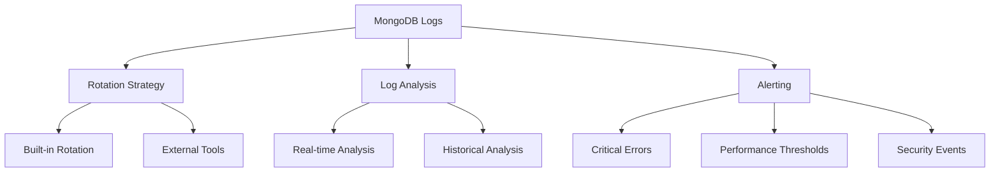

# MongoDB Log Files

## Introduction

Log files are a critical aspect of MongoDB administration, providing valuable insights into the database's operation, performance, and potential issues. As a MongoDB administrator, understanding how to configure, access, and analyze log files is essential for maintaining a healthy database environment.

MongoDB generates detailed logs of its operations, allowing administrators to monitor activity, troubleshoot problems, and ensure optimal system performance. In this guide, we'll explore MongoDB's logging system, including configuration options, log formats, rotation strategies, and best practices for effective log management.

## Understanding MongoDB Log Files

### What Are MongoDB Log Files?

MongoDB log files record various events and operations within your MongoDB deployment. These logs capture information about:

- Server startups and shutdowns
- Connection events
- CRUD operations (depending on configuration)
- Replication activities
- Sharding operations
- Slow queries
- Authentication events
- Error conditions
- Warning messages

### Default Log Locations

MongoDB stores its logs in different locations depending on your operating system and deployment method:

- On Linux/Unix systems: `/var/log/mongodb/mongod.log`
- On Windows: `C:\Program Files\MongoDB\Server\<version>\log\mongod.log`
- On macOS: `/usr/local/var/log/mongodb/mongod.log`

However, these locations can be customized through configuration.

## Configuring MongoDB Logging

### Basic Log Configuration

You can configure MongoDB logging through the MongoDB configuration file (`mongod.conf`). Here's a basic example:

```yaml
systemLog:
   destination: file
   path: "/var/log/mongodb/mongod.log"
   logAppend: true
   verbosity: 1
```

Let's break down these settings:

- `destination`: Specifies where logs are sent (file or syslog)
- `path`: Defines the log file location
- `logAppend`: When true, MongoDB appends to the existing log file on restart
- `verbosity`: Controls the level of detail (0 for minimal, 5 for most verbose)

### Setting Log Verbosity

MongoDB's verbosity levels control the amount of detail in your logs:

- 0: Default level, includes informational messages
- 1: Includes detailed information
- 2: Includes debug information
- 3-5: Increasingly verbose debug information

For most production environments, verbosity levels 0 or 1 are recommended. Higher levels produce significantly more output and should be used only for troubleshooting.

```yaml
systemLog:
   verbosity: 1
```

### Component-Specific Logging

MongoDB allows you to set different verbosity levels for specific components:

```yaml
systemLog:
   verbosity: 0
   component:
      query:
         verbosity: 2
      storage:
         verbosity: 1
      network:
         verbosity: 1
```

This configuration keeps the overall verbosity low while providing more detailed logs for specific components.

## Log Message Format

MongoDB log entries follow a structured format that includes:

1. Timestamp
2. Severity level
3. Component
4. Context (connection information)
5. Message

Here's an example log entry:

```
2023-06-15T14:32:45.123+0000 I NETWORK [conn123] connection accepted from 192.168.1.100:45678 #1 (1 connection now open)
```

Let's analyze this entry:
- `2023-06-15T14:32:45.123+0000`: Timestamp in ISO format with UTC offset
- `I`: Severity level (I for Information)
- `NETWORK`: Component name
- `[conn123]`: Connection context
- `connection accepted...`: The actual log message

### Severity Levels

MongoDB uses the following severity levels:

- F: Fatal
- E: Error
- W: Warning
- I: Informational (for normal operations)
- D: Debug

## Log Rotation

Log files can grow quickly in busy MongoDB deployments. To manage this growth, log rotation is essential.

### Built-in Log Rotation

MongoDB provides built-in log rotation through the `logRotate` command:

```javascript
db.adminCommand({ logRotate: 1 })
```

When executed, this command:
1. Closes the current log file
2. Renames it by appending a timestamp
3. Opens a new log file

### Configuring Log Rotation

You can also configure automatic log rotation using the `systemLog.logRotate` parameter:

```yaml
systemLog:
   destination: file
   path: "/var/log/mongodb/mongod.log"
   logAppend: true
   logRotate: rename
```

The `logRotate` option accepts two values:
- `rename`: Renames the log file by appending a timestamp
- `reopen`: Reopens the log file (useful when external rotation tools are used)

### Using External Log Rotation Tools

For more advanced log rotation needs, you can use operating system tools like `logrotate` on Linux.

Here's an example `/etc/logrotate.d/mongodb` configuration:

```
/var/log/mongodb/mongod.log {
    daily
    size 100M
    rotate 7
    compress
    dateext
    missingok
    notifempty
    create 600 mongodb mongodb
    postrotate
        /usr/bin/mongo admin --eval "db.adminCommand({ logRotate: 1 })" > /dev/null 2>&1
    endscript
}
```

This configuration rotates logs daily or when they reach 100MB, keeps 7 archived logs, and compresses older logs.

## Analyzing MongoDB Logs

### Common Log Patterns to Monitor

Here are some important log entries to watch for:

1. **Slow Queries**: 

```
2023-06-15T15:12:34.567+0000 I COMMAND [conn456] command products.inventory command: find { ... } planSummary: COLLSCAN keysExamined:0 docsExamined:10000 hasSortStage:1 cursorExhausted:1 numYields:78 nreturned:20 reslen:18245 locks:{ ... } 1200ms
```

Queries taking longer than the configured `slowOpThresholdMs` (default 100ms) will be logged. These indicate potential optimization opportunities.

2. **Connection Issues**:

```
2023-06-15T16:23:45.678+0000 I NETWORK [listener] connection accepted from 192.168.1.200:12345 #2 (2 connections now open)
2023-06-15T16:25:12.789+0000 I NETWORK [conn2] end connection 192.168.1.200:12345 (1 connection now open)
```

Tracking connection patterns helps identify client issues or potential denial-of-service attacks.

3. **Authentication Failures**:

```
2023-06-15T17:34:56.789+0000 W ACCESS [conn3] Failed to authenticate user admin@admin with mechanism SCRAM-SHA-256
```

Repeated authentication failures could indicate security issues.

### Log Analysis Tools

Several tools can help analyze MongoDB logs:

1. **mtools**: A collection of Python scripts for analyzing MongoDB logs
   
```bash
# Install mtools
pip install mtools

# Analyze slow queries
mlogfilter mongod.log --slow 100 --json
```

2. **MongoDB Compass**: MongoDB's GUI includes a log viewer feature

3. **ELK Stack** (Elasticsearch, Logstash, Kibana): For advanced log aggregation and visualization

## Real-world Example: Troubleshooting with Logs

Let's walk through a real-world example of using logs to troubleshoot a performance issue.

### Scenario: Application Reporting Slow Response Times

1. **Check for slow queries in the logs**:

```bash
grep "COMMAND" mongod.log | grep -E "([0-9]+)ms" | sort -k 14 -n -r | head -10
```

This command finds the 10 slowest operations.

2. **Analyze one of the slow queries**:

```
2023-06-16T09:45:23.456+0000 I COMMAND [conn789] command sales.transactions command: find { date: { $gte: ISODate("2023-01-01"), $lte: ISODate("2023-06-01") }, amount: { $gt: 1000 } } planSummary: COLLSCAN keysExamined:0 docsExamined:5000000 nreturned:1200 reslen:425678 locks:{ ... } 3500ms
```

3. **Identify the issue**: The `COLLSCAN` in the plan summary indicates a collection scan without using an index.

4. **Solution**: Create an appropriate index based on the query pattern:

```javascript
db.transactions.createIndex({ date: 1, amount: 1 })
```

5. **Verify improvement**: Check subsequent logs to confirm the query now uses the index (look for `IXSCAN` instead of `COLLSCAN`).

## Best Practices for MongoDB Logging

### 1. Set Appropriate Verbosity Levels

- Use lower verbosity (0-1) in production
- Increase verbosity temporarily for troubleshooting
- Use component-specific verbosity for targeted debugging

### 2. Implement Proper Log Rotation

- Configure automatic log rotation
- Ensure adequate disk space for logs
- Archive old logs for compliance and audit needs

### 3. Monitor Important Log Events

Set up automated monitoring for critical log entries:
- Authentication failures
- Connection spikes
- Long-running operations
- Replication lags
- Error messages

### 4. Structure Your Logging Strategy



### 5. Consider Log Aggregation

In larger deployments with multiple MongoDB instances, consider centralizing logs using tools like:
- ELK Stack (Elasticsearch, Logstash, Kibana)
- Graylog
- Splunk
- MongoDB Atlas monitoring (for cloud deployments)

## Summary

MongoDB log files are invaluable tools for monitoring database health, troubleshooting issues, and optimizing performance. By understanding how to configure logging, interpret log messages, implement proper rotation strategies, and analyze log data, you can maintain a more reliable and efficient MongoDB deployment.

Key points to remember:
- Configure appropriate verbosity levels for your environment
- Implement log rotation to manage file sizes
- Regularly analyze logs for performance issues and errors
- Set up alerts for critical log events
- Consider log aggregation for larger deployments

## Additional Resources

- Practice analyzing logs from your own MongoDB instances
- Try creating different indexes and observe how query execution plans change in the logs
- Set up a test environment to experiment with different logging configurations
- Implement a log rotation strategy appropriate for your production environment
- Create a script to extract and summarize important log events for daily review

As you continue your MongoDB administration journey, log management will become an essential part of your toolkit, helping you maintain robust and high-performing database systems.