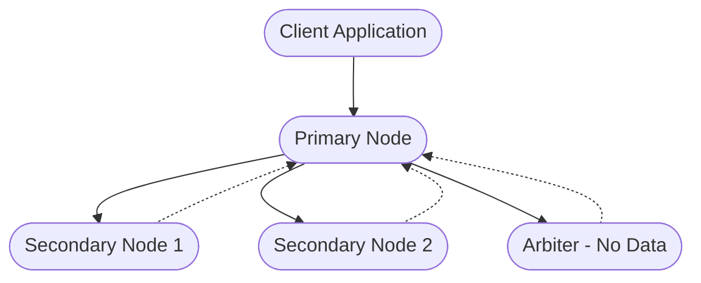

# MongoDB Replica Set

## Introduction

In MongoDB, a replica set is a group of MongoDB instances that maintain the same data set. Replica sets provide redundancy and high availability, which are critical for all production deployments. This tutorial will guide you through understanding, setting up, and managing MongoDB replica sets.

Replica sets are the foundation of MongoDB's replication system, ensuring that your database can withstand server failures and service interruptions while maintaining data consistency and availability.

## What is a MongoDB Replica Set?

A MongoDB replica set consists of multiple MongoDB instances working together to provide:

1. **Data Redundancy**: Multiple copies of data on different database servers
2. **High Availability**: Automatic failover if the primary server fails
3. **Disaster Recovery**: Protection against data loss
4. **Read Distribution**: The ability to distribute read operations across servers

At minimum, a replica set contains:
- A primary node that receives all write operations
- Secondary nodes that replicate data from the primary
- An arbiter (optional) that participates in elections but doesn't hold data



## How Replica Sets Work

### Replica Set Members

A replica set can have up to 50 members, but only 7 voting members. Members can be:

1. **Primary**: The only member that accepts write operations
2. **Secondary**: Read-only members that replicate data from the primary
3. **Arbiter**: Members that vote in elections but don't store data

Each member has a priority that determines its likelihood of becoming primary during an election.

### Replication Process

MongoDB replication works through an operation log (oplog) mechanism:

1. All write operations on the primary are recorded in its oplog
2. Secondary members continuously pull operations from the primary's oplog
3. Secondary members apply these operations to their own data sets
4. This process happens asynchronously

### Automatic Failover

If the primary becomes unavailable, the remaining members conduct an election to select a new primary:

1. Eligible secondary nodes vote for a new primary
2. The node with the highest priority that's up-to-date becomes primary
3. The client application automatically redirects to the new primary

## Setting Up a Basic Replica Set

Let's set up a simple 3-node replica set on a single machine (for testing purposes).

### Step 1: Create Data Directories

```bash
mkdir -p /data/rs1 /data/rs2 /data/rs3
```

### Step 2: Start MongoDB Instances

```bash
mongod --replSet myReplSet --port 27017 --dbpath /data/rs1 --logpath /data/rs1/mongodb.log --fork

mongod --replSet myReplSet --port 27018 --dbpath /data/rs2 --logpath /data/rs2/mongodb.log --fork

mongod --replSet myReplSet --port 27019 --dbpath /data/rs3 --logpath /data/rs3/mongodb.log --fork
```

### Step 3: Initiate the Replica Set

Connect to one of the instances:

```bash
mongosh --port 27017
```

Configure and initiate the replica set:

```javascript
// Define the replica set configuration
const rsConfig = {
  _id: "myReplSet",
  members: [
    { _id: 0, host: "localhost:27017" },
    { _id: 1, host: "localhost:27018" },
    { _id: 2, host: "localhost:27019" }
  ]
};

// Initiate the replica set
rs.initiate(rsConfig);
```

Output:
```
{
  "ok" : 1,
  "operationTime" : Timestamp(1601234567, 1),
  "$clusterTime" : {
    "clusterTime" : Timestamp(1601234567, 1),
    "signature" : {
      "hash" : BinData(0,"AAAAAAAAAAAAAAAAAAAAAAAAAAA="),
      "keyId" : NumberLong(0)
    }
  }
}
```

### Step 4: Check Replica Set Status

```javascript
rs.status()
```

Output (abbreviated):
```javascript
{
  "set" : "myReplSet",
  "date" : ISODate("2023-10-25T14:15:22.123Z"),
  "myState" : 1,
  "term" : NumberLong(1),
  "members" : [
    {
      "_id" : 0,
      "name" : "localhost:27017",
      "health" : 1,
      "state" : 1,
      "stateStr" : "PRIMARY",
      // more details...
    },
    {
      "_id" : 1,
      "name" : "localhost:27018",
      "health" : 1,
      "state" : 2,
      "stateStr" : "SECONDARY",
      // more details...
    },
    {
      "_id" : 2,
      "name" : "localhost:27019",
      "health" : 1,
      "state" : 2,
      "stateStr" : "SECONDARY",
      // more details...
    }
  ],
  // more details...
}
```

## Working with Replica Sets

### Connecting to Replica Sets in Applications

When connecting to a replica set from your application, you should specify all the members in the connection string:

```javascript
// MongoDB Node.js driver example
const { MongoClient } = require('mongodb');

// Connection string with replica set
const uri = "mongodb://localhost:27017,localhost:27018,localhost:27019/mydb?replicaSet=myReplSet";

const client = new MongoClient(uri);

async function run() {
  try {
    await client.connect();
    console.log("Connected to MongoDB replica set");
    
    // Perform operations...
    const database = client.db("test");
    const collection = database.collection("users");
    await collection.insertOne({name: "John Doe", email: "john@example.com"});
    
    console.log("Document inserted");
  } finally {
    await client.close();
  }
}

run().catch(console.error);
```

### Reading from Secondary Nodes

By default, MongoDB directs all reads to the primary node. To allow reads from secondary nodes, you need to explicitly set the read preference:

```javascript
// Set read preference in MongoDB Node.js driver
const collection = database.collection("users");

// Read from secondary nodes
const users = await collection.find().readPreference("secondaryPreferred").toArray();
console.log(users);
```

Read preferences include:
- `primary`: Default, read only from primary
- `primaryPreferred`: Prefer primary, but use secondary if primary unavailable
- `secondary`: Read only from secondaries
- `secondaryPreferred`: Prefer secondaries, but use primary if no secondaries available
- `nearest`: Read from the member with the lowest network latency

## Advanced Replica Set Configurations

### Adding Members to an Existing Replica Set

```javascript
// Connect to the primary
mongosh --host "mongodb://localhost:27017,localhost:27018,localhost:27019/?replicaSet=myReplSet"

// Add a new member (first start the new mongod instance)
rs.add("localhost:27020")
```

### Removing Members from a Replica Set

```javascript
// Remove a member
rs.remove("localhost:27019")
```

### Configuring a Hidden Member

Hidden members are not visible to client applications and cannot become primary. They're useful for dedicated backup or reporting nodes:

```javascript
var cfg = rs.conf();
cfg.members[2].hidden = true;
cfg.members[2].priority = 0;
rs.reconfig(cfg);
```

### Adding an Arbiter

Arbiters don't store data but vote in elections:

```javascript
// Start a mongod instance for the arbiter
rs.addArb("localhost:27021")
```

## Monitoring and Maintenance

### Monitoring Replication Lag

Replication lag is the delay between operations being applied on the primary and replicated to secondaries.

```javascript
// Check the replication status
rs.printSecondaryReplicationInfo()
```

Output:
```
source: localhost:27018
    syncedTo: 2023-10-25T14:28:43.356Z (3 secs ago)
    0 secs (0 hr) behind the primary 
source: localhost:27019
    syncedTo: 2023-10-25T14:28:42.246Z (4 secs ago)
    1 secs (0 hr) behind the primary 
```

### Stepping Down the Primary

For maintenance, you might want to manually step down the primary:

```javascript
// Force the current primary to step down
rs.stepDown()
```

### Forcing Reconfiguration in Emergency Situations

If a majority of nodes are down, you can force a reconfiguration:

```javascript
// This is dangerous and should only be used in emergencies
rs.reconfig(rs.conf(), {force: true})
```

## Real-World Applications of Replica Sets

### High-Availability E-Commerce Database

For an e-commerce application where downtime equals lost revenue:

1. Deploy a 3-node replica set across multiple availability zones
2. Configure automatic failover to ensure the application remains operational
3. Use read preferences to distribute read-heavy operations

```javascript
// Connection code for an e-commerce application
const uri = "mongodb://node1:27017,node2:27017,node3:27017/ecommerce?replicaSet=prodRS";

const client = new MongoClient(uri, {
  w: "majority", // Wait for majority write concerns
  readPreference: "primaryPreferred",
  retryWrites: true
});
```

### Geographically Distributed Application

For a global application with users across multiple continents:

1. Deploy replica set members in different geographical regions
2. Configure read preferences to direct users to the nearest server
3. Use tag sets to control data distribution

```javascript
// Example configuration for geo-distributed replica set
const rsConfig = {
  _id: "geoRS",
  members: [
    { _id: 0, host: "us-server:27017", tags: { region: "us" } },
    { _id: 1, host: "eu-server:27017", tags: { region: "eu" } },
    { _id: 2, host: "asia-server:27017", tags: { region: "asia" } }
  ]
};

// Connect with tag awareness
const client = new MongoClient(uri, {
  readPreference: "nearest",
  readPreferenceTags: [{ region: "eu" }] // Prefer EU region
});
```

## Best Practices for Replica Sets

1. **Always use an odd number of voting members** to ensure proper election outcomes

2. **Distribute replica set members** across different servers, racks, and data centers

3. **Configure appropriate write concern** to ensure durability (`w: "majority"` is often recommended)

4. **Monitor replication lag** and performance metrics

5. **Maintain sufficient oplog size** to prevent secondaries from becoming too stale

6. **Use separate disks for journal, data files, and logs** on production systems

7. **Test failover scenarios** regularly to ensure your application handles them correctly

## Common Issues and Troubleshooting

### Secondary Cannot Sync

If a secondary has fallen too far behind, it might need to be resynced:

```javascript
// Connect to the problematic secondary
mongosh --port 27018

// Reset the secondary (warning: this will delete all data on this node)
rs.resync()
```

### Network Partition Issues

Network partitions can cause split-brain scenarios. MongoDB's voting mechanism prevents this, but you should:

1. Use network redundancy
2. Implement proper monitoring
3. Configure appropriate timeouts

### Authentication Issues

With authentication enabled, replica set members need to authenticate to each other:

```javascript
// Create a keyfile for internal authentication
openssl rand -base64 756 > /data/mongodb-keyfile
chmod 400 /data/mongodb-keyfile

// Start each member with the keyfile
mongod --replSet myReplSet --keyFile /data/mongodb-keyfile --port 27017 [other options]
```

## Summary

MongoDB replica sets provide an essential foundation for building resilient, high-availability database systems. In this guide, we've covered:

- The basic structure and purpose of replica sets
- How to set up and configure a basic replica set
- Working with replica sets in applications
- Advanced configurations and maintenance tasks
- Real-world applications and best practices

By implementing MongoDB replica sets, you can ensure your applications remain available even during server failures, while gaining additional benefits like read scaling and geo-distribution.

## Additional Resources

- [Official MongoDB Replica Set Documentation](https://www.mongodb.com/docs/manual/replication/)
- [MongoDB University - M103: Basic Cluster Administration](https://learn.mongodb.com/courses/m103-basic-cluster-administration)
- [MongoDB Driver Documentation](https://www.mongodb.com/docs/drivers/)

## Exercises

1. Set up a 3-node replica set on your local machine and test failover by shutting down the primary.

2. Implement an application that connects to your replica set and handles primary elections gracefully.

3. Configure a replica set with a hidden secondary dedicated for backups, and practice taking consistent backups.

4. Experiment with different read preferences to understand their impact on performance and consistency.

5. Design a replica set deployment plan for a high-traffic web application with global users, including server locations and configuration options.