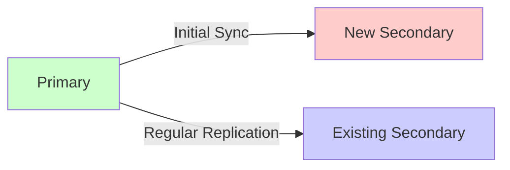
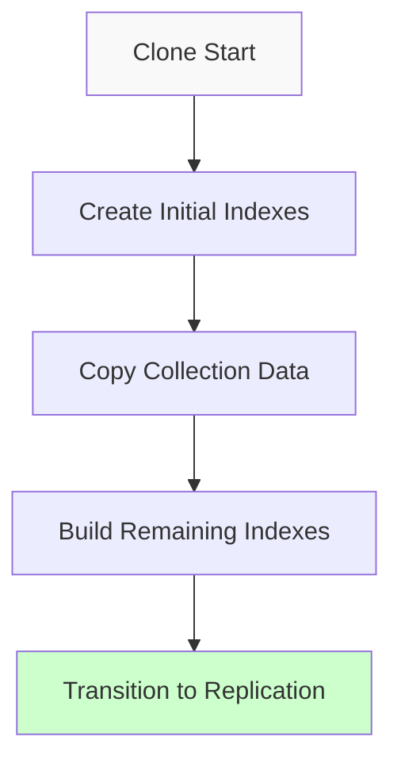

# MongoDB Initial Sync

## Introduction

When setting up a MongoDB replica set, a critical process called **Initial Sync** occurs that creates a complete copy of data from an existing member to a new member. This process is fundamental to MongoDB's replication architecture and ensures that all members of a replica set have identical data.

Initial Sync is the foundation of MongoDB's replication system, serving as the first step when adding new members to an existing replica set. Understanding this process is essential for database administrators, developers working with distributed databases, and anyone managing MongoDB deployments.

## What is Initial Sync?

Initial Sync is the process where a new secondary member of a replica set copies all data from an existing member (typically the primary). This establishes the baseline data set before the new member can start regular replication through the oplog.



## When Initial Sync Occurs

Initial Sync happens in the following scenarios:

1. When you add a new member to an existing replica set
2. When a member has fallen too far behind in replication (its oplog position no longer exists on the source)
3. After certain types of recovery operations
4. When you manually trigger resynchronization

## The Initial Sync Process

MongoDB performs Initial Sync in several distinct phases:

### Phase 1: Preparation

The new secondary selects a sync source (typically the primary) from which to copy data.

```javascript
// Check which member will be used as a sync source
db.adminCommand({ replSetGetStatus: 1 })
```

This command returns information about the replica set, including which member is being used as the sync source.

### Phase 2: Copying Data

The secondary builds collections in a temporary location by:

1. Creating indexes for all collections
2. Copying documents from each collection
3. Building indexes in the background

The exact steps in MongoDB 4.4 and later are:



### Phase 3: Applying Oplog Entries

While copying data, the secondary also records operations from the source's oplog. After the data copy is complete, it applies these operations to ensure it has all changes that occurred during the sync.

```javascript
// On the secondary, you can check the oplog progress with:
use local
db.oplog.rs.find().sort({$natural: -1}).limit(1)
```

### Phase 4: Transition to Normal Replication

Once the copying and oplog application is complete, the secondary transitions to normal replication, continuously applying operations from the primary.

## Practical Example: Adding a New Member to a Replica Set

Let's walk through a complete example of adding a new member to an existing replica set:

### Step 1: Setup an Existing Replica Set

Assume we have a two-member replica set already running:

```javascript
// Initialize a replica set with two members
rs.initiate({
  _id: "myReplicaSet",
  members: [
    { _id: 0, host: "mongodb-0.example.com:27017" },
    { _id: 1, host: "mongodb-1.example.com:27017" }
  ]
})
```

### Step 2: Prepare the New Member

Start a new MongoDB instance that will become the third member:

```bash
mongod --port 27017 --dbpath /data/db --replSet myReplicaSet
```

### Step 3: Add the New Member to the Replica Set

Connect to the primary and add the new member:

```javascript
// Connect to the primary
mongo mongodb-0.example.com:27017

// Add the new member
rs.add("mongodb-2.example.com:27017")
```

### Step 4: Monitor the Initial Sync Process

You can monitor the progress of the initial sync:

```javascript
// On the new secondary, check the replica set status
rs.status()

// For more detailed information about the sync
db.adminCommand({ replSetGetStatus: 1 })
```

Output will include a field like:

```json
{
  "members": [
    // ...other members...
    {
      "_id": 2,
      "name": "mongodb-2.example.com:27017",
      "health": 1,
      "stateStr": "STARTUP2",
      "infoMessage": "performing initial sync",
      "syncSourceHost": "mongodb-0.example.com:27017",
      "syncSourceId": 0,
      "initialSyncStatus": {
        "totalSteps": 8,
        "currentStep": 3,
        "stepDetails": {
          "phase": "clone", 
          "dbname": "mydb",
          "collection": "users",
          "progress": {
            "done": 1000,
            "total": 5000
          }
        }
      }
    }
  ]
}
```

## Common Challenges with Initial Sync

### 1. Long Sync Times for Large Databases

For databases with terabytes of data, initial sync can take hours or days.

**Solution**: Consider alternative strategies for initial population:

```javascript
// Instead of automatic initial sync, you could use options like:
// 1. Restore from backup on the new member, then add to replica set
// 2. Use filesystem snapshots

// After restoring from backup, add with:
rs.add({
  host: "mongodb-2.example.com:27017",
  priority: 0,  // Start with low priority
  votes: 0      // No voting until fully synced
})
```

### 2. Network Limitations

Network bottlenecks can slow down the sync process.

**Solution**: Consider network optimization:

```javascript
// Configure the new member with compression
mongod --replSet myReplicaSet --networkMessageCompressors zlib
```

### 3. Insufficient Resources

The sync process is resource-intensive and can impact performance.

**Solution**: Configure resource limits:

```javascript
// Limit the rate of initial sync (MongoDB 4.2+)
rs.add({
  host: "mongodb-2.example.com:27017",
  initialSyncRateLimitBytesPerSecond: 5242880  // 5MB/second
})
```

## Best Practices for Initial Sync

### 1. Sync During Off-Peak Hours

Schedule adding new members during periods of low database activity:

```javascript
// Add a new member with higher priority but start as non-voting
rs.add({
  host: "mongodb-2.example.com:27017",
  priority: 2,
  votes: 0
})

// After sync completes, re-enable voting
cfg = rs.conf()
cfg.members[2].votes = 1
rs.reconfig(cfg)
```

### 2. Ensure Sufficient Oplog Size

A larger oplog gives more time for the sync to complete:

```javascript
// Check current oplog size
use local
db.oplog.rs.stats().maxSize

// When starting a new member, configure a larger oplog
mongod --replSet myReplicaSet --oplogSize 10240 // 10GB oplog
```

### 3. Monitor Sync Progress

Regularly check the status of the initial sync:

```javascript
// Check replication status with detail
db.adminCommand({
  replSetGetStatus: 1,
  initialSyncStatus: 1
})
```

### 4. Use Hidden Members for Initial Testing

```javascript
// Add a member as hidden during initial sync
rs.add({
  host: "mongodb-2.example.com:27017",
  hidden: true,
  priority: 0
})

// After testing, reconfigure if needed
cfg = rs.conf()
cfg.members[2].hidden = false
cfg.members[2].priority = 1
rs.reconfig(cfg)
```

## Real-World Scenario: Database Migration

Let's explore a real-world scenario where initial sync is used to migrate to new hardware:

### Scenario: Hardware Upgrade

Your team needs to replace aging database servers with new hardware while maintaining availability.

### Solution:

1. Add new servers to the replica set and let initial sync populate them:

```javascript
// Add the first new server
rs.add("new-mongodb-0.example.com:27017")

// Wait for initial sync to complete, then check status
rs.status()
```

2. After sync completes, gradually transition:

```javascript
// Step 1: Increase priority of new members
cfg = rs.conf()
cfg.members.forEach((member, i) => {
  if (member.host.includes("new-mongodb")) {
    cfg.members[i].priority = 10  // Higher priority
  } else {
    cfg.members[i].priority = 0.5  // Lower priority
  }
})
rs.reconfig(cfg)

// Step 2: Force a stepdown to make new server primary
rs.stepDown()

// Step 3: Once confirmed working, remove old members
rs.remove("mongodb-0.example.com:27017")
```

## Summary

Initial Sync is a fundamental process in MongoDB replication that ensures consistent data across all members of a replica set. Understanding this process is essential for proper database administration and planning.

Key points to remember:

- Initial sync copies all data from an existing member to a new secondary
- The process involves cloning data, building indexes, and applying oplog entries
- For large databases, initial sync can take substantial time and resources
- Best practices include proper planning, monitoring, and resource allocation

By mastering the concepts of initial sync, you'll be better equipped to manage MongoDB replica sets efficiently, especially during scaling operations or recovery scenarios.

## Additional Resources

- MongoDB Documentation on [Initial Sync](https://www.mongodb.com/docs/manual/core/replica-set-sync/)
- MongoDB University course: [M103: Basic Cluster Administration](https://university.mongodb.com/courses/M103/about)

## Practice Exercises

1. Set up a three-node replica set locally using Docker containers and observe the initial sync process.
2. Calculate how long initial sync would take for your database based on size and network bandwidth.
3. Create a monitoring script that tracks initial sync progress and sends notifications at different completion stages.
4. Practice failing over to a new member after initial sync completes.

By working through these exercises, you'll develop practical skills for managing MongoDB replication in production environments.