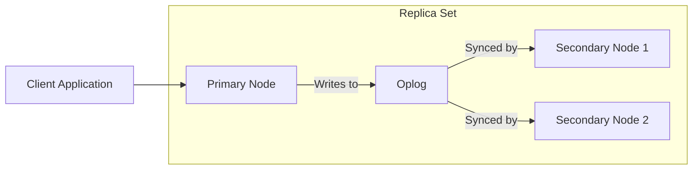

# MongoDB Oplog

## Introduction

The MongoDB Oplog (Operations Log) is one of the most important components of MongoDB's replication mechanism. It's a special capped collection that records all operations that modify data in your MongoDB deployment. When you run MongoDB as a replica set, the primary node records all write operations in the oplog, and secondary nodes continuously copy and apply these operations to maintain data consistency across the replica set.

Understanding the oplog is essential for administrators and developers working with MongoDB replication, as it's the backbone that makes data synchronization possible across multiple nodes in a distributed MongoDB system.

## What is the Oplog?

The oplog (short for "Operations Log") is:

- A **capped collection** - A collection with a fixed size that works like a circular buffer
- Located in the **local** database on each replica set member
- Named **oplog.rs**
- The mechanism that enables replication in MongoDB

When operations occur on the primary node that modify data (inserts, updates, deletes), these operations are recorded in the oplog. Secondary nodes then copy and replay these operations to stay in sync with the primary.



## Oplog Structure

Let's examine what an oplog entry looks like. Each document in the oplog collection represents an operation and has the following structure:

```javascript
{
  "ts" : Timestamp(1610000000, 1),     // Timestamp when the operation occurred
  "t" : NumberLong(1),                 // Term (used for election and replication)
  "h" : NumberLong("123456789"),       // Unique identifier for this operation
  "v" : 2,                             // Version of the oplog entry format
  "op" : "i",                          // Operation type: i=insert, u=update, d=delete, c=command, n=no-op
  "ns" : "mydb.mycollection",          // Namespace (database.collection)
  "o" : { ... },                       // Document being inserted/updated or the query for delete
  "o2" : { ... }                       // For updates: the query to select documents to update
}
```

The most common operation types you'll encounter in the oplog are:
- **i**: Insert operation
- **u**: Update operation
- **d**: Delete operation
- **c**: Command operation (like create collection, drop index)
- **n**: No-op (does nothing, often used for internal purposes)

## Examining the Oplog

To connect to your MongoDB's oplog and examine its contents, you can use the MongoDB shell:

```javascript
// Connect to the local database which contains the oplog
use local

// Check the oplog.rs collection size and other details
db.oplog.rs.stats()

// View the most recent operations in the oplog
db.oplog.rs.find().sort({$natural: -1}).limit(5).pretty()
```

Example output:

```javascript
// Example output from db.oplog.rs.stats()
{
  "capped": true,
  "size": 3753410560,  // ~3.5GB size
  "storageSize": 3753410560,
  "totalSize": 3753410560,
  "max": NumberLong("9223372036854775807"),
  "ok": 1
}

// Example output from oplog query
{
  "ts": Timestamp(1644851005, 1),
  "t": NumberLong(3),
  "h": NumberLong("6704921418682442802"),
  "v": 2,
  "op": "i",
  "ns": "inventory.products",
  "o": {
    "_id": ObjectId("620a2c6d4f9e7a9b1c3d5e7f"),
    "name": "Smartphone",
    "price": 599.99,
    "stock": 120
  }
}
```

## Oplog Sizing

One of the most critical aspects of the MongoDB oplog is its size. By default, MongoDB allocates:
- Approximately 5% of available disk space for the oplog on Linux and Windows
- Approximately 1GB on 64-bit macOS

You can check the current oplog size using:

```javascript
// Get oplog info including size and time range
db.printReplicationInfo()
```

Example output:

```
configured oplog size:   3557.05MB
log length start to end: 6403secs (1.78hrs)
oplog first event time:  Tue Feb 15 2022 10:30:02 GMT+0000
oplog last event time:   Tue Feb 15 2022 12:18:05 GMT+0000
now:                     Tue Feb 15 2022 12:20:15 GMT+0000
```

### Why Oplog Size Matters

The oplog size directly impacts:

1. **Replication Window**: How far back in time a secondary can resync from
2. **Resilience**: Ability to recover after temporary network issues
3. **Maintenance**: Time available for taking nodes offline for maintenance

If the oplog is too small, operations might be overwritten before secondaries can replicate them, requiring a full resync (which is expensive and time-consuming).

## Configuring Oplog Size

You can configure the oplog size when initiating a replica set or by resizing an existing oplog.

### Setting Oplog Size on Replica Set Initialization

When starting a MongoDB instance that will be part of a replica set:

```bash
mongod --replSet myReplicaSet --oplogSize 8192 # Size in MB
```

### Resizing an Existing Oplog

Resizing an existing oplog requires careful steps:

```javascript
// Check current oplog size
use local
db.oplog.rs.stats().maxSize

// Resize oplog (must be executed on each member separately)
// 1. Stop the secondary
// 2. Restart in standalone mode
// 3. Connect and run:
use local
db.adminCommand({replSetResizeOplog: 1, size: 16384}) // 16GB

// 4. Restart as replica set member
```

## Oplog Maintenance and Monitoring

Regular monitoring of your oplog is essential for a healthy replica set:

### Checking Oplog Status

```javascript
// Check how much of the oplog is used
db.printReplicationInfo()

// For more detailed information
db.serverStatus().oplogTruncation
```

### Important Metrics to Monitor

1. **Oplog Window Length**: The time span covered by the oplog
2. **Replication Lag**: How far behind secondaries are from the primary
3. **Oplog Operations Mix**: Types of operations in your oplog

A common monitoring pattern is to alert if the oplog window drops below a certain threshold (e.g., 24 hours).

## Real-World Applications

### Use Case 1: Disaster Recovery Planning

```javascript
// Calculate average operations per second
let stats = db.oplog.rs.stats();
let oplogSizeBytes = stats.maxSize;
let oplogUsedBytes = stats.size;
let firstOplogEntry = db.oplog.rs.find().sort({$natural: 1}).limit(1).next().ts;
let lastOplogEntry = db.oplog.rs.find().sort({$natural: -1}).limit(1).next().ts;
let oplogTimeSpanSeconds = (lastOplogEntry.getTime() - firstOplogEntry.getTime()) / 1000;

// If you have the following operations in the oplog:
let totalOps = db.oplog.rs.count(); 

// Average ops per second
let opsPerSecond = totalOps / oplogTimeSpanSeconds;
print(`Average operations per second: ${opsPerSecond}`);
print(`Estimated oplog capacity in hours: ${oplogTimeSpanSeconds / 3600}`);
```

This information helps you plan:
- How much downtime your secondaries can handle
- When to schedule maintenance
- What size your oplog should be

### Use Case 2: Custom Tailing for Change Data Capture (CDC)

You can create a script that "tails" the oplog to capture data changes for external systems:

```javascript
// Store last processed timestamp
let lastTs = Timestamp(0, 0);

// Function to process new oplog entries
function tailOplog() {
    let cursor = db.oplog.rs.find({ts: {$gt: lastTs}}).sort({$natural: 1}).addOption(DBQuery.Option.tailable);
    
    while (cursor.hasNext()) {
        let doc = cursor.next();
        lastTs = doc.ts;
        
        // Process operations (inserts, updates, deletes)
        if (doc.op === 'i' && doc.ns === 'mydb.customers') {
            print(`New customer added: ${JSON.stringify(doc.o)}`);
            // Here you could send to another system
        }
    }
}

// Call this function in a loop to continuously process oplog
```

This pattern is the foundation for MongoDB change streams and many ETL processes.

### Use Case 3: Investigating Data Modifications

During incident response, the oplog can help you trace what happened to your data:

```javascript
// Find recent operations on a specific collection
db.oplog.rs.find(
    {
        ns: "mydb.important_collection",
        ts: {
            $gt: Timestamp(Math.floor(new Date('2023-03-01').getTime()/1000), 0),
            $lt: Timestamp(Math.floor(new Date('2023-03-02').getTime()/1000), 0)
        }
    }
).sort({ts: 1})
```

This allows you to see all operations performed on a collection during a specific timeframe.

## Common Issues and Troubleshooting

### Issue 1: Secondary Falls Too Far Behind

If a secondary node stops replicating with the error "oplog query failed: timestamp is outside oplog bounds", it means the oplog entries it needs were already overwritten.

**Solution:**
1. Increase oplog size to prevent future occurrences
2. Perform a full resync of the secondary:

```javascript
// On the secondary that's falling behind
rs.syncFrom("primary_hostname:port")

// If that doesn't work, you may need to resync from scratch
rs.remove("problem_secondary_hostname:port")
// Then add it back
rs.add("problem_secondary_hostname:port")
```

### Issue 2: Slow Oplog Apply Rate

If secondaries are consistently falling behind:

```javascript
// Check replication status
rs.printSecondaryReplicationInfo()

// Sample output:
// source: secondary1.example.com:27017
// syncedTo: Mon Feb 14 2022 12:10:11 GMT+0000 (1 mins ago)
// 0 secs (0 hrs) behind the primary
```

**Potential Solutions:**
1. Increase resources on secondary nodes
2. Check for slow operations (using db.currentOp())
3. Optimize indexes on secondary nodes
4. Consider changing read preferences to distribute read load

## Summary

The MongoDB oplog is a fundamental component that enables replication in MongoDB. It's a capped collection that records all write operations on the primary node, which secondary nodes then copy and apply to stay in sync. Key points to remember:

- The oplog is a capped collection in the local database named oplog.rs
- Its size is critical for determining how long secondaries can be offline
- Operations are recorded in CRUD format (insert, update, delete, etc.)
- Monitoring the oplog window is essential for system health

Understanding and properly configuring the oplog is crucial for maintaining a healthy MongoDB replica set, ensuring data consistency, and planning for maintenance and disaster recovery.

## Additional Resources

- **MongoDB Documentation**: [MongoDB Oplog](https://docs.mongodb.com/manual/core/replica-set-oplog/)
- **MongoDB University**: [M103: Basic Cluster Administration](https://university.mongodb.com/courses/M103/about)

## Exercises

1. Connect to your MongoDB replica set and check the current oplog size and time window.
2. Write a script that monitors oplog usage and alerts if the window drops below 24 hours.
3. Create a simple program that tails the oplog and logs all insert operations to a specific collection.
4. Calculate the average write operations per second in your MongoDB deployment using oplog data.
5. Practice resizing the oplog in a test environment and observe how it affects the replication window.