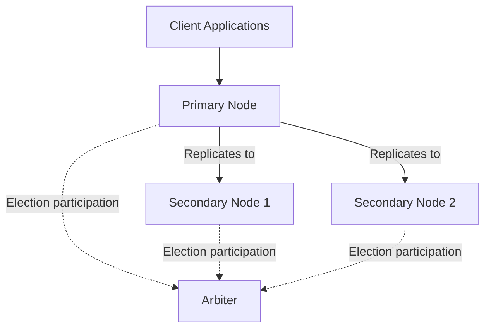

# MongoDB Replica Set Configuration

## Introduction

MongoDB's replica sets are a crucial feature for ensuring data redundancy, high availability, and automatic failover capabilities in production environments. A replica set is a group of MongoDB instances that maintain the same data set, providing redundancy and increasing data availability.

In this guide, you'll learn how to configure and maintain MongoDB replica sets, which are essential for building resilient applications that can withstand server failures without data loss or significant downtime.

## Understanding Replica Sets

A MongoDB replica set consists of:

- **Primary Node**: The only node that accepts write operations from clients
- **Secondary Nodes**: Nodes that replicate data from the primary
- **Optional Arbiter**: A node that participates in elections but doesn't hold data



## Prerequisites for Replica Set Configuration

Before setting up a replica set, ensure you have:

1. MongoDB server installed on all nodes (version 4.0 or higher recommended)
2. Network connectivity between all nodes
3. Proper firewall settings to allow MongoDB communication (default port is 27017)
4. Sufficient disk space on each node

## Setting Up a Basic Replica Set

Let's set up a basic three-node replica set on a local machine for learning purposes.

### Step 1: Create Data Directories

First, create directories for each MongoDB instance:

```bash
mkdir -p /data/rs0-0 /data/rs0-1 /data/rs0-2
```

### Step 2: Start MongoDB Instances

Start three separate MongoDB instances with the following commands (run each in a separate terminal):

```bash
# First instance on port 27017
mongod --replSet rs0 --port 27017 --dbpath /data/rs0-0 --bind_ip localhost

# Second instance on port 27018
mongod --replSet rs0 --port 27018 --dbpath /data/rs0-1 --bind_ip localhost

# Third instance on port 27019
mongod --replSet rs0 --port 27019 --dbpath /data/rs0-2 --bind_ip localhost
```

Key parameters explained:
- `--replSet rs0`: Names the replica set "rs0"
- `--port`: Specifies the port number for each instance
- `--dbpath`: Defines the data directory for each instance
- `--bind_ip`: Specifies which IP addresses MongoDB should bind to

### Step 3: Initialize the Replica Set

Connect to one of the MongoDB instances (which will become the primary) using the MongoDB shell:

```bash
mongosh --port 27017
```

In the MongoDB shell, initialize the replica set with a configuration:

```javascript
rs.initiate({
  _id: "rs0",
  members: [
    { _id: 0, host: "localhost:27017" },
    { _id: 1, host: "localhost:27018" },
    { _id: 2, host: "localhost:27019" }
  ]
})
```

Example output:

```javascript
{
  "ok" : 1,
  "$clusterTime" : {
    "clusterTime" : Timestamp(1587742038, 1),
    "signature" : {
      "hash" : BinData(0,"AAAAAAAAAAAAAAAAAAAAAAAAAAA="),
      "keyId" : NumberLong(0)
    }
  },
  "operationTime" : Timestamp(1587742038, 1)
}
```

### Step 4: Verify the Replica Set Status

Check the status of your replica set:

```javascript
rs.status()
```

This will output detailed information about your replica set, including which node is primary and which are secondary nodes.

## Advanced Replica Set Configuration

### Adding and Removing Members

#### Adding a New Member

To add a new member to an existing replica set:

1. Start the new MongoDB instance:

```bash
mongod --replSet rs0 --port 27020 --dbpath /data/rs0-3 --bind_ip localhost
```

2. Connect to the primary node and add the new member:

```javascript
rs.add("localhost:27020")
```

#### Removing a Member

To remove a member from the replica set:

```javascript
rs.remove("localhost:27019")
```

### Configuring a Member as an Arbiter

If you want to add an arbiter (a lightweight member that participates in elections but doesn't store data):

```javascript
rs.addArb("localhost:27021")
```

### Priority and Voting Configuration

You can customize the priority and voting rights of replica set members to influence election outcomes:

```javascript
cfg = rs.conf()
cfg.members[1].priority = 0.5  // Lower priority for the second member
cfg.members[2].priority = 2    // Higher priority for the third member
rs.reconfig(cfg)
```

A member with priority 0 cannot become primary:

```javascript
cfg = rs.conf()
cfg.members[1].priority = 0  // This node will never become primary
rs.reconfig(cfg)
```

## Replica Set Options and Parameters

### Replica Set Oplog Configuration

The oplog (operations log) is a special capped collection that keeps a rolling record of all operations that modify the data stored in your databases:

```javascript
// Check the current oplog size
db.adminCommand({replSetGetStatus: 1}).optimes

// Start MongoDB with a custom oplog size (in MB)
// mongod --replSet rs0 --oplogSize 2048 --dbpath /data/rs0-0
```

### Read Preference Configuration

In your application, you can configure read preferences to control how client requests are routed to replica set members:

```javascript
// Node.js example with MongoDB driver
const client = new MongoClient("mongodb://localhost:27017,localhost:27018,localhost:27019/test?replicaSet=rs0");
await client.connect();

// Read from primary only (default)
const primaryCollection = client.db("test").collection("data", {
  readPreference: "primary"
});

// Read from secondary if available, otherwise primary
const secondaryPreferredCollection = client.db("test").collection("data", {
  readPreference: "secondaryPreferred"
});
```

### Write Concern Configuration

Write concern determines the level of acknowledgment requested from MongoDB for write operations:

```javascript
// Node.js example with different write concerns
const result = await collection.insertOne(
  { name: "MongoDB Replica Sets", category: "Database" },
  { writeConcern: { w: "majority", wtimeout: 5000 } }
);

// w: "majority" - Write must be acknowledged by a majority of replica set members
// wtimeout: 5000 - Operation times out if it takes longer than 5000ms
```

## Real-World Scenario: High Availability Deployment

Let's configure a production-ready replica set across multiple servers:

```javascript
rs.initiate({
  _id: "prodReplica",
  members: [
    { 
      _id: 0, 
      host: "mongodb-prod-01.example.com:27017",
      priority: 2 // Preferred primary
    },
    { 
      _id: 1, 
      host: "mongodb-prod-02.example.com:27017",
      priority: 1
    },
    { 
      _id: 2, 
      host: "mongodb-backup.example.com:27017",
      priority: 0,  // Never becomes primary
      hidden: true, // Hidden from applications
      slaveDelay: 3600 // 1 hour delayed replica for backup
    }
  ]
})
```

This configuration:
- Designates the first server as the preferred primary
- Sets up a standard secondary
- Creates a delayed, hidden node that keeps a 1-hour delayed copy of data (useful for recovering from accidental data deletion)

## Monitoring and Maintenance

### Checking Replica Set Status

Regularly check the health of your replica set:

```javascript
rs.status()  // General status
rs.conf()    // Configuration details
rs.printSecondaryReplicationInfo()  // Replication lag information
```

### Performing Maintenance on a Secondary Node

To perform maintenance on a secondary node without affecting the replica set:

```javascript
// Step 1: Connect to the secondary node you want to maintain
// Step 2: Step down the node from replica set temporarily
rs.stepDown()

// Step 3: Perform maintenance
// Step 4: Restart the node to rejoin the replica set
```

## Troubleshooting Common Issues

### Dealing with Replication Lag

If secondaries are falling behind the primary:

```javascript
// Check replication lag
rs.printSecondaryReplicationInfo()

// If lag is high, check:
// 1. Network connectivity between nodes
// 2. Secondary server load (CPU, disk I/O)
// 3. Primary server write load
```

### Handling Network Partitions

If network partitions occur, you might need to manually reconfigure the replica set:

```javascript
// Force reconfiguration (use with caution)
rs.reconfig(rs.conf(), {force: true})
```

## Summary

MongoDB replica sets provide a robust solution for ensuring data redundancy and high availability in your database system. By configuring replica sets properly, you can:

- Protect against data loss due to server failures
- Ensure continuous application availability
- Scale read operations across secondary nodes
- Implement disaster recovery strategies

Remember these key points:
- A replica set consists of a primary node and one or more secondary nodes
- Data is automatically synchronized from the primary to secondaries
- Automatic failover occurs when the primary becomes unavailable
- Configure your replica set based on your specific availability and performance needs

## Practice Exercises

1. Set up a local three-node replica set and practice inserting data to verify replication.
2. Simulate a primary failure by shutting down the primary node and observe the automatic failover process.
3. Configure a hidden, delayed secondary and test its use case for recovering accidentally deleted data.
4. Experiment with different read preferences and write concerns to understand their impact on performance and reliability.

## Additional Resources

- [MongoDB Replica Set Documentation](https://www.mongodb.com/docs/manual/replication/)
- [Replica Set Deployment Architectures](https://www.mongodb.com/docs/manual/core/replica-set-architectures/)
- [MongoDB University: M103 Basic Cluster Administration](https://learn.mongodb.com/courses/m103-basic-cluster-administration)

Mastering MongoDB replica sets is essential for any production MongoDB deployment. The configurations and techniques covered in this guide will help you implement a robust, highly available database system for your applications.