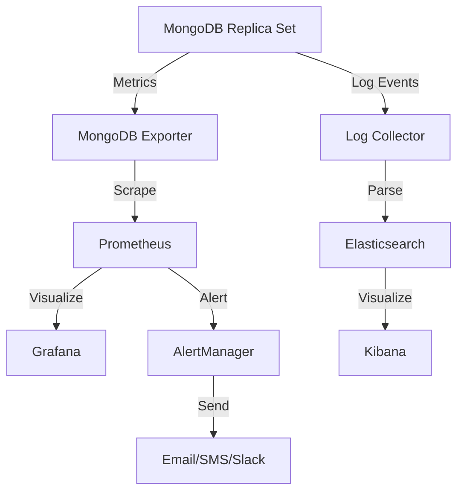

# MongoDB Replica Set Monitoring

Monitoring is a critical aspect of maintaining healthy MongoDB replica sets. Whether you're managing a small development cluster or a large production deployment, proper monitoring ensures your replica set operates efficiently and alerts you to potential issues before they become critical.

## Introduction to Replica Set Monitoring

A MongoDB replica set provides redundancy and high availability for your database. However, to maintain these benefits, you need to monitor the health and performance of your replica set consistently.

Monitoring allows you to:

- Detect and respond to failures promptly
- Ensure optimal data replication
- Identify performance bottlenecks
- Plan for capacity requirements
- Verify that your replication strategy meets your application needs

## Key Metrics to Monitor

### Replication Lag

Replication lag measures the delay between operations executed on the primary and their replication to secondary members. High replication lag can lead to stale reads and potential data loss during failover.

```javascript
// Check replication status
db.printReplicationInfo()

// Example output:
// configured oplog size:   990MB
// log length start to end: 125MB (0.13hrs)
// oplog first event time:  Wed Apr 12 2023 15:30:21 GMT+0000 (UTC)
// oplog last event time:   Wed Apr 12 2023 16:45:31 GMT+0000 (UTC)
// now:                     Wed Apr 12 2023 16:48:12 GMT+0000 (UTC)
```

To check the replication lag for all members in your replica set:

```javascript
// Get replication status across the replica set
rs.status().members.forEach(function(member) {
  print("Host: " + member.name);
  print("State: " + member.stateStr);
  if(member.stateStr !== "PRIMARY") {
    print("Replication lag: " + Math.round((member.optimeDate - rs.status().members.find(m => m.stateStr === "PRIMARY").optimeDate)/1000) + " seconds");
  }
  print("------------------------");
});
```

### Oplog Size and Window

The oplog (operations log) is a capped collection that stores all operations that modify the data in your MongoDB deployment. Monitoring its size and time window helps ensure secondaries can catch up after network issues or maintenance.

```javascript
// Check oplog status
db.printReplicationInfo()
```

### Replication Health

Regularly check the overall health of your replica set:

```javascript
// Replica set status
rs.status()

// Replica set configuration
rs.conf()
```

### Connection Counts

Monitor the number of connections to each member:

```javascript
// Check current connections
db.serverStatus().connections

// Example output:
// {
//   "current": 151,
//   "available": 51049,
//   "totalCreated": 1024,
//   "active": 33
// }
```

## Tools for Monitoring MongoDB Replica Sets

### MongoDB's Built-in Tools

#### MongoDB Shell Commands

MongoDB provides several built-in commands for monitoring:

```javascript
// Most comprehensive status check
rs.status()

// Check replication configuration
rs.conf()

// Check stepdown status
rs.stepDown()

// Check if the current node is primary
db.isMaster()
```

#### MongoDB Compass

MongoDB Compass provides a graphical interface for monitoring replica sets. It visualizes your replica set topology and key metrics.

### MongoDB Cloud Manager / Ops Manager

For larger deployments, MongoDB Cloud Manager (cloud-hosted) or MongoDB Ops Manager (self-hosted) offer comprehensive monitoring solutions:

- Real-time monitoring dashboards
- Historical metric storage 
- Custom alerts
- Automated deployments and upgrades
- Backup management

### Prometheus and Grafana

A popular open-source monitoring stack:

1. Install the MongoDB Prometheus exporter:

```bash
# Download and run the MongoDB exporter
docker run -d --name mongodb_exporter \
  -p 9216:9216 \
  -e MONGODB_URI=mongodb://mongodb-primary:27017,mongodb-secondary1:27017,mongodb-secondary2:27017/?replicaSet=rs0 \
  percona/mongodb_exporter
```

2. Configure Prometheus to scrape metrics from the exporter:

```yaml
# Example prometheus.yml configuration
scrape_configs:
  - job_name: 'mongodb'
    static_configs:
      - targets: ['mongodb_exporter:9216']
```

3. Create Grafana dashboards to visualize the metrics.

## Setting Up Alerts

Alerting is crucial for proactive monitoring. Set up alerts for:

1. **Replica Set State Changes**: When a primary steps down or a new primary is elected.
2. **Replication Lag**: When lag exceeds a certain threshold (e.g., 60 seconds).
3. **Oplog Window**: When the oplog window falls below your recovery time objective.
4. **Node Health**: When a node becomes unreachable or unresponsive.

Here's an example of a simple monitoring script that sends alerts via email when replication lag exceeds a threshold:

```javascript
// monitoring-script.js
const MAX_ACCEPTABLE_LAG_SECONDS = 60;
const EMAIL_TO = "dba@example.com";

// Connect to MongoDB
const conn = new Mongo("mongodb://mongodb-primary:27017,mongodb-secondary1:27017,mongodb-secondary2:27017/?replicaSet=rs0");
const db = conn.getDB("admin");

// Get replica set status
const rsStatus = db.runCommand({ replSetGetStatus: 1 });
const primary = rsStatus.members.find(m => m.stateStr === "PRIMARY");

if (!primary) {
  sendAlert("No primary found in replica set!");
  quit(1);
}

// Check lag for each secondary
rsStatus.members
  .filter(m => m.stateStr === "SECONDARY")
  .forEach(secondary => {
    const lagMs = Math.abs(secondary.optimeDate.getTime() - primary.optimeDate.getTime());
    const lagSeconds = Math.round(lagMs / 1000);
    
    if (lagSeconds > MAX_ACCEPTABLE_LAG_SECONDS) {
      sendAlert(`High replication lag detected on ${secondary.name}: ${lagSeconds} seconds`);
    }
  });

function sendAlert(message) {
  // This is a placeholder - in a real environment, you'd implement
  // an actual email sending function or integration with an alerting system
  print(`ALERT: ${message} - would send to ${EMAIL_TO}`);
}
```

Run this script regularly as a cron job:

```bash
# Run monitoring script every 5 minutes
*/5 * * * * mongo --quiet /path/to/monitoring-script.js >> /var/log/mongodb-monitoring.log 2>&1
```

## Best Practices for Replica Set Monitoring

1. **Monitor All Replica Set Members**: Don't just monitor the primary.

2. **Set Appropriate Thresholds**: Base alert thresholds on your application requirements.

3. **Implement Escalation Procedures**: Define who gets alerted and when.

4. **Keep Historical Data**: Store monitoring data to analyze trends and plan capacity.

5. **Regular Health Checks**: Automatically test your replica set's failover capabilities.

6. **Document Your Monitoring Strategy**: Keep a record of what you're monitoring and why.

## Real-world Example: E-commerce Database Monitoring

Let's consider an e-commerce application with a MongoDB replica set handling order processing.

### Scenario

- 3-node replica set (1 primary, 2 secondaries)
- One secondary is in a different data center for disaster recovery
- Peak traffic during business hours
- Zero data loss requirement for orders

### Monitoring Solution



#### Key Metrics to Monitor

1. **Replication Lag**: Alert if lag exceeds 30 seconds
2. **Oplog Window**: Must maintain at least 24 hours
3. **Write Concern Timeouts**: Indicate potential issues with replication
4. **Connection Pool Saturation**: Alert at 80% utilization
5. **Secondary Read Distribution**: Ensure even load across secondaries

#### Alerting Rules

```yaml
# Example Prometheus alerting rules
groups:
- name: mongodb_replication
  rules:
  - alert: ReplicationLagHigh
    expr: mongodb_mongod_replset_member_replication_lag > 30
    for: 5m
    labels:
      severity: critical
    annotations:
      summary: "MongoDB replication lag high"
      description: "MongoDB replication lag on {{ $labels.instance }} is {{ $value }}s"
  
  - alert: SecondaryDown
    expr: mongodb_mongod_replset_member_state{state="SECONDARY"} == 0
    for: 5m
    labels:
      severity: critical
    annotations:
      summary: "MongoDB secondary down"
      description: "MongoDB secondary {{ $labels.instance }} is down"
```

## Troubleshooting Common Issues

### High Replication Lag

If you encounter high replication lag:

1. Check network connectivity between nodes
2. Look for resource bottlenecks (CPU, memory, disk I/O)
3. Review oplog size and increase if necessary
4. Check for long-running operations blocking replication

```javascript
// Check current operations
db.currentOp({ "secs_running": { $gt: 5 } })

// Increase oplog size (if needed)
// First, check current size
use local
db.oplog.rs.stats().maxSize

// Then, resize oplog (example: increase to 8GB)
db.adminCommand({ replSetResizeOplog: 1, size: 8192 })
```

### Failed Member Synchronization

If a secondary can't sync:

1. Check if it's within the oplog window
2. Consider performing an initial sync if outside the oplog window

```javascript
// Force resync of a secondary
// First, shut down the mongod process
// Then restart with --resync option
// Note: This is deprecated in newer versions
// Instead, remove the data and let it resync:

// 1. Remove the member from the replica set
rs.remove("secondary-hostname:27017")

// 2. Delete the data files on the secondary

// 3. Add the member back
rs.add("secondary-hostname:27017")
```

## Summary

Effective monitoring of MongoDB replica sets is essential for maintaining high availability and performance. By tracking key metrics like replication lag, oplog utilization, and overall replica set health, you can ensure your MongoDB deployment operates smoothly and recover quickly from any issues that arise.

Remember these key points:
- Monitor all members of your replica set, not just the primary
- Set up alerts for critical conditions like excessive replication lag
- Regularly check your oplog size to ensure it meets your recovery needs
- Use a combination of MongoDB's built-in tools and external monitoring solutions
- Document your monitoring strategy and review it regularly

## Additional Resources

- [MongoDB Documentation on Replica Set Monitoring](https://www.mongodb.com/docs/manual/tutorial/monitor-replica-set/)
- [MongoDB University Course: M103 Basic Cluster Administration](https://university.mongodb.com/courses/M103/about)
- [Percona MongoDB Monitoring Tools](https://www.percona.com/software/database-tools/percona-monitoring-and-management)

## Exercises

1. Set up a 3-node MongoDB replica set on your local machine and use `rs.status()` to verify the health of each node.
2. Write a script that checks replication lag and logs a warning if it exceeds 10 seconds.
3. Create a Grafana dashboard that displays key replica set metrics from the MongoDB exporter.
4. Simulate a primary failure and monitor how the election process works.
5. Calculate the appropriate oplog size for your environment based on your write volume and desired recovery window.