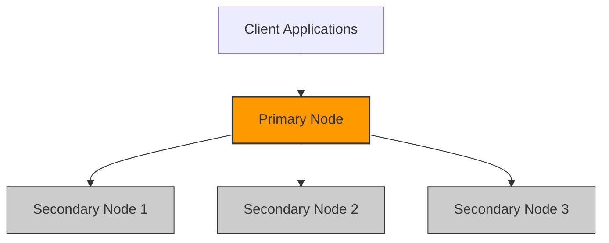

# MongoDB Primary Node

## Introduction

In MongoDB's replication architecture, the **primary node** plays a critical role as the main point of interaction for all write operations in a replica set. A replica set is a group of MongoDB instances that maintain the same data set, providing redundancy and high availability. Understanding how the primary node functions is essential for working with MongoDB's distributed data model effectively.

In this tutorial, we'll explore what the primary node is, how it's elected, its responsibilities, and how it interacts with other nodes in a replica set.

## What is a MongoDB Primary Node?

The primary node is the only member of a replica set that can accept write operations. In a healthy replica set, there is always one and only one primary node active at any given time. This design ensures data consistency across the replica set.



## Primary Node Responsibilities

The primary node has several key responsibilities:

1. **Processing Write Operations**: All write operations (inserts, updates, deletes) are directed to the primary node.
2. **Recording Operations**: All data modifications are recorded in the operation log (oplog).
3. **Replicating Data**: The primary propagates changes to all secondary nodes.
4. **Handling Read Operations**: While secondary nodes can also handle reads, by default, read operations are also directed to the primary.

## How a Primary Node is Elected

When a replica set is initiated or when the current primary becomes unavailable, the members of the replica set automatically conduct an election to choose a new primary. This election process follows these steps:

1. **Eligibility Check**: Nodes verify which members are eligible to become the primary.
2. **Voting Process**: Each eligible node gets one vote (unless configured differently).
3. **Majority Required**: A candidate must receive votes from a majority of voting members.
4. **Highest Priority Wins**: If multiple nodes are eligible, the one with the highest priority setting is chosen.

Let's see how to check which node is currently the primary in a replica set:

```javascript
// Connect to any node in the replica set
mongo "mongodb://localhost:27017,localhost:27018,localhost:27019/admin"

// Check the replica set status
rs.status()
```

Example output:

```json
{
  "set" : "myReplicaSet",
  "date" : ISODate("2023-06-15T10:15:30Z"),
  "myState" : 1,
  "members" : [
    {
      "_id" : 0,
      "name" : "localhost:27017",
      "health" : 1,
      "state" : 1,
      "stateStr" : "PRIMARY",
      "uptime" : 12345,
      "optime" : {
        "ts" : Timestamp(1623746130, 1),
        "t" : NumberLong(2)
      },
      "optimeDate" : ISODate("2023-06-15T10:15:30Z"),
      "electionTime" : Timestamp(1623742530, 1),
      "electionDate" : ISODate("2023-06-15T09:15:30Z"),
      "self" : true
    },
    {
      "_id" : 1,
      "name" : "localhost:27018",
      "health" : 1,
      "state" : 2,
      "stateStr" : "SECONDARY",
      "uptime" : 12300,
      "optime" : {
        "ts" : Timestamp(1623746130, 1),
        "t" : NumberLong(2)
      },
      "optimeDate" : ISODate("2023-06-15T10:15:30Z"),
      "lastHeartbeat" : ISODate("2023-06-15T10:15:29Z"),
      "lastHeartbeatRecv" : ISODate("2023-06-15T10:15:28Z"),
      "pingMs" : NumberLong(0)
    },
    {
      "_id" : 2,
      "name" : "localhost:27019",
      "health" : 1,
      "state" : 2,
      "stateStr" : "SECONDARY",
      "uptime" : 12290,
      "optime" : {
        "ts" : Timestamp(1623746130, 1),
        "t" : NumberLong(2)
      },
      "optimeDate" : ISODate("2023-06-15T10:15:30Z"),
      "lastHeartbeat" : ISODate("2023-06-15T10:15:29Z"),
      "lastHeartbeatRecv" : ISODate("2023-06-15T10:15:28Z"),
      "pingMs" : NumberLong(0)
    }
  ],
  "ok" : 1
}
```

In the output above, you can identify the primary node by looking for the member with `"state": 1` and `"stateStr": "PRIMARY"`.

## Setting Up a Replica Set with a Primary Node

Let's walk through a practical example of setting up a basic replica set with one primary and two secondary nodes:

### Step 1: Create Data Directories

```bash
mkdir -p /data/db/rs0-0 /data/db/rs0-1 /data/db/rs0-2
```

### Step 2: Start MongoDB Instances

Start three MongoDB instances on different ports:

```bash
mongod --replSet rs0 --port 27017 --dbpath /data/db/rs0-0
mongod --replSet rs0 --port 27018 --dbpath /data/db/rs0-1
mongod --replSet rs0 --port 27019 --dbpath /data/db/rs0-2
```

### Step 3: Connect to One Instance and Initiate the Replica Set

```javascript
mongo --port 27017

// Define the replica set configuration
config = {
  _id: "rs0",
  members: [
    { _id: 0, host: "localhost:27017" },
    { _id: 1, host: "localhost:27018" },
    { _id: 2, host: "localhost:27019" }
  ]
}

// Initiate the replica set
rs.initiate(config)
```

### Step 4: Verify the Replica Set Status

```javascript
rs.status()
```

After a brief moment, one of the nodes will be elected as the primary, and you'll see its status as "PRIMARY" in the output.

## Working with the Primary Node

### Writing Data

All write operations must go through the primary node:

```javascript
// Insert a document
db.products.insertOne({ name: "Laptop", price: 999.99 })

// Update a document
db.products.updateOne({ name: "Laptop" }, { $set: { stock: 50 } })

// Delete a document
db.products.deleteOne({ name: "Laptop" })
```

### Checking Which Node You're Connected To

When you connect to a replica set, you can check if you're connected to the primary with:

```javascript
db.isMaster()
```

Example output:

```json
{
  "hosts" : [
    "localhost:27017",
    "localhost:27018",
    "localhost:27019"
  ],
  "setName" : "rs0",
  "setVersion" : 1,
  "ismaster" : true,
  "secondary" : false,
  "primary" : "localhost:27017",
  "me" : "localhost:27017",
  "electionId" : ObjectId("7fffffff000000000000001"),
  "lastWrite" : {
    "opTime" : {
      "ts" : Timestamp(1623746130, 1),
      "t" : NumberLong(1)
    },
    "lastWriteDate" : ISODate("2023-06-15T10:15:30Z")
  },
  "maxBsonObjectSize" : 16777216,
  "maxMessageSizeBytes" : 48000000,
  "maxWriteBatchSize" : 100000,
  "localTime" : ISODate("2023-06-15T10:15:35Z"),
  "logicalSessionTimeoutMinutes" : 30,
  "connectionId" : 1,
  "minWireVersion" : 0,
  "maxWireVersion" : 9,
  "readOnly" : false,
  "ok" : 1
}
```

## Primary Node Failover

One of the key advantages of a replica set is automatic failover. If the primary node becomes unavailable (due to a crash, network partition, or maintenance), the replica set automatically elects a new primary from the eligible secondary nodes.

### What Happens During Failover:

1. Secondary nodes detect that the primary is unreachable
2. An election process begins
3. A new primary is elected
4. The new primary begins accepting write operations
5. The old primary, when it comes back online, will join the replica set as a secondary

Let's simulate a failover by shutting down the current primary:

```javascript
// On the primary node
db.adminCommand({ shutdown: 1 })
```

After a few seconds, connect to one of the remaining nodes and check the replica set status:

```javascript
mongo --port 27018
rs.status()
```

You'll see that one of the secondary nodes has been promoted to primary.

## Monitoring the Primary Node

To ensure your replica set is functioning correctly, you should monitor the primary node. Here are some useful commands:

### Check Replication Status

```javascript
rs.printReplicationInfo()
```

Example output:

```
configured oplog size:   990MB
log length start to end: 80secs (0.02hrs)
oplog first event time:  Wed Jun 15 2023 10:14:10 GMT+0000 (UTC)
oplog last event time:   Wed Jun 15 2023 10:15:30 GMT+0000 (UTC)
now:                     Wed Jun 15 2023 10:15:40 GMT+0000 (UTC)
```

### Check Replication Lag

```javascript
rs.printSecondaryReplicationInfo()
```

Example output:

```
source: localhost:27018
    syncedTo: Wed Jun 15 2023 10:15:30 GMT+0000 (UTC)
    0 secs (0 hrs) behind the primary
source: localhost:27019
    syncedTo: Wed Jun 15 2023 10:15:30 GMT+0000 (UTC)
    0 secs (0 hrs) behind the primary
```

## Best Practices for Primary Node Management

1. **Deploy an Odd Number of Nodes**: Always configure replica sets with an odd number of members to ensure clean elections.

2. **Distribute Nodes Geographically**: Place nodes in different data centers to improve resilience.

3. **Monitor Replication Lag**: Keep an eye on how far behind secondaries are from the primary.

4. **Regular Backups**: Even with replication, maintain regular backups of your data.

5. **Periodic Testing**: Regularly test failover scenarios to ensure smooth operation during actual failures.

6. **Priority Settings**: Configure node priority based on hardware capabilities and network latency.

```javascript
// Example: Set node priority (higher numbers have higher priority)
cfg = rs.conf()
cfg.members[0].priority = 2  // Higher priority for first node
cfg.members[1].priority = 1  // Normal priority for second node
cfg.members[2].priority = 0.5 // Lower priority for third node
rs.reconfig(cfg)
```

## Real-World Use Case: E-Commerce Platform

Imagine an e-commerce platform handling thousands of transactions per minute. Using MongoDB replica sets with a properly configured primary node would provide:

1. **High Write Throughput**: The primary node efficiently processes all orders and inventory updates.
  
2. **Automatic Failover**: If the server hosting the primary node fails, a secondary automatically becomes primary within seconds, minimizing downtime.

3. **Data Protection**: All transactions are replicated to multiple secondary nodes, ensuring data isn't lost if one server fails.

4. **Read Scaling**: By configuring read preferences, product catalog browsing can be distributed across secondary nodes, while checkout processes go through the primary.

## Summary

The primary node in MongoDB replication serves as the central authority for all write operations in a replica set. It ensures data consistency by accepting all writes and replicating those changes to secondary nodes. Through automatic elections and failover mechanisms, MongoDB's replication system provides high availability and fault tolerance for your data.

Understanding how the primary node works is essential for properly designing, implementing, and managing MongoDB deployments, especially in production environments where reliability and data integrity are critical.

## Additional Resources

- [MongoDB Official Documentation on Replication](https://docs.mongodb.com/manual/replication/)
- [MongoDB University Course on Replication](https://university.mongodb.com/)
- [Monitoring Tools for MongoDB](https://docs.mongodb.com/manual/administration/monitoring/)

## Practice Exercises

1. Set up a local three-node replica set and practice initiating controlled failovers.
2. Write a script that detects which node is the primary and monitors how long it takes for a new primary to be elected after a failover.
3. Configure different priority values for nodes in your replica set and observe how this affects primary elections.
4. Implement a simple application that writes data to MongoDB and test its behavior during a primary node failover.
5. Set up replica set members across different subnets and measure the impact on replication lag and failover time.