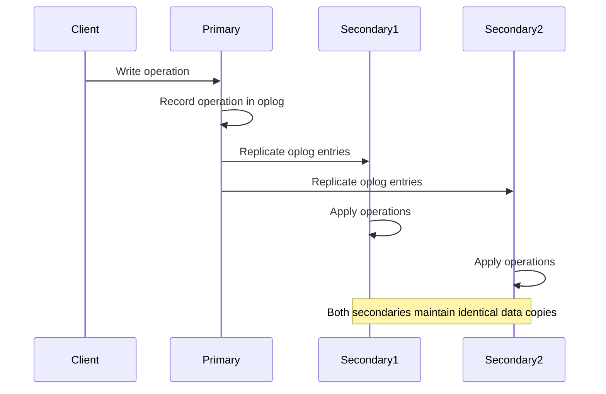

# MongoDB Secondary Nodes

## Introduction

In MongoDB's replication architecture, secondary nodes play a crucial role in maintaining data redundancy and ensuring high availability. When you implement replication in MongoDB, you create a replica set consisting of multiple MongoDB instances, with one primary node and one or more secondary nodes.

Secondary nodes maintain copies of the primary node's data set, providing redundancy that helps protect your database against data loss due to server failures. Understanding how secondary nodes work is essential for designing robust MongoDB deployments that can withstand hardware failures and provide reliable service to your applications.

## What are MongoDB Secondary Nodes?

Secondary nodes are MongoDB instances that replicate the data from the primary node in a replica set. They maintain an identical copy of the primary's data by continuously applying operations from the primary's oplog (operation log).

### Key Characteristics of Secondary Nodes

- **Read-only by default**: Secondary nodes don't accept write operations directly
- **Async replication**: They replicate data asynchronously from the primary
- **Election participation**: They can vote in elections to select a new primary
- **Failover capability**: They can become primary if the current primary becomes unavailable

## How Secondary Nodes Work

### Replication Process

The replication process between primary and secondary nodes follows these steps:



1. The primary node receives write operations from clients.
2. These operations are recorded in the primary's operation log (oplog).
3. Secondary nodes continuously poll the primary for new oplog entries.
4. Secondary nodes copy these entries to their own oplog.
5. Secondary nodes then apply these operations to their data set in the same order.

### Oplog (Operation Log)

The oplog is a capped collection that stores all operations that modify the data stored in your databases. Each operation in the oplog is idempotent, meaning it can be applied multiple times without changing the result beyond the initial application.

```javascript
// Example of oplog entry (viewed using db.oplog.rs.findOne())
{
  "ts" : Timestamp(1610000000, 1),
  "op" : "i",  // i for insert, u for update, d for delete
  "ns" : "mydb.users",
  "o" : {
    "_id" : ObjectId("507f1f77bcf86cd799439011"),
    "name" : "John Doe",
    "email" : "john@example.com"
  }
}
```

## Setting Up Secondary Nodes

### Basic Setup of a Replica Set with Secondary Nodes

To set up a replica set with secondary nodes, follow these steps:

1. Start MongoDB instances with the `--replSet` parameter:

```bash
mongod --replSet myReplicaSet --port 27017 --dbpath /data/db1
mongod --replSet myReplicaSet --port 27018 --dbpath /data/db2
mongod --replSet myReplicaSet --port 27019 --dbpath /data/db3
```

2. Connect to one instance and initialize the replica set:

```javascript
// Connect to the first instance
mongo --port 27017

// Initialize the replica set
rs.initiate({
  _id: "myReplicaSet",
  members: [
    { _id: 0, host: "localhost:27017" },
    { _id: 1, host: "localhost:27018" },
    { _id: 2, host: "localhost:27019" }
  ]
})
```

3. After initialization, check the status of your replica set:

```javascript
rs.status()
```

This will show one node as PRIMARY and others as SECONDARY.

## Working with Secondary Nodes

### Reading from Secondary Nodes

By default, MongoDB doesn't allow reads from secondary nodes to prevent applications from reading stale data. However, you can enable reads from secondaries when appropriate:

```javascript
// Connect to a secondary node
mongo --port 27018

// Enable reads on this connection
db.getMongo().setReadPref("secondary")

// Now you can query data
db.users.find()
```

You can also specify read preferences in your application code:

```javascript
// Node.js example using MongoDB driver
const MongoClient = require('mongodb').MongoClient;

MongoClient.connect('mongodb://localhost:27017,localhost:27018,localhost:27019/mydb?replicaSet=myReplicaSet', {
  readPreference: 'secondary'
}, function(err, client) {
  const db = client.db('mydb');
  
  db.collection('users').find({}).toArray(function(err, docs) {
    console.log(docs);
    client.close();
  });
});
```

### Read Preferences

MongoDB supports several read preference modes:

- `primary`: Read only from the primary node (default)
- `primaryPreferred`: Read from primary if available, otherwise from secondary
- `secondary`: Read only from secondary nodes
- `secondaryPreferred`: Read from secondary if available, otherwise from primary
- `nearest`: Read from the node with the lowest network latency

### Monitoring Replication Lag

Replication lag is the delay between operations executed on the primary and when those same operations are applied on the secondary nodes. You can check this using:

```javascript
rs.printSecondaryReplicationInfo()
```

Example output:

```
source: localhost:27018
    syncedTo: Wed Jan 01 2023 12:00:00 GMT+0000 (UTC)
    0 secs (0 hrs) behind the primary
source: localhost:27019
    syncedTo: Wed Jan 01 2023 11:59:50 GMT+0000 (UTC)
    10 secs (0 hrs) behind the primary
```

## Advanced Secondary Node Configurations

### Priority Configuration

You can configure the priority of secondary nodes to influence which node is most likely to become primary during an election:

```javascript
rs.reconfig({
  _id: "myReplicaSet",
  members: [
    { _id: 0, host: "localhost:27017", priority: 1 },
    { _id: 1, host: "localhost:27018", priority: 0.5 },
    { _id: 2, host: "localhost:27019", priority: 0.5 }
  ]
})
```

### Hidden Secondary Nodes

Hidden nodes are secondary members that cannot become primary and are invisible to client applications:

```javascript
rs.reconfig({
  _id: "myReplicaSet",
  members: [
    { _id: 0, host: "localhost:27017", priority: 1 },
    { _id: 1, host: "localhost:27018", priority: 1 },
    { _id: 2, host: "localhost:27019", priority: 0, hidden: true }
  ]
})
```

Hidden nodes are useful for dedicated backup or reporting purposes.

### Delayed Secondary Nodes

Delayed secondaries intentionally lag behind the primary by a specified amount of time, providing protection against human errors:

```javascript
rs.reconfig({
  _id: "myReplicaSet",
  members: [
    { _id: 0, host: "localhost:27017", priority: 1 },
    { _id: 1, host: "localhost:27018", priority: 1 },
    { _id: 2, host: "localhost:27019", priority: 0, hidden: true, slaveDelay: 3600 } // 1 hour delay
  ]
})
```

This creates a node that maintains a copy of data as it existed 1 hour ago, allowing you to recover from accidental data deletions.

## Real-World Examples

### Example 1: High Availability Web Application

Consider a web application serving millions of users. By implementing MongoDB replication with multiple secondary nodes spread across different data centers, you achieve:

1. **Geographic redundancy**: If one data center fails, others continue operating
2. **Load distribution**: Read operations can be distributed across secondary nodes
3. **Backup capabilities**: Secondary nodes can be used for backups without affecting the primary

```javascript
// Connection string in a production application
const uri = "mongodb://server1:27017,server2:27017,server3:27017/mydb?replicaSet=myReplicaSet";
```

### Example 2: Analytics with Hidden Secondary

An e-commerce platform can use a hidden secondary node specifically for running resource-intensive analytics queries:

```javascript
// Set up a hidden secondary for analytics
rs.reconfig({
  _id: "myReplicaSet",
  members: [
    { _id: 0, host: "db-primary:27017", priority: 2 },
    { _id: 1, host: "db-secondary:27017", priority: 1 },
    { _id: 2, host: "db-analytics:27017", priority: 0, hidden: true }
  ]
})

// Connect to the analytics node for running heavy queries
mongo db-analytics:27017
db.getMongo().setReadPref("secondary")
db.sales.aggregate([
  { $match: { date: { $gte: new Date("2023-01-01") } } },
  { $group: { _id: "$product", total: { $sum: "$amount" } } },
  { $sort: { total: -1 } }
])
```

## Troubleshooting Secondary Nodes

### Common Issues and Solutions

1. **Secondary falls too far behind**
   - Check network connectivity
   - Increase oplog size
   - Verify disk I/O isn't a bottleneck

2. **Secondary not syncing**
   ```javascript
   // Check replication status
   rs.status()
   
   // Look for errors in logs
   db.adminCommand({ getLog: "rs" })
   ```

3. **Secondary unexpectedly becomes primary**
   - Check network partitioning
   - Ensure proper priority configuration

### Resynchronizing a Secondary

If a secondary falls too far behind and can't catch up:

```javascript
// On the problem secondary, first stop it from the replica set
rs.stepDown()

// Then resync from scratch
db.runCommand({ resync: 1 })
```

For more serious issues, you might need to rebuild the secondary:

```bash
# Stop the mongod process
mongod --shutdown

# Delete the data files (be careful!)
rm -rf /data/db/*

# Restart the instance and it will perform initial sync
mongod --replSet myReplicaSet --port 27018 --dbpath /data/db
```

## Best Practices for Secondary Nodes

1. **Deploy an odd number of voting members**: This ensures proper election results
2. **Distribute nodes across failure domains**: Place secondaries in different data centers
3. **Monitor replication lag**: Set up alerts for excessive lag
4. **Consider read preference carefully**: Balance consistency and availability needs
5. **Regularly test failover scenarios**: Ensure your system works when a primary fails
6. **Configure appropriate oplog size**: Prevents secondaries from falling too far behind
7. **Back up different secondaries**: Rotate backup duties among secondaries

## Summary

MongoDB secondary nodes are essential components of a replica set that provide data redundancy, high availability, and read scalability. They maintain copies of the primary's data through asynchronous replication and can take over as primary if necessary.

By properly configuring and managing your secondary nodes, you can build MongoDB deployments that are resilient to failures, efficiently distribute read workloads, and provide specialized functionality like delayed copies for disaster recovery.

Secondary nodes support various configurations including hidden nodes for dedicated purposes, delayed secondaries for protection against data corruption, and priority settings to influence failover behavior.

## Additional Resources

- Try setting up a local replica set with different secondary configurations
- Experiment with reading from secondaries using different read preferences
- Practice simulating failover scenarios by stopping the primary node
- Create a monitoring dashboard for tracking replication lag

## Practice Exercises

1. Set up a three-node replica set on your development machine
2. Configure one secondary node as hidden with a 15-minute delay
3. Write a script that performs writes to the primary and reads from secondaries
4. Simulate network partition by blocking connections between nodes and observe behavior
5. Create a backup strategy that uses secondary nodes without affecting application performance

By mastering MongoDB secondary nodes, you'll be able to design more robust database architectures that meet your application's specific needs for availability, durability, and performance.