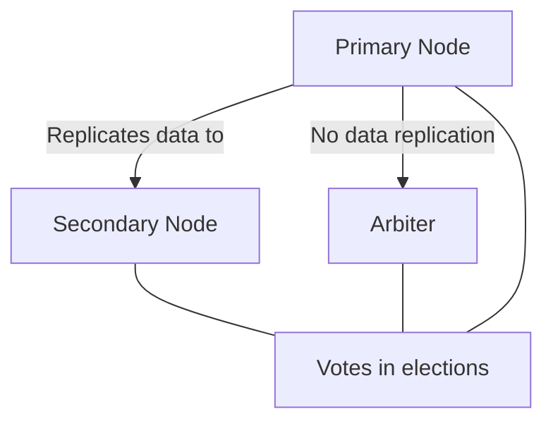
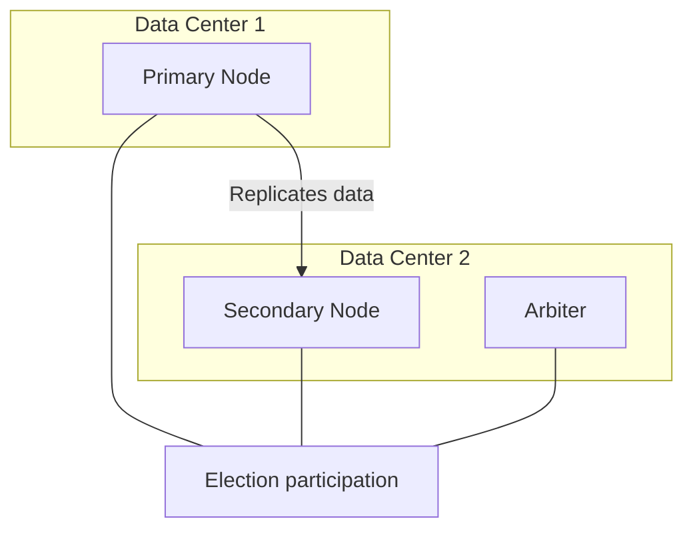

# MongoDB Arbiters

## Introduction

In MongoDB's replication system, high availability is achieved through replica sets - a group of MongoDB instances that maintain the same data set. While primary and secondary nodes store and replicate data, there's another type of node that plays a critical role in maintaining the integrity of a replica set without storing any data: **arbiters**.

An arbiter is a special MongoDB instance that participates in replica set elections but doesn't hold any data. Its sole purpose is to provide an additional vote during the election of a primary node, helping to maintain an odd number of voting members in the replica set.

In this tutorial, you'll learn:
- What MongoDB arbiters are and why they're useful
- How to set up and configure an arbiter
- Best practices and limitations
- When to use (and when to avoid) arbiters

## Understanding MongoDB Arbiters

### What is an Arbiter?

An arbiter is a lightweight MongoDB instance that:
- Contains no data
- Cannot become a primary node
- Exists solely to participate in elections
- Requires minimal resources (CPU, memory, and disk space)



### Why Use Arbiters?

Arbiters serve a specific purpose in MongoDB's high-availability strategy:

1. **Maintain an odd number of voters**: In MongoDB replica sets, an odd number of voting members is crucial to avoid tie situations during elections.

2. **Cost efficiency**: When you need an additional vote but don't want the overhead of a full data-bearing node.

3. **Resource constraints**: When you have limited hardware resources but still need proper election mechanics.

## Setting Up an Arbiter

Adding an arbiter to your replica set is straightforward. Unlike regular nodes, arbiters require minimal configuration since they don't store data.

### Step 1: Create a Directory for the Arbiter

```bash
mkdir -p /data/arbiter
```

### Step 2: Start the MongoDB Instance as an Arbiter

```bash
mongod --port 27019 --dbpath /data/arbiter --replSet rs0
```

### Step 3: Add the Arbiter to Your Replica Set

Connect to the primary node of your replica set using the MongoDB shell:

```bash
mongosh --host primary-host:27017
```

Once connected, add the arbiter to your replica set:

```javascript
rs.addArb("arbiter-host:27019")
```

### Example Response:

```javascript
{
  "ok": 1,
  "operationTime": Timestamp(1597405994, 1),
  "$clusterTime": {
    "clusterTime": Timestamp(1597405994, 1),
    "signature": {
      "hash": BinData(0, "AAAAAAAAAAAAAAAAAAAAAAAAAAA="),
      "keyId": NumberLong(0)
    }
  }
}
```

### Step 4: Verify the Replica Set Configuration

To check that the arbiter was added correctly, run:

```javascript
rs.conf()
```

You should see output similar to this:

```javascript
{
  "_id": "rs0",
  "version": 2,
  "protocolVersion": NumberLong(1),
  "members": [
    {
      "_id": 0,
      "host": "primary-host:27017",
      "arbiterOnly": false,
      "buildIndexes": true,
      "hidden": false,
      "priority": 1,
      "tags": {},
      "secondaryDelaySecs": NumberLong(0),
      "votes": 1
    },
    {
      "_id": 1,
      "host": "secondary-host:27018",
      "arbiterOnly": false,
      "buildIndexes": true,
      "hidden": false,
      "priority": 1,
      "tags": {},
      "secondaryDelaySecs": NumberLong(0),
      "votes": 1
    },
    {
      "_id": 2,
      "host": "arbiter-host:27019",
      "arbiterOnly": true,
      "buildIndexes": true,
      "hidden": false,
      "priority": 0,
      "tags": {},
      "secondaryDelaySecs": NumberLong(0),
      "votes": 1
    }
  ],
  "settings": {
    "chainingAllowed": true,
    "heartbeatIntervalMillis": 2000,
    "heartbeatTimeoutSecs": 10,
    "electionTimeoutMillis": 10000,
    "catchUpTimeoutMillis": -1,
    "catchUpTakeoverDelayMillis": 30000
  }
}
```

Notice that the arbiter has `"arbiterOnly": true` and `"priority": 0`.

## Practical Examples

### Example 1: Two Data Centers with Limited Resources

Imagine you have two data centers and need to deploy a MongoDB replica set across them for high availability. However, you're limited in resources and can only afford two full data-bearing nodes.



**Configuration:**

```javascript
rs.initiate({
  _id: "rs0",
  members: [
    { _id: 0, host: "dc1-server:27017", priority: 2 }, // Prefer this as primary
    { _id: 1, host: "dc2-server:27017", priority: 1 },
    { _id: 2, host: "dc2-server:27018", arbiterOnly: true }
  ]
})
```

In this setup:
- The primary node is in Data Center 1
- The secondary node and arbiter are in Data Center 2
- The arbiter provides the third vote needed for proper elections
- We've set a higher priority for the DC1 node to prefer it as primary

### Example 2: Small Development Environment

For a development environment where you want to simulate a replica set but have limited resources:

```javascript
// Start three MongoDB instances on the same machine
// Primary on port 27017
// Secondary on port 27018
// Arbiter on port 27019

// Connect to the instance that will become primary
mongosh --port 27017

// Initiate the replica set
rs.initiate({
  _id: "devSet",
  members: [
    { _id: 0, host: "localhost:27017" },
    { _id: 1, host: "localhost:27018" },
    { _id: 2, host: "localhost:27019", arbiterOnly: true }
  ]
})
```

This provides a full replica set experience for development with minimal resource usage.

## Best Practices and Limitations

### When to Use Arbiters

✅ Use arbiters when:
- You need an odd number of voting members but don't want to store additional data copies
- You have resource constraints but need proper election mechanics
- You need to break ties in a two-node replica set

### When to Avoid Arbiters

❌ Avoid arbiters when:
- You can afford additional full data-bearing nodes
- You need additional data redundancy
- You're using MongoDB 4.0+ with write concern majority (due to potential data availability issues)

### Important Limitations

1. **Security**: Arbiters still need proper security configuration even though they don't store data

2. **Write Concern Majority**: In MongoDB 4.0+, arbiters can cause issues with `{w: "majority"}` write concerns because they count in the voting majority but don't acknowledge writes

3. **Network Partition Sensitivity**: Replica sets with arbiters can be more sensitive to network partitions

4. **Scalability**: MongoDB recommends no more than one arbiter per replica set

## Security Considerations

Even though arbiters don't store data, they still need to be secured:

```bash
mongod --port 27019 --dbpath /data/arbiter --replSet rs0 --auth \
  --keyFile /path/to/keyfile
```

The `keyFile` provides authentication between replica set members.

## Summary

MongoDB arbiters offer a lightweight solution for maintaining proper election mechanics in a replica set without the overhead of additional data storage. They're particularly useful in resource-constrained environments or when you need to maintain an odd number of voters.

Key takeaways:
- Arbiters participate in elections but don't store data
- They require minimal resources compared to full data-bearing nodes
- They help maintain an odd number of voting members in a replica set
- Best used in specific scenarios, particularly when resource constraints exist
- Care must be taken with write concerns when using arbiters in MongoDB 4.0+

## Additional Resources

To deepen your understanding of MongoDB arbiters and replication:

1. [MongoDB Official Documentation on Arbiter Nodes](https://www.mongodb.com/docs/manual/core/replica-set-arbiter/)
2. [MongoDB Replication Guide](https://www.mongodb.com/docs/manual/replication/)

## Exercises

1. Set up a local three-node replica set with one arbiter on your development machine.
2. Simulate a primary node failure and observe how the election process works with an arbiter.
3. Compare the resource usage (CPU, memory, disk) between a secondary node and an arbiter.
4. Experiment with different replica set configurations to understand when arbiters are most beneficial.
5. Investigate how write concern majority behaves in a replica set with arbiters.