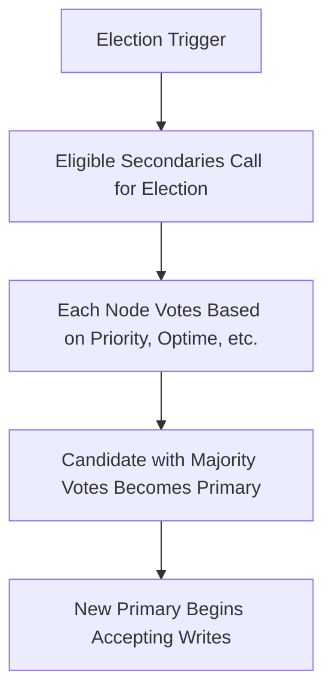
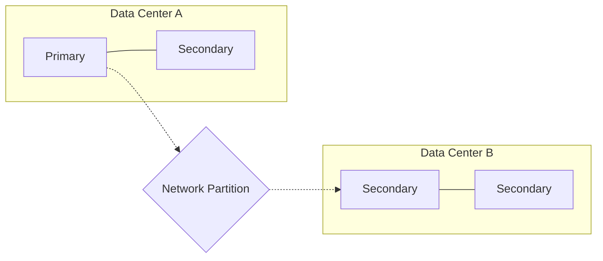

# MongoDB Elections

## Introduction

In a MongoDB replica set, one node serves as the primary node that accepts all write operations, while other nodes act as secondaries that replicate data from the primary. But what happens when the primary node fails? MongoDB's election process automatically selects a new primary node to maintain high availability without manual intervention.

This guide explores how MongoDB elections work, the factors that influence election outcomes, and how to configure and monitor elections in your replica sets.

## Understanding MongoDB Elections

### What Triggers an Election?

Elections in MongoDB replica sets occur in the following scenarios:

1. **Initial replica set initialization**: When you first set up a replica set
2. **Primary node failure**: When the current primary becomes unavailable
3. **Network partitions**: When communication between nodes is disrupted
4. **Manual triggering**: When an administrator runs `rs.stepDown()` or `rs.reconfig()`

### The Election Process

When an election is triggered, MongoDB uses a consensus protocol to determine which secondary should be promoted to primary:



Let's break down the steps:

1. Eligible secondaries determine they need to elect a new primary
2. These secondaries nominate themselves as candidates
3. Each node in the replica set votes for a candidate
4. A candidate that receives votes from a majority of voting members becomes the new primary
5. The new primary begins accepting write operations

## Election Configuration Parameters

You can influence election outcomes through several configuration parameters:

### Priority

The `priority` setting (0-1000) influences which node is most likely to become primary:

```javascript
// Configure a node with higher priority
cfg = rs.conf()
cfg.members[1].priority = 10  // Give the second member higher priority
rs.reconfig(cfg)
```

A priority of `0` means a node can never become primary (useful for backup or analytics nodes).

### Vote Count

Each node has a `votes` value (typically 1) that determines its voting power:

```javascript
// Configure a node's voting power
cfg = rs.conf()
cfg.members[2].votes = 0  // Remove voting rights from the third member
rs.reconfig(cfg)
```

### Elections in Practice

Let's see a practical example of examining and modifying election settings:

```javascript
// Connect to a replica set member
mongo "mongodb://mongodb-server-1:27017"

// Check current replica set configuration
rs.conf()

// Sample output:
{
  "_id" : "rs0",
  "version" : 1,
  "members" : [
    {
      "_id" : 0,
      "host" : "mongodb-server-1:27017",
      "priority" : 1
    },
    {
      "_id" : 1,
      "host" : "mongodb-server-2:27017",
      "priority" : 1
    },
    {
      "_id" : 2,
      "host" : "mongodb-server-3:27017",
      "priority" : 1
    }
  ]
}

// Modify settings to prefer server-2 as primary
cfg = rs.conf()
cfg.members[1].priority = 2
rs.reconfig(cfg)

// Check replica set status to verify changes
rs.status()
```

## Factors That Influence Elections

Several factors influence which node wins an election:

1. **Priority**: Nodes with higher priority values are preferred
2. **Replication lag**: Nodes that are more up-to-date are preferred
3. **Connectivity**: Nodes must be able to communicate with a majority of the set
4. **Member configuration**: Only voting members with priority > 0 can become primary

## Election Timeout and Heartbeats

MongoDB uses heartbeats to detect node failures:

- **Heartbeat interval**: By default, every 2 seconds
- **Election timeout**: By default, 10 seconds without a heartbeat triggers election

You can adjust these settings for your specific environment:

```javascript
// Modify replica set settings
cfg = rs.conf()
cfg.settings = {
  heartbeatTimeoutSecs: 15,
  electionTimeoutMillis: 12000
}
rs.reconfig(cfg)
```

## Real-World Election Scenarios

### Scenario 1: Network Partition

When a network partition occurs, nodes may be split into groups that can't communicate with each other:



If the primary (Node A) can't communicate with a majority of voting members, it will step down. If the secondaries in Data Center B form a majority, they can elect a new primary.

### Scenario 2: Stepdown for Maintenance

When performing maintenance on a primary node, it's best practice to step it down gracefully:

```javascript
// Connect to current primary
mongo "mongodb://primary-server:27017"

// Step down primary (will trigger election)
rs.stepDown(300)  // Stay secondary for 300 seconds

// The output will show something like:
// { "ok" : 1 }
// And you'll be disconnected as the node steps down
```

## Monitoring Elections

MongoDB provides several ways to monitor elections:

### Using the MongoDB Log

Elections produce detailed log entries you can review:

```
2023-07-15T14:22:10.123+0000 I REPL     [replexec-1] Member mongodb-server-2:27017 is now in state PRIMARY
2023-07-15T14:22:10.125+0000 I REPL     [replexec-1] Member mongodb-server-1:27017 is now in state SECONDARY
```

### Using Replica Set Status

The `rs.status()` command shows the current state of all replica set members:

```javascript
rs.status()

// Output will include election-related information like:
{
  "set" : "rs0",
  "members" : [
    {
      "_id" : 0,
      "name" : "mongodb-server-1:27017",
      "state" : 2,  // 2 means SECONDARY
      "stateStr" : "SECONDARY",
      "lastHeartbeatMessage" : "",
      "syncSourceHost" : "mongodb-server-2:27017",
      "syncSourceId" : 1,
      "electionTime" : Timestamp(1657777612, 1), // When this node was last elected primary
      "electionDate" : ISODate("2023-07-14T18:00:12Z")
    },
    {
      "_id" : 1,
      "name" : "mongodb-server-2:27017",
      "state" : 1,  // 1 means PRIMARY
      "stateStr" : "PRIMARY",
      "electionTime" : Timestamp(1657900112, 1),
      "electionDate" : ISODate("2023-07-15T14:22:10Z")
    }
    // ...more members
  ]
}
```

## Best Practices for Election Configuration

To ensure smooth elections and high availability:

1. **Always use an odd number of voting members** to avoid ties (3, 5, or 7 is typical)
2. **Distribute voting members across failure domains** (different servers, racks, or data centers)
3. **Set appropriate priorities** based on hardware capabilities and geographic location
4. **Monitor replication lag** to ensure secondaries stay current
5. **Test failover scenarios** regularly in non-production environments

## Advanced Election Topics

### Election Handoff

MongoDB 4.0+ supports "election handoff" where a stepping-down primary recommends its sync source as the next primary:

```javascript
// Enable election handoff
cfg = rs.conf()
cfg.settings = cfg.settings || {}
cfg.settings.catchUpTimeoutMillis = 2000  // 2-second catch-up period
rs.reconfig(cfg)
```

### Force Elections for Testing

In testing environments, you can force a primary to step down:

```javascript
// Force primary to step down immediately (unsafe for production)
db.adminCommand({replSetStepDown: 0, force: true})
```

## Summary

MongoDB's election process is a core feature that enables high availability in replica sets. By automatically promoting a secondary node to primary when failures occur, MongoDB ensures your application continues functioning with minimal disruption.

Key points to remember:
- Elections are triggered by node failures, network partitions, or manual intervention
- Priority, replication lag, and connectivity influence election outcomes
- Configure your replica set with an odd number of voting members
- Test failover scenarios regularly to ensure your applications handle them gracefully

## Additional Resources and Exercises

### Resources
- [MongoDB Documentation: Replica Set Elections](https://www.mongodb.com/docs/manual/core/replica-set-elections/)
- [MongoDB University: M103 Basic Cluster Administration](https://university.mongodb.com/)

### Practice Exercises

1. Set up a three-node replica set and practice triggering elections using `rs.stepDown()`
2. Configure different priorities for nodes and observe how it affects election outcomes
3. Simulate a network partition by stopping MongoDB on the primary and observe the election process
4. Write a script that monitors replica set status and alerts when a new primary is elected

By understanding and properly configuring MongoDB elections, you'll build more resilient applications that can withstand infrastructure failures without losing availability.