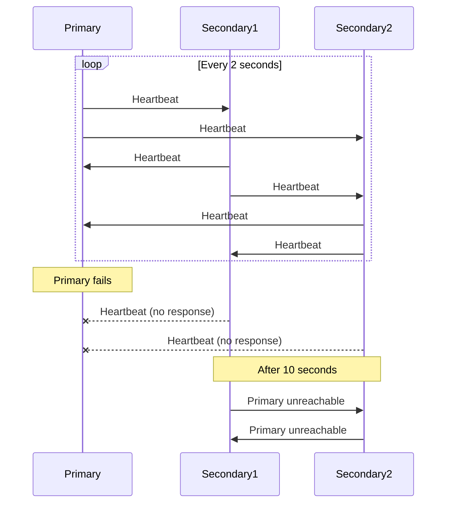

# MongoDB Failover

In distributed database systems, ensuring continuous operation even when individual servers fail is critical. MongoDB's replication mechanism includes robust failover capabilities that help maintain high availability of your database services during hardware failures, network issues, or maintenance operations.

## What is MongoDB Failover?

Failover is the automated process where a secondary member of a replica set assumes the primary role when the original primary becomes unavailable. This transition ensures that your application can continue to read and write data without significant interruption.

## How MongoDB Failover Works

The failover process in MongoDB involves several key components working together:

### Heartbeat Mechanism

Members of a replica set constantly communicate with each other through heartbeat messages.

- Each member sends a heartbeat to every other member every 2 seconds
- If a heartbeat isn't received within 10 seconds, the member is marked as unreachable
- This mechanism enables quick detection of unavailable nodes



### Election Process

When a primary becomes unavailable, the remaining secondaries hold an election to select a new primary:

1. A secondary nominates itself for election
2. Other secondaries vote for the candidate
3. The candidate with the majority of votes becomes the new primary
4. The entire process typically takes a few seconds

### Priority and Voting Configuration

You can influence the failover process through configuration:

- **Priority**: Higher priority members are preferred in elections
- **Votes**: Determines a member's weight in the election process
- **Hidden members**: Participate in voting but cannot become primary
- **Arbiter**: Special member that only votes but doesn't store data

## Configuring a Replica Set for Effective Failover

Let's set up a basic three-node replica set with failover in mind:

```javascript
// Initialize a new replica set
rs.initiate({
  _id: "myReplicaSet",
  members: [
    { _id: 0, host: "mongodb-0.example.com:27017", priority: 2 },  // Preferred primary
    { _id: 1, host: "mongodb-1.example.com:27017", priority: 1 },  // Standard secondary
    { _id: 2, host: "mongodb-2.example.com:27017", priority: 1 }   // Standard secondary
  ]
})
```

You can check the status of your replica set using:

```javascript
rs.status()
```

This command provides detailed information about each member, including who is currently primary and the state of each node.

## Example: Handling a Primary Failure

Let's walk through a practical scenario showing how MongoDB handles a primary node failure:

### Initial State

We have a three-node replica set with one primary and two secondaries:

```javascript
// Connect to the primary node
mongo mongodb-0.example.com:27017

// Check replica set status
rs.status()
// Output shows mongodb-0 as PRIMARY, mongodb-1 and mongodb-2 as SECONDARY
```

### Simulating a Primary Failure

We'll simulate a primary node failure by stopping the MongoDB service on that server:

```bash
# On the primary server
sudo systemctl stop mongod
```

### Observing Failover

Now, if we connect to one of the secondary nodes, we can observe the failover process:

```javascript
// Connect to a secondary node
mongo mongodb-1.example.com:27017

// Check replica set status
rs.status()
// After a few seconds, output will show either mongodb-1 or mongodb-2 as the new PRIMARY
```

The application using this MongoDB cluster would experience a brief interruption (typically 5-30 seconds, depending on network conditions and configuration), after which writes can resume to the new primary.

## Common Failover Challenges and Solutions

### Write Concern

Using appropriate write concern helps ensure data safety during failover:

```javascript
// Connect to your MongoDB cluster
const client = new MongoClient("mongodb://mongodb-0.example.com:27017,mongodb-1.example.com:27017,mongodb-2.example.com:27017/?replicaSet=myReplicaSet");

// Insert with majority write concern
db.collection('important_data').insertOne(
  { item: "critical_record", value: 42 },
  { writeConcern: { w: "majority", wtimeout: 5000 } }
);
```

This ensures that the write is acknowledged by a majority of replica set members, making it durable even if failover occurs.

### Read Preference

Configure your application's read preference to match your requirements:

```javascript
// Node.js MongoDB driver example
const client = new MongoClient(
  "mongodb://mongodb-0.example.com:27017,mongodb-1.example.com:27017,mongodb-2.example.com:27017/?replicaSet=myReplicaSet",
  {
    readPreference: "primaryPreferred"  // Reads from primary if available, otherwise secondary
  }
);
```

Common read preferences include:
- `primary`: Only read from the primary (default)
- `primaryPreferred`: Prefer primary, but read from secondary if primary unavailable
- `secondary`: Only read from secondaries
- `secondaryPreferred`: Prefer secondaries, but read from primary if no secondaries available
- `nearest`: Read from the member with lowest network latency

### Monitoring Failover Events

You can track failover events in your MongoDB logs. Look for entries like:

```
[replSetMemberStateChange] transition to PRIMARY from SECONDARY
```

For programmatic monitoring, you can use MongoDB's change streams:

```javascript
const changeStream = client.db('admin').watch([
  { $match: { 'operationType': 'event' } }
]);

changeStream.on('change', (change) => {
  // Handle replica set changes
  console.log('Detected change:', change);
});
```

## Step Down vs. Failover

It's important to distinguish between planned and unplanned primary transitions:

### Planned Step Down

For maintenance, you can manually step down a primary:

```javascript
// Connect to the current primary
rs.stepDown(60)  // Step down for 60 seconds
```

This is a graceful process where:
1. The primary stops accepting writes
2. It waits for all in-progress write operations to complete (up to 10 seconds by default)
3. It steps down to secondary status
4. An election selects a new primary

### Unplanned Failover

When a primary becomes unavailable unexpectedly:
1. Other nodes detect missing heartbeats
2. After the timeout period, an election begins
3. A new primary is elected
4. The old primary, when it recovers, rejoins as a secondary

## Best Practices for Robust Failover

1. **Deploy at least three voting members** - This ensures elections can achieve majority even if one node fails

2. **Distribute across failure domains** - Place members in different data centers or availability zones:

```javascript
rs.initiate({
  _id: "geoDistributedSet",
  members: [
    { _id: 0, host: "mongodb-us-east.example.com:27017", tags: { "region": "us-east" } },
    { _id: 1, host: "mongodb-us-west.example.com:27017", tags: { "region": "us-west" } },
    { _id: 2, host: "mongodb-eu-central.example.com:27017", tags: { "region": "eu-central" } }
  ]
})
```

3. **Configure appropriate timeouts** - Adjust the heartbeat timeout based on your network conditions:

```javascript
cfg = rs.conf()
cfg.settings = {
  heartbeatTimeoutSecs: 15,  // Increase from default 10 for unstable networks
  electionTimeoutMillis: 12000  // Increase election timeout accordingly
}
rs.reconfig(cfg)
```

4. **Implement proper connection handling** in your application:

```javascript
// Node.js example
const client = new MongoClient(
  "mongodb://mongodb-0.example.com:27017,mongodb-1.example.com:27017,mongodb-2.example.com:27017/?replicaSet=myReplicaSet",
  {
    serverSelectionTimeoutMS: 5000,  // How long to try finding a server
    connectTimeoutMS: 10000,  // How long to wait for a connection
    socketTimeoutMS: 45000,   // How long to wait for responses
    retryWrites: true,        // Retry write operations on network errors
    retryReads: true          // Retry read operations on network errors
  }
);
```

5. **Test failover regularly** - Practice makes perfect:

```javascript
// Force a failover for testing
db.adminCommand({ replSetStepDown: 60, force: true })
```

## Summary

MongoDB's failover mechanism is a critical component of its high-availability strategy, allowing your database to continue operating even when individual nodes fail. By understanding how failover works and applying the best practices outlined in this guide, you can build resilient applications that maintain availability through server failures and maintenance events.

The key components of effective failover planning include:

- Proper replica set configuration with at least three members
- Strategic distribution across failure domains
- Appropriate write concern and read preference settings
- Regular testing of failover scenarios
- Application code that handles connection recovery gracefully

By mastering MongoDB's failover capabilities, you can build applications that deliver consistent availability even in challenging network and infrastructure conditions.

## Additional Resources

- [MongoDB Official Documentation on Replica Set Failover](https://docs.mongodb.com/manual/core/replica-set-high-availability/)
- [MongoDB University Course: M103: Basic Cluster Administration](https://university.mongodb.com/courses/M103/about)

## Practice Exercises

1. Set up a three-node replica set on your local machine using different ports for each node.
2. Practice forcing a failover by shutting down the primary node and observing the election.
3. Write a simple script that connects to your replica set and continues to perform writes during a failover.
4. Experiment with different write concerns and measure the impact on performance and data durability.
5. Implement a monitoring solution that alerts you when failover occurs in your replica set.