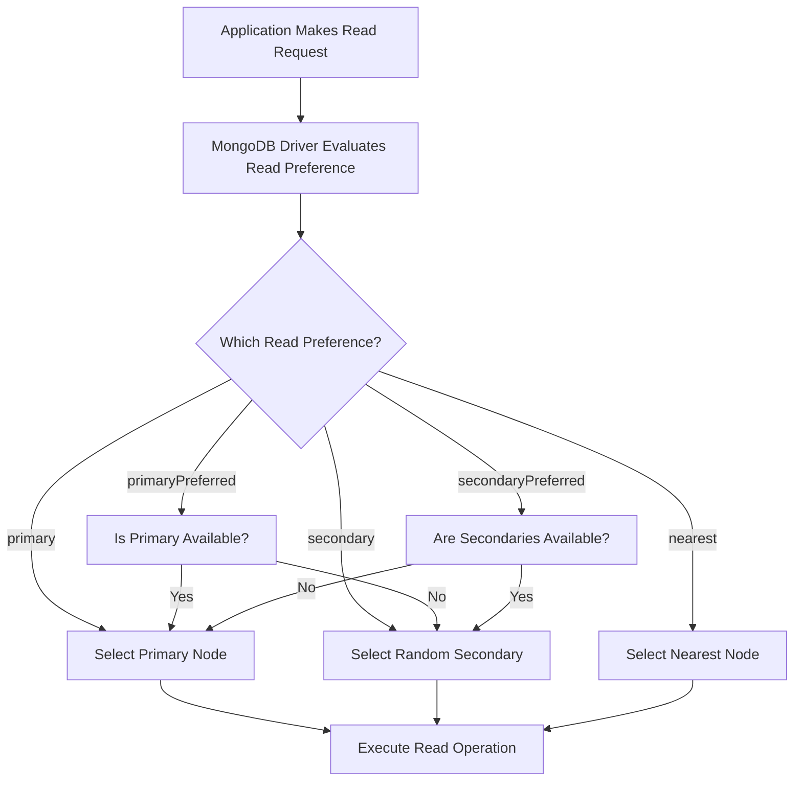

# MongoDB Read Preference

In a MongoDB replica set, understanding how read operations are distributed is essential for optimizing your application's performance and reliability. MongoDB's read preference feature allows you to control which members of a replica set handle read operations, giving you fine-grained control over read distribution.

## What is Read Preference?

Read preference is a configuration setting that determines which members of a replica set are eligible to receive read operations from your application. By default, all read operations go to the primary node, but MongoDB allows you to direct reads to secondary nodes based on various criteria.

This capability enables you to:

- Distribute read workloads across the replica set
- Reduce latency in geographically distributed deployments
- Maintain read operations during primary node failures
- Balance read and write workloads on your cluster

## Read Preference Modes

MongoDB provides five different read preference modes to control read operation distribution:

### 1. primary

The default read preference mode. All read operations go to the primary node of the replica set.

```javascript
// Connect with primary read preference (default)
const client = new MongoClient("mongodb://localhost:27017/mydb", {
  readPreference: "primary"
});

// Or set at query level
collection.find({}).readPref("primary").toArray();
```

**When to use:** When you need strictly consistent reads (read-your-writes consistency) and your primary node can handle the read load.

### 2. primaryPreferred

Reads go to the primary node if it's available. If the primary is unavailable, reads go to secondary nodes.

```javascript
// Connect with primaryPreferred read preference
const client = new MongoClient("mongodb://localhost:27017/mydb", {
  readPreference: "primaryPreferred"
});

// Or set at query level
collection.find({}).readPref("primaryPreferred").toArray();
```

**When to use:** When you want the consistency of reading from the primary but still want reads to succeed during primary failover events.

### 3. secondary

Reads only go to secondary nodes. If no secondary is available, the read operation will fail.

```javascript
// Connect with secondary read preference
const client = new MongoClient("mongodb://localhost:27017/mydb", {
  readPreference: "secondary"
});

// Or set at query level
collection.find({}).readPref("secondary").toArray();
```

**When to use:** When you want to offload read operations from the primary node and can tolerate potentially stale data.

### 4. secondaryPreferred

Reads go to secondary nodes if available. If no secondary is available, reads go to the primary.

```javascript
// Connect with secondaryPreferred read preference
const client = new MongoClient("mongodb://localhost:27017/mydb", {
  readPreference: "secondaryPreferred"
});

// Or set at query level
collection.find({}).readPref("secondaryPreferred").toArray();
```

**When to use:** When you want to primarily read from secondaries to offload your primary, but still want reads to succeed even if all secondaries are unavailable.

### 5. nearest

Reads go to the member with the lowest network latency, regardless of whether it's primary or secondary.

```javascript
// Connect with nearest read preference
const client = new MongoClient("mongodb://localhost:27017/mydb", {
  readPreference: "nearest"
});

// Or set at query level
collection.find({}).readPref("nearest").toArray();
```

**When to use:** When minimizing read latency is more important than reading the most current data or exclusively reading from the primary.

## How Read Preferences Work

When your application makes a read request, the MongoDB driver:

1. Evaluates which members of the replica set match the read preference mode
2. If applicable, applies any tag sets to filter the eligible members
3. Selects a random eligible member to handle the read request



## Read Preference and Data Consistency

When reading from secondaries, it's important to understand that you might receive stale data because replication happens asynchronously. The degree of potential staleness depends on replication lag between the primary and secondary nodes.

### Potential Staleness Scenarios:

1. **Primary writes new data**
2. **Secondary hasn't replicated yet**
3. **Application reads from secondary**
4. **Application receives old data**

## Advanced Configuration: Tag Sets

Tag sets allow you to further refine which members are eligible for read operations. You can assign custom tags to replica set members and then specify tag sets in your read preference.

### Example: Setting up tag sets on replica set members

```javascript
// Configure replica set members with tags
rs.conf() = {
  _id: "myReplSet",
  members: [
    { _id: 0, host: "server1:27017", tags: { datacenter: "east", role: "reporting" } },
    { _id: 1, host: "server2:27017", tags: { datacenter: "east", role: "application" } },
    { _id: 2, host: "server3:27017", tags: { datacenter: "west", role: "application" } }
  ]
}
```

### Example: Using tag sets in read preference

```javascript
// Read from secondary nodes in the east datacenter
const client = new MongoClient("mongodb://localhost:27017/mydb", {
  readPreference: "secondary",
  readPreferenceTags: [{ datacenter: "east" }]
});

// Or set at query level
collection.find({}).readPref("secondary", [{ datacenter: "east" }]).toArray();
```

## Setting Read Preference

You can configure read preference at multiple levels:

### 1. Connection Level

```javascript
// In MongoDB Node.js driver
const client = new MongoClient("mongodb://localhost:27017/mydb", {
  readPreference: "secondaryPreferred"
});

// In MongoDB connection string URI
const uri = "mongodb://localhost:27017/mydb?readPreference=secondaryPreferred";
const client = new MongoClient(uri);
```

### 2. Database Level

```javascript
const db = client.db("mydb", { readPreference: "secondaryPreferred" });
```

### 3. Collection Level

```javascript
const collection = db.collection("users", { readPreference: "secondaryPreferred" });
```

### 4. Operation Level

```javascript
collection.find({}).readPref("secondaryPreferred").toArray();
```

## Real-World Use Cases

### Case 1: Offloading Analytics Queries

A common pattern is to send heavy analytics queries to secondary nodes while keeping user-facing operational reads on the primary:

```javascript
// User profile reads go to primary for consistency
const userProfiles = db.collection("profiles", { readPreference: "primary" });

// Analytics queries go to secondaries to reduce load on primary
const analyticsReports = db.collection("userEvents", { readPreference: "secondary" });

// User makes a profile request
const profile = await userProfiles.findOne({ userId: "12345" });

// Meanwhile, analytics processing happens on secondaries
const eventCounts = await analyticsReports.aggregate([
  { $match: { eventType: "purchase" } },
  { $group: { _id: "$productId", count: { $sum: 1 } } },
  { $sort: { count: -1 } },
  { $limit: 10 }
]).toArray();
```

### Case 2: Geo-Distributed Reads

For applications with users in multiple geographic regions, you can use tag sets to direct reads to nearby replica members:

```javascript
// Configuration for users in Europe
const europeClient = new MongoClient("mongodb://localhost:27017/mydb", {
  readPreference: "nearest",
  readPreferenceTags: [{ region: "europe" }]
});

// Configuration for users in Asia
const asiaClient = new MongoClient("mongodb://localhost:27017/mydb", {
  readPreference: "nearest",
  readPreferenceTags: [{ region: "asia" }]
});
```

### Case 3: High-Availability Reading

For applications that need to continue reading during failover events:

```javascript
// Connect with primaryPreferred to maintain read operations during failover
const client = new MongoClient("mongodb://localhost:27017,localhost:27018,localhost:27019/mydb", {
  readPreference: "primaryPreferred",
  replicaSet: "myReplSet"
});

// Application can continue reading during primary elections
async function getUserData(userId) {
  try {
    return await client.db("mydb").collection("users").findOne({ _id: userId });
  } catch (err) {
    console.error("Read failed:", err);
    return null;
  }
}
```

## Performance Considerations

When choosing a read preference, consider these performance factors:

1. **Read consistency requirements:** Primary reads provide the most up-to-date data
2. **Network latency:** Reading from geographically closer nodes can reduce latency
3. **Load distribution:** Directing reads to secondaries can help balance system load
4. **Failover resilience:** Using `primaryPreferred` or `secondaryPreferred` improves availability during node failures

## Common Mistakes and Pitfalls

1. **Reading from secondaries for write-heavy applications:** The replication lag might be significant
2. **Using `secondary` read preference without enough secondary nodes:** This can cause failures if secondaries are down
3. **Not considering stale data implications:** Secondary reads might return outdated information
4. **Overloading secondaries:** Remember secondaries also handle replication workload

## Summary

MongoDB read preferences give you flexible control over how read operations are distributed across your replica set. By understanding the different read preference modes and how to apply them, you can optimize your application for performance, availability, and data consistency based on your specific requirements.

When choosing a read preference, consider:
- Your application's consistency requirements
- Your replica set's geographical distribution
- Your load balancing needs
- Your high-availability strategy

## Additional Resources

- [MongoDB Documentation on Read Preference](https://www.mongodb.com/docs/manual/core/read-preference/)
- [MongoDB University Course on Replication](https://university.mongodb.com/)

## Practice Exercises

1. Configure a three-node replica set and experiment with different read preferences to see how they affect read distribution.
2. Create a simple application that writes data to MongoDB and then reads it using different read preferences. Observe any differences in consistency.
3. Implement a tag-based read preference strategy for a hypothetical global application with users in multiple regions.
4. Design a fallback read strategy that progressively relaxes consistency requirements when the primary is unavailable.