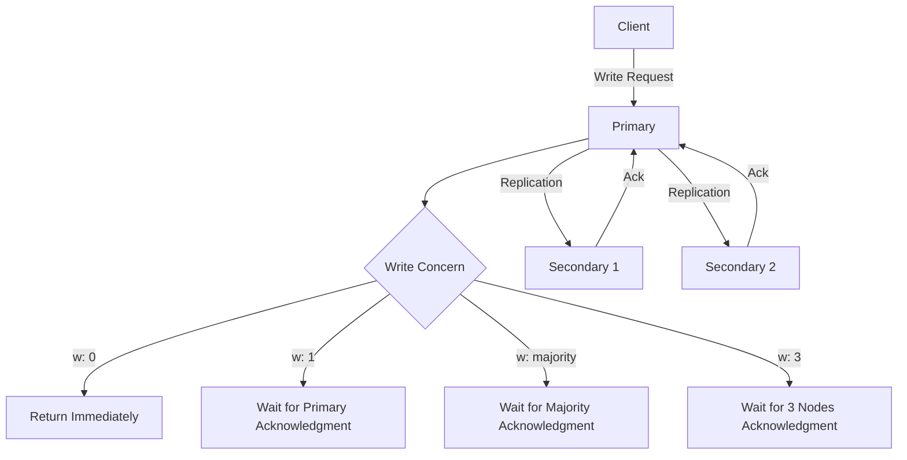
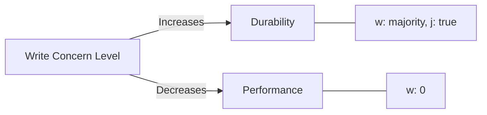

# MongoDB Write Concern

## Introduction

When working with MongoDB replica sets, understanding **Write Concern** is crucial for balancing data durability and performance. Write Concern controls how MongoDB acknowledges write operations and ensures data is properly saved across replica set members.

In this tutorial, you'll learn:
- What Write Concern is and why it matters
- Different Write Concern levels and their implications
- How to configure Write Concern for your applications
- Best practices and real-world scenarios

## What is Write Concern?

Write Concern in MongoDB defines the level of acknowledgment requested from MongoDB for write operations. It determines:

1. How many replica set members must acknowledge the write
2. Whether the write needs to be committed to the journal
3. How long the server should wait before timing out

Think of Write Concern as your "confidence level" that a write operation was successful and durable across your MongoDB deployment.

## Write Concern Options

### The `w` Option

The `w` option specifies the number of members that must acknowledge the write operation:

| Value | Description |
| ----- | ----------- |
| 0 | No acknowledgment required (fire and forget) |
| 1 | Primary only acknowledgment (default) |
| n | Primary and (n-1) secondaries must acknowledge |
| "majority" | A majority of voting members must acknowledge |
| tag | Custom replica set tag |

### The `j` Option

The `j` option determines whether the write must be committed to the journal before acknowledging:

| Value | Description |
| ----- | ----------- |
| true | Requires write operation to be committed to journal |
| false | Does not require journal commit (default) |

### The `wtimeout` Option

The `wtimeout` option sets a time limit (in milliseconds) for the write concern to be satisfied before returning an error.

## Write Concern Levels

Let's explore different Write Concern levels and their practical applications:

### 1. `{w: 0}` - No Acknowledgment

With `w: 0`, MongoDB doesn't wait for any acknowledgment - the application continues immediately after sending the write request.

```javascript
db.collection.insertOne(
  { name: "Alice", email: "alice@example.com" },
  { writeConcern: { w: 0 } }
);
```

**Use case**: High-throughput logging or metrics collection where occasional data loss is acceptable.

**Trade-off**: Offers maximum performance but provides no guarantee that the write was successful.

### 2. `{w: 1}` - Primary Acknowledgment (Default)

This is MongoDB's default Write Concern. The primary node acknowledges the write before the operation returns as successful.

```javascript
db.collection.insertOne(
  { name: "Bob", email: "bob@example.com" },
  { writeConcern: { w: 1 } }
);
```

**Use case**: General application development where basic durability guarantees are sufficient.

**Trade-off**: Good balance of performance and durability, but writes could be lost if the primary crashes before replication occurs.

### 3. `{w: "majority"}` - Majority Acknowledgment

Ensures that the write has been acknowledged by a majority of voting members in the replica set.

```javascript
db.collection.insertOne(
  { name: "Charlie", email: "charlie@example.com" },
  { writeConcern: { w: "majority", j: true } }
);
```

**Use case**: Financial applications, user account creation, or other operations where data loss is unacceptable.

**Trade-off**: Higher latency but guarantees that writes survive primary failures.

### 4. `{w: 3, wtimeout: 5000}` - Specific Node Count with Timeout

Requires acknowledgment from the primary and two secondary nodes, with a 5-second timeout.

```javascript
db.collection.insertOne(
  { name: "David", email: "david@example.com" },
  { writeConcern: { w: 3, wtimeout: 5000 } }
);
```

**Use case**: Applications requiring specific durability guarantees but needing graceful failure handling.

**Trade-off**: Can cause failed operations if secondaries are unavailable or slow to replicate.

## Visualizing Write Concern



## Real-World Examples

### Example 1: User Registration System

For user registration, data durability is critical since losing user accounts would be problematic.

```javascript
// User registration with high durability guarantees
async function registerUser(userData) {
  try {
    const result = await db.users.insertOne(
      userData,
      { writeConcern: { w: "majority", j: true, wtimeout: 10000 } }
    );
    return { success: true, userId: result.insertedId };
  } catch (error) {
    console.error("Registration failed:", error);
    return { success: false, error: error.message };
  }
}
```

### Example 2: Analytics Data Collection

For high-volume analytics data, performance might be prioritized over durability.

```javascript
// Analytics event tracking with high performance
async function trackEvent(eventData) {
  try {
    // Using w: 1 for better performance, accepting some durability risk
    await db.events.insertOne(
      { ...eventData, timestamp: new Date() },
      { writeConcern: { w: 1, j: false } }
    );
  } catch (error) {
    // Maybe just log the error without retrying
    console.warn("Event tracking error:", error);
  }
}
```

### Example 3: Financial Transaction

For financial operations, maximum durability is needed:

```javascript
// Financial transaction with maximum durability
async function processPayment(paymentDetails) {
  const session = client.startSession();
  try {
    session.startTransaction({
      readConcern: { level: "snapshot" },
      writeConcern: { w: "majority", j: true }
    });
    
    // Debit account
    await db.accounts.updateOne(
      { accountId: paymentDetails.fromAccount },
      { $inc: { balance: -paymentDetails.amount } },
      { session }
    );
    
    // Credit account
    await db.accounts.updateOne(
      { accountId: paymentDetails.toAccount },
      { $inc: { balance: paymentDetails.amount } },
      { session }
    );
    
    // Record transaction
    await db.transactions.insertOne(
      { ...paymentDetails, status: "completed", date: new Date() },
      { session }
    );
    
    await session.commitTransaction();
    return { success: true };
  } catch (error) {
    await session.abortTransaction();
    return { success: false, error: error.message };
  } finally {
    session.endSession();
  }
}
```

## Best Practices

1. **Default to `w: "majority"` for important data**:
   - For user accounts, financial transactions, or other critical data
   - Ensures durability across replica set failures

2. **Use `j: true` for critical operations**:
   - Ensures data is written to the journal for persistence
   - Provides protection against server crashes

3. **Always set a `wtimeout` value**:
   - Prevents indefinite hanging of operations
   - Typical values range from 2000-10000ms depending on network conditions

4. **Consider lower Write Concern for high-volume, less critical data**:
   - Analytics, logs, or metrics might use `w: 1`
   - Performance-critical applications could use `w: 0` where data loss is acceptable

5. **Application-level retry logic**:
   - Implement retries for write operations that fail due to timeout
   - Use exponential backoff for retries

## Configuring Write Concern

### At the Client Level

```javascript
// Setting default write concern for a MongoClient
const client = new MongoClient(uri, {
  writeConcern: {
    w: "majority",
    j: true,
    wtimeout: 5000
  }
});
```

### At the Database Level

```javascript
// Setting write concern at database level
const db = client.db("myDatabase", {
  writeConcern: {
    w: "majority",
    j: true
  }
});
```

### At the Collection Level

```javascript
// Setting write concern at collection level
const collection = db.collection("users", {
  writeConcern: {
    w: 2,
    j: true,
    wtimeout: 2000
  }
});
```

### For Individual Operations

```javascript
// Setting write concern for a specific operation
await collection.updateOne(
  { _id: userId },
  { $set: { lastLogin: new Date() } },
  { writeConcern: { w: "majority", wtimeout: 5000 } }
);
```

## Impact on Performance

Higher Write Concern levels increase latency because:

1. The operation needs to wait for acknowledgment from more nodes
2. Journal commits add additional I/O operations
3. Network latency between replica set members adds overhead

This creates a trade-off between durability and performance:



## Handling Write Concern Errors

When a write operation fails to satisfy the Write Concern within the specified timeout, MongoDB returns a `WriteConcernError`. Here's how to handle it:

```javascript
try {
  const result = await db.collection.insertOne(
    { name: "Error Test" },
    { writeConcern: { w: 5, wtimeout: 1000 } } // Assuming only 3 nodes exist
  );
  console.log("Insert successful:", result);
} catch (error) {
  if (error.code === 64 || error.codeName === "WriteConcernFailed") {
    // Handle write concern failure
    console.error("Write concern error:", error.errInfo);
    
    // The document might actually be written to the primary
    // Check if the operation was actually applied
    if (error.result && error.result.ok === 1) {
      console.log("Write completed on primary but didn't satisfy write concern");
    }
  } else {
    // Handle other errors
    console.error("Operation error:", error);
  }
}
```

## Summary

MongoDB's Write Concern mechanism provides flexible control over the durability guarantees of write operations in a replica set. Key points to remember:

- **Write Concern options**: `w` (nodes), `j` (journaling), and `wtimeout` (timeout)
- **Durability vs. Performance trade-off**: Higher Write Concern means better durability but slower performance
- **Default Write Concern** is `{w: 1, j: false}` which only waits for primary acknowledgment
- **Important data** should use at least `{w: "majority", j: true}` to ensure durability
- **Configure Write Concern** at client, database, collection, or operation level based on your needs

Understanding Write Concern is essential for designing MongoDB applications that balance performance needs with data safety requirements.

## Practice Exercises

1. Set up a MongoDB replica set locally with three members and experiment with different Write Concern settings.
2. Write a Node.js script that tests the performance difference between `{w: 1}` and `{w: "majority"}` Write Concern.
3. Implement a function that handles Write Concern errors gracefully with retries and exponential backoff.
4. Design an error handling strategy for your application that considers Write Concern failures.

## Additional Resources

- [MongoDB Documentation: Write Concern](https://www.mongodb.com/docs/manual/reference/write-concern/)
- [MongoDB University: M201 MongoDB Performance](https://university.mongodb.com/courses/M201/about)
- [MongoDB Blog: Understanding Write Concern](https://www.mongodb.com/blog/post/understanding-mongodb-write-concern)
- [MongoDB Replica Set Deployment Architecture Guide](https://www.mongodb.com/docs/manual/core/replica-set-architectures/)