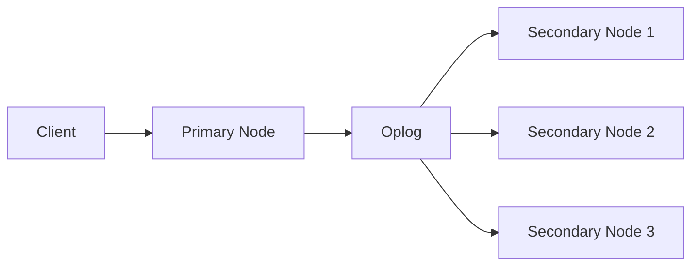

# MongoDB Replication Lag

## Introduction

In MongoDB replica sets, **replication lag** refers to the delay between an operation being applied to the primary node and that same operation being applied to a secondary node. While MongoDB's replication mechanism is designed to keep all members of a replica set consistently updated, various factors can cause secondary nodes to fall behind the primary, creating a time gap in data consistency across the cluster.

Understanding and managing replication lag is crucial for maintaining a healthy MongoDB deployment, ensuring data consistency, and providing reliable read operations from secondary nodes.

## Understanding MongoDB Replication

Before diving into replication lag, let's quickly review how MongoDB replication works:



1. All write operations go to the **primary** node
2. The primary records all data-modifying operations in its **oplog** (operations log)
3. **Secondary** nodes continuously replicate the oplog from the primary
4. Secondaries apply these operations to their data sets to stay in sync

## What Causes Replication Lag?

Replication lag can occur for several reasons:

### 1. Network Issues

```javascript
// Network latency between data centers can cause replication lag
// Example: Primary in US-East, Secondary in Asia-Pacific
```

- High latency between nodes
- Network congestion
- Packet loss
- Network partitions

### 2. Resource Constraints

Secondary nodes might lag when they don't have enough resources to keep up with the primary:

- CPU bottlenecks
- Disk I/O limitations
- Memory constraints

### 3. High Write Load

When the primary handles a large volume of write operations:

```javascript
// Example of a heavy write operation that can cause replication lag
db.largeCollection.insertMany([
  // Thousands of documents being inserted at once
  { item: 1, name: "Product 1", ... },
  { item: 2, name: "Product 2", ... },
  // ... many more documents
]);
```

### 4. Long-Running Operations

Operations that take a long time to execute on the primary will also take time on secondaries:

```javascript
// Index creation can block replication and cause lag
db.hugeCollection.createIndex({ complexField: 1 });
```

## Detecting Replication Lag

MongoDB provides several ways to monitor and detect replication lag:

### 1. Using the `rs.status()` Command

```javascript
// Run on any replica set member
rs.status();

// Sample output (partial)
{
  "members": [
    {
      "_id": 0,
      "name": "server1:27017",
      "health": 1,
      "state": 1,
      "stateStr": "PRIMARY",
      // ...
    },
    {
      "_id": 1,
      "name": "server2:27017",
      "health": 1,
      "state": 2,
      "stateStr": "SECONDARY",
      "lastHeartbeat": ISODate("2023-10-28T10:25:45.817Z"),
      "lastHeartbeatRecv": ISODate("2023-10-28T10:25:46.017Z"),
      "optimeDate": ISODate("2023-10-28T10:25:40.102Z"), // Look at this timestamp
      "lastHeartbeatMessage": "",
      "syncSourceHost": "server1:27017",
      "syncSourceId": 0,
      "replicationLag": NumberLong(5), // Replication lag in seconds
      // ...
    }
  ],
  // ...
}
```

In the output above, note the `replicationLag` field showing the lag in seconds.

### 2. Using Replica Lag Metrics

```javascript
// Using db.serverStatus()
db.serverStatus().repl;

// Or more directly with the replSetGetStatus command
db.adminCommand({ replSetGetStatus: 1 });
```

### 3. Monitoring the Oplog Window

```javascript
// Check the oplog size and time span
db.printReplicationInfo();

// Sample output
configured oplog size:   990MB
log length start to end: 600secs (0.17hrs)
oplog first event time:  Sat Oct 28 2023 10:15:40 GMT+0000
oplog last event time:   Sat Oct 28 2023 10:25:40 GMT+0000
now:                     Sat Oct 28 2023 10:25:45 GMT+0000
```

### 4. Using MongoDB Monitoring Tools

MongoDB provides monitoring tools like MongoDB Cloud Manager, Ops Manager, or MongoDB Atlas that offer comprehensive dashboards for tracking replication lag.

## Real-world Impact of Replication Lag

### Example 1: Stale Reads

Consider an e-commerce application where a user updates their shipping address:

```javascript
// User updates shipping address on the primary
db.users.updateOne(
  { userId: "user123" },
  { $set: { shippingAddress: "123 New Street, New City" } }
);

// Later, the application reads from a secondary with replication lag
// It might still see the old address if the update hasn't propagated yet
db.users.findOne(
  { userId: "user123" },
  { readPreference: "secondary" }
);
```

### Example 2: Backup Operations

When taking backups from a secondary node with significant lag:

```javascript
// If a backup is taken from a lagging secondary,
// recent data changes might be missing from the backup
mongodump --host secondary-server:27017 --db myDatabase
```

### Example 3: Analytics Queries

Running analytics on a secondary with replication lag means working with outdated data:

```javascript
// An analytics query on a lagging secondary
// might miss recent orders or events
db.orders.aggregate([
  { $match: { date: { $gte: new Date(Date.now() - 3600000) } } },
  { $group: { _id: "$product", totalSales: { $sum: "$amount" } } }
], { readPreference: "secondary" });
```

## Strategies to Minimize Replication Lag

### 1. Hardware and Infrastructure Improvements

```javascript
// No direct code, but ensure sufficient resources:
// - Fast disks (SSDs preferred)
// - Adequate RAM (for WiredTiger cache)
// - Fast network connections between nodes
```

### 2. Optimize Write Operations

Batch write operations when possible:

```javascript
// Instead of individual inserts
// AVOID THIS:
for (let i = 0; i < 10000; i++) {
  db.collection.insertOne({ value: i });
}

// DO THIS:
const documents = [];
for (let i = 0; i < 10000; i++) {
  documents.push({ value: i });
}
db.collection.insertMany(documents);
```

### 3. Index Optimization

Ensure your indexes support your workload:

```javascript
// Analyze a slow operation
db.collection.find({ field: "value" }).explain("executionStats");

// Create an index to speed it up
db.collection.createIndex({ field: 1 });
```

### 4. Configure Read Preference with Maximal Staleness

```javascript
// Configure the MongoDB client to avoid reading from lagging secondaries
const client = new MongoClient(uri, {
  readPreference: "secondaryPreferred",
  readPreferenceTags: [{ dataCenter: "east" }],
  maxStalenessSeconds: 90  // Don't read from secondaries more than 90s behind
});
```

### 5. Adjust Oplog Size

If your workload involves many updates, consider increasing the oplog size:

```javascript
// Check current oplog size
use local
db.oplog.rs.stats().maxSize;

// Resize oplog (requires restart)
// Add to mongod.conf:
// replication:
//   oplogSizeMB: 10000
```

### 6. Scale Write Concerns Appropriately

```javascript
// Use appropriate write concerns based on your needs
db.collection.insertOne(
  { item: "example" },
  { writeConcern: { w: "majority", wtimeout: 5000 } }
);
```

### 7. Monitor and Alert on Replication Lag

Set up monitoring and alerting for replication lag over a threshold:

```javascript
// Pseudocode for monitoring replication lag
function checkReplicationLag() {
  const status = db.adminCommand({ replSetGetStatus: 1 });
  const secondaries = status.members.filter(m => m.state === 2);
  
  for (const secondary of secondaries) {
    if (secondary.replicationLag > 60) {  // Alert if lag > 60 seconds
      sendAlert(`Secondary ${secondary.name} has replication lag of ${secondary.replicationLag} seconds`);
    }
  }
}
```

## Real-world Implementation Example

Let's implement a complete example of a Node.js application that monitors replication lag and adjusts its read behavior accordingly:

```javascript
const { MongoClient } = require('mongodb');

async function monitorAndAdjustForReplicationLag() {
  const uri = 'mongodb://mongodb-server:27017/mydb?replicaSet=rs0';
  const client = new MongoClient(uri);
  
  try {
    await client.connect();
    
    // Function to check replication lag
    async function checkLag() {
      const admin = client.db('admin');
      const status = await admin.command({ replSetGetStatus: 1 });
      
      const secondaries = status.members.filter(m => m.state === 2);
      let maxLag = 0;
      
      for (const secondary of secondaries) {
        const lag = secondary.replicationLag || 0;
        console.log(`Secondary ${secondary.name} has replication lag of ${lag} seconds`);
        maxLag = Math.max(maxLag, lag);
      }
      
      return maxLag;
    }
    
    // Adjust read preference based on lag
    async function performOperation() {
      const lag = await checkLag();
      const db = client.db('mydb');
      
      // If lag is high, read from primary, otherwise use secondaries
      const readPref = lag > 10 ? 'primary' : 'secondaryPreferred';
      console.log(`Using read preference: ${readPref} due to lag of ${lag} seconds`);
      
      // Execute the query with the appropriate read preference
      const result = await db.collection('users')
        .find({})
        .setReadPreference(readPref)
        .limit(10)
        .toArray();
      
      console.log(`Found ${result.length} users`);
      return result;
    }
    
    // Run operation every 30 seconds
    setInterval(performOperation, 30000);
    await performOperation(); // Initial run
    
  } catch (err) {
    console.error('Error:', err);
  }
}

monitorAndAdjustForReplicationLag().catch(console.error);
```

## Summary

MongoDB replication lag is a natural phenomenon in distributed database systems that occurs when secondary nodes fall behind the primary in applying operations. Key points to remember:

1. **Causes of lag** include network issues, resource constraints, high write loads, and long-running operations
2. **Detecting lag** can be done using `rs.status()`, monitoring tools, or the oplog window
3. **Real-world impact** includes stale reads, inconsistent backup data, and inaccurate analytics
4. **Mitigation strategies** involve hardware improvements, operation optimization, proper indexing, read preference configuration, and continuous monitoring

By understanding replication lag and implementing proper strategies to mitigate it, you can maintain a healthy MongoDB replica set that provides both high availability and data consistency.

## Additional Resources

- [MongoDB Official Documentation on Replication](https://www.mongodb.com/docs/manual/replication/)
- [MongoDB University Course on Replication](https://university.mongodb.com/)
- [MongoDB Monitoring Tools](https://www.mongodb.com/products/ops-manager)

## Exercises

1. Set up a local MongoDB replica set and create a script to monitor replication lag.
2. Experiment with different write loads and observe how they affect replication lag.
3. Implement a read preference strategy that adapts to the current replication lag in your application.
4. Create an alert system that notifies administrators when replication lag exceeds a threshold.
5. Design a backup strategy that ensures consistency despite potential replication lag.