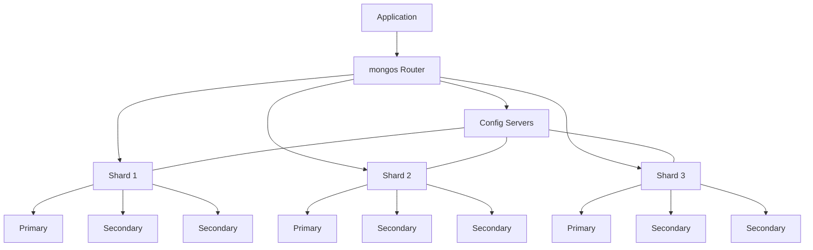

# MongoDB Sharding Introduction

## What is Sharding?

Sharding is a database architecture pattern related to **horizontal scaling** — distributing data across multiple machines to handle larger loads and store more data than a single server could manage. In MongoDB, sharding refers to the process of splitting data across multiple servers (or clusters) to distribute the read/write load and storage requirements.

As your application grows and database operations increase, a single server may not be sufficient to handle the workload or store all the data. This is where sharding comes in as a scaling strategy.

<br />

## Why Do We Need Sharding?

Before diving deeper into the concepts, let's understand why sharding becomes necessary:

- **Storage limitations**: When your data exceeds the storage capacity of a single server
- **Throughput constraints**: When read/write operations exceed what a single server can handle
- **High availability**: To ensure your database remains operational even if some servers fail
- **Geographic distribution**: To reduce latency by placing data closer to users

Without sharding, your only scaling option would be **vertical scaling** (adding more CPU, RAM, or storage to a single server), which has physical and practical limitations.

## Sharded Cluster Components

A MongoDB sharded cluster consists of three main components:



1. **Shard**: Each shard is a separate MongoDB instance that holds a portion of the sharded data. In production environments, each shard is typically a replica set for high availability.

2. **Config Servers**: These store the metadata about the cluster, including which data is located on which shard. Config servers are deployed as a replica set.

3. **mongos Router**: This is the query router that directs operations to the appropriate shard(s). Your application connects to the mongos router, which then interacts with the shards.

<br />

## How MongoDB Sharding Works

### Shard Keys

The most important concept in MongoDB sharding is the **shard key**. This is a field or combination of fields that MongoDB uses to distribute data across shards.

Choosing an effective shard key is critical because it determines:

- How evenly data is distributed
- How efficiently queries can be routed
- The scalability of write operations

A shard key must be:
- Present in every document
- Indexed (either as a single field index or as the prefix of a compound index)
- Immutable (cannot be changed once set)

### Example: Setting Up a Sharded Collection

Here's a basic example of how to enable sharding on a database and collection:

```javascript
// Connect to mongos router
mongos> use myapp

// Enable sharding for the database
mongos> sh.enableSharding("myapp")

// Create an index on the field you want to use as the shard key
mongos> db.users.createIndex({ "userId": 1 })

// Shard the collection using the userId field as the shard key
mongos> sh.shardCollection("myapp.users", { "userId": 1 })
```

In this example, we've sharded the `users` collection using `userId` as the shard key.

### Sharding Strategies

MongoDB offers three sharding strategies:

#### 1. Range Sharding

Data is divided into contiguous ranges determined by the shard key values.

```javascript
// Example of range sharding
mongos> sh.shardCollection("myapp.users", { "age": 1 })
```

With this setup, users might be distributed like:
- Shard 1: Users with age 0-30
- Shard 2: Users with age 31-60
- Shard 3: Users with age 61+

Range sharding is ideal for queries that need to retrieve a range of values, but can lead to hotspots if the data isn't evenly distributed.

#### 2. Hash Sharding

MongoDB computes a hash of the shard key field's value and uses this hash to distribute data.

```javascript
// Example of hash sharding
mongos> sh.shardCollection("myapp.users", { "userId": "hashed" })
```

Hash sharding ensures a more random distribution of data across shards but makes range queries less efficient.

#### 3. Zone Sharding

Data is assigned to specific shards based on a field or set of fields.

```javascript
// Example of setting up zone sharding
mongos> sh.addShardToZone("shard0001", "US")
mongos> sh.addShardToZone("shard0002", "EU")
mongos> sh.addShardToZone("shard0003", "ASIA")

mongos> sh.updateZoneKeyRange("myapp.users", { "country": "US" }, { "country": "US\uffff" }, "US")
mongos> sh.updateZoneKeyRange("myapp.users", { "country": "FR" }, { "country": "FR\uffff" }, "EU")
mongos> sh.updateZoneKeyRange("myapp.users", { "country": "JP" }, { "country": "JP\uffff" }, "ASIA")
```

Zone sharding is useful for data sovereignty or keeping certain data close to specific geographic user bases.

## Real-World Application Example

Let's consider an example of a social media application with millions of users and posts.

### Problem Statement

- The application has 50 million users and growing
- Each user has an average of 500 posts
- The application needs to handle 10,000 reads and 1,000 writes per second
- Total data volume is approaching several terabytes

### Solution with Sharding

```javascript
// Connect to mongos
mongos> use socialmedia

// Enable sharding for the database
mongos> sh.enableSharding("socialmedia")

// For the users collection, shard by userId (hash-based for even distribution)
mongos> db.users.createIndex({ "userId": 1 })
mongos> sh.shardCollection("socialmedia.users", { "userId": "hashed" })

// For the posts collection, shard by a compound key of userId and timestamp
// This allows efficient retrieval of a user's posts in time order
mongos> db.posts.createIndex({ "userId": 1, "timestamp": 1 })
mongos> sh.shardCollection("socialmedia.posts", { "userId": 1, "timestamp": 1 })
```

### Benefits in This Scenario

1. **Horizontal Scalability**: As user count grows, new shards can be added to accommodate more data.
   
2. **Improved Performance**: Reads and writes for a specific user's data go to the same shard, reducing latency.

3. **Query Efficiency**: When fetching a user's timeline, the mongos router can target only the relevant shard(s).

4. **High Availability**: With replica sets used for each shard, the system remains operational even if individual servers fail.

## Monitoring Sharded Clusters

Once your sharding is set up, monitoring becomes crucial. Here's how to check the status and distribution of your shards:

```javascript
// Check status of the sharded cluster
mongos> sh.status()

// Get sharding statistics
mongos> db.adminCommand({ "serverStatus": 1 }).sharding

// Check chunk distribution for a collection
mongos> db.getSiblingDB("config").chunks.aggregate([
  { $match: { ns: "myapp.users" } },
  { $group: { _id: "$shard", count: { $sum: 1 } } }
])
```

## Best Practices for Effective Sharding

1. **Choose shard keys carefully**:
   - Avoid monotonically increasing/decreasing fields (like automatic timestamps)
   - Look for high-cardinality fields with good distribution
   - Consider your most common query patterns

2. **Pre-split data** for new collections with significant initial data:

```javascript
// Example of pre-splitting chunks for a user collection
// This creates chunks ready to be distributed across shards
for (let i = 1; i <= 10; i++) {
  mongos> sh.splitAt("myapp.users", { userId: i * 1000000 })
}
```

3. **Balance your shards regularly** by monitoring the distribution.

4. **Index properly** to support your shard key and common queries.

5. **Always use replica sets** for each shard in production environments.

## Challenges and Considerations

While sharding provides tremendous scaling benefits, it also introduces complexity:

- **Operations Overhead**: Managing multiple servers instead of one
- **Complexity in Backup and Recovery**: Multiple shards need coordinated backup strategies
- **Query Planning**: Some queries may hit multiple shards and require aggregation
- **Shard Key Selection**: Once chosen, changing a shard key requires rebuilding the collection

## Summary

MongoDB sharding provides a powerful way to horizontally scale your database across multiple servers, offering solutions for both storage capacity and performance challenges. By distributing your data across multiple machines, you can:

- Store virtually limitless amounts of data
- Handle higher throughput of read and write operations
- Maintain high availability even during server failures
- Optimize data locality for global applications

Successful sharding hinges on careful planning, especially the selection of appropriate shard keys based on your data access patterns. When implemented correctly, sharding allows your MongoDB deployment to grow seamlessly with your application.

## Additional Resources

- [MongoDB Official Sharding Documentation](https://www.mongodb.com/docs/manual/sharding/)
- [Choosing a Shard Key](https://www.mongodb.com/docs/manual/core/sharding-shard-key/)
- [Manage Sharded Clusters](https://www.mongodb.com/docs/manual/tutorial/manage-sharded-cluster-balancer/)

## Exercises

1. Design a shard key for an e-commerce database with collections for products, users, and orders. Justify your choice for each collection.

2. Set up a local sharded MongoDB cluster with three shards using MongoDB's Docker images.

3. Write a script to insert test data into a sharded collection and observe how the data is distributed across shards.

4. Analyze a case where range sharding would be better than hash sharding, and vice versa.