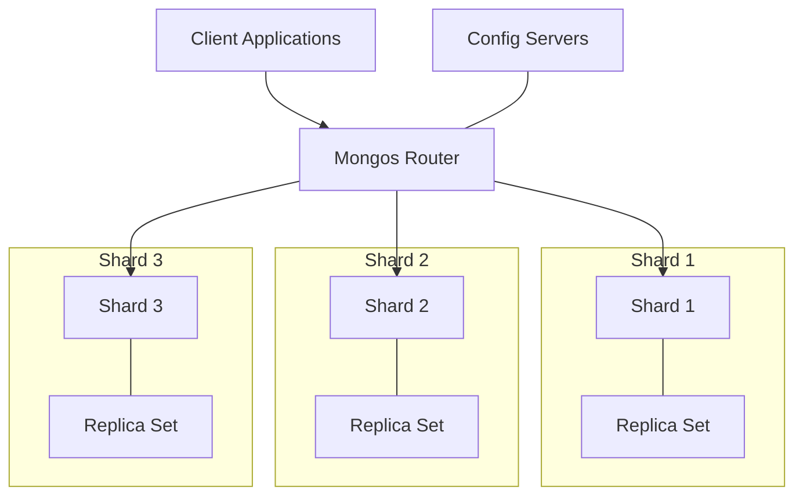

# MongoDB Sharded Cluster

## Introduction

MongoDB sharded clusters provide a method for distributing data across multiple machines to support deployments with very large data sets and high throughput operations. As your data grows, a single server might not be sufficient to store all your data or handle the required request load. Sharding solves this by horizontally scaling your database, spreading your data across multiple machines.

In this guide, we'll explore what a MongoDB sharded cluster is, its components, how to set one up, and best practices for managing it effectively.

## What is a MongoDB Sharded Cluster?

A sharded cluster is a collection of MongoDB instances that work together to distribute data horizontally across multiple servers or "shards." This approach allows MongoDB to support very large data sets and high throughput operations that a single server couldn't handle on its own.



## Components of a Sharded Cluster

A MongoDB sharded cluster consists of three main components:

### 1. Shard

Shards contain a subset of the sharded data. Each shard is deployed as a replica set for redundancy and high availability.

### 2. Mongos Router

The `mongos` instances act as query routers, providing an interface between client applications and the sharded cluster. They direct operations to the appropriate shard(s).

### 3. Config Servers

Config servers store the cluster's metadata, including which data is on which shard. In production environments, config servers are deployed as a replica set (CSRS - Config Server Replica Set).

## How MongoDB Sharding Works

### Shard Keys

A shard key is the indexed field or fields MongoDB uses to distribute documents among shards. The choice of shard key significantly impacts the cluster's performance, efficiency, and scalability.

Good shard keys should:
- Have high cardinality (many possible values)
- Experience evenly distributed write operations
- Allow queries to target specific shards

### Chunks

MongoDB divides sharded data into chunks. Each chunk has an inclusive lower bound and an exclusive upper bound based on the shard key values. When a chunk grows beyond the configured chunk size (default 64MB), MongoDB performs a split operation, breaking it into smaller chunks.

### Balancing

The balancer is a background process that runs to ensure an even distribution of chunks across all shards in the cluster. If it detects an uneven distribution, it migrates chunks from more loaded shards to less loaded ones.

## Setting Up a MongoDB Sharded Cluster

Let's walk through the steps to set up a basic sharded cluster. For demonstration purposes, we'll set up a small cluster on a single machine, but in production, you would deploy each component on separate servers.

### Step 1: Start Config Server Replica Set

First, create directories for each config server:

```bash
mkdir -p ~/mongodb/configdb1 ~/mongodb/configdb2 ~/mongodb/configdb3
```

Start the config servers:

```bash
mongod --configsvr --replSet configRS --port 27019 --dbpath ~/mongodb/configdb1
mongod --configsvr --replSet configRS --port 27020 --dbpath ~/mongodb/configdb2
mongod --configsvr --replSet configRS --port 27021 --dbpath ~/mongodb/configdb3
```

Initialize the config server replica set:

```javascript
mongo --port 27019
> rs.initiate({
   _id: "configRS",
   configsvr: true,
   members: [
      { _id: 0, host: "localhost:27019" },
      { _id: 1, host: "localhost:27020" },
      { _id: 2, host: "localhost:27021" }
   ]
})
```

### Step 2: Start Shard Replica Sets

Create directories for each shard:

```bash
mkdir -p ~/mongodb/shard1/rs1 ~/mongodb/shard1/rs2 ~/mongodb/shard1/rs3
mkdir -p ~/mongodb/shard2/rs1 ~/mongodb/shard2/rs2 ~/mongodb/shard2/rs3
```

Start the shard replica sets:

```bash
# Shard 1
mongod --shardsvr --replSet shard1RS --port 27022 --dbpath ~/mongodb/shard1/rs1
mongod --shardsvr --replSet shard1RS --port 27023 --dbpath ~/mongodb/shard1/rs2
mongod --shardsvr --replSet shard1RS --port 27024 --dbpath ~/mongodb/shard1/rs3

# Shard 2
mongod --shardsvr --replSet shard2RS --port 27025 --dbpath ~/mongodb/shard2/rs1
mongod --shardsvr --replSet shard2RS --port 27026 --dbpath ~/mongodb/shard2/rs2
mongod --shardsvr --replSet shard2RS --port 27027 --dbpath ~/mongodb/shard2/rs3
```

Initialize each shard replica set:

```javascript
// Initialize Shard 1
mongo --port 27022
> rs.initiate({
   _id: "shard1RS",
   members: [
      { _id: 0, host: "localhost:27022" },
      { _id: 1, host: "localhost:27023" },
      { _id: 2, host: "localhost:27024" }
   ]
})

// Initialize Shard 2
mongo --port 27025
> rs.initiate({
   _id: "shard2RS",
   members: [
      { _id: 0, host: "localhost:27025" },
      { _id: 1, host: "localhost:27026" },
      { _id: 2, host: "localhost:27027" }
   ]
})
```

### Step 3: Start mongos Router

Start the `mongos` router:

```bash
mongos --configdb configRS/localhost:27019,localhost:27020,localhost:27021 --port 27017
```

### Step 4: Add Shards to the Cluster

Connect to the `mongos` and add the shards:

```javascript
mongo --port 27017
> sh.addShard("shard1RS/localhost:27022,localhost:27023,localhost:27024")
> sh.addShard("shard2RS/localhost:27025,localhost:27026,localhost:27027")
```

### Step 5: Enable Sharding for a Database and Collection

Enable sharding for a database and shard a collection:

```javascript
mongo --port 27017
> sh.enableSharding("mydb")
> db.mydb.users.createIndex({ userId: 1 })  // Create an index on the shard key
> sh.shardCollection("mydb.users", { userId: 1 })
```

## Working with a Sharded Cluster

### Checking Sharding Status

To see the status of your sharded cluster:

```javascript
mongo --port 27017
> sh.status()
```

This command provides information about the shards, databases, collections, and chunks in your cluster.

### Querying Sharded Collections

Queries in a sharded environment work just like in a regular MongoDB deployment:

```javascript
db.users.find({ age: { $gt: 30 } })
```

The `mongos` router will determine which shards to query based on the query and the shard key.

### Example: Targeted vs. Scatter-Gather Queries

#### Targeted Query (Efficient)

If your query includes the shard key, MongoDB can target specific shards:

```javascript
// If userId is the shard key
db.users.find({ userId: "user123" })
```

#### Scatter-Gather Query (Less Efficient)

Without the shard key in the query, MongoDB must query all shards:

```javascript
// This query must check all shards
db.users.find({ lastName: "Smith" })
```

## Real-world Application: E-commerce Platform

Let's consider an e-commerce platform with billions of product listings and millions of users. To handle this scale efficiently, we can shard our database.

### Sharding Strategy

1. **Products Collection**:
   - Shard key: `{ category: 1, productId: 1 }`
   - Rationale: Products are often queried by category, and using a compound shard key with productId ensures high cardinality.

2. **Orders Collection**:
   - Shard key: `{ userId: 1, orderDate: -1 }`
   - Rationale: Orders are typically accessed by user and recent orders are accessed more frequently.

### Implementation Code

```javascript
// Connect to mongos
const MongoClient = require('mongodb').MongoClient;
const client = new MongoClient('mongodb://localhost:27017');

async function setupSharding() {
  try {
    await client.connect();
    const admin = client.db('admin');
    
    // Enable sharding for the ecommerce database
    await admin.command({ enableSharding: 'ecommerce' });
    
    // Create indices for shard keys
    const db = client.db('ecommerce');
    await db.collection('products').createIndex({ category: 1, productId: 1 });
    await db.collection('orders').createIndex({ userId: 1, orderDate: -1 });
    
    // Shard the collections
    await admin.command({ 
      shardCollection: 'ecommerce.products', 
      key: { category: 1, productId: 1 } 
    });
    
    await admin.command({ 
      shardCollection: 'ecommerce.orders', 
      key: { userId: 1, orderDate: -1 } 
    });
    
    console.log('Sharding configured successfully');
  } catch (err) {
    console.error('Error setting up sharding:', err);
  } finally {
    await client.close();
  }
}

setupSharding();
```

### Querying the Sharded Collections

```javascript
async function queryProducts() {
  try {
    await client.connect();
    const db = client.db('ecommerce');
    
    // Efficient query (uses shard key)
    const electronicsProducts = await db.collection('products')
      .find({ category: 'electronics' })
      .limit(10)
      .toArray();
      
    console.log('Electronics products:', electronicsProducts);
    
    // Less efficient query (scatter-gather)
    const discountedProducts = await db.collection('products')
      .find({ onSale: true })
      .limit(10)
      .toArray();
      
    console.log('Discounted products:', discountedProducts);
  } catch (err) {
    console.error('Error querying products:', err);
  } finally {
    await client.close();
  }
}
```

## Best Practices for Sharded Clusters

1. **Choose the right shard key**:
   - High cardinality
   - Low frequency rate of change
   - Even distribution of writes
   - Supports targeted queries

2. **Size your chunks appropriately**:
   - Default chunk size is 64MB
   - Consider adjusting based on your data access patterns

3. **Plan for capacity**:
   - Add shards before you reach capacity
   - Monitor disk usage on all shards

4. **Use replica sets for each shard**:
   - Ensures high availability
   - Minimum 3 nodes per replica set recommended

5. **Regular monitoring**:
   - Watch for chunk migrations
   - Monitor balancer activity
   - Check for jumbo chunks that can't be moved

## Common Challenges and Solutions

### Challenge: Jumbo Chunks

**Problem**: Chunks that are too large to be moved by the balancer.

**Solution**:
```javascript
// Check for jumbo chunks
db.getSiblingDB("config").chunks.find({ "jumbo" : true })

// Pre-split your data range to avoid jumbo chunks
sh.splitAt("mydb.users", { userId: "user5000" })
sh.splitAt("mydb.users", { userId: "userA000" })
```

### Challenge: Poor Shard Key Selection

**Problem**: Uneven data distribution due to a poor shard key choice.

**Solution**: For new collections, choose a better shard key. For existing collections, you may need to:

1. Create a new collection with a better shard key
2. Migrate data from the old collection
3. Replace the old collection with the new one

## Summary

MongoDB sharded clusters provide horizontal scaling for large databases by distributing data across multiple servers. Key components include shards (which store your data), config servers (which store metadata), and `mongos` routers (which direct queries).

Proper shard key selection is critical for performance and balanced data distribution. When implemented correctly, sharding allows MongoDB to handle massive datasets and high throughput operations that would be impossible on a single server.

A successful sharding strategy involves careful planning, proper monitoring, and an understanding of your data access patterns.

## Additional Resources

- [MongoDB Sharding Documentation](https://docs.mongodb.com/manual/sharding/)
- [Choosing a Shard Key](https://docs.mongodb.com/manual/core/sharding-shard-key/)
- [Deploy a Sharded Cluster](https://docs.mongodb.com/manual/tutorial/deploy-shard-cluster/)

## Practice Exercises

1. Set up a local sharded cluster with two shards and one replica set per shard.
2. Create a collection with 100,000 documents and shard it using a field of your choice.
3. Write queries that target a specific shard and observe the performance difference compared to scatter-gather queries.
4. Experiment with different shard keys on the same dataset and observe the distribution of chunks.

Remember that sharding is a powerful but complex feature. It's best to thoroughly understand your data and access patterns before implementing sharding in a production environment.