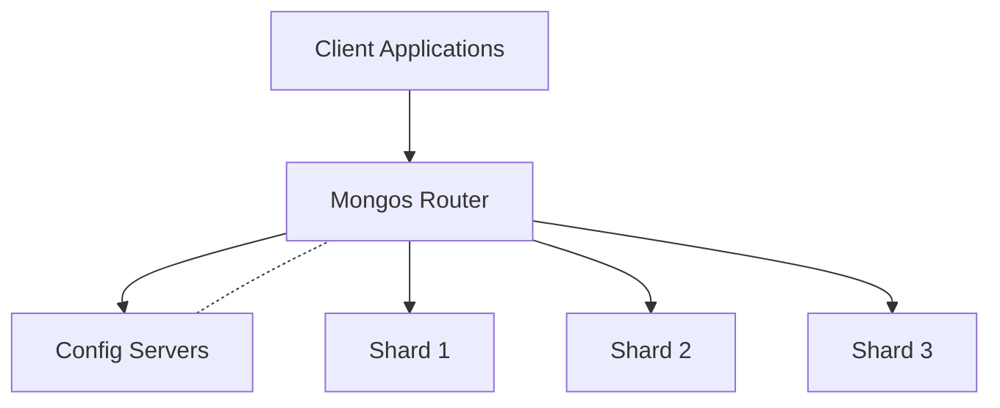
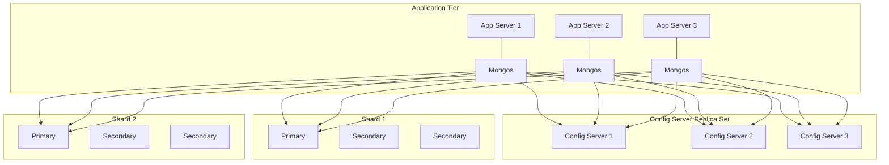

# MongoDB Mongos Routers

## Introduction

In a MongoDB sharded cluster, the **mongos router** serves as the interface between client applications and the sharded cluster. It plays a critical role in the MongoDB sharding architecture by directing queries to the appropriate shards and aggregating results from multiple shards.

When your data grows beyond the capacity of a single server, MongoDB sharding allows you to distribute your data across multiple machines. The mongos router is the component that makes this distribution transparent to your application.

In this guide, we'll explore:
- What mongos routers are and their purpose
- How mongos routers work in a sharded cluster
- How to deploy and configure mongos routers
- Best practices for mongos deployment
- Common troubleshooting scenarios

## Understanding the Mongos Router

### What is a Mongos Router?

A mongos (pronounced "Mongo S") router is a MongoDB process that acts as a query router, providing an interface between client applications and the sharded cluster. It determines which shard contains the data being requested in a query and routes the operation to the appropriate shard(s).



### Key Responsibilities of Mongos Routers

1. **Query Routing**: Directs operations to the appropriate shard(s)
2. **Results Aggregation**: Combines results from multiple shards into a single result set
3. **Metadata Caching**: Caches shard metadata from config servers
4. **Connection Pooling**: Maintains connection pools to each shard
5. **Authentication**: Authenticates clients and enforces access control

### How Mongos Works

When a client sends a query to a mongos router:

1. The mongos consults its cached metadata (from the config servers) to determine which shard(s) contain the relevant data
2. It routes the query to the appropriate shard(s)
3. If multiple shards are involved, it merges the results
4. It returns the final result to the client

The client application doesn't need to know anything about the sharding configuration—it simply connects to the mongos as if it were a regular MongoDB server.

## Deploying Mongos Routers

### Basic Setup

To start a mongos router, you use the `mongos` executable (instead of the `mongod` executable used for regular MongoDB instances).

Here's a basic example of starting a mongos instance from the command line:

```bash
mongos --configdb configReplSet/configsvr1:27019,configsvr2:27019,configsvr3:27019 --bind_ip localhost,server_IP --port 27017
```

Or through a configuration file:

```yaml
sharding:
  configDB: configReplSet/configsvr1:27019,configsvr2:27019,configsvr3:27019
net:
  port: 27017
  bindIp: localhost,server_IP
```

Then start mongos with:

```bash
mongos --config /path/to/mongos.conf
```

### Connecting to a Mongos Router

Connecting to a mongos router is identical to connecting to a regular MongoDB instance:

```javascript
// Connect to mongos router
const { MongoClient } = require('mongodb');

// Connection URL
const url = 'mongodb://mongos-host:27017';

// Database Name
const dbName = 'myDatabase';

async function main() {
  // Create a new MongoClient
  const client = new MongoClient(url);

  try {
    // Connect to the MongoDB server
    await client.connect();
    console.log('Connected successfully to mongos');

    // Get the database
    const db = client.db(dbName);
    
    // Perform operations as usual
    const collection = db.collection('myCollection');
    const result = await collection.find({}).toArray();
    console.log('Query result:', result);
  } finally {
    await client.close();
  }
}

main().catch(console.error);
```

## Multiple Mongos Routers

In production environments, you typically deploy multiple mongos routers for redundancy and load balancing.

### Load Balancing

Client applications can connect to any mongos in the cluster. To distribute the load:

1. **Client-Side Load Balancing**: Clients maintain a list of mongos routers and implement their own load-balancing strategy.
2. **Hardware Load Balancer**: Deploy a load balancer (like HAProxy, F5, or an AWS ELB) in front of your mongos routers.

Here's an example of HAProxy configuration for mongos load balancing:

```
frontend mongodb_frontend
    bind *:27017
    mode tcp
    default_backend mongodb_backend

backend mongodb_backend
    mode tcp
    balance roundrobin
    server mongos1 mongos1:27017 check
    server mongos2 mongos2:27017 check
    server mongos3 mongos3:27017 check
```

### Deployment Strategies

There are several strategies for deploying mongos routers:

1. **Co-located with Application Servers**: Install mongos on the same servers as your application for minimal network latency.
2. **Dedicated Mongos Tier**: Deploy mongos on dedicated servers for better resource isolation.
3. **Hybrid Approach**: A combination of both strategies based on your workload characteristics.



## Configuration Options

Mongos routers have several important configuration options:

### Essential Configuration Parameters

1. **configDB**: Specifies the config server replica set (required)
2. **port**: The port mongos listens on (default: 27017)
3. **bindIp**: IP addresses mongos binds to
4. **logpath**: Path for log files
5. **keyFile/clusterAuthMode**: Authentication settings

### Performance Tuning Options

1. **maxConns**: Maximum number of simultaneous connections
2. **cursorTimeoutMillis**: How long to keep inactive cursors open
3. **connPoolMaxConnectionsPerHost**: Maximum connections per shard
4. **connPoolMaxInUseConnections**: Maximum in-use connections per shard

Example configuration with performance tuning:

```yaml
sharding:
  configDB: configReplSet/configsvr1:27019,configsvr2:27019,configsvr3:27019
net:
  port: 27017
  bindIp: localhost,server_IP
  maxIncomingConnections: 2000
systemLog:
  destination: file
  path: /var/log/mongodb/mongos.log
  logAppend: true
security:
  keyFile: /path/to/keyfile
setParameter:
  connPoolMaxConnectionsPerHost: 200
  connPoolMaxInUseConnections: 150
  cursorTimeoutMillis: 30000
```

## Practical Example: Setting Up a Complete Sharded Cluster

Let's walk through a complete example of setting up a sharded cluster with mongos routers:

### Step 1: Start the Config Server Replica Set

```bash
# Start each config server
mongod --configsvr --replSet configRS --dbpath /data/configdb --port 27019
```

Initialize the config server replica set:

```javascript
rs.initiate({
  _id: "configRS",
  configsvr: true,
  members: [
    { _id: 0, host: "configsvr1:27019" },
    { _id: 1, host: "configsvr2:27019" },
    { _id: 2, host: "configsvr3:27019" }
  ]
})
```

### Step 2: Set Up Shard Replica Sets

```bash
# Start shard 1 replica set members
mongod --shardsvr --replSet shard1RS --dbpath /data/shard1 --port 27018

# Initialize shard 1 replica set
rs.initiate({
  _id: "shard1RS",
  members: [
    { _id: 0, host: "shard1svr1:27018" },
    { _id: 1, host: "shard1svr2:27018" },
    { _id: 2, host: "shard1svr3:27018" }
  ]
})

# Repeat for shard2RS, shard3RS, etc.
```

### Step 3: Start the Mongos Router

```bash
mongos --configdb configRS/configsvr1:27019,configsvr2:27019,configsvr3:27019 --port 27017
```

### Step 4: Add Shards to the Cluster

Connect to mongos and add the shards:

```javascript
// Connect to mongos
mongo --host localhost --port 27017

// Add shards
sh.addShard("shard1RS/shard1svr1:27018,shard1svr2:27018,shard1svr3:27018")
sh.addShard("shard2RS/shard2svr1:27018,shard2svr2:27018,shard2svr3:27018")
sh.addShard("shard3RS/shard3svr1:27018,shard3svr2:27018,shard3svr3:27018")

// Enable sharding on a database
sh.enableSharding("myDatabase")

// Shard a collection
sh.shardCollection("myDatabase.users", { "userId": 1 })
```

### Step 5: Verify the Sharded Cluster Status

```javascript
// Show sharding status
sh.status()

// Check config databases
use config
db.shards.find().pretty()
db.databases.find().pretty()
db.collections.find().pretty()
```

## Monitoring Mongos Routers

### Important Metrics to Monitor

1. **Connection Count**: Number of active connections
2. **Query Performance**: Average query response time
3. **Memory Usage**: Resident and virtual memory
4. **CPU Usage**: Overall CPU utilization
5. **Network Traffic**: Network I/O

### Using the MongoDB Shell

```javascript
// Connect to mongos
mongo --host mongos-host --port 27017

// Check server status
db.serverStatus()

// Analyze current operations
db.currentOp()

// Get mongos-specific stats
db.adminCommand({ "connPoolStats": 1 })
```

### Using MongoDB Cloud Manager or Ops Manager

MongoDB Cloud Manager and Ops Manager provide comprehensive monitoring solutions for MongoDB deployments, including mongos routers. These tools offer:

- Real-time monitoring of all mongos instances
- Alerts for performance issues
- Historical performance data
- Detailed metrics on query performance

## Troubleshooting Common Mongos Issues

### Connection Issues

**Problem**: Clients cannot connect to mongos
**Solution**:
1. Verify mongos is running: `ps aux | grep mongos`
2. Check if it's listening on the expected port: `netstat -tlnp | grep mongos`
3. Confirm network connectivity: `telnet mongos-host 27017`
4. Review the mongos log for errors: `tail -f /var/log/mongodb/mongos.log`

### Performance Issues

**Problem**: Slow queries through mongos
**Solution**:
1. Enable profiling: `db.setProfilingLevel(1, 100)` (log operations taking more than 100ms)
2. Check explain plans: `db.collection.find().explain()`
3. Verify shard key distribution: `db.collection.getShardDistribution()`
4. Check for jumbo chunks: `use config; db.chunks.find({jumbo: true})`

### Metadata Refresh Issues

**Problem**: Stale metadata or chunk migration issues
**Solution**:
1. Force metadata refresh: `db.adminCommand({ flushRouterConfig: 1 })`
2. Check balancer status: `sh.getBalancerState()`
3. Review changelog: `use config; db.changelog.find().sort({time:-1}).limit(10)`

## Best Practices for Mongos Deployment

1. **Deploy multiple mongos routers** for redundancy and load distribution
2. **Locate mongos close to your application servers** to minimize network latency
3. **Scale mongos horizontally** based on application load
4. **Monitor mongos performance** regularly
5. **Keep mongos versions consistent** across your deployment
6. **Upgrade mongos instances** before upgrading the shard and config servers
7. **Set appropriate connection pool sizes** based on your workload

## Summary

Mongos routers are the gateway to your sharded MongoDB cluster, providing a unified interface for client applications. They handle the complex work of routing queries to the appropriate shards and aggregating results, making the sharded architecture transparent to applications.

Key takeaways:
- Mongos routers direct operations to the appropriate shards
- They maintain no persistent state—all metadata is stored in the config servers
- For production deployments, use multiple mongos instances for redundancy
- Place mongos routers close to your application servers for optimal performance
- Monitor mongos instances regularly to ensure optimal operation

## Additional Resources

- **MongoDB Documentation**: [MongoDB Sharding](https://docs.mongodb.com/manual/sharding/)
- **MongoDB University**: Free courses on MongoDB sharding and architecture
- **MongoDB Blog**: Technical articles and best practices

## Exercises

1. Set up a local test sharded cluster with two shards and a mongos router
2. Write a script that connects to a mongos router and inserts data across multiple shards
3. Experiment with different shard keys to observe their effect on data distribution
4. Configure a simple load balancer (like HAProxy) in front of multiple mongos instances
5. Simulate a failure of one mongos router and observe how applications can seamlessly connect to another

By understanding and properly configuring mongos routers, you can build scalable MongoDB deployments that grow with your application's needs while maintaining consistent performance.