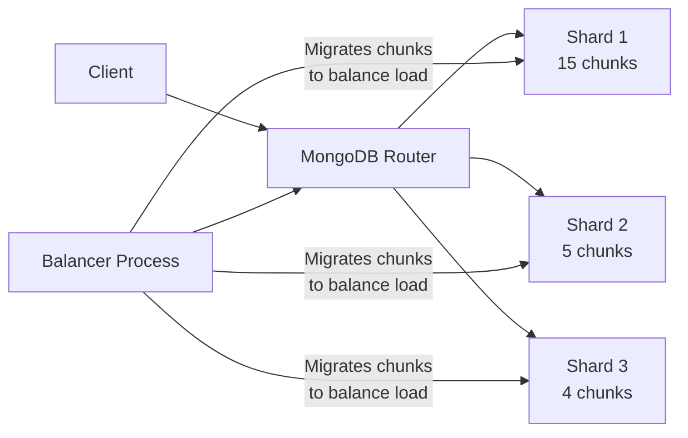

# MongoDB Balancing

In a MongoDB sharded environment, **balancing** refers to the process of evenly distributing data chunks across all shards in the cluster. This is a critical component of MongoDB's horizontal scaling capabilities, ensuring no single shard becomes a bottleneck by carrying a disproportionate amount of data or workload.

## Understanding MongoDB Balancing

### What is Balancing?

When you shard a collection in MongoDB, the data is divided into chunks based on the shard key. Initially, all chunks might be on a single shard. The MongoDB balancer is a background process that monitors the distribution of chunks across shards and automatically migrates chunks between shards to ensure an even distribution.



### How Balancing Works

1. **Chunk Size**: By default, chunks in MongoDB have a maximum size of 64MB.
2. **Migration Threshold**: The balancer moves chunks when the difference in chunk count between the shard with the most chunks and the shard with the fewest chunks exceeds the migration threshold.
3. **Migration Process**: During migration, the balancer copies a chunk from the source shard to the destination shard, then redirects reads and writes for that chunk's key range to the new location.

## The Balancer Process in Detail

### Balancer Components

The MongoDB balancer consists of two main components:

1. **Balancer Coordinator**: Runs on the primary node of the config server replica set.
2. **Chunk Migration Process**: Executed by the mongod instances on the source and destination shards.

### Balancing Round

A balancing round consists of these steps:

1. **Detecting imbalance**: The balancer examines the distribution of chunks across shards.
2. **Finding migration candidates**: It identifies which chunks should be moved from which shard to which other shard.
3. **Performing migrations**: It executes the migrations one at a time.

Let's see the process in action:

```javascript
// Check the current balancer status
db.admin().runCommand({ balancerStatus: 1 })

// Sample output:
{
  "mode": "full",
  "inBalancerRound": false,
  "numMigrationsRunning": 0,
  "ok": 1
}
```

To see the chunk distribution across shards:

```javascript
// Get chunk distribution
db.adminCommand({ listShards: 1 })

// Sample output:
{
  "shards": [
    {
      "_id": "shard0000",
      "host": "shard0/localhost:27018,localhost:27019,localhost:27020",
      "state": 1
    },
    {
      "_id": "shard0001",
      "host": "shard1/localhost:27021,localhost:27022,localhost:27023",
      "state": 1
    }
  ],
  "ok": 1
}

// Check the chunk distribution for a collection
use config
db.chunks.aggregate([
  { $group: { _id: "$shard", count: { $sum: 1 } } }
])

// Sample output:
{ "_id" : "shard0000", "count" : 42 }
{ "_id" : "shard0001", "count" : 36 }
```

## Controlling the Balancer

MongoDB provides several commands to control the balancer's behavior.

### Enabling/Disabling the Balancer

You might want to disable the balancer during maintenance windows or high-traffic periods:

```javascript
// Disable balancer
sh.stopBalancer()

// Enable balancer
sh.startBalancer()

// Check if balancer is enabled
sh.getBalancerState()
```

### Scheduling Balancer Windows

For production environments, you can schedule balancer activity during off-peak hours:

```javascript
// Set a balancing window (e.g., only between 1:00 AM and 5:00 AM)
db.settings.update(
  { _id: "balancer" },
  { $set: { activeWindow: { start: "01:00", stop: "05:00" } } },
  { upsert: true }
)

// Remove the balancing window
db.settings.update(
  { _id: "balancer" },
  { $unset: { activeWindow: "" } }
)
```

## Monitoring Balancing Operations

### Current Balancer Operations

To see if the balancer is currently running and what migrations are in progress:

```javascript
// Check balancer status
use config
db.adminCommand({ balancerStatus: 1 })

// Check ongoing migrations
db.chunks.find({ "moveTime" : { $exists : true } }).pretty()
```

### Balancer Logs

The balancer logs its activity to the config server's primary node logs. You can examine these logs to track balancer operations:

```javascript
// Connect to the config server primary and check logs
db.adminCommand({ getLog: "global" })
```

## Best Practices for Efficient Balancing

### Choosing the Right Shard Key

The shard key affects how data is distributed and how effectively the balancer can work:

1. **High Cardinality**: Choose a shard key with many different values to ensure even distribution.
2. **Even Distribution**: Avoid shard keys that result in monotonically increasing values (like timestamps), which can lead to hot spots.
3. **Granularity**: The shard key should allow for fine-grained chunk splits.

Here's an example of a good shard key choice:

```javascript
// Good shard key for a user collection: combination of region and userId
db.adminCommand({
  shardCollection: "mydb.users",
  key: { "region": 1, "userId": 1 }
})
```

### Optimizing Chunk Size

You can modify the default chunk size based on your data patterns:

```javascript
// Change the chunk size to 32MB
use config
db.settings.updateOne(
   { _id: "chunksize" },
   { $set: { value: 32 } },
   { upsert: true }
)
```

### Pre-splitting for New Collections

For new sharded collections, pre-splitting can prevent the initial load from all going to a single shard:

```javascript
// Enable sharding for the database
sh.enableSharding("mydb")

// Shard the collection
sh.shardCollection("mydb.products", { "category": 1, "productId": 1 })

// Pre-split the collection to distribute initial load
// Split at category boundaries
sh.splitAt("mydb.products", { "category": "electronics", "productId": MinKey })
sh.splitAt("mydb.products", { "category": "books", "productId": MinKey })
sh.splitAt("mydb.products", { "category": "clothing", "productId": MinKey })

// Move the pre-split chunks to different shards
sh.moveChunk("mydb.products", { "category": "electronics", "productId": MinKey }, "shard0001")
sh.moveChunk("mydb.products", { "category": "books", "productId": MinKey }, "shard0002")
```

## Real-World Example: E-commerce Database

Consider an e-commerce platform with rapidly growing data. Let's set up proper sharding and balancing strategies:

```javascript
// Connect to mongos router
mongo --host mongosHost:27017

// Enable sharding for the e-commerce database
sh.enableSharding("ecommerce")

// Shard the products collection by category and productId
sh.shardCollection("ecommerce.products", { "category": 1, "productId": 1 })

// Shard the orders collection by region and timestamp
// This is better than timestamp alone as it distributes writes across shards
sh.shardCollection("ecommerce.orders", { "customerRegion": 1, "orderTimestamp": 1 })

// Set a balancing window for off-peak hours
db.settings.updateOne(
  { _id: "balancer" },
  { $set: { activeWindow: { start: "01:00", stop: "05:00" } } },
  { upsert: true }
)

// Monitor chunk distribution weekly
db.runCommand({ dataSize: "ecommerce.products" })
db.chunks.aggregate([
  { $match: { ns: "ecommerce.products" } },
  { $group: { _id: "$shard", count: { $sum: 1 }, "avgChunkSize": { $avg: "$size" } } }
])
```

## Troubleshooting Common Balancing Issues

### Stuck Migrations

If a migration gets stuck, you can:

```javascript
// Check for migrations that have been running for too long
use config
db.changelog.find().sort({ time: -1 }).limit(10).pretty()

// If needed, stop the balancer and manually clear the lock
sh.stopBalancer()
db.locks.find({ _id: "balancer" })
db.locks.remove({ _id: "balancer" })
sh.startBalancer()
```

### Imbalanced Data Distribution

If chunks are migrating but data remains imbalanced:

```javascript
// Check the size of chunks across shards
db.chunks.aggregate([
  { $group: { _id: { shard: "$shard", ns: "$ns" }, 
              totalChunks: { $sum: 1 }, 
              avgSize: { $avg: "$size" } } }
])
```

This might indicate issues with your shard key design, which may require a reshard.

## Summary

MongoDB's balancer is a powerful feature that automatically maintains an even distribution of data across shards in your cluster. Key points to remember:

1. The balancer automatically moves chunks between shards to ensure an even distribution.
2. You can control when the balancer runs using scheduling windows.
3. The effectiveness of balancing depends significantly on shard key choice.
4. Pre-splitting collections and monitoring balancer operations are essential practices for large-scale deployments.
5. Balancing works best when it has to do minimal work - good shard key design reduces the need for balancing.

## Additional Resources

- Practice analyzing your shard distribution regularly
- Set up proper monitoring for migration operations, especially in production environments
- Experiment with different shard keys in testing environments before committing to a design

## Exercises

1. Set up a 3-shard MongoDB cluster and create a sharded collection with 1 million documents.
2. Monitor how chunks are distributed initially and how the balancer migrates them.
3. Try different shard keys and compare their balancing efficiency.
4. Implement a balancer window and observe its effects on your cluster performance.
5. Simulate a high-write scenario and analyze how well your balancing configuration handles the load.

By understanding and properly configuring MongoDB's balancing mechanism, you can ensure your sharded cluster remains performant and scalable even as your data grows.