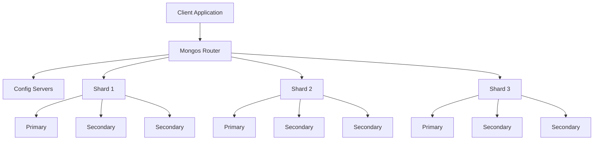

# MongoDB Sharding Operations

## Introduction

MongoDB sharding is a method for distributing data across multiple machines to support deployments with very large data sets and high throughput operations. As your application's data volume and read/write traffic grow, a single server may not be sufficient to handle the load or store all the data. Sharding solves this challenge by horizontally scaling your database across multiple servers.

In this guide, we'll explore the essential operations involved in setting up, managing, and maintaining a MongoDB sharded cluster. We'll cover everything from shard key selection to balancing data across your cluster, along with practical examples to help solidify your understanding.

## Understanding MongoDB Sharded Clusters

Before diving into operations, let's understand the components of a sharded cluster:

1. **Shards**: Each shard contains a subset of the sharded data. Each shard can be a replica set to provide high availability.

2. **Config Servers**: Store metadata and configuration settings for the cluster.

3. **Mongos Routers**: Query routers that interface with client applications and direct operations to the appropriate shard(s).



## Setting Up a Sharded Cluster

Let's walk through the basic steps to set up a sharded cluster. This involves:

1. Setting up config servers
2. Setting up shard replica sets
3. Setting up mongos routers
4. Adding shards to the cluster

Here's a simplified example of how to set up a small sharded cluster:

```javascript
// 1. Start a config server replica set (on 3 different servers)
mongod --configsvr --replSet configRS --port 27019 --dbpath /data/configdb

// On one of the config servers, initiate the replica set
mongo --port 27019
rs.initiate({
  _id: "configRS",
  configsvr: true,
  members: [
    { _id: 0, host: "config1:27019" },
    { _id: 1, host: "config2:27019" },
    { _id: 2, host: "config3:27019" }
  ]
})

// 2. Start each shard as a replica set
// For Shard 1
mongod --shardsvr --replSet shard1RS --port 27018 --dbpath /data/shard1

// Initialize shard1 replica set (on shard1 primary)
mongo --port 27018
rs.initiate({
  _id: "shard1RS",
  members: [
    { _id: 0, host: "shard1svr1:27018" },
    { _id: 1, host: "shard1svr2:27018" },
    { _id: 2, host: "shard1svr3:27018" }
  ]
})

// Repeat for other shards...

// 3. Start mongos router
mongos --configdb configRS/config1:27019,config2:27019,config3:27019 --port 27017

// 4. Add shards to the cluster (connect to mongos)
mongo --port 27017
sh.addShard("shard1RS/shard1svr1:27018,shard1svr2:27018,shard1svr3:27018")
sh.addShard("shard2RS/shard2svr1:27018,shard2svr2:27018,shard2svr3:27018")
```

## Enabling Sharding for a Database

Before you can shard collections, you must enable sharding for the database:

```javascript
// Connect to mongos
mongo --port 27017

// Enable sharding for a specific database
sh.enableSharding("myDatabase")
```

## Choosing a Shard Key

The shard key is one of the most critical decisions you'll make when sharding a collection. It determines how MongoDB distributes documents across the shards.

### Criteria for a Good Shard Key:

1. **High Cardinality**: Many different values to ensure even data distribution
2. **Low Frequency**: No single value appears in a large percentage of documents
3. **Non-monotonic**: Doesn't increase or decrease steadily (to avoid hotspots)

### Example Shard Key Selection Scenarios:

| Collection      | Good Shard Key          | Poor Shard Key | Reason                                             |
|-----------------|-------------------------|----------------|----------------------------------------------------|
| User Profiles   | `userId`                | status         | Status has low cardinality (e.g., active/inactive) |
| Product Catalog | `{category, productId}` | createdDate    | Date is monotonically increasing                   |
| Sensor Readings | `{sensorId, timestamp}` | timestamp      | Using only timestamp creates hotspots              |

## Sharding a Collection

Once you've selected a shard key, you can shard your collection:

```javascript
// First, create an index on the shard key
db.products.createIndex({ category: 1, productId: 1 })

// Then shard the collection
sh.shardCollection("myDatabase.products", { category: 1, productId: 1 })
```

## Shard Key Strategies

### Ranged Sharding

The default sharding strategy divides data into ranges based on the shard key values:

```javascript
// Ranged sharding (default)
sh.shardCollection("myDatabase.users", { lastName: 1, firstName: 1 })
```

### Hashed Sharding

Hashed sharding distributes data more randomly for more even distribution:

```javascript
// First create a hashed index
db.users.createIndex({ userId: "hashed" })

// Shard using the hashed key
sh.shardCollection("myDatabase.users", { userId: "hashed" })
```

### Considerations:

- **Range sharding** is better for queries that select ranges of shard key values
- **Hash sharding** provides more even data distribution but doesn't support efficient range queries

## Working with Chunks

MongoDB divides sharded data into chunks. Understanding and managing chunks is crucial for maintaining a balanced cluster.

### Viewing Chunk Information

```javascript
// Connect to mongos
mongo --port 27017

// Get information about chunks in a collection
use config
db.chunks.find({ ns: "myDatabase.products" }).pretty()

// Get chunk distribution across shards
db.chunks.aggregate([
  { $match: { ns: "myDatabase.products" } },
  { $group: { _id: "$shard", count: { $sum: 1 } } }
])
```

### Managing Chunk Size

The default chunk size is 64MB. You can modify it if needed:

```javascript
use config
db.settings.updateOne(
   { _id: "chunksize" },
   { $set: { value: 64 } },  // Size in MB
   { upsert: true }
)
```

## Balancing Data in a Sharded Cluster

MongoDB automatically balances chunks across shards. You can also control this process:

```javascript
// Check if the balancer is currently running
sh.isBalancerRunning()

// Check balancer status
sh.getBalancerState()

// Enable or disable the balancer
sh.setBalancerState(true)  // or false to disable

// Schedule balancing window (e.g., only run during off-peak hours)
db.settings.updateOne(
   { _id: "balancer" },
   { $set: { activeWindow: { start: "01:00", stop: "05:00" } } },
   { upsert: true }
)
```

## Working with Zones

Zones (previously called tag-aware sharding) allow you to associate shards with specific geographic regions, hardware types, or other criteria.

### Creating Zones

```javascript
// Add a shard to a zone
sh.addShardToZone("shard0000", "US-EAST")
sh.addShardToZone("shard0001", "US-WEST")

// Add zone ranges to a collection
sh.updateZoneKeyRange(
   "myDatabase.users",
   { "address.state": "NY" },
   { "address.state": "PA" },
   "US-EAST"
)

sh.updateZoneKeyRange(
   "myDatabase.users",
   { "address.state": "CA" },
   { "address.state": "WA" },
   "US-WEST"
)
```

### Removing Zone Ranges

```javascript
sh.removeRangeFromZone(
   "myDatabase.users",
   { "address.state": "NY" },
   { "address.state": "PA" }
)
```

## Monitoring a Sharded Cluster

Regular monitoring helps ensure your sharded cluster operates efficiently.

### Basic Monitoring Commands

```javascript
// Get cluster status overview
sh.status()

// Check database sharding status
db.printShardingStatus()

// Check for any balancing issues
use config
db.actionlog.find().sort({ time: -1 }).limit(10)

// View distribution statistics
db.stats()

// View sharding statistics for a collection
db.products.stats({ sharded: true })
```

### Identifying Jumbo Chunks

Jumbo chunks are too large for the balancer to move. They need special attention:

```javascript
use config
db.chunks.find({ "jumbo": true }).pretty()
```

## Practical Example: E-commerce Database Sharding

Let's consider sharding a database for an e-commerce application:

### Database Design and Sharding Strategy

```javascript
// Enable sharding for the ecommerce database
sh.enableSharding("ecommerce")

// 1. Orders collection: shard by customer ID (hash-based)
db.orders.createIndex({ customerId: "hashed" })
sh.shardCollection("ecommerce.orders", { customerId: "hashed" })

// 2. Products collection: shard by category and productId (range-based)
db.products.createIndex({ category: 1, productId: 1 })
sh.shardCollection("ecommerce.products", { category: 1, productId: 1 })

// 3. Customers collection: shard by location and customerId
db.customers.createIndex({ country: 1, customerId: 1 })
sh.shardCollection("ecommerce.customers", { country: 1, customerId: 1 })
```

### Setting up Zones by Geography

```javascript
// Create zones for different regions
sh.addShardToZone("shard0000", "EUROPE")
sh.addShardToZone("shard0001", "AMERICAS")
sh.addShardToZone("shard0002", "ASIA")

// Assign customers to zones based on geography
sh.updateZoneKeyRange(
  "ecommerce.customers", 
  { country: "DE" }, 
  { country: "GB" }, 
  "EUROPE"
)

sh.updateZoneKeyRange(
  "ecommerce.customers", 
  { country: "US" }, 
  { country: "MX" }, 
  "AMERICAS"
)

sh.updateZoneKeyRange(
  "ecommerce.customers", 
  { country: "CN" }, 
  { country: "JP" }, 
  "ASIA"
)
```

### Querying Data in a Sharded Collection

When you query a sharded collection, MongoDB tries to target the query to specific shards when possible:

```javascript
// This query is "targeted" - only runs on the shard containing US customers
db.customers.find({ country: "US" })

// This query doesn't include the shard key and must be sent to all shards
db.customers.find({ membership: "premium" })
```

## Common Sharding Issues and Solutions

### 1. Uneven Data Distribution

**Symptom**: One shard has significantly more chunks than others.

**Solution**:
```javascript
// Check chunk distribution
use config
db.chunks.aggregate([
  { $group: { _id: "$shard", count: { $sum: 1 } } }
])

// Jumbo chunks may be preventing balancing
db.chunks.find({ jumbo: true })

// Consider re-evaluating your shard key if distribution is consistently uneven
```

### 2. Missing Shard Key in Queries

**Symptom**: Slow queries that need to contact all shards.

**Solution**: Include the shard key in your queries whenever possible:

```javascript
// Bad (scatters to all shards)
db.orders.find({ orderDate: { $gt: ISODate("2023-01-01") } })

// Better (uses shard key)
db.orders.find({ 
  customerId: "12345", 
  orderDate: { $gt: ISODate("2023-01-01") } 
})
```

### 3. Handling Growing Collections

As your data grows, you may need to split large chunks manually:

```javascript
// Split chunks at a specific value
sh.splitAt("ecommerce.products", { category: "electronics", productId: 5000 })

// Split a collection into evenly distributed chunks
sh.splitFind("ecommerce.products", { category: "electronics" })
```

## Advanced Sharding Operations

### Changing a Collection's Shard Key (MongoDB 4.4+)

Prior to MongoDB 4.4, you couldn't change a shard key. Now you can:

```javascript
// Refine a shard key by adding a suffix field
db.adminCommand({
  refineCollectionShardKey: "ecommerce.orders",
  key: { customerId: "hashed", orderDate: 1 }
})
```

### Resharding a Collection (MongoDB 5.0+)

Completely changing a shard key:

```javascript
// Start the resharding operation
db.adminCommand({
  reshardCollection: "ecommerce.products",
  key: { supplierId: 1, productId: 1 }
})
```

### Migrating a Sharded Cluster

When you need to migrate your entire cluster to new hardware:

```javascript
// Add new shards but don't remove old ones yet
sh.addShard("newShardRS/server1:27018,server2:27018,server3:27018")

// Update zone ranges to target the new shards
sh.addShardToZone("newShardRS", "NEW-ZONE")

// Let the balancer migrate the data gradually
// Once migration is complete, remove the old shards
sh.removeShardTag("oldShardRS", "OLD-ZONE")
sh.removeShard("oldShardRS")
```

## Summary

MongoDB's sharding capabilities provide powerful ways to horizontally scale your database and handle large volumes of data and traffic. In this guide, we've covered:

- The components of a sharded cluster: shards, config servers, and mongos routers
- How to set up a sharded cluster and enable sharding for databases and collections
- Shard key selection strategies and their impact on performance
- Working with chunks and balancing data across shards
- Using zones for geographically distributed data
- Monitoring and troubleshooting sharded clusters
- Practical examples for e-commerce applications

The key to successful sharding is thorough planning, especially around shard key selection, as this decision impacts data distribution, query efficiency, and overall performance of your sharded cluster.

## Additional Resources and Exercises

### Exercises

1. **Shard Key Selection Practice**: For each of these collections, propose a good shard key and justify your choice:
   - A collection of weather data with readings from sensors worldwide
   - A social media posts collection with billions of posts
   - A financial transactions database tracking customer account activities

2. **Sharded Cluster Setup**: Using MongoDB's Atlas service or local Docker containers, set up a small sharded cluster with two shards and practice sharding a collection.

3. **Performance Analysis**: Create a sharded collection with two different shard keys (in separate tests) and compare the performance for various query patterns.

### Further Learning

- MongoDB documentation on sharding: [https://docs.mongodb.com/manual/sharding/](https://docs.mongodb.com/manual/sharding/)
- MongoDB University courses on scaling MongoDB deployments
- Explore MongoDB's internals to understand how chunks are split, moved, and balanced

Remember that sharding adds complexity to your database architecture, so you should only implement it when you have specific scaling requirements that cannot be met with a replica set alone. Proper planning and regular monitoring are essential for maintaining a healthy sharded cluster.