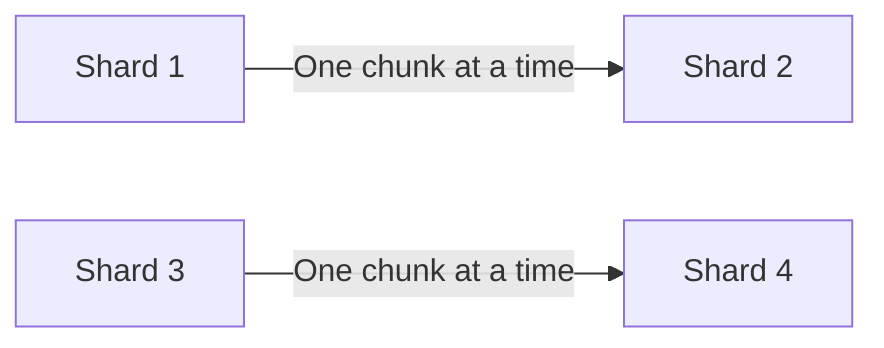
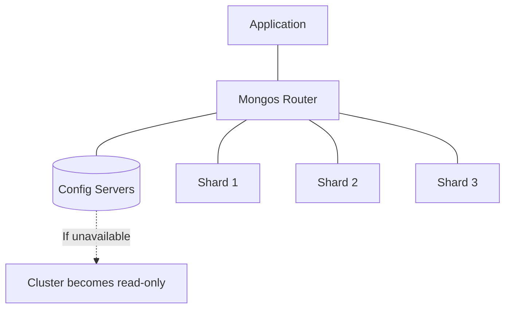

# MongoDB Sharding Limitations

While MongoDB sharding provides powerful horizontal scaling capabilities, it's important to understand its limitations and constraints. This knowledge will help you design better database architectures and avoid potential pitfalls when implementing and maintaining sharded clusters.

## Introduction to Sharding Limitations

MongoDB sharding allows you to distribute data across multiple machines, helping to handle large datasets and high throughput operations. However, like any distributed system, it comes with certain limitations and trade-offs that developers and database administrators should be aware of.

## Shard Key Limitations

### Immutable Shard Keys

Once you choose a shard key for a collection, it cannot be changed without dropping and recreating the collection.

```javascript
// Example: Creating a sharded collection with a shard key
db.adminCommand({
  shardCollection: "mydb.customers",
  key: { customerId: 1 }
})

// If you later realize that sharding by region would be better,
// you cannot simply change it - you would need to recreate the collection
```

### Shard Key Update Restrictions

In versions prior to MongoDB 4.2, you cannot update the shard key values of a document after insertion.

```javascript
// Before MongoDB 4.2:
// This would fail if customerId is part of the shard key
db.customers.updateOne(
  { customerId: 1001 },
  { $set: { customerId: 1002 } }
)
```

Starting from MongoDB 4.2, you can update shard key values, but with restrictions:

```javascript
// In MongoDB 4.2+, this works but has performance implications
db.customers.updateOne(
  { customerId: 1001 },
  { $set: { customerId: 1002 } }
)
```

### Limited Shard Key Modification Options

Once a collection is sharded, you cannot:
- Change the shard key fields
- Change the shard key index type
- Unshard a collection (without rebuilding it)

## Balancing Limitations

### Balancer Performance Impact

The balancer process, which redistributes chunks across shards, consumes resources and can impact cluster performance.

```javascript
// To avoid balancer impact during peak hours, you can schedule balancing windows
use config
db.settings.updateOne(
  { _id: "balancer" },
  { $set: { activeWindow: { start: "20:00", stop: "06:00" } } },
  { upsert: true }
)
```

### Chunk Migration Speed

Chunk migrations happen one at a time per shard, which can make rebalancing slow for large datasets.



## Operational Limitations

### Jumbo Chunks

When chunks become too large (exceeding the maximum size, typically 64MB), they get marked as "jumbo" and cannot be moved by the balancer.

```javascript
// Check for jumbo chunks
use config
db.chunks.find({ "jumbo": true }).pretty()
```

### Configuration Server Dependency

The cluster depends on the config servers being available. If all config servers are down, the cluster becomes read-only.



### Transactions Across Shards

Multi-document transactions that span multiple shards have performance implications and additional constraints.

```javascript
// Multi-shard transaction example with potential performance impact
const session = db.getMongo().startSession();
session.startTransaction();
try {
  session.getDatabase("mydb").orders.insertOne({ order_id: 123, user_id: 456 });
  session.getDatabase("mydb").payments.insertOne({ payment_id: 789, order_id: 123 });
  session.commitTransaction();
} catch (error) {
  session.abortTransaction();
} finally {
  session.endSession();
}
```

## Query Routing Limitations

### Targeted vs. Scatter-Gather Queries

Queries that don't include the shard key must be sent to all shards (scatter-gather), which is less efficient.

```javascript
// Targeted query (efficient) - includes shard key
db.customers.find({ region: "Europe", name: "John" })  // If 'region' is the shard key

// Scatter-gather query (less efficient) - missing shard key
db.customers.find({ name: "John" }) // Must check all shards
```

### $lookup and Joins

`$lookup` operations (joins) that span multiple shards are not supported directly and require application-level handling.

```javascript
// This won't work efficiently if 'orders' and 'customers' 
// are sharded differently
db.orders.aggregate([
  {
    $lookup: {
      from: "customers",
      localField: "customer_id",
      foreignField: "_id",
      as: "customer_details"
    }
  }
])
```

## Administrative Limitations

### Complex Setup and Maintenance

Setting up and maintaining a sharded cluster requires more expertise compared to a replica set.

### Backup Complexity

Taking consistent backups of a sharded cluster is more complex than backing up a single database.

```javascript
// Example of backing up a sharded cluster using mongodump
// You need to shut down the balancer during backup
use admin
db.adminCommand({ balancerStop: 1 })

// Then run mongodump on each shard
// mongodump --host <shard1> --out /backup/shard1
// mongodump --host <shard2> --out /backup/shard2
// ...

// Don't forget to restart the balancer
db.adminCommand({ balancerStart: 1 })
```

## Real-World Examples and Workarounds

### Example 1: E-commerce Product Catalog

**Problem**: An e-commerce site with millions of products wants to shard by product category, but later realized that some categories have much more products than others.

**Solution**: Instead of using just `category` as the shard key, use a compound shard key that includes both category and product ID:

```javascript
// Better shard key design
db.adminCommand({
  shardCollection: "ecommerce.products",
  key: { category: 1, product_id: 1 }
})
```

### Example 2: Managing Jumbo Chunks

**Problem**: A time-series data collection sharded by date is experiencing jumbo chunks for recent dates.

**Solution**: Implement a more granular shard key and use pre-splitting:

```javascript
// More granular shard key
db.adminCommand({
  shardCollection: "metrics.data",
  key: { date: 1, hour: 1, minute: 1 }
})

// Pre-split chunks for expected high-volume periods
for (let hour = 0; hour < 24; hour++) {
  db.adminCommand({
    split: "metrics.data",
    middle: { date: ISODate("2023-10-15"), hour: hour, minute: 0 }
  })
}
```

### Example 3: Working Around Cross-Shard Joins

**Problem**: Need to join data from two differently sharded collections.

**Solution**: Implement application-level joins or denormalize your data:

```javascript
// Application-level join example in Node.js
async function getOrderWithCustomer(orderId) {
  const order = await db.collection('orders').findOne({ _id: orderId });
  if (order) {
    const customer = await db.collection('customers').findOne({ _id: order.customer_id });
    return { ...order, customer };
  }
  return null;
}
```

## Best Practices to Avoid Limitations

1. **Choose shard keys carefully** - Consider data distribution, query patterns, and future growth.

2. **Plan for jumbo chunks** - Pre-split chunks and monitor chunk sizes regularly.

3. **Design for minimal cross-shard operations** - Structure your data to minimize cross-shard queries and transactions.

4. **Schedule balancing windows** - Configure the balancer to run during off-peak hours.

5. **Monitor your cluster** - Use MongoDB Atlas or MongoDB Ops Manager to monitor performance metrics.

## Summary

MongoDB sharding offers tremendous scalability but comes with limitations that affect how you design your database schema, write your queries, and manage your infrastructure. By understanding these limitations upfront, you can design your MongoDB deployment to avoid common pitfalls and create a more effective, scalable database architecture.

Remember that with each MongoDB release, some of these limitations are addressed or improved, so it's always worth checking the most recent MongoDB documentation for updates.

## Additional Resources

- MongoDB Official Documentation on Sharding Limitations
- MongoDB University courses on Sharding
- Consider exploring practical exercises like designing shard keys for different scenarios or implementing strategies to work around the limitations discussed.

## Exercises

1. Design an appropriate shard key for a social media application where users post content and interact with each other's posts.

2. Create a plan for backing up a sharded cluster that contains 5TB of data spread across 6 shards.

3. Describe how you would migrate from a non-sharded MongoDB deployment to a sharded cluster with minimal downtime for a busy e-commerce website.