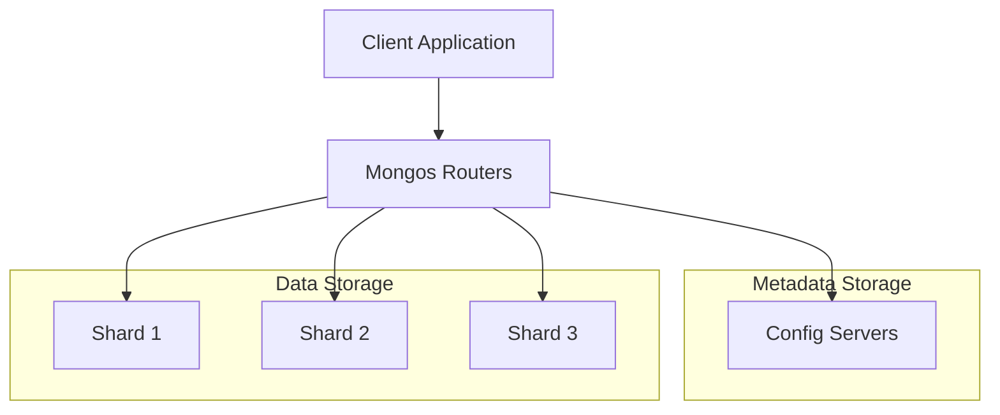
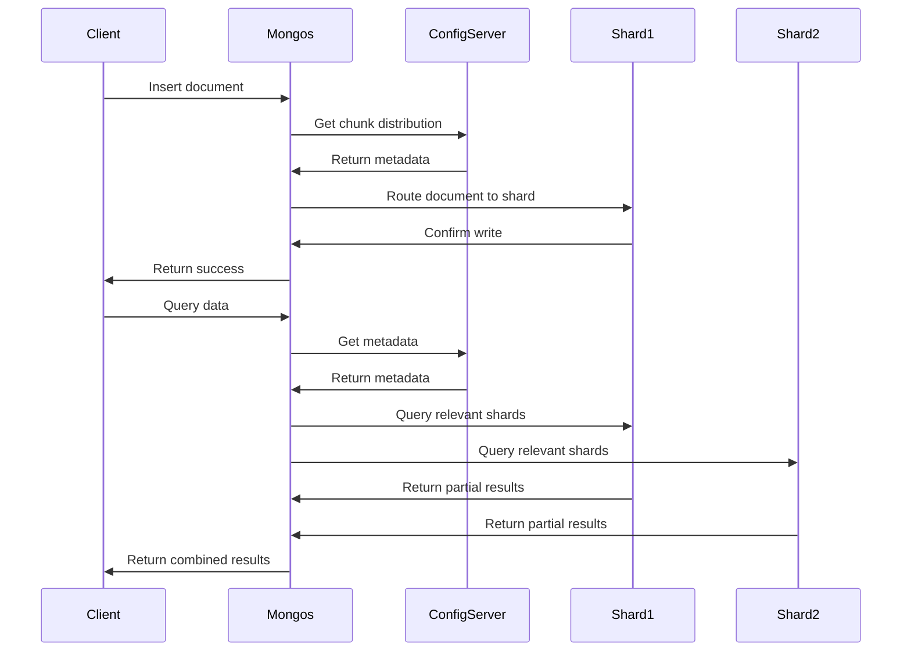

# MongoDB Sharding Components

In a MongoDB sharded cluster, data is distributed across multiple machines to support deployments with very large datasets and high throughput operations. Understanding the core components that make up this architecture is essential for effectively implementing and managing sharded MongoDB deployments.

## Introduction to Sharding Components

MongoDB's sharding system consists of three main components that work together to create a horizontally scalable database:

1. **Shards** - The data containers
2. **Config Servers** - The metadata managers
3. **Mongos Routers** - The query routers

Let's take a deeper look at each component and understand how they function within the sharding ecosystem.



## Shards: The Data Containers

Shards are the containers that hold portions of the sharded data. Each shard is a separate MongoDB instance (or replica set) that stores a subset of the collection's data.

### Key Features of Shards

- Each shard contains a subset of the sharded data
- In production environments, each shard is typically deployed as a replica set for redundancy and high availability
- Shards operate independently but collectively make up the entire dataset

### Practical Example: Setting Up a Shard

To set up a shard using a replica set, you'd first create and initialize the replica set:

```javascript
// Initialize the first replica set to use as a shard
rs.initiate({
  _id: "shard1",
  members: [
    { _id: 0, host: "shard1-server1:27018" },
    { _id: 1, host: "shard1-server2:27018" },
    { _id: 2, host: "shard1-server3:27018" }
  ]
})
```

Then, you would add this shard to your cluster using the `sh.addShard()` command from a `mongos` instance:

```javascript
// Add the replica set as a shard
sh.addShard("shard1/shard1-server1:27018,shard1-server2:27018,shard1-server3:27018")
```

## Config Servers: The Metadata Managers

Config servers are specialized MongoDB instances that store metadata and configuration settings for the sharded cluster.

### Key Features of Config Servers

- Store metadata about the cluster, including which data is on which shard
- Maintain the mapping of chunks to shards
- Must be deployed as a replica set (CSRS - Config Server Replica Set) in production
- Store their data in the `config` database

### What Data Do Config Servers Store?

Config servers maintain several collections in the `config` database:

- `chunks`: Contains information about where data chunks are located
- `shards`: Contains a registry of all shards in the cluster
- `databases`: Contains information about each database in the cluster
- `collections`: Contains information about sharded collections

### Practical Example: Initializing a Config Server Replica Set

```javascript
// Initialize the config server replica set
rs.initiate({
  _id: "configReplSet",
  configsvr: true,
  members: [
    { _id: 0, host: "configsvr1:27019" },
    { _id: 1, host: "configsvr2:27019" },
    { _id: 2, host: "configsvr3:27019" }
  ]
})
```

## Mongos Routers: The Query Routers

Mongos (pronounced "Mongo S") instances are lightweight routers that direct operations to the appropriate shards. They serve as the interface between client applications and the sharded cluster.

### Key Features of Mongos

- Acts as a query router
- Caches metadata from config servers
- Transparently routes queries and write operations to the appropriate shards
- Aggregates results from multiple shards when necessary
- Stateless, allowing for multiple mongos instances for load balancing

### How Mongos Routes Queries

When a client sends a query to a mongos instance, it:

1. Determines which shard(s) contain the relevant data
2. Routes the operation to the appropriate shard(s)
3. Waits for responses
4. Returns the consolidated results to the client

### Practical Example: Starting a Mongos Router

To start a mongos instance that connects to the config server replica set:

```bash
mongos --configdb configReplSet/configsvr1:27019,configsvr2:27019,configsvr3:27019 --port 27017
```

Connecting to this mongos router and checking the sharding status:

```javascript
// Connect to mongos
mongo --port 27017

// Check sharding status
sh.status()
```

Output:
```
--- Sharding Status ---
  sharding version: {
    "_id" : 1,
    "minCompatibleVersion" : 5,
    "currentVersion" : 6,
    "clusterId" : ObjectId("5f7b7d06c3c0a76e2c7c2a6a")
  }
  shards:
    {  "_id" : "shard1",  "host" : "shard1/shard1-server1:27018,shard1-server2:27018,shard1-server3:27018",  "state" : 1 }
  ...
```

## How the Components Work Together

Understanding how these components interact is crucial for effective MongoDB sharding implementation.

### Data Distribution Flow

1. When a document is inserted:
   - The mongos determines which shard should receive the document based on the shard key
   - It routes the write operation to the appropriate shard
   - The shard stores the document

2. When a query is executed:
   - The mongos analyzes the query to determine which shards contain relevant data
   - It sends the query to the appropriate shards
   - Each shard processes the query against its portion of data
   - The mongos aggregates results (if needed) and returns them to the client

### Metadata Updates Flow

1. When a chunk migration occurs:
   - Config servers update metadata to reflect the new chunk location
   - Mongos instances refresh their metadata cache to ensure accurate routing



## Real-world Application: E-commerce Database

Let's examine how a sharded MongoDB architecture would work for a large e-commerce application:

1. **Setup:**
   - 4 shards (each a 3-node replica set)
   - 3 config servers in a replica set
   - Multiple mongos routers for load balancing

2. **Collection Design:**
   - `products` collection sharded on `category` and `price`
   - `orders` collection sharded on `customer_id` and `order_date`
   - `customers` collection sharded on `country` and `zipCode`

3. **Implementation Code:**

```javascript
// Connect to mongos
const mongos = "mongodb://mongos1:27017,mongos2:27017,mongos3:27017/ecommerce"
const client = new MongoClient(mongos);
await client.connect();
const db = client.db("ecommerce");

// Enable sharding for the database
db.adminCommand({ enableSharding: "ecommerce" });

// Create indexes for shard keys
db.products.createIndex({ category: 1, price: 1 });
db.orders.createIndex({ customer_id: 1, order_date: 1 });
db.customers.createIndex({ country: 1, zipCode: 1 });

// Shard the collections
db.adminCommand({
  shardCollection: "ecommerce.products",
  key: { category: 1, price: 1 }
});

db.adminCommand({
  shardCollection: "ecommerce.orders",
  key: { customer_id: 1, order_date: 1 }
});

db.adminCommand({
  shardCollection: "ecommerce.customers",
  key: { country: 1, zipCode: 1 }
});

// Queries will now automatically be routed to the appropriate shards
const smartphones = await db.products.find({ category: "smartphones", price: { $gt: 500 } }).toArray();
```

4. **Benefits:**
   - The system can horizontally scale as the product catalog grows
   - Order processing remains fast even with millions of orders
   - Queries for specific geographic regions are efficiently routed

## Common Challenges and Best Practices

When working with sharding components, consider these best practices:

1. **Config Server Reliability:**
   - Always use a 3-member replica set for config servers
   - Back up the config database regularly
   - Monitor config servers closely as they are critical to the cluster

2. **Mongos Deployment:**
   - Deploy multiple mongos routers for load balancing and high availability
   - Place mongos routers on application servers to minimize network hops
   - Ensure all mongos instances connect to the same config servers

3. **Shard Key Selection:**
   - Choose shard keys that distribute data and queries evenly
   - Avoid monotonically increasing or decreasing shard keys
   - Consider compound shard keys for better distribution

4. **Monitoring:**
   - Monitor chunk distribution across shards
   - Watch for jumbo chunks that cannot be split or migrated
   - Track network latency between components

## Summary

MongoDB's sharding architecture consists of three essential components that work together to create a horizontally scalable database system:

1. **Shards** store the actual data, distributed across multiple servers or replica sets.
2. **Config Servers** maintain metadata about the cluster, mapping chunks to shards.
3. **Mongos Routers** direct client operations to the appropriate shards and combine results when necessary.

Understanding these components and their interactions is fundamental to designing, implementing, and maintaining an effective sharded MongoDB deployment. Each component has a specific role, and together they enable MongoDB to scale horizontally to handle very large datasets and high throughput requirements.

## Additional Resources and Exercises

### Exercises

1. **Setup Exercise:** Create a small sharded cluster on your local machine with 2 shards, 1 config server replica set (with 3 members), and 1 mongos router.

2. **Query Analysis:** Connect to a mongos router and use the `explain()` method to understand how queries are being routed in a sharded environment.
   ```javascript
   db.products.find({ category: "electronics" }).explain("executionStats")
   ```

3. **Chunk Analysis:** Examine the chunk distribution in your sharded collection:
   ```javascript
   use config
   db.chunks.find().pretty()
   ```

### Additional Resources

- [MongoDB Official Documentation on Sharding](https://docs.mongodb.com/manual/sharding/)
- [MongoDB University Course: M103: Basic Cluster Administration](https://university.mongodb.com/courses/M103/about)
- [Production Notes for MongoDB Sharded Clusters](https://docs.mongodb.com/manual/administration/production-notes/)

With these components working in concert, MongoDB sharding provides a powerful solution for scaling databases horizontally while maintaining performance and reliability.