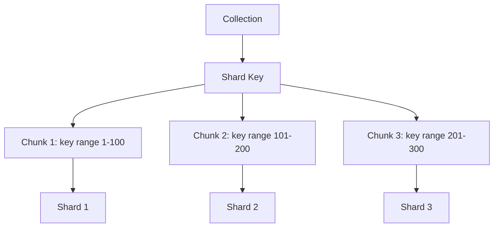

# MongoDB Shard Keys

In a MongoDB sharded cluster, **shard keys** are fundamental to achieving proper data distribution and query efficiency. Selecting the right shard key is one of the most critical decisions you'll make when implementing sharding, and it can significantly impact your application's performance.

## What Are Shard Keys?

A shard key is an indexed field or compound fields that MongoDB uses to partition data across the shards in your cluster. When you shard a collection, MongoDB divides the data into chunks based on the shard key values and distributes these chunks across the available shards.

:::tip
Think of a shard key as the "address" that tells MongoDB where to store and find each document in your sharded cluster.
:::

## Why Shard Keys Matter

Choosing the right shard key is crucial because:

1. **It's permanent** - You cannot change the shard key after sharding a collection without dropping and resharding
2. **It affects data distribution** - A poor shard key can lead to uneven data distribution (hotspots)
3. **It impacts query performance** - Queries that include the shard key are more efficient
4. **It determines scalability** - The right shard key enables your database to scale horizontally

## Shard Key Requirements

Before selecting a shard key, understand these fundamental requirements:

1. **Must be indexed** - The shard key fields must have an index. MongoDB will create one if it doesn't exist.
2. **Must exist in every document** - Every document in your collection must have the shard key fields.
3. **Cannot be an array** - Shard key fields cannot contain array values.
4. **Size limitation** - The maximum size of the shard key is 512 bytes.

## Types of Shard Keys

### 1. Single Field Keys

The simplest form of shard key is based on a single field in your documents.

```javascript
// Example of sharding a collection with a single field key
db.adminCommand({
  shardCollection: "myDatabase.customers",
  key: { customerId: 1 }
})
```

### 2. Compound Shard Keys

Compound shard keys use multiple fields to distribute data, which often provides better distribution patterns.

```javascript
// Example of sharding with a compound shard key
db.adminCommand({
  shardCollection: "myDatabase.orders",
  key: { region: 1, orderDate: 1 }
})
```

## Shard Key Strategies

### 1. Ranged Sharding

In ranged sharding (the default), MongoDB divides data into ranges based on the shard key values and distributes these ranges across shards.

```javascript
// Example of ranged sharding
db.adminCommand({
  shardCollection: "myDatabase.products",
  key: { category: 1, price: 1 }
})
```

This creates chunks of data where products in the same category with similar prices will be stored together.

### 2. Hashed Sharding

For more random distribution, you can use a hashed shard key, where MongoDB computes a hash of the key value.

```javascript
// Example of hashed sharding
db.adminCommand({
  shardCollection: "myDatabase.logs",
  key: { _id: "hashed" }
})
```

Hashed keys provide more even data distribution but sacrifice the ability to perform efficient range-based queries.

## Properties of a Good Shard Key

An effective shard key should have these characteristics:

### 1. High Cardinality

Cardinality refers to the number of unique values in your shard key. Higher cardinality results in better data distribution.

**Poor Example:** Gender (only two values)
**Better Example:** userId (millions of values)

### 2. Low Frequency

Frequency refers to how often a particular value appears in the shard key field. Ideally, each shard key value should appear in approximately the same number of documents.

**Poor Example:** status (where 90% of documents have "active" status)
**Better Example:** UUID (where each value appears only once)

### 3. Non-monotonic Change

Avoid shard keys that change in a predictable, increasing pattern, as they can cause insert hotspots.

**Poor Example:** Timestamp or auto-incrementing ID
**Better Example:** UUID or combination of fields that don't increase monotonically

## Real-World Shard Key Examples

Let's explore some practical examples for different types of applications:

### E-commerce Order System

```javascript
// Good shard key for an orders collection
db.adminCommand({
  shardCollection: "ecommerce.orders",
  key: { customerId: 1, orderDate: -1 }
})
```

This compound key distributes orders across customers while keeping each customer's orders in chronological order, which helps with common queries like "show me a customer's recent orders."

### IoT Sensor Data

```javascript
// Good shard key for a sensor readings collection
db.adminCommand({
  shardCollection: "iot.sensorData",
  key: { sensorId: 1, timestamp: 1 }
})
```

This approach keeps each sensor's data together and organized chronologically, making time-series queries efficient.

### User Analytics Events

```javascript
// Using a hashed key for random distribution
db.adminCommand({
  shardCollection: "analytics.events",
  key: { userId: "hashed" }
})
```

With a hashed key on userId, analytics events get distributed randomly across shards, preventing hotspots from high-activity users.

## Visualizing Shard Key Distribution



## Common Shard Key Mistakes

### 1. Using Monotonically Increasing Fields

```javascript
// AVOID this shard key for high-insertion collections
db.adminCommand({
  shardCollection: "logs.events",
  key: { timestamp: 1 }
})
```

This creates a "hot shard" that receives all new inserts, defeating the purpose of sharding.

### 2. Low-Cardinality Shard Keys

```javascript
// AVOID low-cardinality shard keys
db.adminCommand({
  shardCollection: "users.profiles",
  key: { country: 1 }
})
```

With only ~200 countries, this would create very few chunks, leading to poor distribution.

### 3. Ignoring Query Patterns

Always consider how your application queries the data. If you frequently search by specific fields, including them in your shard key can improve performance:

```javascript
// Before choosing a shard key, analyze your queries
db.users.find({ region: "Europe", age: { $gt: 18 } }).sort({ lastName: 1 })
// A shard key of { region: 1, age: 1 } might be appropriate
```

## Testing Shard Key Distribution

You can analyze how well your shard key distributes data using these commands:

```javascript
// Check chunk distribution
db.adminCommand({ listShards: 1 })
db.adminCommand({ dbStats: 1, scale: 1024 })

// Check how many documents are in each chunk
db.collection.getShardDistribution()
```

## Changing Shard Keys

Starting with MongoDB 4.4, you can refine your shard key by adding a suffix field to an existing key. This is useful when you discover that your initial shard key isn't providing optimal distribution:

```javascript
// Add a field to an existing shard key
db.adminCommand({
  refineCollectionShardKey: "myDatabase.users",
  key: { userId: 1, email: 1 }  // Original key was { userId: 1 }
})
```

However, completely changing a shard key still requires dropping and resharding the collection.

## Summary

Choosing the right shard key in MongoDB is essential for achieving scalable, high-performance applications. Remember these key principles:

- Select shard keys with high cardinality and low frequency
- Avoid monotonically increasing fields as shard keys
- Consider your application's query patterns
- Use compound shard keys when appropriate
- Test and monitor your shard distribution

By following these guidelines, you'll create a sharded cluster that distributes data evenly and scales effectively as your application grows.

## Practice Exercises

1. Design an appropriate shard key for a social media posts collection where users frequently query their own posts by date.
2. Compare the advantages and disadvantages of using `{ _id: "hashed" }` versus `{ userId: 1, createdAt: 1 }` as a shard key.
3. For a weather data collection with millions of sensor readings per day, propose and justify an effective shard key.

## Additional Resources

- [MongoDB Documentation on Shard Keys](https://www.mongodb.com/docs/manual/core/sharding-shard-key/)
- [Choosing a Shard Key](https://www.mongodb.com/docs/manual/core/sharding-shard-key/#choosing-a-shard-key)
- [Changing a Shard Key](https://www.mongodb.com/docs/manual/core/sharding-change-shard-key/)

Happy sharding!