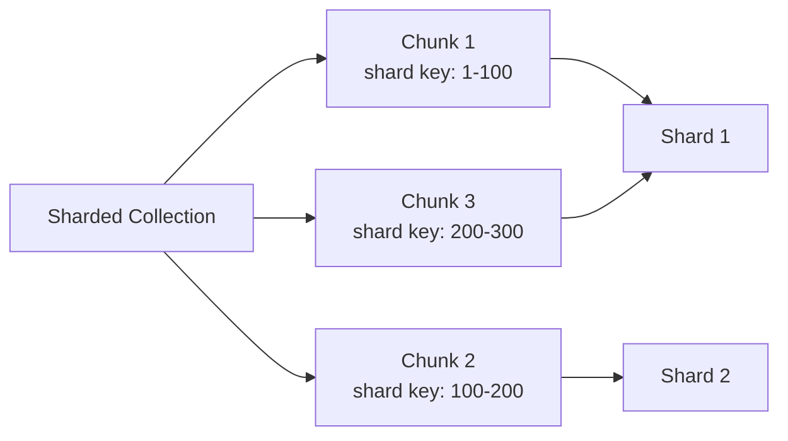
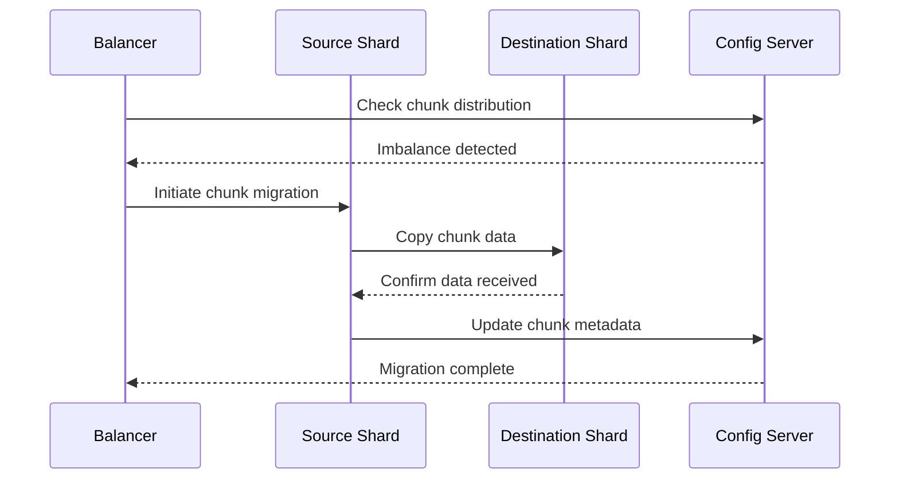

# MongoDB Chunks

## Introduction

In a MongoDB sharded cluster, a **chunk** represents a subset of the data in a sharded collection. Understanding chunks is essential for working with MongoDB sharding effectively, as they are the fundamental units that MongoDB uses to distribute data across multiple servers.

This guide explores how chunks work, how they're created and managed, and how they affect the performance and scalability of your MongoDB deployment.

## What are Chunks?

A chunk consists of a contiguous range of documents from a sharded collection, defined by the shard key values. Each chunk has:

- A minimum value (inclusive)
- A maximum value (exclusive)
- An association with a specific shard in the cluster

When you shard a collection, MongoDB initially creates a single chunk containing the entire collection. As data grows, MongoDB splits chunks and migrates them across shards to maintain an even data distribution.



## How Chunks Work in Sharding

### Chunk Size

Each chunk in MongoDB has a default maximum size of 64MB (as of MongoDB 4.4). This size can be configured using the `chunkSize` setting in the sharding configuration.

```javascript
// Check the current chunk size configuration
db.settings.find({ _id: "chunksize" })

// Change the default chunk size to 32MB
use config
db.settings.updateOne(
   { _id: "chunksize" },
   { $set: { value: 32 } },
   { upsert: true }
)
```

:::caution
Changing the chunk size doesn't affect existing chunks but only new chunks created after the change.
:::

### Chunk Distribution

The primary goal of sharding is to distribute data evenly across shards. MongoDB achieves this through:

1. **Chunk splitting**: When a chunk exceeds the maximum size, MongoDB splits it into smaller chunks
2. **Chunk migration**: The balancer moves chunks across shards to ensure an even distribution

## Chunk Splitting

MongoDB automatically splits chunks when they grow beyond the configured maximum size. Here's how the splitting process works:

1. MongoDB identifies a chunk that has grown beyond the maximum size
2. It finds a suitable split point within the chunk based on shard key values
3. It divides the chunk into two smaller chunks at the split point
4. The split chunks remain on the same shard until the balancer migrates them

Let's examine a chunk splitting example:

```javascript
// Assume we have a collection sharded on field "userId"
// Initial chunk: { userId: MinKey } --> { userId: MaxKey }

// After inserting many documents and exceeding chunk size:
// MongoDB might split it into:
// Chunk 1: { userId: MinKey } --> { userId: 5000 }
// Chunk 2: { userId: 5000 } --> { userId: MaxKey }
```

You can view the chunks in your sharded collection using:

```javascript
use config
db.chunks.find({ ns: "mydatabase.mycollection" }).sort({ min: 1 })

// Sample output:
// { "_id" : "mydatabase.mycollection-userId_MinKey", "ns" : "mydatabase.mycollection", "min" : { "userId" : MinKey }, "max" : { "userId" : 5000 }, "shard" : "shard0001", ... }
// { "_id" : "mydatabase.mycollection-userId_5000", "ns" : "mydatabase.mycollection", "min" : { "userId" : 5000 }, "max" : { "userId" : MaxKey }, "shard" : "shard0001", ... }
```

### Manual Chunk Splitting

In some cases, you might want to manually split chunks:

```javascript
// Split the chunk containing userId: 5000 at userId: 7500
sh.splitAt("mydatabase.mycollection", { userId: 7500 })

// Split chunks in the specified range into a specified number of chunks
sh.splitFind("mydatabase.mycollection", { userId: { $gte: 1000, $lt: 5000 } }, 3)
```

## Chunk Migration

The MongoDB balancer is a background process that monitors the chunk distribution and migrates chunks across shards to ensure an even data distribution. Chunk migration involves:

1. The balancer identifies an imbalance in the chunk distribution
2. It selects a chunk to move from an overloaded shard to an underloaded shard
3. It initiates the migration process, copying documents and updating metadata



### Monitoring Chunk Migration

You can monitor chunk migrations using the following commands:

```javascript
// Check if the balancer is currently running
sh.isBalancerRunning()

// Check balancer status
sh.getBalancerState()

// View migration statistics
db.adminCommand({ balancerStatus: 1 })
```

### Controlling the Balancer

In production environments, you might need to control when the balancer runs:

```javascript
// Stop the balancer
sh.stopBalancer()

// Start the balancer
sh.startBalancer()

// Schedule balancer window (run only during off-peak hours)
use config
db.settings.updateOne(
   { _id: "balancer" },
   { $set: { activeWindow: { start: "23:00", stop: "06:00" } } },
   { upsert: true }
)
```

## Jumbo Chunks

A **jumbo chunk** is a chunk that has grown beyond the maximum size but cannot be split. This usually happens when:

1. Many documents share the same shard key value
2. The shard key has low cardinality
3. The data model doesn't allow for further splitting

Jumbo chunks can cause performance issues and imbalances in data distribution.

```javascript
// Find jumbo chunks
use config
db.chunks.find({ jumbo: true })
```

### Dealing with Jumbo Chunks

To prevent jumbo chunks:

1. Choose a shard key with high cardinality
2. Use compound shard keys
3. Use hashed shard keys for more random distribution

If you already have jumbo chunks:

```javascript
// Remove jumbo flag (only if you're sure it can be migrated)
use config
db.chunks.updateOne(
   { _id: "mydatabase.mycollection-userId_MinKey" },
   { $unset: { jumbo: "" } }
)
```

## Real-World Example: User Activity Application

Let's imagine we're building an application that tracks user activity across a platform. As the application scales to millions of users, we need to shard our data.

### Setting Up Sharding

```javascript
// Enable sharding for the database
sh.enableSharding("activityTracker")

// Create an index on our shard key
db.userActivities.createIndex({ userId: 1, timestamp: 1 })

// Shard the collection using a compound shard key
sh.shardCollection("activityTracker.userActivities", { userId: 1, timestamp: 1 })
```

### Monitoring Chunks After Growth

As our application grows, chunks will start splitting and migrating:

```javascript
// Check how many chunks we have now
use config
db.chunks.count({ ns: "activityTracker.userActivities" })

// See how chunks are distributed across shards
db.chunks.aggregate([
   { $match: { ns: "activityTracker.userActivities" } },
   { $group: { _id: "$shard", count: { $sum: 1 } } }
])

// Output might look like:
// { "_id" : "shard0001", "count" : 42 }
// { "_id" : "shard0002", "count" : 38 }
// { "_id" : "shard0003", "count" : 40 }
```

### Optimizing for Hot Spots

If we notice that certain time periods have much more activity than others, we might experience "hot spots" where certain chunks receive more traffic. We can analyze this:

```javascript
// Check the distribution of our chunks by timestamp range
use config
db.chunks.find({ ns: "activityTracker.userActivities" }, 
               { min: 1, max: 1, shard: 1 }).sort({ "min.timestamp": 1 })
```

Based on this analysis, we might decide to refine our sharding strategy or pre-split chunks for anticipated high-traffic periods:

```javascript
// Pre-split chunks for a new marketing campaign that will generate traffic
sh.splitAt("activityTracker.userActivities", 
           { userId: MinKey, timestamp: ISODate("2023-06-01T00:00:00Z") })
sh.splitAt("activityTracker.userActivities", 
           { userId: MinKey, timestamp: ISODate("2023-06-02T00:00:00Z") })
```

## Best Practices for Chunk Management

1. **Choose an appropriate shard key**:
   - High cardinality
   - Even write distribution
   - Supports common query patterns

2. **Monitor chunk distribution**:
   - Check for imbalances regularly
   - Look for jumbo chunks
   - Verify that the balancer is working correctly

3. **Consider pre-splitting**:
   - Pre-split chunks before bulk data loads
   - Use pre-splitting for predictable growth patterns

4. **Set an appropriate chunk size**:
   - Smaller chunks (e.g., 32MB) for more even distribution
   - Larger chunks (e.g., 128MB) to reduce metadata overhead

5. **Control balancer activity**:
   - Schedule balancing during off-peak hours
   - Temporarily disable during maintenance or peak traffic

## Summary

MongoDB chunks are the fundamental units of data distribution in a sharded cluster. They allow MongoDB to horizontally scale by distributing data across multiple servers. Understanding how chunks work—how they split, migrate, and are managed—is essential for building and maintaining a performant sharded MongoDB deployment.

Key concepts we've covered:
- What chunks are and how they define data boundaries
- How chunks split when they grow beyond the maximum size
- How the balancer migrates chunks to maintain even distribution
- Challenges like jumbo chunks and how to address them
- Best practices for effective chunk management

## Additional Resources and Exercises

### Exercises

1. Set up a small sharded cluster in a test environment and monitor how chunks are created and distributed as you insert data.

2. Experiment with different shard keys on a sample dataset and compare how they affect chunk distribution.

3. Practice manually splitting chunks and observe how the balancer redistributes them.

4. Simulate a scenario with a poor shard key that leads to jumbo chunks, then implement a solution.

### Further Reading

- MongoDB Documentation: [Data Partitioning with Chunks](https://www.mongodb.com/docs/manual/core/sharding-data-partitioning/)
- MongoDB Documentation: [Balancer Administration](https://www.mongodb.com/docs/manual/core/sharding-balancer-administration/)
- MongoDB Documentation: [Shard Key Selection](https://www.mongodb.com/docs/manual/core/sharding-shard-key/)

By mastering MongoDB chunks and their management, you'll be equipped to design and maintain highly scalable MongoDB deployments that can handle growing data volumes while maintaining performance.