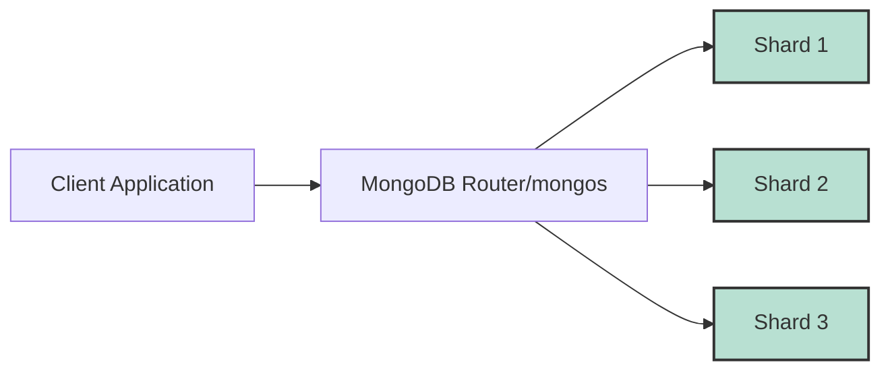

# MongoDB Shard Key Selection

## Introduction

In MongoDB's sharded architecture, the shard key is perhaps the most critical decision you'll make when implementing horizontal scaling. The shard key determines how MongoDB distributes your data across shards, directly impacting performance, scalability, and operational efficiency.

This guide will walk you through the process of selecting an effective shard key, explain the key considerations, and provide real-world examples to help you make informed decisions for your applications.

## What is a Shard Key?

A shard key is a field or set of fields that MongoDB uses to distribute documents across shards in a sharded cluster. When you shard a collection, you must specify a field or compound fields to serve as the shard key.



## Shard Key Requirements

Before diving into selection strategies, let's understand the requirements and constraints for shard keys:

1. **Immutability**: Once a document is inserted, its shard key field value cannot be modified.
2. **Must be indexed**: The shard key fields must be indexed (either a single field index or as the prefix of a compound index).
3. **Must exist in every document**: The shard key fields must exist in every document in the collection.

## Key Considerations for Shard Key Selection

### 1. Cardinality

Cardinality refers to the number of distinct values a field can have. A high-cardinality field allows MongoDB to distribute data more evenly.

**Low cardinality example**: Gender field (only "male", "female", "non-binary" values)
**High cardinality example**: User ID (millions of unique values)

```javascript
// Poor shard key with low cardinality
db.shardCollection("mydb.users", { gender: 1 })  // Only a few distinct values

// Better shard key with high cardinality
db.shardCollection("mydb.users", { userId: 1 })  // Millions of unique values
```

### 2. Frequency

Frequency refers to how often a specific value appears in your data. An ideal shard key has an even frequency distribution.

**Example of poor frequency distribution**: 
If you shard on `category` in an e-commerce product collection where 80% of products are "electronics".

**Example of good frequency distribution**:
`productId` where each value appears exactly once.

### 3. Rate of Change

How monotonically does your shard key field value change? This affects chunk distribution.

**Monotonically increasing**: Values that always increase (like timestamps or auto-incrementing IDs)
**Non-monotonic**: Values that vary non-sequentially (like hashes or UUIDs)

```javascript
// Monotonically increasing (can lead to hotspotting)
db.shardCollection("mydb.orders", { orderDate: 1 })

// Non-monotonic (better distribution)
db.shardCollection("mydb.orders", { orderId: "hashed" })
```

## Common Shard Key Strategies

### 1. Hashed Shard Keys

Hashing transforms a field's value into a seemingly random value, distributing data evenly across shards.

```javascript
// Create an index for the hashed field
db.products.createIndex({ productId: "hashed" })

// Shard the collection using the hashed field
db.shardCollection("mydb.products", { productId: "hashed" })
```

**Pros**:
- Even data distribution
- Prevents hotspots with monotonically increasing values

**Cons**:
- Cannot support ranged queries efficiently
- Cannot use for compound shard keys

### 2. Ranged Shard Keys

Ranged shard keys group documents with similar shard key values together.

```javascript
// Create an index for the ranged key
db.users.createIndex({ location: 1, lastName: 1 })

// Shard the collection using a compound ranged key
db.shardCollection("mydb.users", { location: 1, lastName: 1 })
```

**Pros**:
- Efficient for range-based queries
- Supports zone sharding for data locality

**Cons**:
- Risk of uneven data distribution
- Potential hotspots with monotonically changing values

### 3. Compound Shard Keys

Using multiple fields as your shard key can give you better control over data distribution.

```javascript
// Create an index for the compound key
db.orders.createIndex({ customerId: 1, orderDate: 1 })

// Shard the collection using the compound key
db.shardCollection("mydb.orders", { customerId: 1, orderDate: 1 })
```

**Pros**:
- Higher cardinality through field combination
- Better control over data locality
- Can combine high-cardinality with frequently queried fields

**Cons**:
- More complex to design and maintain
- Queries that don't include the first field of the compound key won't be routed efficiently

## Real-World Examples

### Example 1: E-commerce Order System

**Collection**: `orders`

**Considerations**:
- Orders are constantly being inserted
- Orders are frequently queried by customer 
- Orders are sometimes queried by date ranges
- Historical analysis by date is common

**Potential shard key options**:

1. `{ orderId: "hashed" }`
   - Even distribution
   - Cannot efficiently query by date ranges

2. `{ customerId: 1, orderDate: -1 }`
   - Groups a customer's orders together
   - Recent orders from a customer are in the same chunk
   - Supports efficient customer order queries

```javascript
// Option 2 implementation
db.orders.createIndex({ customerId: 1, orderDate: -1 })
db.shardCollection("ecommerce.orders", { customerId: 1, orderDate: -1 })
```

### Example 2: IoT Sensor Data

**Collection**: `sensorReadings`

**Considerations**:
- Time-series data with timestamps
- Data often queried by sensor ID and time range
- Massive data volume with continuous writes
- Recent data accessed more frequently than historical data

**Potential shard key options**:

1. `{ sensorId: 1, timestamp: 1 }`
   - Groups readings from the same sensor
   - Good for range queries on a specific sensor
   - May lead to hotspots on newest data

2. `{ sensorId: 1, timestamp: "hashed" }`
   - Not possible (can't hash part of compound key)

3. `{ sensorId: "hashed" }`
   - Even distribution of sensors
   - Sacrifices ability to query ranges efficiently

```javascript
// Option 1 implementation with zones for time-based tiering
db.sensorReadings.createIndex({ sensorId: 1, timestamp: 1 })
db.shardCollection("iot.sensorReadings", { sensorId: 1, timestamp: 1 })

// Add zones for time-based data tiering
sh.addShardToZone("shard1", "recent")
sh.addShardToZone("shard2", "historical")

sh.updateZoneKeyRange(
  "iot.sensorReadings", 
  { sensorId: MinKey, timestamp: MinKey }, 
  { sensorId: MaxKey, timestamp: ISODate("2023-01-01") }, 
  "historical"
)

sh.updateZoneKeyRange(
  "iot.sensorReadings", 
  { sensorId: MinKey, timestamp: ISODate("2023-01-01") }, 
  { sensorId: MaxKey, timestamp: MaxKey }, 
  "recent"
)
```

## Testing Your Shard Key

Before implementing a shard key in production, you should test it using representative data:

1. **Analyze query patterns**: Review your application's most common queries
2. **Test data distribution**: Use a test environment to observe chunk distribution
3. **Simulate growth**: Insert test data that simulates future growth patterns
4. **Measure performance**: Compare query performance across different shard key options

Here's a script to analyze shard key distribution:

```javascript
// Function to analyze potential shard key distribution
function analyzeShardKey(collection, shardKeyField) {
  let distinctValues = db[collection].distinct(shardKeyField).length;
  let totalDocs = db[collection].count();
  
  let pipeline = [];
  let group = { _id: "$" + shardKeyField, count: { $sum: 1 } };
  pipeline.push({ $group: group });
  pipeline.push({ $sort: { count: -1 } });
  pipeline.push({ $limit: 10 });
  
  let result = db[collection].aggregate(pipeline).toArray();
  
  print(`Total distinct values: ${distinctValues} (${(distinctValues/totalDocs*100).toFixed(2)}% of documents)`);
  print("Top 10 most frequent values:");
  result.forEach(r => print(`${r._id}: ${r.count} (${(r.count/totalDocs*100).toFixed(2)}% of documents)`));
}

// Example usage
analyzeShardKey("orders", "customerId");
analyzeShardKey("orders", "orderDate");
```

## Common Pitfalls to Avoid

1. **Using _id as shard key**
   - While high cardinality, ObjectIds are monotonically increasing
   - Creates hotspot on the newest chunk

2. **Using timestamp alone**
   - Creates write hotspots on the most recent chunk
   - Better to combine with another field or use hashing

3. **Ignoring query patterns**
   - Shard key should align with common query patterns
   - Queries that can't use the shard key become scatter-gather operations

4. **Forgetting about jumbo chunks**
   - When a key range can't be split further but grows too large
   - Often happens with low-cardinality or highly skewed shard keys

## When to Consider Resharding

MongoDB 5.0+ introduced resharding, which allows you to change your shard key. Consider resharding when:

1. Your data distribution becomes severely unbalanced
2. Your query patterns have changed significantly
3. Your initial shard key choice is causing performance issues

```javascript
// Resharding example (MongoDB 5.0+)
db.adminCommand({
  reshardCollection: "mydb.orders",
  key: { region: 1, customerId: 1 }
});
```

## Summary

Selecting the right shard key is crucial for MongoDB sharding success. Remember these key points:

- Choose a shard key with high cardinality and even frequency distribution
- Consider your query patterns and access distribution
- Compound shard keys can provide flexibility by combining different characteristics
- Hashed shard keys provide even distribution but sacrifice range-based query efficiency
- Test your shard key with realistic data before deploying to production

The ideal shard key balances these often competing factors:
1. Even data distribution across shards
2. Efficient targeted queries (vs. scatter-gather)
3. Write scalability without hotspots
4. Alignment with your application's query patterns

## Additional Resources

- [MongoDB Official Documentation on Shard Keys](https://docs.mongodb.com/manual/core/sharding-shard-key/)
- [MongoDB University Course: M201 - MongoDB Performance](https://university.mongodb.com/courses/M201/about)
- [MongoDB Blog: Sharding Pattern - Shard by Location](https://www.mongodb.com/blog/post/schema-design-for-time-series-data-in-mongodb)

## Exercises

1. For a social media application with posts collection, design an appropriate shard key considering:
   - Posts are queried by author
   - Posts are queried by date range
   - Trending posts are frequently accessed
   - Historical data is rarely accessed

2. Analyze the following collections and suggest appropriate shard keys:
   - A `weather` collection with hourly temperature readings from thousands of stations
   - A `transactions` collection for a banking application with millions of accounts
   - A `logs` collection that records application events with timestamps and service IDs

3. Write a script that simulates data distribution across chunks for a given shard key on a sample dataset.