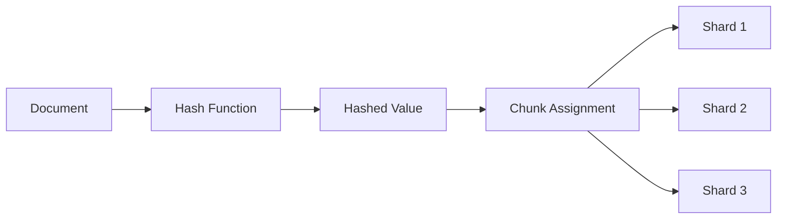

# MongoDB Hash Sharding

## Introduction

When working with large datasets in MongoDB, sharding becomes essential to distribute data across multiple machines. Hash Sharding is one of several sharding strategies that MongoDB offers to help you efficiently split your data across a cluster. Unlike range-based sharding, which groups documents based on the range of shard key values, hash sharding distributes documents more randomly, resulting in a more even data distribution.

In this guide, we'll explore how hash sharding works in MongoDB, when to use it, and how to implement it effectively in your applications.

## What is Hash Sharding?

Hash sharding uses a hash function to determine where to store documents in a sharded cluster. MongoDB applies a hash function to the shard key's value, and uses the hashed value to determine which chunk (and thus which shard) should store the document.



### Key Benefits of Hash Sharding

1. **Even Data Distribution**: Hash sharding provides more uniform data distribution, which helps prevent hot spots
2. **Predictable Performance**: The even distribution leads to more consistent query performance
3. **Simplified Scaling**: Adding new shards results in automatic, balanced redistribution of data
4. **Good for Write-Heavy Workloads**: Particularly beneficial for write-intensive applications

## When to Use Hash Sharding

Hash sharding is ideal when:

- Your data has a shard key with high cardinality but poor distribution (like monotonically increasing values)
- Your application experiences hot spots in specific ranges of data
- You need to distribute write operations evenly across the cluster
- You primarily perform single-document operations rather than range-based queries

## Hash Sharding Implementation

### Prerequisites

Before implementing hash sharding:

1. Set up a sharded MongoDB cluster with:
   - Config servers
   - Mongos routers
   - Shard replica sets

2. Determine the appropriate shard key for your collection

### Creating a Collection with Hash Sharding

To create a new collection with hash sharding:

```javascript
db.adminCommand({
  shardCollection: "database.collection",
  key: { fieldToShard: "hashed" }
});
```

In this example, MongoDB will apply a hash function to the `fieldToShard` value and use that hashed value to distribute documents.

### Adding Hash Sharding to an Existing Collection

For an existing collection, first ensure your shard key field is indexed:

```javascript
db.collection.createIndex({ fieldToShard: "hashed" });
```

Then enable sharding on the collection:

```javascript
db.adminCommand({
  shardCollection: "database.collection",
  key: { fieldToShard: "hashed" }
});
```

## Shard Key Selection for Hash Sharding

Selecting an appropriate shard key is crucial for effective hash sharding:

### Good Shard Key Characteristics:

1. **High Cardinality**: Should have many possible unique values
2. **No Monotonic Change**: Ideally not regularly increasing/decreasing values
3. **Frequent Query Inclusion**: Present in most queries for routing efficiency

### Common Choices for Hash Shard Keys:

- **User IDs**: Good choice for user-centric applications
- **UUID or ObjectId**: Excellent for high-cardinality, random distribution
- **Natural Business Keys**: Such as product IDs, transaction IDs, etc.

### Example: Creating an Index and Sharding

```javascript
// First, create a hashed index
db.users.createIndex({ userId: "hashed" });

// Then shard the collection using the hashed field
db.adminCommand({
  shardCollection: "myapp.users",
  key: { userId: "hashed" }
});
```

## Practical Example: E-commerce Product Database

Let's implement hash sharding for an e-commerce product catalog:

```javascript
// Connect to mongos router
mongosh "mongodb://mongos-router:27017"

// Select the database
use ecommerce

// Create a hashed index on product_id
db.products.createIndex({ product_id: "hashed" });

// Enable sharding on the database
db.adminCommand({ enableSharding: "ecommerce" });

// Shard the products collection
db.adminCommand({
  shardCollection: "ecommerce.products",
  key: { product_id: "hashed" }
});

// Insert some test products
db.products.insertMany([
  { product_id: "P1001", name: "Smartphone", price: 599.99, category: "Electronics" },
  { product_id: "P1002", name: "Laptop", price: 1299.99, category: "Electronics" },
  { product_id: "P1003", name: "Headphones", price: 99.99, category: "Electronics" },
  // ...more products
]);
```

### Verifying Shard Distribution

To check how data is distributed across your shards:

```javascript
db.products.getShardDistribution();
```

Example output:
```
Shard shard0 at shard0/mongodb0.example.net:27017,mongodb1.example.net:27017,mongodb2.example.net:27017
 data: 10.5MB docs: 32704 chunks: 8
 estimated data per chunk: 1.31MB
 estimated docs per chunk: 4088

Shard shard1 at shard1/mongodb3.example.net:27017,mongodb4.example.net:27017,mongodb5.example.net:27017
 data: 9.8MB docs: 31823 chunks: 8
 estimated data per chunk: 1.22MB
 estimated docs per chunk: 3977

// ... more shards ...

Totals
 data: 31.0MB docs: 98721 chunks: 24
 Shard shard0 contains 33.87% data, 33.12% docs
 Shard shard1 contains 31.61% data, 32.23% docs
 Shard shard2 contains 34.52% data, 34.65% docs
```

Notice how the data distribution is relatively even across all shards.

## Compound Shard Keys with Hashing

In some scenarios, you might want to use a compound shard key with a hashed component:

```javascript
// Create a compound index with one hashed component
db.orders.createIndex({ "customerId": "hashed", "orderDate": 1 });

// Shard using the compound key
db.adminCommand({
  shardCollection: "ecommerce.orders",
  key: { "customerId": "hashed", "orderDate": 1 }
});
```

This approach provides both the distribution benefits of hashing and the ability to target ranges on the non-hashed field.

## Limitations of Hash Sharding

Hash sharding isn't ideal for every situation. Here are some limitations to consider:

1. **Range Queries**: Hash sharding doesn't support range-based queries efficiently 
2. **Geospatial Queries**: Not suitable for geospatial-indexed fields
3. **Sorting**: Range-based sorting must be done in memory rather than utilizing the natural sort order of the index
4. **Chunk Migrations**: Adding new shards requires significant data movement

## Real-World Use Case: Social Media Platform

Consider a social media platform that stores user posts. Each day, millions of posts are created with monotonically increasing IDs, which would cause hot spots with range-based sharding.

```javascript
// Create a posts collection with hash sharding on post_id
db.adminCommand({ enableSharding: "socialMedia" });

db.posts.createIndex({ post_id: "hashed" });

db.adminCommand({
  shardCollection: "socialMedia.posts",
  key: { post_id: "hashed" }
});

// Sample post insertion
db.posts.insertOne({
  post_id: ObjectId(),
  user_id: "user123",
  content: "Learning about MongoDB hash sharding!",
  created_at: new Date(),
  likes: 0,
  comments: []
});
```

With hash sharding, these posts are evenly distributed across all shards, allowing the platform to:

1. Handle high write throughput
2. Scale horizontally as the user base grows
3. Avoid performance bottlenecks during peak posting times

## Monitoring Hash Sharding Performance

To ensure your hash sharding strategy is effective, regularly monitor:

1. **Chunk Distribution**: Check for balanced chunks across shards
   ```javascript
   use config
   db.chunks.aggregate([
     { $group: { _id: "$shard", count: { $sum: 1 } } }
   ])
   ```

2. **Jumbo Chunks**: Monitor for chunks that have grown too large
   ```javascript
   use config
   db.chunks.find({ "jumbo": true })
   ```

3. **Balancer Status**: Check if the cluster balancer is working properly
   ```javascript
   sh.getBalancerState()
   sh.status()
   ```

## Summary

Hash sharding in MongoDB provides an effective way to distribute data evenly across a sharded cluster, particularly for workloads with monotonically increasing shard keys or those requiring even write distribution. By applying a hash function to the shard key, MongoDB ensures documents are spread evenly across shards, avoiding hotspots and providing more predictable performance.

Key points to remember:

- Hash sharding excels at even data distribution
- It's ideal for write-heavy workloads and monotonically increasing keys
- It doesn't support efficient range-based queries
- Shard key selection remains critical even with hash sharding
- Hash sharding can be combined with compound keys for more flexible querying

## Additional Resources & Exercises

### Resources
- [MongoDB Official Documentation on Hashed Sharding](https://www.mongodb.com/docs/manual/core/hashed-sharding/)
- [MongoDB University: Sharding Courses](https://university.mongodb.com/)

### Exercises

1. **Practice Exercise**: Set up a local MongoDB cluster using Docker Compose and implement hash sharding on a sample collection.

2. **Analysis Exercise**: Compare query performance between range-based and hash-based sharding for different types of queries (point queries vs. range queries).

3. **Design Challenge**: For an IoT sensor data application storing time-series data, design an appropriate sharding strategy using hash sharding where applicable.

4. **Performance Tuning**: Experiment with different chunk sizes in a hash-sharded collection to find the optimal configuration for your workload.