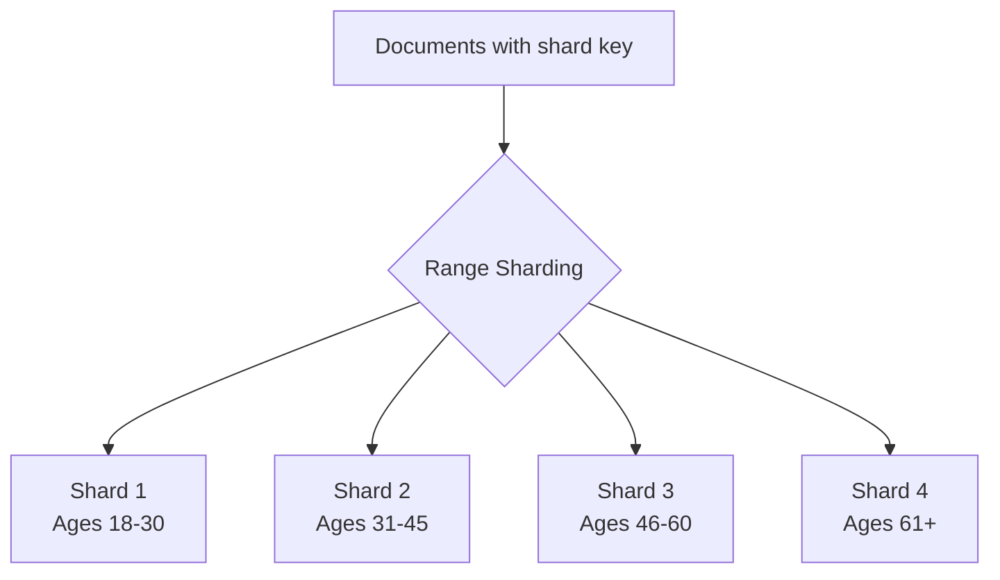

# MongoDB Range Sharding

## Introduction

Range sharding is one of the fundamental sharding strategies in MongoDB that allows you to distribute large datasets across multiple servers (shards) based on specific ranges of a chosen shard key. This approach organizes data into contiguous ranges, making it particularly efficient for queries that target specific ranges of values.

When implementing a sharded cluster in MongoDB, understanding range sharding is crucial because it directly impacts how your data is distributed and accessed, which in turn affects your application's performance and scalability.

## Understanding Range Sharding

Range sharding distributes data across shards by dividing the shard key values into "chunks," where each chunk represents a range of shard key values.

For example, if you have a collection of user documents with ages as the shard key, MongoDB might create chunks like:
- Chunk 1: Ages 18-30
- Chunk 2: Ages 31-45
- Chunk 3: Ages 46-60
- And so on...

Each of these chunks is then assigned to a specific shard in your MongoDB cluster.



## Setting Up Range Sharding

Let's go through the process of setting up range sharding for a MongoDB collection:

### Step 1: Create a Sharded Cluster

Before implementing range sharding, you need a properly configured sharded cluster with:
- Config servers
- Mongos routers
- Multiple shard servers

For this example, we'll assume you already have a sharded cluster running.

### Step 2: Enable Sharding for a Database

First, you need to enable sharding for your target database:

```javascript
// Connect to mongos
mongosh "mongodb://mongos-hostname:27017"

// Enable sharding for the database
db.adminCommand({ enableSharding: "myDatabase" })
```

### Step 3: Choose a Shard Key

Choosing the right shard key is crucial for effective range sharding. The shard key should:
- Have high cardinality (many different values)
- Distribute writes evenly
- Support your most common query patterns

Let's say we have a `users` collection and we want to shard it by age:

```javascript
// Create an index on the field you want to use as the shard key
db.users.createIndex({ age: 1 })
```

### Step 4: Shard the Collection with Range Sharding

Now we can shard the collection using range sharding:

```javascript
// Shard the collection using range sharding
db.adminCommand({
  shardCollection: "myDatabase.users",
  key: { age: 1 },
  // Note: not specifying the 'numInitialChunks' parameter
  // and not using 'presplitHashedZones' means we're using range sharding
})
```

## Range Sharding in Action

Let's see range sharding in practice by inserting documents and examining their distribution:

```javascript
// Insert test data
for (let i = 1; i <= 1000; i++) {
  db.users.insertOne({
    name: "User" + i,
    age: Math.floor(Math.random() * 80) + 18, // Random age between 18 and 97
    registrationDate: new Date()
  });
}

// Check the chunk distribution
db.adminCommand({ listChunks: "myDatabase.users" })
```

Sample output:

```json
{
  "chunks" : [
    {
      "min" : { "age" : MinKey },
      "max" : { "age" : 30 },
      "shard" : "shard0000"
    },
    {
      "min" : { "age" : 30 },
      "max" : { "age" : 45 },
      "shard" : "shard0001"
    },
    {
      "min" : { "age" : 45 },
      "max" : { "age" : 60 },
      "shard" : "shard0000"
    },
    {
      "min" : { "age" : 60 },
      "max" : { "age" : MaxKey },
      "shard" : "shard0001"
    }
  ],
  "ok" : 1
}
```

### Analyzing Shard Distribution

To check if documents are evenly distributed across shards:

```javascript
// Connect to each shard and count documents
db.adminCommand({ listShards: 1 }).shards.forEach(function(shard) {
  let shardConn = new Mongo("mongodb://" + shard.host);
  let count = shardConn.getDB("myDatabase").users.count();
  print("Shard " + shard._id + " has " + count + " documents");
});
```

## Querying with Range Sharding

Range sharding is particularly efficient for range queries that include the shard key:

```javascript
// This query is targeted and efficient - will only hit shards containing users aged 25-35
db.users.find({ age: { $gte: 25, $lte: 35 } })

// This query doesn't include the shard key and will need to query all shards
db.users.find({ name: /^User5/ })
```

## Real-World Application Example: E-commerce Order Management

Let's consider a practical example of range sharding for an e-commerce platform's order management system:

### Scenario:
- Collection: `orders`
- Data volume: Millions of orders
- Access pattern: Most queries are for recent orders; historical data is accessed less frequently

### Implementation:

First, create the orders collection with an index on the order date:

```javascript
db.createCollection("orders")
db.orders.createIndex({ orderDate: 1 })

// Enable sharding on the database
db.adminCommand({ enableSharding: "ecommerce" })

// Shard the orders collection by orderDate
db.adminCommand({
  shardCollection: "ecommerce.orders",
  key: { orderDate: 1 }
})
```

Let's insert some sample order data:

```javascript
// Function to generate random orders for the past year
function generateSampleOrders(count) {
  for (let i = 0; i < count; i++) {
    const randomDaysAgo = Math.floor(Math.random() * 365);
    const orderDate = new Date();
    orderDate.setDate(orderDate.getDate() - randomDaysAgo);
    
    db.orders.insertOne({
      orderNumber: "ORD-" + i.toString().padStart(6, '0'),
      customerID: "CUST-" + Math.floor(Math.random() * 1000),
      orderDate: orderDate,
      totalAmount: Math.floor(Math.random() * 10000) / 100,
      items: Math.floor(Math.random() * 10) + 1,
      status: ["Processing", "Shipped", "Delivered", "Cancelled"][Math.floor(Math.random() * 4)]
    });
  }
}

// Generate 10,000 sample orders
generateSampleOrders(10000);
```

Now, you can efficiently query for orders within specific date ranges:

```javascript
// Get orders from the last month
const oneMonthAgo = new Date();
oneMonthAgo.setMonth(oneMonthAgo.getMonth() - 1);

db.orders.find({ 
  orderDate: { $gte: oneMonthAgo }
}).explain("executionStats");
```

The `explain()` output will show that MongoDB only targets shards containing data from the last month, making the query highly efficient.

## Benefits and Limitations of Range Sharding

### Benefits:

1. **Efficient Range Queries**: Range sharding excels at handling range-based queries, as MongoDB can target only the shards containing the relevant ranges.

2. **Logical Organization**: Data is organized in a logical way based on the shard key value, making it intuitive to understand data distribution.

3. **Data Locality**: Related documents with similar shard key values are stored together, potentially improving query performance.

### Limitations:

1. **Hotspotting**: If writes concentrate on a specific range (like today's date), that shard can become a hotspot, creating an uneven distribution.

2. **Monotonically Increasing Keys**: Range sharding with ever-increasing keys (like timestamps or auto-incrementing IDs) can lead to all new writes going to the same shard.

3. **Chunk Migrations**: As data grows in a particular range, MongoDB needs to split and migrate chunks, which can impact performance.

## Mitigating Range Sharding Limitations

### Using Compound Shard Keys

To address some limitations, consider using compound shard keys that combine a field with good distribution and a field with high cardinality:

```javascript
// Create a compound index
db.orders.createIndex({ region: 1, orderDate: 1 })

// Shard using compound key
db.adminCommand({
  shardCollection: "ecommerce.orders",
  key: { region: 1, orderDate: 1 }
})
```

### Pre-splitting Chunks

For new collections where you anticipate the data distribution, pre-splitting chunks can help avoid migration overhead:

```javascript
// Pre-split chunks for date ranges
db.adminCommand({
  split: "ecommerce.orders",
  middle: { orderDate: ISODate("2023-01-01") }
})

db.adminCommand({
  split: "ecommerce.orders",
  middle: { orderDate: ISODate("2023-04-01") }
})

db.adminCommand({
  split: "ecommerce.orders",
  middle: { orderDate: ISODate("2023-07-01") }
})

db.adminCommand({
  split: "ecommerce.orders",
  middle: { orderDate: ISODate("2023-10-01") }
})
```

## Advanced Range Sharding: Zoned Sharding

MongoDB also offers zone-based sharding, which gives you more control over which shards store which ranges of data:

```javascript
// Create zones for different date ranges
sh.addShardToZone("shard0000", "recent")
sh.addShardToZone("shard0001", "archive")

// Associate ranges with zones
sh.updateZoneKeyRange(
  "ecommerce.orders",
  { orderDate: ISODate("2023-01-01") },
  { orderDate: MaxKey },
  "recent"
)

sh.updateZoneKeyRange(
  "ecommerce.orders",
  { orderDate: MinKey },
  { orderDate: ISODate("2023-01-01") },
  "archive"
)
```

This ensures that recent orders go to `shard0000` and older orders go to `shard0001`, which could be configured with different hardware to match access patterns.

## Summary

Range sharding in MongoDB is a powerful mechanism for distributing data across multiple shards based on ranges of shard key values. It provides efficient range-based queries and logical data organization but requires careful planning to avoid hotspots and uneven distribution.

Key points to remember:
- Choose shard keys with high cardinality and good write distribution
- Be cautious with monotonically increasing values as shard keys
- Consider compound shard keys to improve distribution
- Use pre-splitting and zones for more control over data placement

Range sharding works best when:
- Your application frequently queries for ranges of values
- You can predict and evenly distribute your data
- You need logical grouping of related data

## Exercises

1. Set up a local MongoDB sharded cluster with two shards and implement range sharding on a collection of your choice.

2. Create a collection of product data and shard it by price range. Then analyze how different query patterns perform.

3. Practice implementing a compound shard key strategy to address the hotspot issues that might arise with simple range sharding.

4. Experiment with zone sharding to place different data ranges on specific shards and measure the performance implications.

5. Compare the performance of range queries between a range-sharded collection and a hash-sharded collection to understand the trade-offs.

## Additional Resources

- [MongoDB Documentation on Sharding](https://www.mongodb.com/docs/manual/sharding/)
- [Shard Key Selection Guidelines](https://www.mongodb.com/docs/manual/core/sharding-shard-key/)
- [MongoDB University Course: M201 - MongoDB Performance](https://university.mongodb.com/)
- [Data Modeling Considerations for Sharded Clusters](https://www.mongodb.com/docs/manual/core/sharded-cluster-data-modeling/)